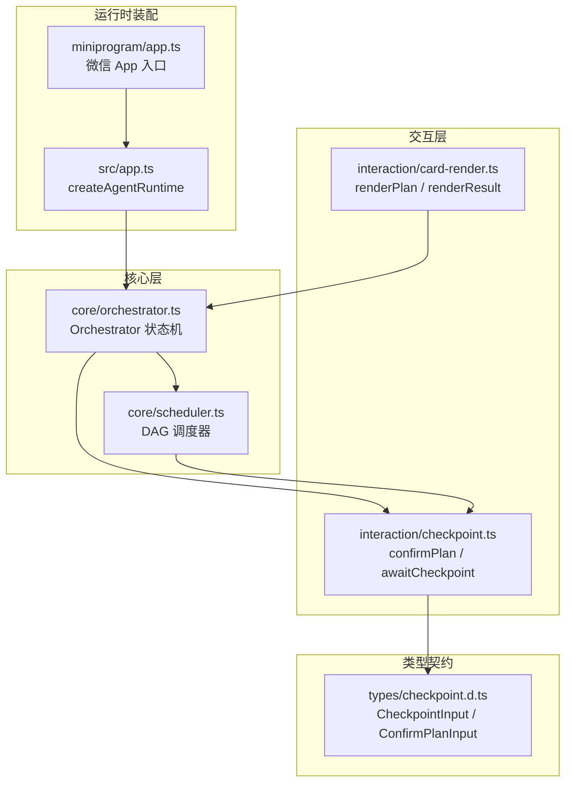
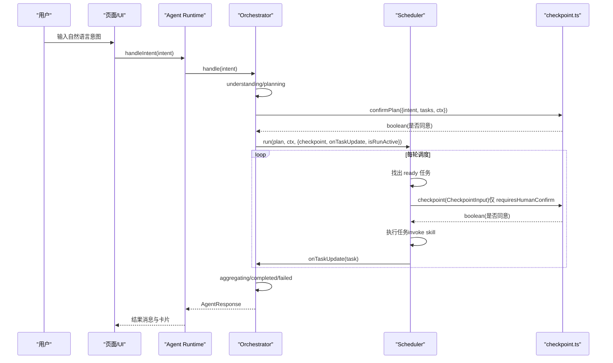
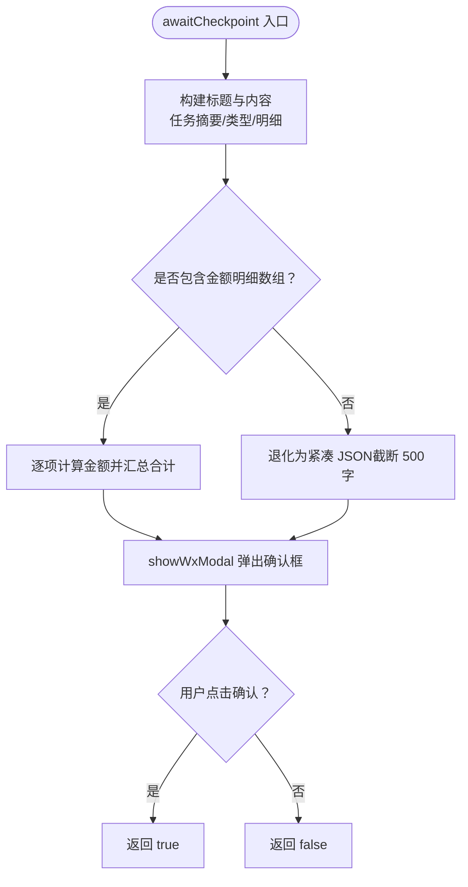
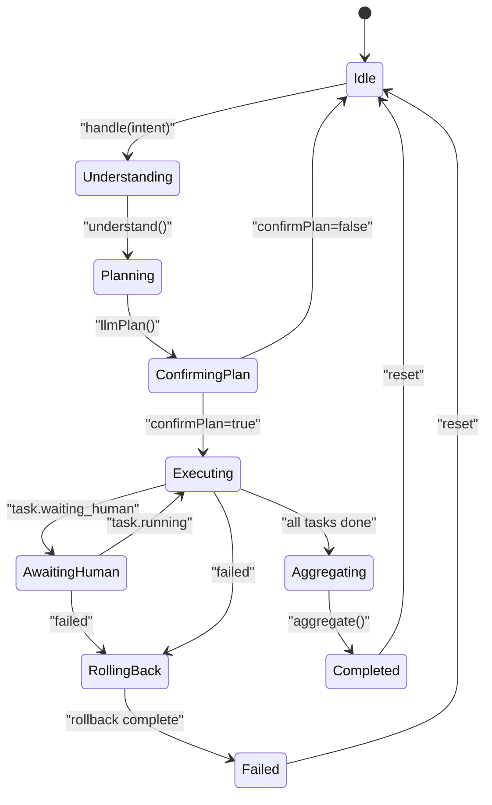
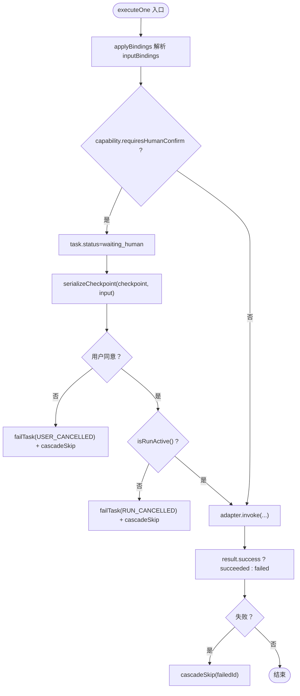
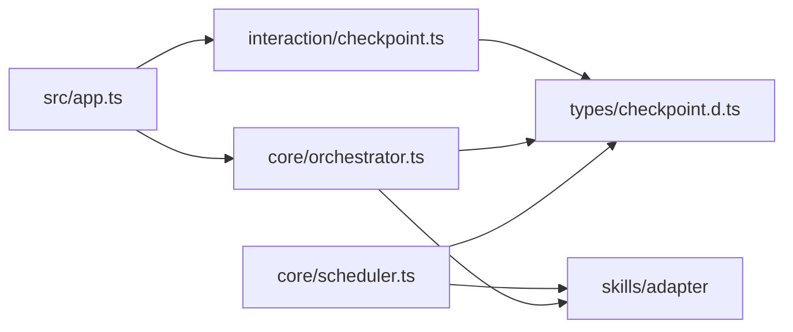

# 检查点确认机制

<cite>
**本文引用的文件**   
- [checkpoint.ts](file://miniprogram/src/interaction/checkpoint.ts)
- [checkpoint.d.ts](file://miniprogram/src/types/checkpoint.d.ts)
- [orchestrator.ts](file://miniprogram/src/core/orchestrator.ts)
- [scheduler.ts](file://miniprogram/src/core/scheduler.ts)
- [card-render.ts](file://miniprogram/src/interaction/card-render.ts)
- [app.ts](file://miniprogram/src/app.ts)
- [app.ts（微信入口）](file://miniprogram/app.ts)
</cite>

## 目录
1. [引言](#引言)
2. [项目结构](#项目结构)
3. [核心组件](#核心组件)
4. [架构总览](#架构总览)
5. [详细组件分析](#详细组件分析)
6. [依赖关系分析](#依赖关系分析)
7. [性能与并发特性](#性能与并发特性)
8. [故障排查指南](#故障排查指南)
9. [结论](#结论)
10. [附录：使用示例与配置选项](#附录使用示例与配置选项)

## 引言
本文件面向 WAIC-WeChat-MiniProgram 中“人机协作的检查点确认机制”，聚焦以下目标：
- 说明何时触发检查点、用户确认的交互模式，以及数据验证逻辑。
- 解释检查点的生命周期管理，从创建到完成或取消的状态转换。
- 说明检查点与 Orchestrator 编排器的集成方式，如何在任务执行过程中插入人工确认环节。
- 详细介绍检查点的数据结构设计，包括上下文信息、能力元数据、验证规则与回调处理。
- 提供检查点的使用示例与配置选项，包括如何定义自定义检查点逻辑与错误处理策略。

该机制遵循“interaction → core → skills → llm”的单向依赖规范，确保核心编排层不反向依赖交互实现，同时通过类型契约在编译期保证接口一致性。

## 项目结构
与检查点机制直接相关的代码分布在以下模块：
- interaction/checkpoint.ts：检查点 UI 交互实现（Plan 整体确认、单步写操作确认）。
- types/checkpoint.d.ts：检查点协议类型（CheckpointInput、ConfirmPlanInput、CheckpontFn、ConfirmPlanFn）。
- core/orchestrator.ts：编排器状态机，负责 Plan 确认、调度注入、状态迁移与回滚。
- core/scheduler.ts：DAG 调度器，负责任务就绪判断、并行执行、死锁检测与检查点序列化。
- interaction/card-render.ts：将 Plan/结果转换为可渲染卡片，辅助 UI 展示。
- src/app.ts：Agent Runtime 组装，注入 confirmPlan 与 checkpoint 回调。
- miniprogram/app.ts：微信小程序入口，懒加载 Agent Runtime。

图表来源
- [checkpoint.ts:1-122](file://miniprogram/src/interaction/checkpoint.ts#L1-L122)
- [checkpoint.d.ts:1-44](file://miniprogram/src/types/checkpoint.d.ts#L1-L44)
- [orchestrator.ts:28-48](file://miniprogram/src/core/orchestrator.ts#L28-L48)
- [scheduler.ts:27-44](file://miniprogram/src/core/scheduler.ts#L27-L44)
- [card-render.ts:21-35](file://miniprogram/src/interaction/card-render.ts#L21-L35)
- [app.ts:90-121](file://miniprogram/src/app.ts#L90-L121)
- [app.ts（微信入口）:23-48](file://miniprogram/app.ts#L23-L48)

章节来源
- [checkpoint.ts:1-122](file://miniprogram/src/interaction/checkpoint.ts#L1-L122)
- [checkpoint.d.ts:1-44](file://miniprogram/src/types/checkpoint.d.ts#L1-L44)
- [orchestrator.ts:28-48](file://miniprogram/src/core/orchestrator.ts#L28-L48)
- [scheduler.ts:27-44](file://miniprogram/src/core/scheduler.ts#L27-L44)
- [card-render.ts:21-35](file://miniprogram/src/interaction/card-render.ts#L21-L35)
- [app.ts:90-121](file://miniprogram/src/app.ts#L90-L121)
- [app.ts（微信入口）:23-48](file://miniprogram/app.ts#L23-L48)

## 核心组件
- 检查点交互实现（interaction/checkpoint.ts）
  - confirmPlan：对 Plan 整体进行确认，列出意图与各 Task 摘要，调用 wx.showModal 获取用户同意。
  - awaitCheckpoint：对单个写操作进行确认，格式化输入明细（金额感知），调用 wx.showModal 获取用户同意。
  - showWxModal：封装 wx.showModal，若不可用则降级为拒绝（测试场景）。
- 检查点类型契约（types/checkpoint.d.ts）
  - CheckpointInput：包含 task、capability、resolvedInput、ctx。
  - ConfirmPlanInput：包含 intent、tasks、ctx。
  - CheckpointFn / ConfirmPlanFn：回调函数签名，返回 Promise<boolean>。
- 编排器（core/orchestrator.ts）
  - 状态机：idle → understanding → planning → confirming_plan → executing → awaiting_human → aggregating → completed/failed。
  - 注入 confirmPlan 与 checkpoint；支持 autoConfirm、autoApproveCheckpoint 等测试开关。
  - 任务更新联动：task.waiting_human ↔ awaiting_human。
- 调度器（core/scheduler.ts）
  - DAG 调度：按依赖并行执行 ready 任务，死锁检测，runToken 失效中止。
  - 检查点序列化：模块级 Promise 链串行化所有 checkpoint，避免弹窗覆盖导致确认丢失。
  - 写操作拦截：requiresHumanConfirm 时进入 waiting_human，等待用户确认后继续执行。
- 运行时装配（src/app.ts）
  - createAgentRuntime：注册 SKILL、初始化云端、构建 Orchestrator，注入 confirmPlan 与 awaitCheckpoint。
  - 暴露 handleIntent、resetAgent、getState、getCurrentPlan、subscribe。
- 微信入口（miniprogram/app.ts）
  - 懒加载 Agent Runtime，挂载到 globalData.agent。

章节来源
- [checkpoint.ts:21-122](file://miniprogram/src/interaction/checkpoint.ts#L21-L122)
- [checkpoint.d.ts:17-44](file://miniprogram/src/types/checkpoint.d.ts#L17-L44)
- [orchestrator.ts:28-48](file://miniprogram/src/core/orchestrator.ts#L28-L48)
- [orchestrator.ts:152-183](file://miniprogram/src/core/orchestrator.ts#L152-L183)
- [scheduler.ts:54-74](file://miniprogram/src/core/scheduler.ts#L54-L74)
- [scheduler.ts:139-186](file://miniprogram/src/core/scheduler.ts#L139-L186)
- [app.ts:90-121](file://miniprogram/src/app.ts#L90-L121)
- [app.ts（微信入口）:38-48](file://miniprogram/app.ts#L38-L48)

## 架构总览
检查点机制贯穿“计划确认”和“单步写操作确认”两个阶段：
- 计划确认阶段：Orchestrator 在 planning 后进入 confirming_plan，调用 confirmPlan 让用户确认整个 Plan。
- 执行阶段：Scheduler 在执行每个 Task 前，若 capability.requiresHumanConfirm 为真，则进入 waiting_human，调用 checkpoint 让用户确认该写操作。
- 状态联动：当 task.status 变为 waiting_human，Orchestrator 将自身状态切换至 awaiting_human，UI 可据此显示“等待人类确认”。

图表来源
- [orchestrator.ts:152-183](file://miniprogram/src/core/orchestrator.ts#L152-L183)
- [scheduler.ts:139-186](file://miniprogram/src/core/scheduler.ts#L139-L186)
- [checkpoint.ts:48-122](file://miniprogram/src/interaction/checkpoint.ts#L48-L122)

## 详细组件分析

### 检查点交互实现（interaction/checkpoint.ts）
- confirmPlan
  - 构造标题与内容：意图 + 各 Task 摘要（含依赖提示）。
  - 调用 showWxModal，按钮文案为“执行/取消”。
- awaitCheckpoint
  - 构造标题与内容：任务摘要、类型（读/写）、明细。
  - formatInputDetail：金额感知，优先解析订单明细数组（元素含 amountCent），逐项展示“品名 × 数量 = 金额”，并汇总合计；非订单入参退化为紧凑 JSON（截断 500 字符）。
  - 调用 showWxModal，按钮文案为“同意/拒绝”。
- showWxModal
  - 封装 wx.showModal，若不可用则记录日志并默认拒绝（测试降级）。

图表来源
- [checkpoint.ts:87-122](file://miniprogram/src/interaction/checkpoint.ts#L87-L122)

章节来源
- [checkpoint.ts:21-122](file://miniprogram/src/interaction/checkpoint.ts#L21-L122)

### 检查点类型契约（types/checkpoint.d.ts）
- CheckpointInput
  - task：待确认的任务对象。
  - capability：技能能力元数据（包含 requiresHumanConfirm、reversible 等）。
  - resolvedInput：inputBindings 解析后的最终入参。
  - ctx：Agent 上下文。
- ConfirmPlanInput
  - intent：用户原始意图。
  - tasks：Plan 内全部任务。
  - ctx：Agent 上下文。
- CheckpointFn / ConfirmPlanFn
  - 回调函数签名，返回 Promise<boolean>，true 表示用户同意。

章节来源
- [checkpoint.d.ts:17-44](file://miniprogram/src/types/checkpoint.d.ts#L17-L44)

### 编排器集成（core/orchestrator.ts）
- 状态机与转移
  - ALLOWED_TRANSITIONS 定义了合法状态转移路径，包括 awaiting_human ↔ executing。
  - transition 方法带合法性校验与 onStateChange 回调。
- Plan 确认
  - 在 planning 后进入 confirming_plan，调用 confirmPlan；若拒绝则回到 idle。
- 执行与检查点注入
  - 调用 runScheduler 时注入 checkpoint（或 autoApproveCheckpoint 自动同意）。
  - onTaskUpdate 将 task.waiting_human 映射为 awaiting_human，保持 UI 同步。
- 重置与会话令牌
  - reset 递增 runToken，使在途 Scheduler/checkpoint 流程失效，防止并发双跑与交錯彈窗。
- 失败回滚
  - rollbackIfNeeded 反序撤销已成功且可逆的任务，标记 rolled_back。

图表来源
- [orchestrator.ts:60-71](file://miniprogram/src/core/orchestrator.ts#L60-L71)
- [orchestrator.ts:310-317](file://miniprogram/src/core/orchestrator.ts#L310-L317)

章节来源
- [orchestrator.ts:60-71](file://miniprogram/src/core/orchestrator.ts#L60-L71)
- [orchestrator.ts:152-183](file://miniprogram/src/core/orchestrator.ts#L152-L183)
- [orchestrator.ts:258-303](file://miniprogram/src/core/orchestrator.ts#L258-L303)
- [orchestrator.ts:310-328](file://miniprogram/src/core/orchestrator.ts#L310-L328)

### 调度器与检查点序列化（core/scheduler.ts）
- 调度主循环
  - 每轮找出 ready 任务，并行执行；若无 ready 但仍有 pending 且无 running/waiting_human，则抛出死锁错误。
- 检查点序列化互斥锁
  - 模块级 checkpointChain 以 Promise 链串行化所有 checkpoint，避免 wx.showModal 被覆盖导致确认丢失。
- 写操作拦截
  - 若 capability.requiresHumanConfirm，任务状态设为 waiting_human，调用 serializeCheckpoint(checkpoint, input)。
  - 若用户拒绝，标记失败并级联跳过下游任务；若 runToken 失效，同样失败并跳过。
- 任务执行与结果
  - 应用 inputBindings，解析 resolvedInput，写入 task.input。
  - 调用 adapter.invoke，根据 result.success 设置 succeeded/failed，失败则级联跳过下游。

图表来源
- [scheduler.ts:139-204](file://miniprogram/src/core/scheduler.ts#L139-L204)
- [scheduler.ts:54-74](file://miniprogram/src/core/scheduler.ts#L54-L74)

章节来源
- [scheduler.ts:54-74](file://miniprogram/src/core/scheduler.ts#L54-L74)
- [scheduler.ts:77-128](file://miniprogram/src/core/scheduler.ts#L77-L128)
- [scheduler.ts:139-204](file://miniprogram/src/core/scheduler.ts#L139-L204)
- [scheduler.ts:206-245](file://miniprogram/src/core/scheduler.ts#L206-L245)

### 运行时装配与事件订阅（src/app.ts）
- createAgentRuntime
  - 注册内置 SKILL（train-12306、coffee-starbucks、payment-aicard）。
  - 初始化云端环境。
  - 构建 Orchestrator，注入 confirmPlan 与 awaitCheckpoint。
  - 转发 onStateChange、onTaskUpdate、onPlanUpdate 给订阅者。
- 对外 API
  - handleIntent：包装 Orchestrator.handle，记录会话历史。
  - resetAgent：调用 orchestrator.reset。
  - getState/getCurrentPlan：查询当前状态与 Plan。
  - subscribe：事件订阅与取消订阅。

章节来源
- [app.ts:71-76](file://miniprogram/src/app.ts#L71-L76)
- [app.ts:90-121](file://miniprogram/src/app.ts#L90-L121)
- [app.ts:123-177](file://miniprogram/src/app.ts#L123-L177)

## 依赖关系分析
- 依赖方向
  - interaction/checkpoint.ts 依赖 types/checkpoint.d.ts 与 services/payment、utils/logger。
  - core/orchestrator.ts 依赖 types/checkpoint.d.ts（仅类型），不反向 import interaction。
  - core/scheduler.ts 依赖 types/checkpoint.d.ts（仅类型），不反向 import interaction。
  - src/app.ts 作为装配层，导入 interaction/checkpoint.ts 并注入到 Orchestrator。
- 耦合与内聚
  - 检查点交互与核心编排解耦：通过回调函数签名与类型契约通信。
  - 调度器与编排器解耦：通过 onTaskUpdate 与 isRunActive 回调传递状态与有效性。
- 外部依赖
  - wx.showModal：用于用户确认弹窗。
  - SkillRegistry：提供可用技能列表。
  - LLM 客户端：理解意图与生成计划。

图表来源
- [checkpoint.ts:13-16](file://miniprogram/src/interaction/checkpoint.ts#L13-L16)
- [checkpoint.d.ts:13-15](file://miniprogram/src/types/checkpoint.d.ts#L13-L15)
- [orchestrator.ts:13-26](file://miniprogram/src/core/orchestrator.ts#L13-L26)
- [scheduler.ts:18-25](file://miniprogram/src/core/scheduler.ts#L18-L25)
- [app.ts:21-36](file://miniprogram/src/app.ts#L21-L36)

章节来源
- [checkpoint.ts:13-16](file://miniprogram/src/interaction/checkpoint.ts#L13-L16)
- [checkpoint.d.ts:13-15](file://miniprogram/src/types/checkpoint.d.ts#L13-L15)
- [orchestrator.ts:13-26](file://miniprogram/src/core/orchestrator.ts#L13-L26)
- [scheduler.ts:18-25](file://miniprogram/src/core/scheduler.ts#L18-L25)
- [app.ts:21-36](file://miniprogram/src/app.ts#L21-L36)

## 性能与并发特性
- 检查点序列化
  - 模块级 Promise 链确保同一时刻只有一个检查点弹窗，避免 wx.showModal 覆盖导致的确认丢失。
- 并行执行与死锁检测
  - Scheduler 使用 Promise.allSettled 并行执行 ready 任务，并在无进展时抛出死锁错误。
- 运行令牌（runToken）
  - Orchestrator 与 Scheduler 共享 isRunActive 探测，reset 后旧流程立即中止，防止重复下單与交錯彈窗。
- 降级策略
  - 若 wx.showModal 不可用，checkpont 默认拒绝（测试场景），避免阻塞流程。

章节来源
- [scheduler.ts:54-74](file://miniprogram/src/core/scheduler.ts#L54-L74)
- [scheduler.ts:116-120](file://miniprogram/src/core/scheduler.ts#L116-L120)
- [orchestrator.ts:79-84](file://miniprogram/src/core/orchestrator.ts#L79-L84)
- [checkpoint.ts:28-46](file://miniprogram/src/interaction/checkpoint.ts#L28-L46)

## 故障排查指南
- 常见问题
  - 弹窗被覆盖：确认是否存在多个并发 checkpont；检查 serializeCheckpoint 是否生效。
  - 任务卡死：查看是否有 pending 任务且无 running/waiting_human；检查依赖图与死锁检测。
  - 用户拒绝导致级联失败：确认 cascadeSkip 是否正确标记下游任务。
  - 重置后仍弹窗：检查 runToken 是否递增，isRunActive 是否返回 false。
- 定位建议
  - 观察 onTaskUpdate 输出，确认 task.status 变化是否符合预期。
  - 检查 capability.requiresHumanConfirm 与 reversible 配置是否正确。
  - 查看日志中的错误码（USER_CANCELLED、RUN_CANCELLED、DEADLOCK、UNEXPECTED）。

章节来源
- [scheduler.ts:102-114](file://miniprogram/src/core/scheduler.ts#L102-L114)
- [scheduler.ts:175-186](file://miniprogram/src/core/scheduler.ts#L175-L186)
- [orchestrator.ts:234-254](file://miniprogram/src/core/orchestrator.ts#L234-L254)

## 结论
检查点确认机制通过类型契约与回调注入，实现了人机协作的关键操作确认。其核心在于：
- 计划确认与单步写操作确认的双层保障。
- 调度器对写操作的拦截与序列化，确保用户体验与数据一致性。
- 编排器状态机与任务更新的联动，提供清晰的 UI 反馈。
- 运行令牌与降级策略，提升并发安全与鲁棒性。

## 附录：使用示例与配置选项

### 基本用法
- 在运行时装配处注入 confirmPlan 与 awaitCheckpoint：
  - 参考 [app.ts:105-119](file://miniprogram/src/app.ts#L105-L119)。
- 页面订阅事件以渲染卡片与进度：
  - 使用 runtime.subscribe 监听 onStateChange、onTaskUpdate、onPlanUpdate。

### 配置选项
- OrchestratorOptions
  - confirmPlan：必填，Plan 确认回调。
  - checkpoint：必填，单步写操作确认回调。
  - autoConfirm：可选，测试用，自动确认 Plan。
  - autoApproveCheckpoint：可选，测试用，自动同意所有检查点。
  - onTaskUpdate/onPlanUpdate/onStateChange：可选，UI 推送回调。
- SchedulerOptions
  - checkpoint：必填，写操作确认回调。
  - onTaskUpdate/onComplete：可选，任务与计划完成回调。
  - isRunActive：可选，运行有效性探测。

### 自定义检查点逻辑
- 实现 CheckpointFn：接收 CheckpointInput，返回 Promise<boolean>。
  - 可基于 capability.requiresHumanConfirm 决定是否需要确认。
  - 可结合 resolvedInput 进行额外校验（如金额阈值、敏感字段）。
- 实现 ConfirmPlanFn：接收 ConfirmPlanInput，返回 Promise<boolean>。
  - 可展示 Plan 摘要与风险项，引导用户决策。

### 错误处理策略
- 用户拒绝：标记任务失败并级联跳过下游。
- 运行令牌失效：标记任务失败并跳过，避免旧流程继续。
- 死锁检测：抛出 SchedulerDeadlockError，由 Orchestrator 捕获并回滚。
- 异常兜底：记录日志并返回统一错误码（LLM_ERROR、DEADLOCK、UNEXPECTED）。

章节来源
- [app.ts:105-119](file://miniprogram/src/app.ts#L105-L119)
- [orchestrator.ts:28-48](file://miniprogram/src/core/orchestrator.ts#L28-L48)
- [scheduler.ts:27-44](file://miniprogram/src/core/scheduler.ts#L27-L44)
- [checkpoint.d.ts:17-44](file://miniprogram/src/types/checkpoint.d.ts#L17-L44)