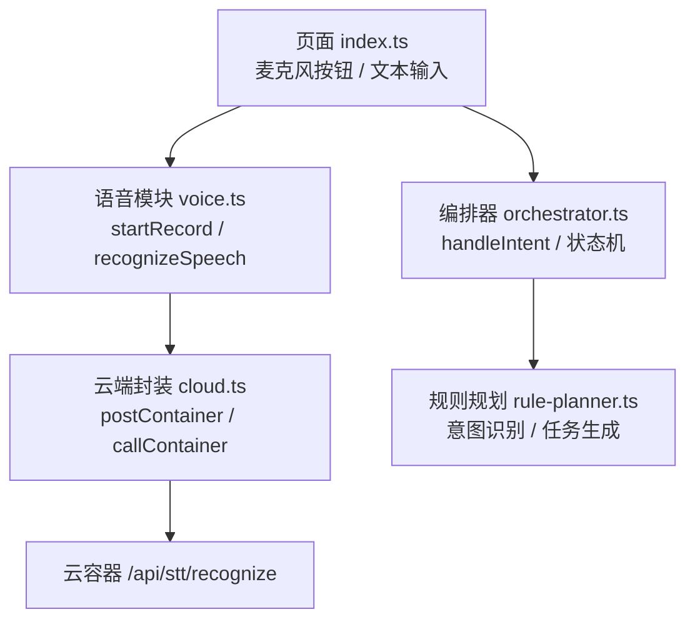
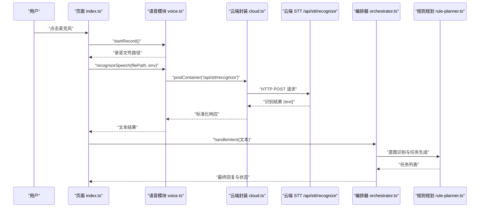
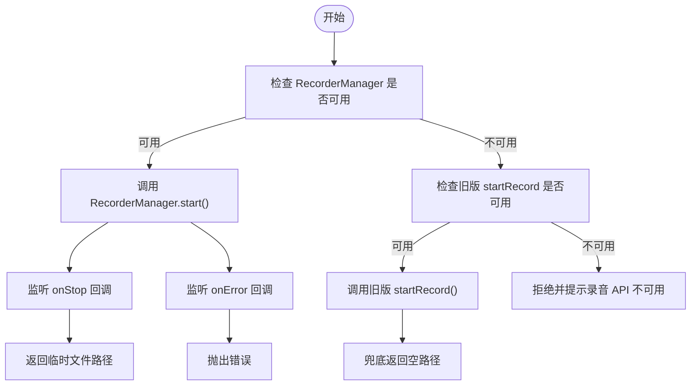
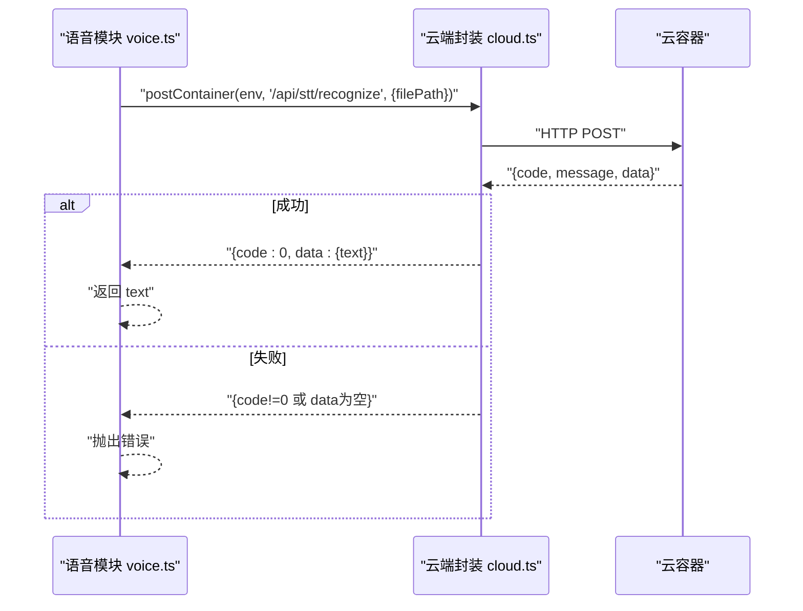
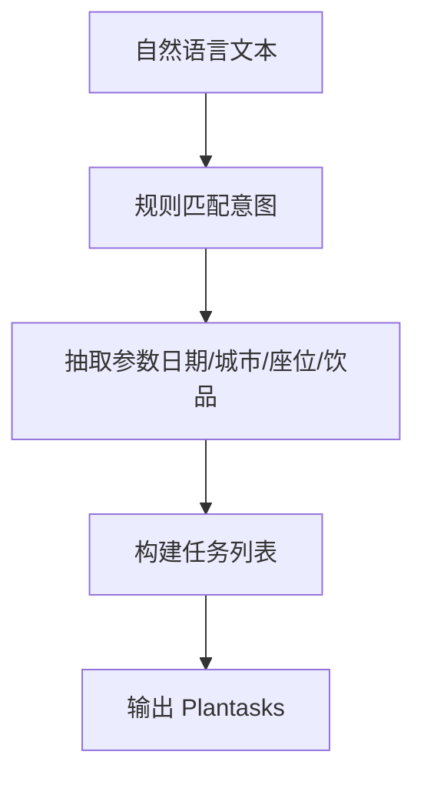
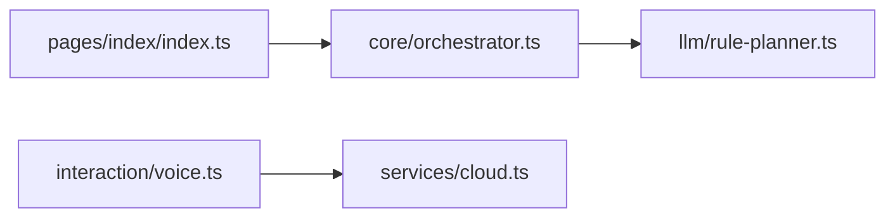

# 语音交互功能

<cite>
**本文引用的文件**   
- [voice.ts](file://miniprogram/src/interaction/voice.ts)
- [index.ts](file://miniprogram/pages/index/index.ts)
- [cloud.ts](file://miniprogram/src/services/cloud.ts)
- [rule-planner.ts](file://miniprogram/src/llm/rule-planner.ts)
- [orchestrator.ts](file://miniprogram/src/core/orchestrator.ts)
- [wx.d.ts](file://miniprogram/src/types/wx.d.ts)
</cite>

## 目录
1. [引言](#引言)
2. [项目结构](#项目结构)
3. [核心组件](#核心组件)
4. [架构总览](#架构总览)
5. [详细组件分析](#详细组件分析)
6. [依赖关系分析](#依赖关系分析)
7. [性能与优化](#性能与优化)
8. [故障排查指南](#故障排查指南)
9. [结论](#结论)

## 引言
本文件面向 WAIC-WeChat-MiniProgram 的语音交互能力，聚焦以下目标：
- 说明语音输入处理流程：录音权限获取、音频数据捕获、实时语音识别。
- 说明 STT（Speech-to-Text）服务集成方案：API 调用、结果解析与错误处理。
- 说明语音指令预处理与后处理：意图识别与命令格式化。
- 说明语音反馈实现：TTS（Text-to-Speech）播放控制与触发时机。
- 提供配置选项与性能优化策略：音频格式选择、网络请求优化与用户体验改进。

当前仓库中，语音入口在首页通过麦克风按钮提示 MVP 阶段使用文字输入；同时已封装录音与云端 STT 调用能力，供后续接入微信同声传译插件或云端 STT 服务时使用。

## 项目结构
与语音交互直接相关的代码主要分布在以下位置：
- 交互层：`miniprogram/src/interaction/voice.ts`
- 页面入口：`miniprogram/pages/index/index.ts`
- 云端通信封装：`miniprogram/src/services/cloud.ts`
- 规则式意图规划：`miniprogram/src/llm/rule-planner.ts`
- 编排器与状态机：`miniprogram/src/core/orchestrator.ts`
- 类型声明（含录音 API）：`miniprogram/src/types/wx.d.ts`

图示来源
- [index.ts:180-187](file://miniprogram/pages/index/index.ts#L180-L187)
- [voice.ts:17-64](file://miniprogram/src/interaction/voice.ts#L17-L64)
- [cloud.ts:64-149](file://miniprogram/src/services/cloud.ts#L64-L149)
- [orchestrator.ts:101-134](file://miniprogram/src/core/orchestrator.ts#L101-L134)
- [rule-planner.ts:75-99](file://miniprogram/src/llm/rule-planner.ts#L75-L99)

章节来源
- [index.ts:180-187](file://miniprogram/pages/index/index.ts#L180-L187)
- [voice.ts:1-64](file://miniprogram/src/interaction/voice.ts#L1-L64)
- [cloud.ts:1-223](file://miniprogram/src/services/cloud.ts#L1-L223)
- [rule-planner.ts:27-99](file://miniprogram/src/llm/rule-planner.ts#L27-L99)
- [orchestrator.ts:92-134](file://miniprogram/src/core/orchestrator.ts#L92-L134)
- [wx.d.ts:138-141](file://miniprogram/src/types/wx.d.ts#L138-L141)

## 核心组件
- 语音模块 `voice.ts`
  - 负责录音启动与结束回调，返回临时录音文件路径。
  - 封装云端 STT 调用，统一错误结构与重试语义。
- 云端封装 `cloud.ts`
  - 统一 wx.cloud.callContainer 调用、超时、重试、开发环境降级。
  - 提供 postContainer 快捷方法。
- 页面 `index.ts`
  - 提供麦克风按钮入口（MVP 阶段提示文字输入）。
  - 管理对话状态、加载态与 Agent 事件订阅。
- 编排器 `orchestrator.ts`
  - 处理用户意图，驱动状态机流转，协调理解、计划、执行等阶段。
- 规则规划器 `rule-planner.ts`
  - 基于关键词与正则进行意图识别与参数抽取，输出可执行任务。
- 类型声明 `wx.d.ts`
  - 定义录音相关 API 的类型，包括新版 RecorderManager 与旧版 startRecord/stopRecord。

章节来源
- [voice.ts:12-64](file://miniprogram/src/interaction/voice.ts#L12-L64)
- [cloud.ts:16-43](file://miniprogram/src/services/cloud.ts#L16-L43)
- [index.ts:117-187](file://miniprogram/pages/index/index.ts#L117-L187)
- [orchestrator.ts:101-134](file://miniprogram/src/core/orchestrator.ts#L101-L134)
- [rule-planner.ts:75-99](file://miniprogram/src/llm/rule-planner.ts#L75-L99)
- [wx.d.ts:138-141](file://miniprogram/src/types/wx.d.ts#L138-L141)

## 架构总览
语音交互的整体流程如下：
- 用户在页面点击麦克风按钮，进入语音入口。
- 调用录音模块启动录音，获取临时录音文件路径。
- 将录音文件路径发送给云端 STT 接口，得到识别文本。
- 文本进入编排器进行意图理解与任务规划。
- 根据任务执行结果更新 UI 状态与消息卡片。

图示来源
- [index.ts:180-187](file://miniprogram/pages/index/index.ts#L180-L187)
- [voice.ts:17-64](file://miniprogram/src/interaction/voice.ts#L17-L64)
- [cloud.ts:64-149](file://miniprogram/src/services/cloud.ts#L64-L149)
- [orchestrator.ts:101-134](file://miniprogram/src/core/orchestrator.ts#L101-L134)
- [rule-planner.ts:75-99](file://miniprogram/src/llm/rule-planner.ts#L75-L99)

## 详细组件分析

### 语音输入处理流程
- 录音权限与设备能力检测
  - 优先使用新版 RecorderManager；若不可用则回退到旧版 startRecord。
  - 若两者均不可用，直接拒绝并提示“录音 API 不可用”。
- 音频数据捕获
  - 设置最大录音时长与音频格式（默认 mp3）。
  - 监听停止与错误回调，返回临时文件路径或抛出错误。
- 实时语音识别
  - 当前实现为“录音结束后上传云端 STT”，非流式实时识别。
  - 真实场景建议先 uploadFile 至云存储，再调用 `/api/stt/recognize`。

图示来源
- [voice.ts:17-45](file://miniprogram/src/interaction/voice.ts#L17-L45)
- [wx.d.ts:138-141](file://miniprogram/src/types/wx.d.ts#L138-L141)

章节来源
- [voice.ts:17-45](file://miniprogram/src/interaction/voice.ts#L17-L45)
- [wx.d.ts:138-141](file://miniprogram/src/types/wx.d.ts#L138-L141)

### STT 服务集成方案
- API 调用
  - 通过 `postContainer` 调用云端容器，路径为 `/api/stt/recognize`。
  - 传入录音文件路径与环境 ID。
- 结果解析
  - 标准响应包含 code、message、data。
  - 成功时从 data.text 提取识别文本。
- 错误处理
  - 当 code 不为 0 或 data 为空时抛出错误，携带 message 或 code 信息。
  - 底层网络错误由 `callContainer` 包装为 `CloudNetworkError`，支持重试与超时。

图示来源
- [voice.ts:56-64](file://miniprogram/src/interaction/voice.ts#L56-L64)
- [cloud.ts:64-149](file://miniprogram/src/services/cloud.ts#L64-L149)

章节来源
- [voice.ts:56-64](file://miniprogram/src/interaction/voice.ts#L56-L64)
- [cloud.ts:64-149](file://miniprogram/src/services/cloud.ts#L64-L149)

### 语音指令预处理与后处理
- 预处理
  - 页面接收 STT 返回的文本，作为自然语言意图传入编排器。
- 意图识别
  - 规则规划器基于关键词与正则匹配，判断是否为购票、咖啡下单等意图。
  - 抽取日期、城市、座位类型、饮品名等参数。
- 命令格式化
  - 将识别到的意图与参数转换为任务列表，供后续执行。

图示来源
- [rule-planner.ts:75-99](file://miniprogram/src/llm/rule-planner.ts#L75-L99)

章节来源
- [rule-planner.ts:75-99](file://miniprogram/src/llm/rule-planner.ts#L75-L99)

### 语音反馈与 TTS 播放控制
- 当前实现
  - 页面未实现 TTS 播放；语音反馈主要通过文本消息与状态文案展示。
- 触发时机
  - 建议在 Agent 完成回复后，根据业务需要触发 TTS 播报。
  - 可在页面层增加 TTS 控制逻辑，结合状态变化与消息追加时机。

章节来源
- [index.ts:214-270](file://miniprogram/pages/index/index.ts#L214-L270)

## 依赖关系分析
- 页面 `index.ts` 依赖编排器 `orchestrator.ts` 处理意图。
- 语音模块 `voice.ts` 依赖云端封装 `cloud.ts` 进行 STT 调用。
- 云端封装 `cloud.ts` 依赖重试与日志工具，统一错误与超时。
- 编排器 `orchestrator.ts` 依赖规则规划器 `rule-planner.ts` 进行意图识别。

图示来源
- [index.ts:180-187](file://miniprogram/pages/index/index.ts#L180-L187)
- [voice.ts:10-64](file://miniprogram/src/interaction/voice.ts#L10-L64)
- [cloud.ts:64-149](file://miniprogram/src/services/cloud.ts#L64-L149)
- [orchestrator.ts:101-134](file://miniprogram/src/core/orchestrator.ts#L101-L134)
- [rule-planner.ts:75-99](file://miniprogram/src/llm/rule-planner.ts#L75-L99)

章节来源
- [index.ts:180-187](file://miniprogram/pages/index/index.ts#L180-L187)
- [voice.ts:10-64](file://miniprogram/src/interaction/voice.ts#L10-L64)
- [cloud.ts:64-149](file://miniprogram/src/services/cloud.ts#L64-L149)
- [orchestrator.ts:101-134](file://miniprogram/src/core/orchestrator.ts#L101-L134)
- [rule-planner.ts:75-99](file://miniprogram/src/llm/rule-planner.ts#L75-L99)

## 性能与优化
- 音频格式选择
  - 默认使用 mp3 格式，兼顾兼容性与体积。
  - 可根据网络质量调整采样率与码率，降低传输耗时。
- 网络请求优化
  - 使用云端封装的统一超时与重试机制，提升稳定性。
  - 建议先 uploadFile 到云存储，再调用 STT 接口，减少大文件直传风险。
- 用户体验改进
  - 在录音期间显示明确的状态提示与进度反馈。
  - 对 STT 失败提供降级提示与重试入口。
  - 在 TTS 播放时避免打断用户操作，提供暂停与重播控制。

章节来源
- [voice.ts:41-43](file://miniprogram/src/interaction/voice.ts#L41-L43)
- [cloud.ts:123-149](file://miniprogram/src/services/cloud.ts#L123-L149)

## 故障排查指南
- 录音 API 不可用
  - 现象：调用 startRecord 直接拒绝，提示“录音 API 不可用”。
  - 排查：确认基础库版本与设备能力，优先使用 RecorderManager。
- STT 调用失败
  - 现象：云端返回 code 不为 0 或 data 为空。
  - 排查：检查云端容器路径、环境与网络连通性；查看错误 message。
- 云端调用超时或网络异常
  - 现象：callContainer 抛出 CloudNetworkError，触发重试。
  - 排查：检查网络状况与服务器状态；必要时调整超时与重试策略。
- 意图识别不准确
  - 现象：规则匹配未能正确抽取参数或生成任务。
  - 排查：扩展规则规划器的关键词与正则表达式，补充边界用例。

章节来源
- [voice.ts:24-33](file://miniprogram/src/interaction/voice.ts#L24-L33)
- [voice.ts:56-64](file://miniprogram/src/interaction/voice.ts#L56-L64)
- [cloud.ts:99-118](file://miniprogram/src/services/cloud.ts#L99-L118)
- [rule-planner.ts:75-99](file://miniprogram/src/llm/rule-planner.ts#L75-L99)

## 结论
当前仓库已具备语音交互的基础能力：录音封装、云端 STT 调用、意图识别与任务生成。页面层在 MVP 阶段以文字输入为主，语音入口提供占位提示。后续可在此基础上接入微信同声传译插件或更完善的云端 STT/TTS 服务，完善实时识别、流式传输与语音反馈体验。