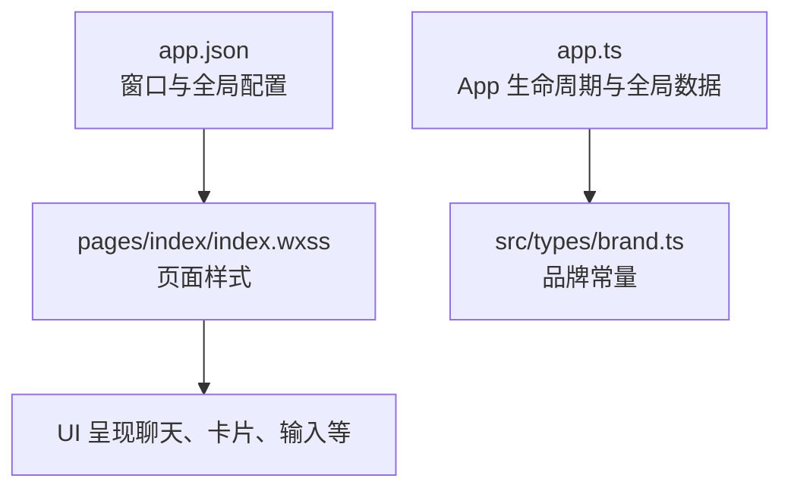
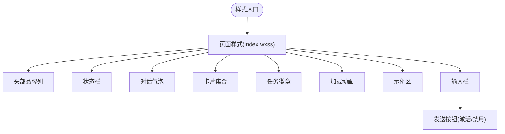
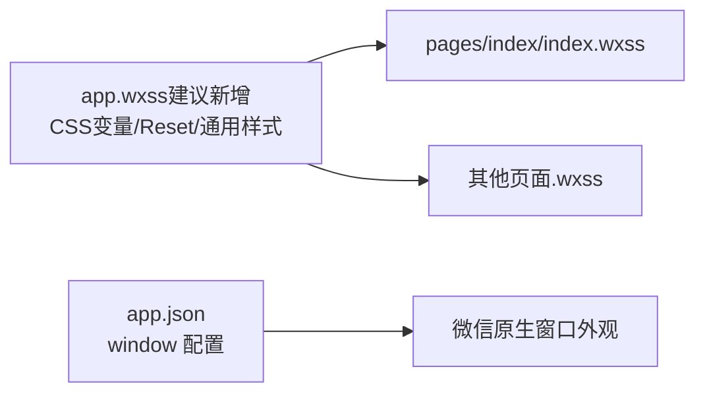
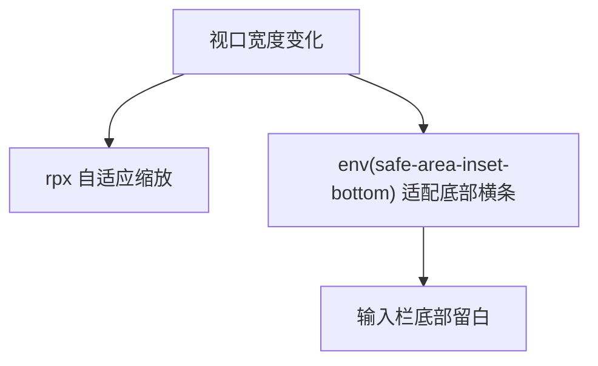
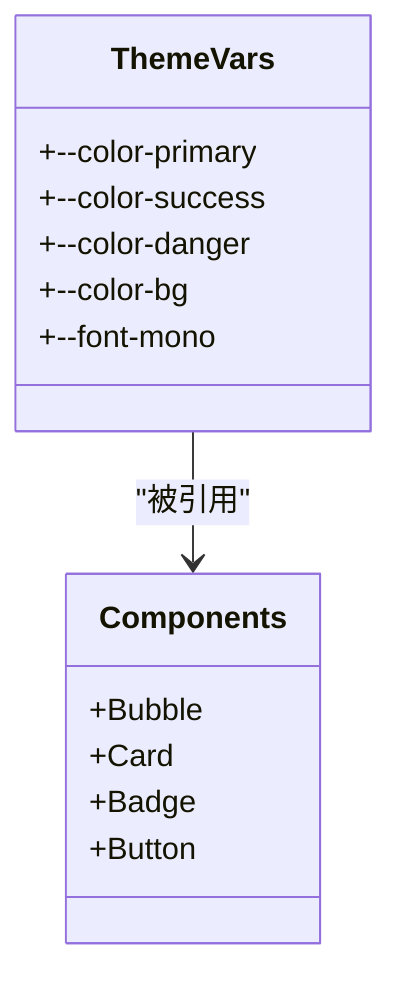
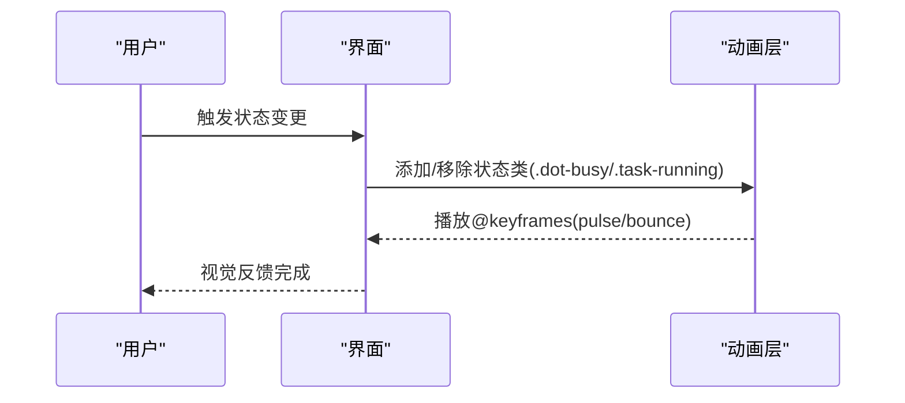
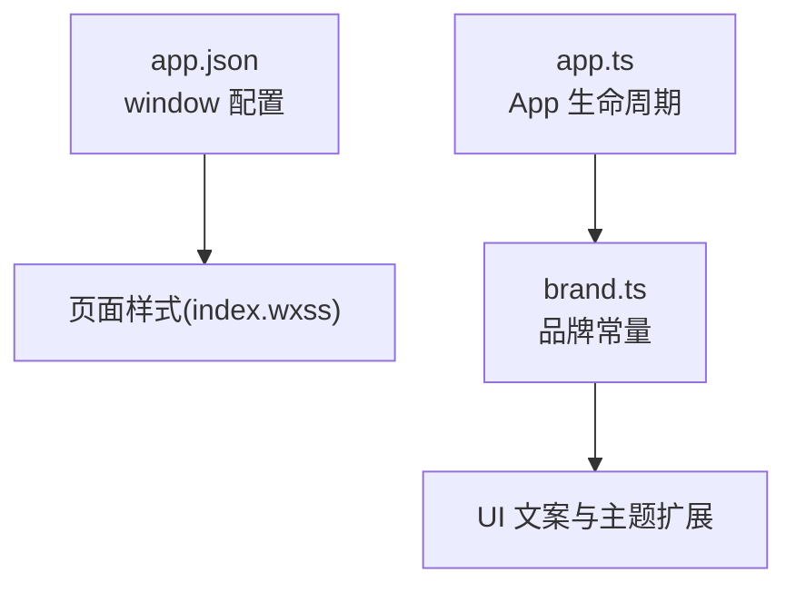

# 样式系统

<cite>
**本文引用的文件**   
- [miniprogram/pages/index/index.wxss](file://miniprogram/pages/index/index.wxss)
- [miniprogram/app.json](file://miniprogram/app.json)
- [miniprogram/app.ts](file://miniprogram/app.ts)
- [miniprogram/src/types/brand.ts](file://miniprogram/src/types/brand.ts)
</cite>

## 目录
1. [简介](#简介)
2. [项目结构](#项目结构)
3. [核心组件](#核心组件)
4. [架构总览](#架构总览)
5. [详细组件分析](#详细组件分析)
6. [依赖关系分析](#依赖关系分析)
7. [性能与优化](#性能与优化)
8. [故障排查指南](#故障排查指南)
9. [结论](#结论)
10. [附录：扩展指南](#附录扩展指南)

## 简介
本文件为 WAIC-WeChat-MiniProgram 的样式系统文档，聚焦 WXSS 的组织方式、命名规范、响应式适配策略、主题系统与动画机制，并提供可落地的优化实践与扩展建议。当前仓库在 miniprogram 目录下仅包含一个示例页面 index 的 WXSS，未提供全局 app.wxss；因此本文以现有实现为基础，给出可扩展的体系化方案，确保后续新增页面与组件时保持一致的样式治理。

## 项目结构
- 样式入口与配置
  - 应用级窗口样式通过 app.json 的 window 字段控制导航栏等基础外观。
  - 当前未定义全局 app.wxss，所有页面样式集中在各自页面的 .wxss 文件中。
- 页面样式
  - 示例页面样式位于 miniprogram/pages/index/index.wxss，涵盖头部、状态栏、对话气泡、卡片、任务徽章、加载动画、输入区等。

**图表来源**
- [miniprogram/app.json:5-12](file://miniprogram/app.json#L5-L12)
- [miniprogram/pages/index/index.wxss:1-359](file://miniprogram/pages/index/index.wxss#L1-L359)
- [miniprogram/app.ts:23-48](file://miniprogram/app.ts#L23-L48)
- [miniprogram/src/types/brand.ts:21-33](file://miniprogram/src/types/brand.ts#L21-L33)

**章节来源**
- [miniprogram/app.json:1-20](file://miniprogram/app.json#L1-L20)
- [miniprogram/pages/index/index.wxss:1-359](file://miniprogram/pages/index/index.wxss#L1-L359)

## 核心组件
本节从样式角度梳理页面中的关键视觉模块及其职责。

- 页面容器与背景
  - 使用 flex 纵向布局，高度占满视口，浅灰背景营造对话氛围。
- 顶部品牌列
  - 渐变背景、阴影、品牌名与标语、重置按钮。
- 状态栏
  - 状态点与标签，支持忙、正常、失败三种状态，带脉冲动画。
- 对话气泡
  - 用户与助手两类气泡，区分圆角与边框，内容自动换行。
- 卡片
  - 计划、结果、错误三类卡片，左侧色条区分语义。
- 任务进度徽章
  - 根据任务状态动态着色（待处理、运行中、等待人工、成功、失败、跳过、回滚）。
- 加载动画
  - 三点弹跳动画，用于阶段提示。
- 示例区
  - 示例标签展示常用指令或快捷操作。
- 输入栏
  - 麦克风按钮、输入框、发送按钮，含激活态与禁用态。

**章节来源**
- [miniprogram/pages/index/index.wxss:1-359](file://miniprogram/pages/index/index.wxss#L1-L359)

## 架构总览
WXSS 在当前项目中采用“页面级样式”组织，未引入全局样式表。整体样式架构遵循以下原则：
- 单一职责：每个页面拥有独立 .wxss，避免跨页面污染。
- 语义化命名：类名表达 UI 语义（如 .bubble-user、.card-result），便于维护与复用。
- 主题色集中：主色调与辅助色在页面内统一使用，便于后续抽取为变量。
- 动效可控：动画集中在少量关键节点（状态点、加载点），避免过度渲染。

[本图为概念性流程示意，不直接映射具体源码文件]

## 详细组件分析

### 全局样式与组件样式分离策略
- 现状
  - 无全局 app.wxss，所有样式集中于 pages/index/index.wxss。
  - 窗口级外观（导航栏标题、背景色、文字颜色）由 app.json 的 window 字段管理。
- 建议
  - 新建 app.wxss 作为全局样式入口，放置 CSS 变量、基础 reset、通用排版与主题色。
  - 将重复出现的通用样式（如按钮基类、间距系统、字体族）提取到全局。
  - 页面 .wxss 只保留页面特有样式与组件局部样式，减少耦合。

**图表来源**
- [miniprogram/app.json:5-12](file://miniprogram/app.json#L5-L12)

**章节来源**
- [miniprogram/app.json:1-20](file://miniprogram/app.json#L1-L20)

### 命名规范
- 语义优先：类名表达含义，如 .bubble-user、.card-error、.task-running。
- 组合命名：前缀+语义+变体，如 .send-btn-active、.send-btn-disabled。
- 状态类：用状态后缀表示交互态，如 .dot-busy、.state-ok、.task-succeeded。
- 避免深层嵌套：尽量扁平化选择器，降低特异性冲突。

**章节来源**
- [miniprogram/pages/index/index.wxss:1-359](file://miniprogram/pages/index/index.wxss#L1-L359)

### 响应式设计与断点
- 单位策略
  - 大量使用 rpx，利于在不同屏幕尺寸下按比例缩放。
  - 字号、间距、圆角、阴影均基于 rpx，保证多端一致性。
- 安全区域
  - 输入栏底部使用 env(safe-area-inset-bottom)，适配刘海屏与底部横条设备。
- 断点建议
  - 当前页面以流式布局为主，未显式使用 @media 断点。
  - 建议在 app.wxss 中定义断点变量（如 --bp-sm、--bp-md、--bp-lg），并在需要时通过媒体查询调整布局密度与字号。

**图表来源**
- [miniprogram/pages/index/index.wxss:311-318](file://miniprogram/pages/index/index.wxss#L311-L318)

**章节来源**
- [miniprogram/pages/index/index.wxss:1-359](file://miniprogram/pages/index/index.wxss#L1-L359)

### 主题系统
- 颜色
  - 主色：紫色系渐变（头部、用户气泡、激活按钮）。
  - 语义色：成功（绿色）、失败（红色）、中性（灰色）。
  - 状态色：任务徽章与状态点按状态切换颜色。
- 字体
  - 正文使用常规字体族，部分信息使用 monospace（如技能标识、状态值）。
- 主题定制建议
  - 在 app.wxss 中定义 CSS 变量（如 --color-primary、--color-success、--color-danger、--font-mono），供页面与组件引用。
  - 通过 data-theme 属性切换主题模式（浅色/深色），配合媒体查询与 JS 切换逻辑。

[本图为概念性类图，不直接映射具体源码文件]

**章节来源**
- [miniprogram/pages/index/index.wxss:1-359](file://miniprogram/pages/index/index.wxss#L1-L359)

### 动画与过渡效果
- 状态点脉冲
  - 使用 @keyframes pulse 实现呼吸效果，表达忙碌状态。
- 加载三点弹跳
  - 使用 @keyframes bounce 与 animation-delay 错开三个点的弹跳节奏。
- 交互反馈
  - 发送按钮通过 .send-btn-active 与 .send-btn-disabled 切换背景与透明度，提供即时反馈。

**图表来源**
- [miniprogram/pages/index/index.wxss:48-76](file://miniprogram/pages/index/index.wxss#L48-L76)
- [miniprogram/pages/index/index.wxss:244-283](file://miniprogram/pages/index/index.wxss#L244-L283)
- [miniprogram/pages/index/index.wxss:340-359](file://miniprogram/pages/index/index.wxss#L340-L359)

**章节来源**
- [miniprogram/pages/index/index.wxss:48-76](file://miniprogram/pages/index/index.wxss#L48-L76)
- [miniprogram/pages/index/index.wxss:244-283](file://miniprogram/pages/index/index.wxss#L244-L283)
- [miniprogram/pages/index/index.wxss:340-359](file://miniprogram/pages/index/index.wxss#L340-L359)

### 样式最佳实践
- 性能
  - 避免复杂选择器与深层嵌套，保持选择器扁平。
  - 合理使用 will-change 与 transform 提升动画性能（谨慎使用，避免过度）。
  - 限制动画数量与时长，避免同时过多动画导致掉帧。
- 兼容性
  - 使用 rpx 与 env() 适配不同机型与安全区域。
  - 对不支持的特性提供降级方案（如渐变背景不可用时使用纯色）。
- 可维护性
  - 统一命名与层级结构，建立组件样式模板。
  - 将重复样式抽离为公共类或 CSS 变量。

[本节为通用指导，不直接分析具体文件]

## 依赖关系分析
- 样式与配置
  - app.json 的 window 字段影响导航栏外观，与页面样式共同构成整体视觉。
- 样式与运行时
  - app.ts 负责 App 生命周期与 globalData 注入，与样式无直接耦合，但可通过 globalData 暴露的品牌信息间接影响文案显示。
- 样式与品牌常量
  - brand.ts 提供品牌名称、标语与版本，虽不直接参与样式，但与 UI 文案一致，有助于主题与国际化扩展。

**图表来源**
- [miniprogram/app.json:5-12](file://miniprogram/app.json#L5-L12)
- [miniprogram/app.ts:23-48](file://miniprogram/app.ts#L23-L48)
- [miniprogram/src/types/brand.ts:21-33](file://miniprogram/src/types/brand.ts#L21-L33)

**章节来源**
- [miniprogram/app.json:1-20](file://miniprogram/app.json#L1-L20)
- [miniprogram/app.ts:1-49](file://miniprogram/app.ts#L1-L49)
- [miniprogram/src/types/brand.ts:1-37](file://miniprogram/src/types/brand.ts#L1-L37)

## 性能与优化
- 渲染路径
  - 对话气泡与卡片频繁更新时，尽量减少重排与重绘，优先使用 transform 与 opacity 做动画。
- 资源体积
  - 合并重复样式，避免冗余类；按需引入组件样式，减少无用规则。
- 兼容性与降级
  - 对高级特性（如 backdrop-filter、复杂渐变）提供 fallback。
- 调试与监控
  - 使用微信开发者工具的 Performance 面板观察动画帧率与重绘热点。

[本节为通用指导，不直接分析具体文件]

## 故障排查指南
- 导航栏样式异常
  - 检查 app.json 的 window 配置是否覆盖默认样式。
- 输入栏底部被遮挡
  - 确认 env(safe-area-inset-bottom) 是否正确应用。
- 动画卡顿
  - 检查是否存在过多并发动画或复杂滤镜；简化动画或使用硬件加速属性。
- 主题不一致
  - 若引入 CSS 变量，检查变量作用域与覆盖顺序。

**章节来源**
- [miniprogram/app.json:5-12](file://miniprogram/app.json#L5-L12)
- [miniprogram/pages/index/index.wxss:311-318](file://miniprogram/pages/index/index.wxss#L311-L318)

## 结论
当前项目的样式系统以页面级 WXSS 为主，命名语义清晰，动画克制且聚焦关键交互点。为支撑未来规模化扩展，建议引入全局 app.wxss 统一管理主题变量、基础样式与断点，并将重复样式抽象为公共类。在此基础上，结合 CSS 变量与媒体查询，构建可插拔的主题系统与响应式布局，确保新增组件与功能模块时保持一致的视觉与体验标准。

[本节为总结性内容，不直接分析具体文件]

## 附录：扩展指南
- 新增页面
  - 在对应 pages 目录下创建 .wxml/.ts/.json/.wxss，仅编写页面特有样式。
- 新增组件
  - 将组件样式放入组件目录下的 wxss，并通过 BEM 或类似约定命名，避免与页面样式冲突。
- 主题扩展
  - 在 app.wxss 中定义主题变量，并通过 data-theme 切换；必要时在 JS 中监听系统主题变化并同步。
- 响应式增强
  - 在 app.wxss 中定义断点变量，并在需要处使用 @media 查询调整布局密度与字号。
- 动画规范
  - 统一动画时长与缓动函数，避免随意设置；对长列表滚动与频繁更新的节点谨慎使用动画。

[本节为通用指导，不直接分析具体文件]