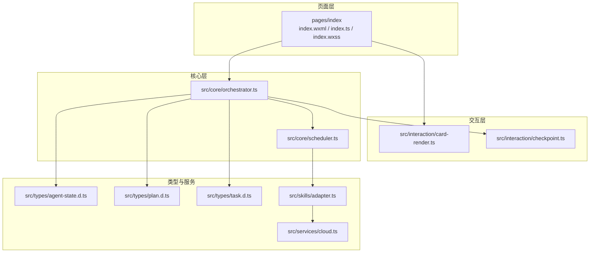
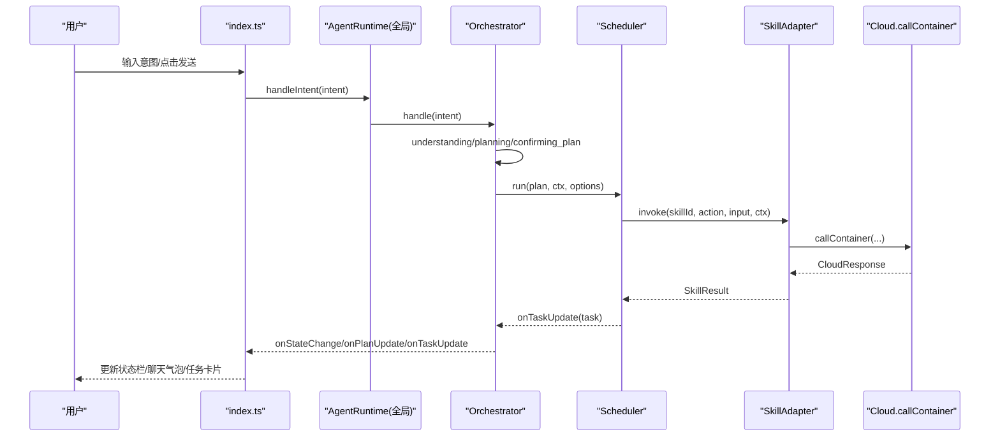
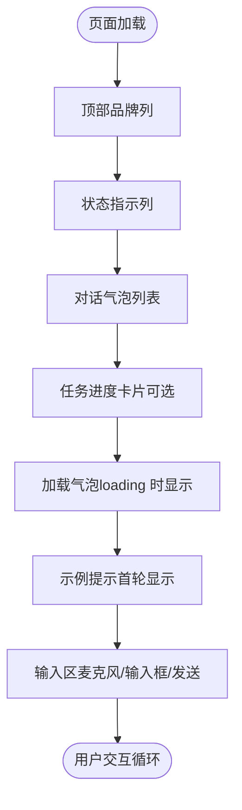
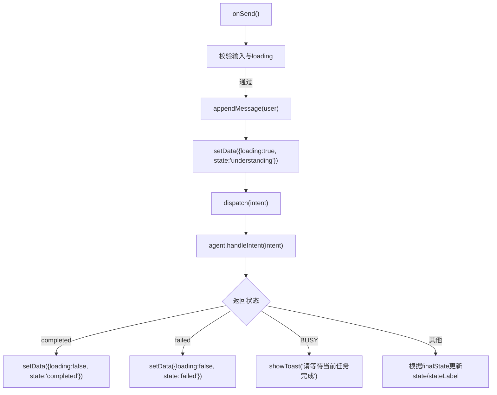
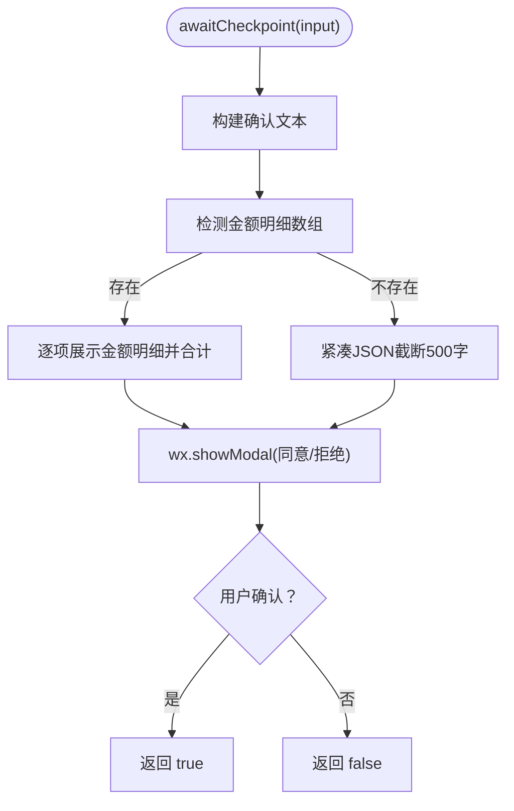
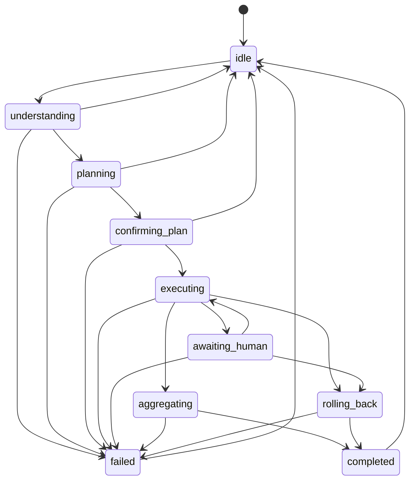
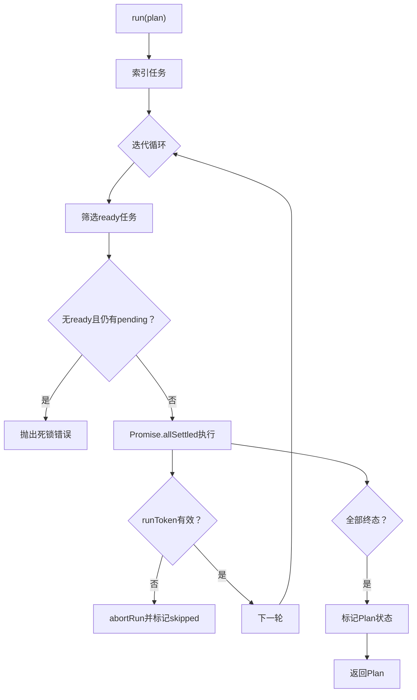
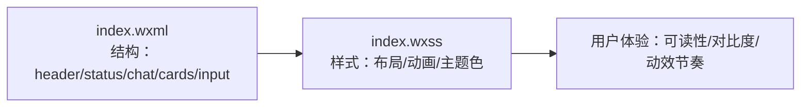
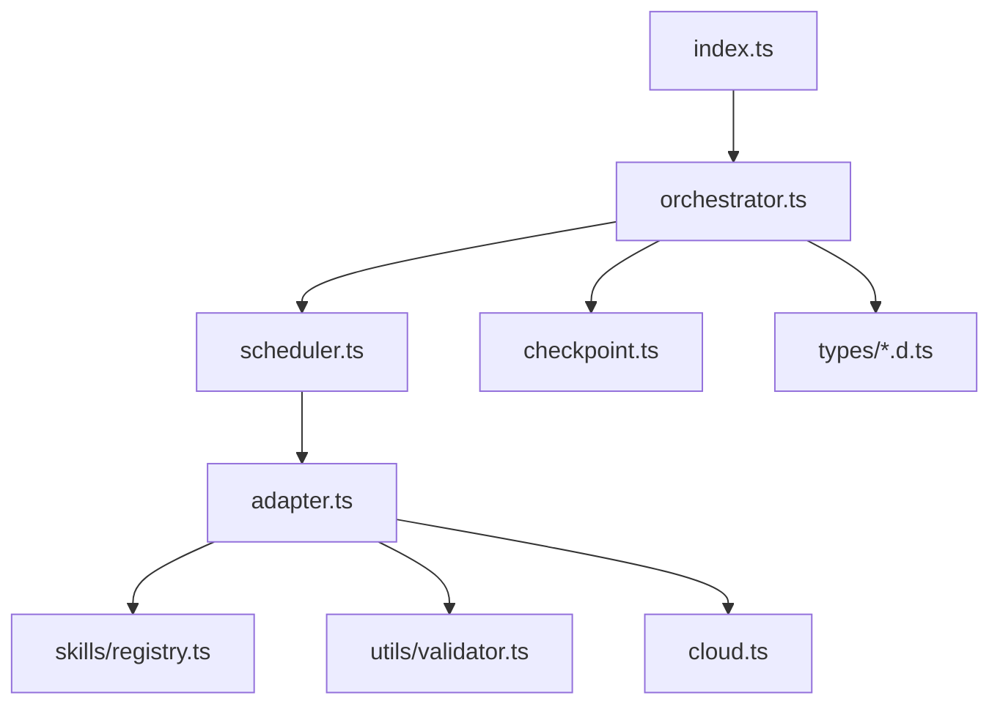

# 用户界面

<cite>
**本文引用的文件**   
- [index.wxml](file://miniprogram/pages/index/index.wxml)
- [index.ts](file://miniprogram/pages/index/index.ts)
- [index.wxss](file://miniprogram/pages/index/index.wxss)
- [app.json](file://miniprogram/app.json)
- [card-render.ts](file://miniprogram/src/interaction/card-render.ts)
- [checkpoint.ts](file://miniprogram/src/interaction/checkpoint.ts)
- [agent-state.d.ts](file://miniprogram/src/types/agent-state.d.ts)
- [orchestrator.ts](file://miniprogram/src/core/orchestrator.ts)
- [scheduler.ts](file://miniprogram/src/core/scheduler.ts)
- [plan.d.ts](file://miniprogram/src/types/plan.d.ts)
- [task.d.ts](file://miniprogram/src/types/task.d.ts)
- [cloud.ts](file://miniprogram/src/services/cloud.ts)
- [adapter.ts](file://miniprogram/src/skills/adapter.ts)
</cite>

## 目录
1. [简介](#简介)
2. [项目结构](#项目结构)
3. [核心组件](#核心组件)
4. [架构总览](#架构总览)
5. [详细组件分析](#详细组件分析)
6. [依赖关系分析](#依赖关系分析)
7. [性能与体验优化](#性能与体验优化)
8. [故障排查指南](#故障排查指南)
9. [结论](#结论)

## 简介
本文件面向 WAIC-WeChat-MiniProgram 的用户界面，聚焦小程序首页（index）的页面结构、交互层设计、UI 状态管理、WXML/WXSS 组织方式，以及人机协作界面的实现细节。文档同时给出卡片渲染引擎、状态指示显示、用户反馈机制、响应式设计与主题定制方法，并提供可复用的 UI 组件使用示例与自定义指南，最后总结用户体验优化与性能调优建议。

## 项目结构
小程序采用“页面 + 业务核心”的分层组织：
- 页面层：`miniprogram/pages/index` 包含 WXML、TS、WXSS 与 JSON 配置，负责对话气泡、输入区、状态栏与任务进度卡片的展示与交互。
- 交互层：`miniprogram/src/interaction` 提供卡片渲染辅助与人类确认对话框。
- 核心层：`miniprogram/src/core` 提供 Orchestrator（状态机）、Scheduler（DAG 调度器）等编排能力。
- 类型定义：`miniprogram/src/types` 统一 AgentState、Plan、Task 等数据结构。
- 服务层：`miniprogram/src/services` 封装微信云开发调用、支付格式化等通用能力。
- 技能适配：`miniprogram/src/skills` 提供 SKILL 注册与统一调用适配器。



**图表来源**
- [index.ts:117-152](file://miniprogram/pages/index/index.ts#L117-L152)
- [orchestrator.ts:73-256](file://miniprogram/src/core/orchestrator.ts#L73-L256)
- [scheduler.ts:77-128](file://miniprogram/src/core/scheduler.ts#L77-L128)
- [card-render.ts:21-53](file://miniprogram/src/interaction/card-render.ts#L21-L53)
- [checkpoint.ts:48-122](file://miniprogram/src/interaction/checkpoint.ts#L48-L122)
- [cloud.ts:64-149](file://miniprogram/src/services/cloud.ts#L64-L149)
- [adapter.ts:36-85](file://miniprogram/src/skills/adapter.ts#L36-L85)

**章节来源**
- [index.wxml:1-77](file://miniprogram/pages/index/index.wxml#L1-L77)
- [index.ts:1-329](file://miniprogram/pages/index/index.ts#L1-L329)
- [index.wxss:1-359](file://miniprogram/pages/index/index.wxss#L1-L359)
- [app.json:1-20](file://miniprogram/app.json#L1-L20)

## 核心组件
- 首页页面控制器（index.ts）：负责消息列表、输入框、发送逻辑、状态列文案、加载动画、重置对话、订阅 Agent runtime 事件并驱动 UI 更新。
- 卡片渲染引擎（card-render.ts）：将 Plan 与结果数据转换为 UI 可渲染的卡片 schema，支持 plan/result/error/info/train/order/payment 等类型。
- 人类确认对话框（checkpoint.ts）：通过 wx.showModal 提供 Plan 确认与单步写操作确认；在缺少 wx API 时降级为自动拒绝，保证测试可用。
- 状态机编排器（orchestrator.ts）：维护 AgentState 状态机，协调理解、规划、确认、执行、聚合、完成/失败/回滚等阶段，并向 UI 推送状态与任务进度。
- DAG 调度器（scheduler.ts）：按依赖并行执行 Task，处理等待人类确认、失败级联跳过、死锁检测与运行令牌失效中止。
- 类型定义（agent-state.d.ts, plan.d.ts, task.d.ts）：统一 AgentState、Plan、Task 等数据结构，约束状态转移表与卡片结构。
- 云服务封装（cloud.ts）：统一微信云容器调用、超时重试、开发环境降级与初始化。
- 技能适配器（adapter.ts）：统一 SKILL 调用入口、入参校验、错误包装与回滚接口。

**章节来源**
- [index.ts:25-84](file://miniprogram/pages/index/index.ts#L25-L84)
- [card-render.ts:11-53](file://miniprogram/src/interaction/card-render.ts#L11-L53)
- [checkpoint.ts:21-122](file://miniprogram/src/interaction/checkpoint.ts#L21-L122)
- [orchestrator.ts:28-71](file://miniprogram/src/core/orchestrator.ts#L28-L71)
- [scheduler.ts:27-52](file://miniprogram/src/core/scheduler.ts#L27-L52)
- [agent-state.d.ts:7-47](file://miniprogram/src/types/agent-state.d.ts#L7-L47)
- [plan.d.ts:12-51](file://miniprogram/src/types/plan.d.ts#L12-L51)
- [task.d.ts:11-59](file://miniprogram/src/types/task.d.ts#L11-L59)
- [cloud.ts:16-53](file://miniprogram/src/services/cloud.ts#L16-L53)
- [adapter.ts:19-85](file://miniprogram/src/skills/adapter.ts#L19-L85)

## 架构总览
页面层通过 getApp().globalData.agent 访问 Orchestrator，订阅 onStateChange、onPlanUpdate、onTaskUpdate 三个事件，驱动 WXML 中的状态栏、聊天气泡与任务进度卡片实时刷新。Orchestrator 内部协调 LLM 理解与规划、人类确认、Scheduler 执行与结果聚合，并通过 adapter 调用 SKILL，最终经 cloud.ts 与云端容器通信。



**图表来源**
- [index.ts:141-151](file://miniprogram/pages/index/index.ts#L141-L151)
- [orchestrator.ts:106-256](file://miniprogram/src/core/orchestrator.ts#L106-L256)
- [scheduler.ts:77-128](file://miniprogram/src/core/scheduler.ts#L77-L128)
- [adapter.ts:36-85](file://miniprogram/src/skills/adapter.ts#L36-L85)
- [cloud.ts:64-149](file://miniprogram/src/services/cloud.ts#L64-L149)

## 详细组件分析

### 页面结构与布局（index.wxml）
- 顶部品牌列：品牌名、标语与重置按钮。
- 状态指示列：根据 state 动态切换圆点颜色与文案（待命中/理解中/计划中/等待确认/执行中/等待人类/汇总中/已完成/失败/回滚中）。
- 对话气泡列表：滚动容器，按 role 区分用户与助手气泡；每条消息可附带 cards，用于展示任务进度卡片。
- 加载气泡：loading 状态下显示当前 stateLabel 与三点弹跳动画。
- 示例提示：首轮显示快捷示例，点击后直接触发 dispatch。
- 输入区：麦克风按钮（MVP 提示文字输入）、输入框、发送按钮（loading 仅禁用发送，不锁定输入）。



**图表来源**
- [index.wxml:1-77](file://miniprogram/pages/index/index.wxml#L1-L77)

**章节来源**
- [index.wxml:1-77](file://miniprogram/pages/index/index.wxml#L1-L77)

### 交互层设计（index.ts）
- 消息模型：ChatMessage 包含 id、role、content、timestamp、cards；ChatCard 包含 type、title、payload。
- 页面数据：brandName、brandTagline、messages、inputText、loading、state、stateLabel、scrollIntoView。
- 生命周期：onLoad 订阅 runtime 事件；onUnload 退订；onTapReset 清空对话并重置 Agent。
- 输入与发送：onInput 受控更新；onSend 校验非空且未 loading，调用 dispatch；onTapExample 快捷触发。
- 状态映射：STATE_LABELS 将 AgentState 转为中文文案；TASK_STATUS_LABELS 将任务状态转为徽章文案。
- 事件处理：
  - onAgentStateChange：更新状态列与 loading 气泡文案。
  - onAgentPlanUpdate：生成计划卡片消息，列出每个任务的摘要与初始状态。
  - onAgentTaskUpdate：就地更新对应任务卡片的 status 与 statusLabel，并在失败时附加 error 信息。
- 滚动控制：appendMessage 追加消息并设置 scrollIntoView 锚点，确保新消息自动滚动到底部。



**图表来源**
- [index.ts:166-270](file://miniprogram/pages/index/index.ts#L166-L270)

**章节来源**
- [index.ts:25-84](file://miniprogram/pages/index/index.ts#L25-L84)
- [index.ts:117-329](file://miniprogram/pages/index/index.ts#L117-L329)

### 卡片渲染引擎（card-render.ts）
- RenderCard 定义：type、title、subtitle、body、actions。
- renderPlan：将 Plan.tasks 映射为多张 plan 类型卡片，包含 taskId、input、dependsOn、status 等 body 字段，并提供“检视”操作。
- renderResult：过滤 succeeded 的任务，按 skillId 选择 result 类型（train/order/payment/info），并以 data 作为 body。
- pickResultType：根据 skillId 关键词推断卡片类型，便于 UI 差异化展示。

```mermaid
classDiagram
class RenderCard {
+string type
+string title
+string subtitle
+Record~string, unknown~ body
+{label : string;action : string;primary? : boolean}[] actions
}
class CardRenderer {
+renderPlan(plan) RenderCard[]
+renderResult(plan) RenderCard[]
-pickResultType(skillId) string
}
CardRenderer --> RenderCard : "生成"
```

**图表来源**
- [card-render.ts:11-53](file://miniprogram/src/interaction/card-render.ts#L11-L53)

**章节来源**
- [card-render.ts:1-53](file://miniprogram/src/interaction/card-render.ts#L1-L53)

### 人类确认对话框（checkpoint.ts）
- showWxModal：封装 wx.showModal，若不可用则降级为自动拒绝（测试友好）。
- confirmPlan：展示 Plan 的所有任务摘要，含依赖信息，供用户确认是否执行。
- formatInputDetail：金额感知格式化，优先识别订单明细数组，逐行展示“品名 × 数量 = 金额”，并计算合计；非订单入参退化紧凑 JSON（截断至 500 字符）。
- awaitCheckpoint：对单步写操作进行确认，展示任务类型（读/写）、明细与同意/拒绝选项。



**图表来源**
- [checkpoint.ts:48-122](file://miniprogram/src/interaction/checkpoint.ts#L48-L122)

**章节来源**
- [checkpoint.ts:1-122](file://miniprogram/src/interaction/checkpoint.ts#L1-L122)

### UI 状态管理与状态机（orchestrator.ts）
- ALLOWED_TRANSITIONS：定义合法的状态转移路径，防止非法跳转导致 UI 不一致。
- Orchestrator.handle：主流程包括 understanding → planning → confirming_plan → executing → aggregating → completed/failed；异常分支包含 LLM_ERROR、DEADLOCK、UNEXPECTED 等错误码。
- reset：强制通道，绕过转移守卫，将状态归位 idle，并递增 runToken 使在途流程失效。
- rollbackIfNeeded：按反序撤销已成功且可逆的任务，标记 rolled_back 并通知 UI。
- handleTaskUpdate：将 Scheduler 的 waiting_human/running 映射到 Orchestrator 的 awaiting_human/executing，保持 UI 同步。



**图表来源**
- [orchestrator.ts:60-71](file://miniprogram/src/core/orchestrator.ts#L60-L71)

**章节来源**
- [orchestrator.ts:73-340](file://miniprogram/src/core/orchestrator.ts#L73-L340)

### DAG 调度器（scheduler.ts）
- run：每轮找出 ready 任务并并行执行，直到全部终态或死锁；完成后标记 Plan 状态。
- isReady：判断任务依赖是否满足。
- executeOne：解析 inputBindings，必要时触发 checkpoint（序列化互斥），执行 SKILL，记录结果与状态，失败则级联跳过下游。
- abortRun：runToken 失效时将所有非终态任务标记 skipped。
- cascadeSkip：递归标记所有依赖失败任务的下游为 skipped。



**图表来源**
- [scheduler.ts:77-128](file://miniprogram/src/core/scheduler.ts#L77-L128)
- [scheduler.ts:139-204](file://miniprogram/src/core/scheduler.ts#L139-L204)
- [scheduler.ts:219-240](file://miniprogram/src/core/scheduler.ts#L219-L240)

**章节来源**
- [scheduler.ts:1-245](file://miniprogram/src/core/scheduler.ts#L1-L245)

### WXML 模板结构与 WXSS 样式组织
- WXML：使用条件渲染与列表渲染组合，结合 scroll-view 实现消息自动滚动；卡片通过嵌套 for 遍历 item.cards。
- WXSS：
  - 页面背景与 Flex 布局，顶部品牌列渐变与阴影。
  - 状态列圆点动画（pulse）与状态标签配色（busy/ok/failed）。
  - 气泡样式区分用户与助手，内容换行与最大宽度限制。
  - 卡片边框色与背景色区分 plan/result/error，任务徽章随状态变色。
  - 加载气泡三点弹跳动画（bounce）。
  - 输入区安全区域适配（env(safe-area-inset-bottom)），发送按钮激活/禁用态。



**图表来源**
- [index.wxml:1-77](file://miniprogram/pages/index/index.wxml#L1-L77)
- [index.wxss:1-359](file://miniprogram/pages/index/index.wxss#L1-L359)

**章节来源**
- [index.wxss:1-359](file://miniprogram/pages/index/index.wxss#L1-L359)

### 人机协作界面设计原则与实现
- 透明化计划：Plan 确认后以卡片形式展示任务清单与依赖，用户可直观理解执行路径。
- 写操作强确认：所有 requiresHumanConfirm 的写操作必须经过 awaitCheckpoint，金额明细强制展示，避免误操作。
- 状态可见性：状态栏与 loading 气泡实时反映 AgentState，帮助用户感知系统当前阶段。
- 失败与回滚：失败时按反序撤销已成功且可逆的任务，UI 通过任务卡片状态变化呈现回滚结果。
- 降级与容错：wx.showModal 不可用时降级为自动拒绝；云端不可用时 code:-1 降級，保证本地演示与测试可用性。

**章节来源**
- [checkpoint.ts:48-122](file://miniprogram/src/interaction/checkpoint.ts#L48-L122)
- [orchestrator.ts:272-303](file://miniprogram/src/core/orchestrator.ts#L272-L303)
- [cloud.ts:157-182](file://miniprogram/src/services/cloud.ts#L157-L182)

## 依赖关系分析
- 页面层依赖 Orchestrator 的事件回调，间接依赖 Scheduler、Adapter、Cloud。
- Orchestrator 依赖 types（AgentState、Plan、Task）与 interaction（checkpoint）。
- Scheduler 依赖 adapter 与 utils（binding/logger），并通过 checkpoint 注入人类确认逻辑。
- Adapter 依赖 registry 与 validator，屏蔽 wx.* 直接调用，统一错误结构。
- Cloud 封装 wx.cloud.callContainer，提供超时重试与开发环境降级。



**图表来源**
- [index.ts:117-152](file://miniprogram/pages/index/index.ts#L117-L152)
- [orchestrator.ts:13-26](file://miniprogram/src/core/orchestrator.ts#L13-L26)
- [scheduler.ts:18-25](file://miniprogram/src/core/scheduler.ts#L18-L25)
- [adapter.ts:13-17](file://miniprogram/src/skills/adapter.ts#L13-L17)
- [cloud.ts:1-11](file://miniprogram/src/services/cloud.ts#L1-L11)

**章节来源**
- [index.ts:117-152](file://miniprogram/pages/index/index.ts#L117-L152)
- [orchestrator.ts:13-26](file://miniprogram/src/core/orchestrator.ts#L13-L26)
- [scheduler.ts:18-25](file://miniprogram/src/core/scheduler.ts#L18-L25)
- [adapter.ts:13-17](file://miniprogram/src/skills/adapter.ts#L13-L17)
- [cloud.ts:1-11](file://miniprogram/src/services/cloud.ts#L1-L11)

## 性能与体验优化
- 列表滚动优化：使用 scroll-into-view 与 scroll-with-animation 确保新消息平滑滚动到底部，避免频繁全量重绘。
- 状态更新最小化：onAgentTaskUpdate 就地更新对应卡片 payload，减少 messages 数组整体替换开销。
- 并发控制：Scheduler 使用 Promise.allSettled 并行执行 ready 任务，提升吞吐；checkpoint 序列化互斥避免弹窗覆盖。
- 网络层优化：cloud.ts 提供超时与重试策略，开发环境降级保障本地演示流畅。
- 主题与响应式：使用 rpx 单位与 flex 布局适配不同屏幕尺寸；渐变与阴影增强视觉层次；safe-area-inset-bottom 适配刘海屏。
- 动效节制：脉冲与弹跳动画使用 CSS keyframes，避免 JS 动画造成卡顿。

[本节为通用指导，不直接分析具体文件]

## 故障排查指南
- Agent runtime 未就绪：页面 onLoad 时若 globalData.agent 缺失，会记录错误日志并禁用对话功能。检查 app.ts 是否正确初始化 agent。
- BUSY 状态：当 Orchestrator 处于非空闲状态时，handleIntent 返回 errorCode='BUSY'，页面显示 toast 提示等待。
- EMPTY_PLAN：LLM 无法识别意图返回空 tasks，状态归位 idle，页面提示换种说法。
- DEADLOCK：Scheduler 检测到 pending 任务无法推进，抛出死锁错误，UI 进入 failed 状态。
- LLM_ERROR：Planner 调用失败，UI 显示错误消息并进入 failed。
- UNEXPECTED：未知异常，UI 显示系统异常提示并进入 failed。
- 云端不可用：开发环境降级为 code:-1，SKILL mock 与规则规划器兜底生效；正式环境保留严格失败语义。

**章节来源**
- [index.ts:141-151](file://miniprogram/pages/index/index.ts#L141-L151)
- [index.ts:246-269](file://miniprogram/pages/index/index.ts#L246-L269)
- [orchestrator.ts:106-256](file://miniprogram/src/core/orchestrator.ts#L106-L256)
- [scheduler.ts:95-114](file://miniprogram/src/core/scheduler.ts#L95-L114)
- [cloud.ts:106-118](file://miniprogram/src/services/cloud.ts#L106-L118)

## 结论
WAIC-WeChat-MiniProgram 的用户界面以清晰的页面分层与事件驱动的状态管理为核心，结合卡片渲染引擎与人类确认对话框，实现了高透明度的人机协作体验。Orchestrator 与 Scheduler 共同保证了复杂任务的可观测性与可靠性，而 cloud.ts 与 adapter.ts 提供了统一的网络与技能调用抽象。通过合理的 WXML/WXSS 组织与响应式设计，界面在不同设备上保持一致的视觉与交互质量。建议在后续迭代中继续强化错误提示的可视化、优化长列表渲染性能，并扩展主题定制能力以满足更多品牌需求。