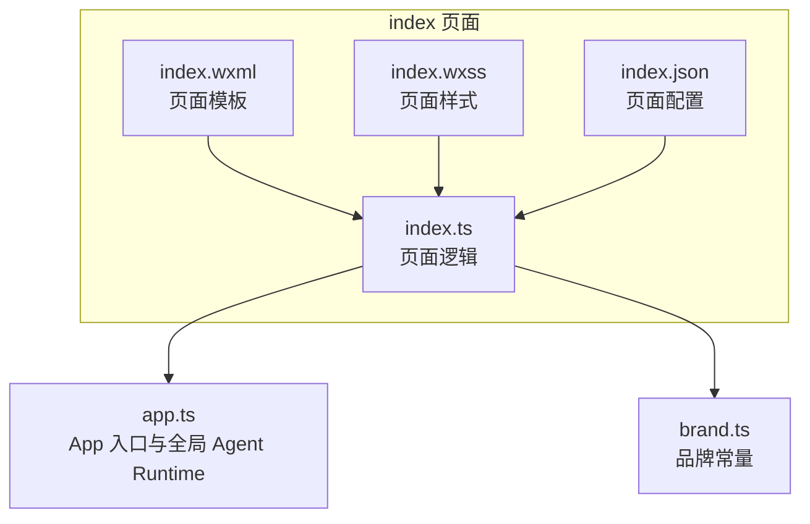
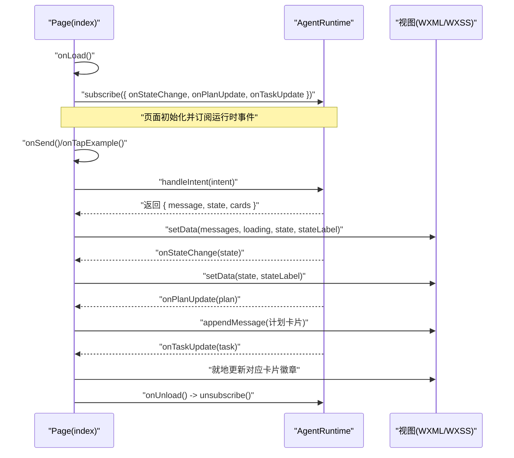
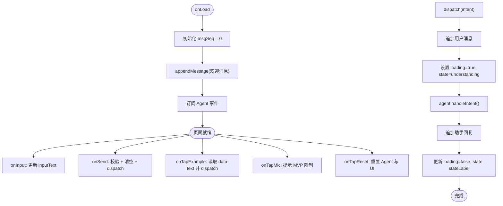
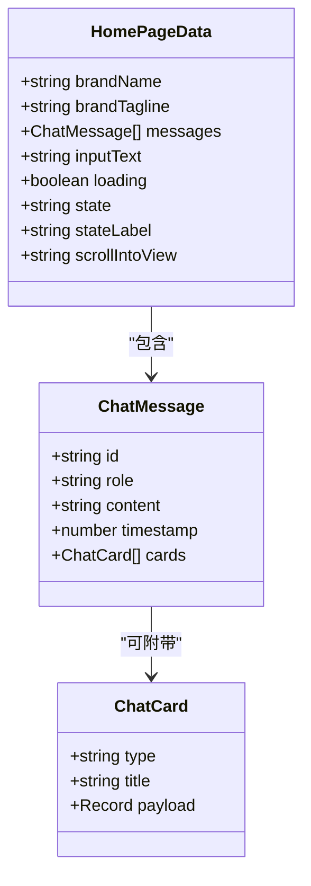
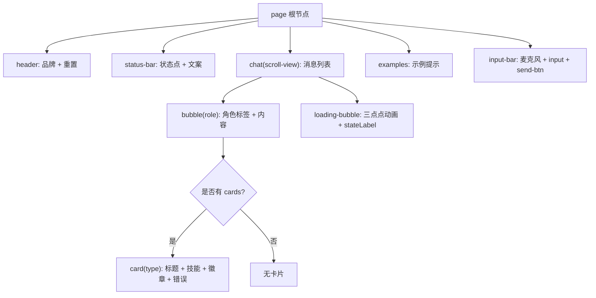
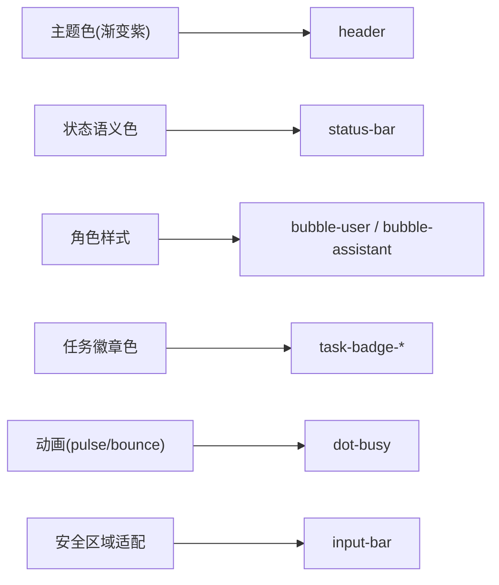
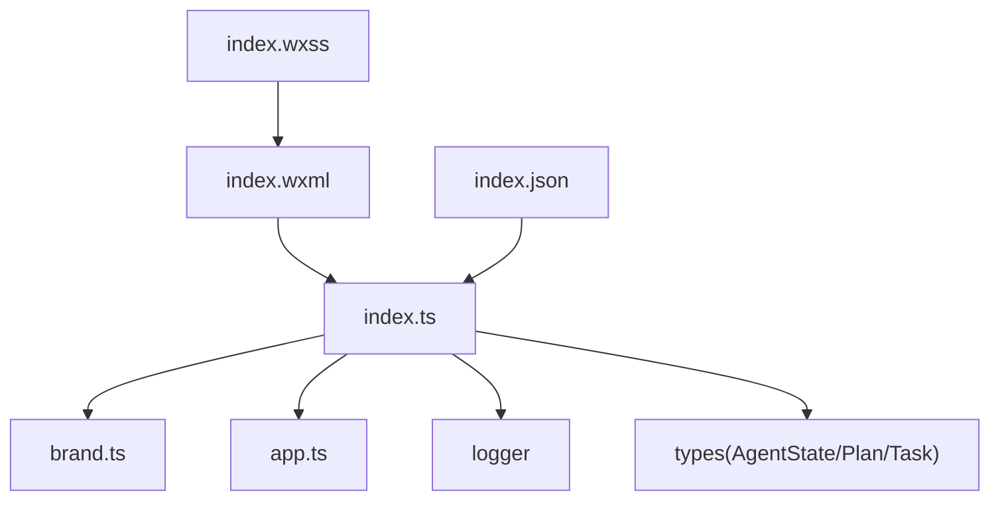

# 页面组件结构

<cite>
**本文引用的文件**   
- [index.ts](file://miniprogram/pages/index/index.ts)
- [index.wxml](file://miniprogram/pages/index/index.wxml)
- [index.wxss](file://miniprogram/pages/index/index.wxss)
- [index.json](file://miniprogram/pages/index/index.json)
- [app.ts](file://miniprogram/app.ts)
- [brand.ts](file://miniprogram/src/types/brand.ts)
</cite>

## 目录
1. [简介](#简介)
2. [项目结构](#项目结构)
3. [核心组件](#核心组件)
4. [架构总览](#架构总览)
5. [详细组件分析](#详细组件分析)
6. [依赖关系分析](#依赖关系分析)
7. [性能考量](#性能考量)
8. [故障排查指南](#故障排查指南)
9. [结论](#结论)
10. [附录：使用与扩展指南](#附录使用与扩展指南)

## 简介
本文面向 WAIC-WeChat-MiniProgram 的首页（index）页面，系统性说明其页面组件结构、数据模型、模板层次、样式组织以及事件与生命周期管理。重点包括：
- index 页面的组件组织方式与 Page 生命周期管理
- HomePageData 接口数据结构设计（消息列表、输入状态、加载状态等）
- WXML 模板结构（对话气泡、输入框、状态指示器、进度卡片）
- WXSS 样式组织（响应式布局、主题变量、组件样式隔离）
- 页面组件的使用示例与自定义扩展指南

## 项目结构
index 页面由四个标准小程序文件组成：
- index.ts：页面逻辑、数据绑定、事件处理、Agent 运行时订阅
- index.wxml：页面模板，包含品牌头、状态栏、对话气泡列表、输入区
- index.wxss：页面样式，包含布局、气泡、卡片、徽章、动画等
- index.json：页面配置，声明导航标题与组件引用

图表来源
- [index.ts:117-329](file://miniprogram/pages/index/index.ts#L117-L329)
- [index.wxml:1-77](file://miniprogram/pages/index/index.wxml#L1-L77)
- [index.wxss:1-359](file://miniprogram/pages/index/index.wxss#L1-L359)
- [index.json:1-4](file://miniprogram/pages/index/index.json#L1-L4)
- [app.ts:23-48](file://miniprogram/app.ts#L23-L48)
- [brand.ts:21-36](file://miniprogram/src/types/brand.ts#L21-L36)

章节来源
- [index.ts:117-329](file://miniprogram/pages/index/index.ts#L117-L329)
- [index.wxml:1-77](file://miniprogram/pages/index/index.wxml#L1-L77)
- [index.wxss:1-359](file://miniprogram/pages/index/index.wxss#L1-L359)
- [index.json:1-4](file://miniprogram/pages/index/index.json#L1-L4)
- [app.ts:23-48](file://miniprogram/app.ts#L23-L48)
- [brand.ts:21-36](file://miniprogram/src/types/brand.ts#L21-L36)

## 核心组件
- 页面容器与头部：品牌名称、标语与重置按钮
- 状态栏：状态点与状态文案，随 Agent 状态机实时更新
- 对话区域：滚动容器，渲染用户与助手消息气泡，支持自动滚动到底部
- 计划与任务卡片：在助手消息中内嵌卡片，展示任务清单与实时进度徽章
- 输入区：麦克风占位按钮、受控输入框、发送按钮（loading 仅禁用发送，不禁止输入）

章节来源
- [index.wxml:1-77](file://miniprogram/pages/index/index.wxml#L1-L77)
- [index.ts:117-329](file://miniprogram/pages/index/index.ts#L117-L329)

## 架构总览
index 页面通过 getApp().globalData.agent 获取 AgentRuntime，并在 onLoad 时订阅状态变更、计划更新与任务进度事件；onUnload 时退订。页面数据通过 setData 驱动 WXML 渲染，WXSS 提供样式与动画。

图表来源
- [index.ts:129-158](file://miniprogram/pages/index/index.ts#L129-L158)
- [index.ts:165-270](file://miniprogram/pages/index/index.ts#L165-L270)
- [index.ts:272-327](file://miniprogram/pages/index/index.ts#L272-L327)
- [app.ts:38-47](file://miniprogram/app.ts#L38-L47)

## 详细组件分析

### 页面生命周期与事件流
- onLoad：初始化消息序列号、注入欢迎消息、订阅 Agent 运行时事件
- onUnload：清理事件订阅，避免内存泄漏
- onInput：受控输入框双向绑定
- onSend：校验输入与 loading 状态，清空输入并调用 dispatch
- onTapExample：快捷示例触发 dispatch
- onTapMic：MVP 阶段提示使用文字输入
- onTapReset：重置 Agent 与本地消息状态

图表来源
- [index.ts:129-158](file://miniprogram/pages/index/index.ts#L129-L158)
- [index.ts:160-205](file://miniprogram/pages/index/index.ts#L160-L205)
- [index.ts:213-270](file://miniprogram/pages/index/index.ts#L213-L270)

章节来源
- [index.ts:129-158](file://miniprogram/pages/index/index.ts#L129-L158)
- [index.ts:160-205](file://miniprogram/pages/index/index.ts#L160-L205)
- [index.ts:213-270](file://miniprogram/pages/index/index.ts#L213-L270)

### HomePageData 数据结构设计
HomePageData 是页面级数据模型，承载以下核心字段：
- brandName / brandTagline：品牌信息，来自 brand.ts
- messages：聊天消息数组，每条消息包含 id、role、content、timestamp，可选 cards
- inputText：输入框当前值
- loading：是否处于请求或处理中
- state：Agent 状态枚举字符串
- stateLabel：state 对应的中文文案
- scrollIntoView：用于 scroll-view 自动滚动到最新消息的锚点 ID

图表来源
- [index.ts:25-56](file://miniprogram/pages/index/index.ts#L25-L56)
- [brand.ts:21-36](file://miniprogram/src/types/brand.ts#L21-L36)

章节来源
- [index.ts:25-56](file://miniprogram/pages/index/index.ts#L25-L56)
- [brand.ts:21-36](file://miniprogram/src/types/brand.ts#L21-L36)

### WXML 模板结构与渲染逻辑
- 顶部品牌列：显示品牌名、标语与重置按钮
- 状态栏：根据 state 动态切换状态点与文案样式
- 对话气泡列表：scroll-view 包裹，wx:for 遍历 messages，按 role 区分气泡样式；当存在 cards 时渲染计划卡片
- 加载气泡：当 loading 为真时显示“三点点”动画与当前 stateLabel
- 示例提示：仅在首条消息以内显示
- 输入区：麦克风按钮、input 受控绑定、发送按钮根据 inputText 与 loading 控制激活态

图表来源
- [index.wxml:1-77](file://miniprogram/pages/index/index.wxml#L1-L77)

章节来源
- [index.wxml:1-77](file://miniprogram/pages/index/index.wxml#L1-L77)

### WXSS 样式组织与主题
- 布局：使用 flex 构建纵向布局，页面高度 100vh，对话区 flex:1 自适应
- 主题色：主色调采用渐变紫色系，成功/失败/忙碌状态分别用绿色、红色、蓝色标识
- 组件样式隔离：通过类名限定作用域，如 .bubble-user/.bubble-assistant、.task-pending/.task-running 等
- 动画：状态点脉冲动画与三点弹跳动画增强交互反馈
- 安全区域：输入区底部预留 env(safe-area-inset-bottom)，适配刘海屏

图表来源
- [index.wxss:1-359](file://miniprogram/pages/index/index.wxss#L1-L359)

章节来源
- [index.wxss:1-359](file://miniprogram/pages/index/index.wxss#L1-L359)

### 事件处理与数据绑定机制
- 数据绑定：WXML 通过 {{}} 绑定 data 字段，如 brandName、messages、inputText、stateLabel、scrollIntoView
- 事件绑定：bindtap、bindinput、bindconfirm 分别绑定 to 方法，实现点击与输入回调
- 受控输入：onInput 同步更新 inputText，确保输入框始终与 data 一致
- 自动滚动：appendMessage 同时设置 scrollIntoView 为最新消息 id，配合 scroll-with-animation 平滑滚动

章节来源
- [index.wxml:16-75](file://miniprogram/pages/index/index.wxml#L16-L75)
- [index.ts:160-170](file://miniprogram/pages/index/index.ts#L160-L170)
- [index.ts:323-327](file://miniprogram/pages/index/index.ts#L323-L327)

### Agent 运行时集成与状态映射
- 运行时获取：getAgent 从 getApp().globalData.agent 懒加载 AgentRuntime
- 事件订阅：onLoad 订阅 onStateChange、onPlanUpdate、onTaskUpdate；onUnload 退订
- 状态映射：STATE_LABELS 将内部状态码映射为中文文案，供状态栏与加载气泡共用
- 任务徽章映射：TASK_STATUS_LABELS 将任务状态映射为徽章文案，随 onTaskUpdate 就地更新

章节来源
- [index.ts:111-115](file://miniprogram/pages/index/index.ts#L111-L115)
- [index.ts:141-151](file://miniprogram/pages/index/index.ts#L141-L151)
- [index.ts:86-109](file://miniprogram/pages/index/index.ts#L86-L109)
- [index.ts:272-321](file://miniprogram/pages/index/index.ts#L272-L321)

## 依赖关系分析
- index.ts 依赖：
  - brand.ts：品牌常量 BRAND_NAME、BRAND_TAGLINE、BRAND_AI_GENERATED_BY
  - app.ts：通过 getApp().globalData.agent 获取 AgentRuntime
  - logger：日志输出 info/error
  - 类型定义：AgentState、Plan、Task（用于事件回调参数）
- index.wxml 依赖：
  - index.ts 暴露的数据与方法（data 字段与事件回调）
- index.wxss 依赖：
  - index.wxml 的类名结构
- index.json：
  - 声明页面标题与组件引用（本页面未使用自定义组件）

图表来源
- [index.ts:18-23](file://miniprogram/pages/index/index.ts#L18-L23)
- [index.ts:111-115](file://miniprogram/pages/index/index.ts#L111-L115)
- [index.wxml:1-77](file://miniprogram/pages/index/index.wxml#L1-L77)
- [index.wxss:1-359](file://miniprogram/pages/index/index.wxss#L1-L359)
- [index.json:1-4](file://miniprogram/pages/index/index.json#L1-L4)

章节来源
- [index.ts:18-23](file://miniprogram/pages/index/index.ts#L18-L23)
- [index.ts:111-115](file://miniprogram/pages/index/index.ts#L111-L115)
- [index.wxml:1-77](file://miniprogram/pages/index/index.wxml#L1-L77)
- [index.wxss:1-359](file://miniprogram/pages/index/index.wxss#L1-L359)
- [index.json:1-4](file://miniprogram/pages/index/index.json#L1-L4)

## 性能考量
- 懒加载 AgentRuntime：app.ts 中 globalData.agent 为 getter，首次访问时才创建实例，降低启动耗时
- 轻量 onLaunch：避免在 onLaunch 中进行重计算，保持基础库性能要求
- 局部更新：onTaskUpdate 仅更新对应卡片，避免全量重绘
- 滚动优化：使用 scroll-into-view 与 scroll-with-animation 提升滚动体验
- 输入不受限：loading 期间仍允许继续输入，提升多轮对话效率

章节来源
- [app.ts:23-47](file://miniprogram/app.ts#L23-L47)
- [index.ts:300-321](file://miniprogram/pages/index/index.ts#L300-L321)
- [index.wxml:17-47](file://miniprogram/pages/index/index.wxml#L17-L47)

## 故障排查指南
- Agent runtime 未就绪：
  - 现象：控制台报错提示 globalData.agent 缺失，对话功能不可用
  - 排查：确认 App 已正确初始化，且 createAgentRuntime 能正常构造
  - 参考：[index.ts:141-151](file://miniprogram/pages/index/index.ts#L141-L151)
- 发送失败或异常：
  - 现象：dispatch 捕获异常后追加错误消息，并将 state 置为 failed
  - 排查：检查 handleIntent 返回值与 errorCode 分支处理
  - 参考：[index.ts:256-269](file://miniprogram/pages/index/index.ts#L256-L269)
- 状态文案不更新：
  - 现象：状态栏文案未变化
  - 排查：确认 onAgentStateChange 被调用且 STATE_LABELS 映射完整
  - 参考：[index.ts:272-275](file://miniprogram/pages/index/index.ts#L272-L275)
- 任务徽章不更新：
  - 现象：任务进度卡片徽章不变
  - 排查：确认 onTaskUpdate 能找到对应 taskId 并更新 payload.status/statusLabel
  - 参考：[index.ts:300-321](file://miniprogram/pages/index/index.ts#L300-L321)

章节来源
- [index.ts:141-151](file://miniprogram/pages/index/index.ts#L141-L151)
- [index.ts:256-269](file://miniprogram/pages/index/index.ts#L256-L269)
- [index.ts:272-275](file://miniprogram/pages/index/index.ts#L272-L275)
- [index.ts:300-321](file://miniprogram/pages/index/index.ts#L300-L321)

## 结论
index 页面以清晰的组件分层与明确的数据流向实现了 Agent 对话界面：
- 通过 Page 生命周期与事件订阅，将运行时状态与 UI 紧密联动
- HomePageData 作为单一数据源，支撑消息、输入、状态与滚动锚点
- WXML 模板结构直观，结合 WXSS 的主题与动画，提供良好的用户体验
- 通过懒加载与局部更新策略，兼顾了性能与可维护性

## 附录：使用与扩展指南

### 页面组件使用示例
- 启动应用后进入 index 页面，默认显示欢迎消息与示例提示
- 点击示例或直接输入文本，点击发送或回车触发对话
- 观察状态栏与加载气泡的状态变化，查看计划卡片与任务徽章的实时更新
- 点击重置按钮可清空对话并重置 Agent

章节来源
- [index.wxml:49-75](file://miniprogram/pages/index/index.wxml#L49-L75)
- [index.ts:165-205](file://miniprogram/pages/index/index.ts#L165-L205)

### 自定义与扩展指南
- 新增页面功能：
  - 在 index.ts 中添加新的 data 字段与事件处理方法，并通过 setData 更新视图
  - 在 index.wxml 中绑定新字段与事件，必要时添加新的 UI 区块
  - 在 index.wxss 中为新元素编写样式，遵循现有命名规范与主题色
- 扩展状态与徽章：
  - 在 STATE_LABELS 与 TASK_STATUS_LABELS 中补充新的状态映射
  - 在 index.wxss 中为新的 task-* 徽章类添加样式
- 主题定制：
  - 调整 header 渐变背景、气泡颜色、状态语义色等，保持视觉一致性
  - 如需深色模式，可在 WXSS 中引入条件样式或使用 CSS 变量（需评估基础库兼容性）
- 组件化建议：
  - 将气泡、卡片、输入区等抽取为独立组件，减少单页复杂度
  - 通过组件 props 传递数据，事件回调统一在页面层处理

章节来源
- [index.ts:44-56](file://miniprogram/pages/index/index.ts#L44-L56)
- [index.ts:86-109](file://miniprogram/pages/index/index.ts#L86-L109)
- [index.wxss:1-359](file://miniprogram/pages/index/index.wxss#L1-L359)