# 性能优化

<cite>
**本文引用的文件**   
- [miniprogram/app.ts](file://miniprogram/app.ts)
- [miniprogram/pages/index/index.ts](file://miniprogram/pages/index/index.ts)
- [miniprogram/src/core/orchestrator.ts](file://miniprogram/src/core/orchestrator.ts)
- [miniprogram/src/core/scheduler.ts](file://miniprogram/src/core/scheduler.ts)
- [miniprogram/src/services/cloud.ts](file://miniprogram/src/services/cloud.ts)
- [miniprogram/src/llm/client.ts](file://miniprogram/src/llm/client.ts)
- [miniprogram/src/storage/cache.ts](file://miniprogram/src/storage/cache.ts)
- [cloudrun/src/server.ts](file://cloudrun/src/server.ts)
- [cloudrun/src/api.ts](file://cloudrun/src/api.ts)
- [cloudrun/package.json](file://cloudrun/package.json)
- [miniprogram/app.json](file://miniprogram/app.json)
- [project.config.json](file://project.config.json)
</cite>

## 目录
1. [引言](#引言)
2. [项目结构](#项目结构)
3. [核心组件](#核心组件)
4. [架构总览](#架构总览)
5. [详细组件分析](#详细组件分析)
6. [依赖关系分析](#依赖关系分析)
7. [性能考虑](#性能考虑)
8. [故障排查指南](#故障排查指南)
9. [结论](#结论)
10. [附录](#附录)

## 引言
本文件面向 WAIC-WeChat-MiniProgram 的性能优化，覆盖小程序端与云端服务两端：
- 小程序端：页面加载优化、内存管理、渲染性能调优。
- 云端服务：Node.js 进程优化、数据库查询优化（扩展建议）、缓存策略配置。
- 并发处理与负载均衡：任务调度优化、连接池管理、资源限流策略。
- 性能监控与分析：APM 集成、瓶颈识别、优化效果评估。
- 容量规划与扩展：水平扩展、自动扩缩容规则、成本优化建议。

## 项目结构
本项目由小程序前端与云端容器服务组成：
- 小程序端位于 miniprogram，包含 App 入口、首页对话页、Agent 运行时、LLM 客户端、SKILL 适配层、存储与缓存等。
- 云端服务位于 cloudrun，使用 Node.js 原生 http 模块提供 REST 路由与健康检查，并聚合 LLM、训练与咖啡技能等子路由。

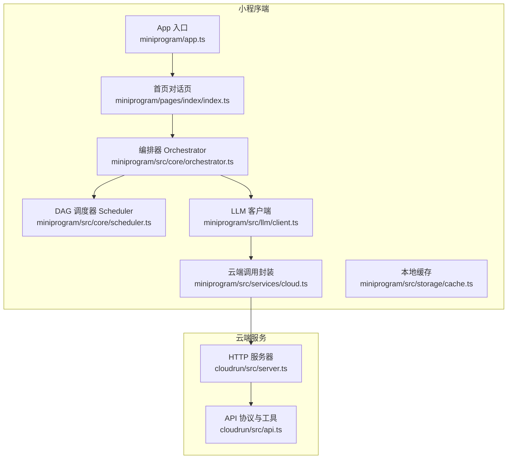

**图表来源**
- [miniprogram/app.ts:23-48](file://miniprogram/app.ts#L23-L48)
- [miniprogram/pages/index/index.ts:117-158](file://miniprogram/pages/index/index.ts#L117-L158)
- [miniprogram/src/core/orchestrator.ts:73-118](file://miniprogram/src/core/orchestrator.ts#L73-L118)
- [miniprogram/src/core/scheduler.ts:76-128](file://miniprogram/src/core/scheduler.ts#L76-L128)
- [miniprogram/src/services/cloud.ts:64-149](file://miniprogram/src/services/cloud.ts#L64-L149)
- [miniprogram/src/llm/client.ts:56-119](file://miniprogram/src/llm/client.ts#L56-L119)
- [cloudrun/src/server.ts:76-128](file://cloudrun/src/server.ts#L76-L128)
- [cloudrun/src/api.ts:10-38](file://cloudrun/src/api.ts#L10-L38)

**章节来源**
- [miniprogram/app.ts:1-49](file://miniprogram/app.ts#L1-L49)
- [cloudrun/src/server.ts:1-28](file://cloudrun/src/server.ts#L1-L28)

## 核心组件
- App 入口：负责微信生命周期、全局品牌信息与懒加载 Agent Runtime，避免 onLaunch 阻塞。
- 首页对话页：订阅 Agent 状态与计划变更，增量更新消息列表与滚动定位。
- Orchestrator：状态机驱动理解、计划、确认、执行、聚合、回滚等阶段，并提供 reset 令牌防止并发双跑。
- Scheduler：DAG 任务调度，支持并行执行、死锁检测、checkpoint 序列化与级联跳过。
- Cloud 调用封装：统一超时、重试、错误归一化与开发环境降级。
- LLM 客户端：计划生成、解析与兜底规则规划；在开发环境对云端不可用进行降级。
- 本地缓存：基于 TTL 的 SKILL 结果缓存，减少重复调用。
- 云端 HTTP 服务器：健康检查、请求体大小限制、JSON 解析、路由分发与统一响应。

**章节来源**
- [miniprogram/app.ts:23-48](file://miniprogram/app.ts#L23-L48)
- [miniprogram/pages/index/index.ts:117-158](file://miniprogram/pages/index/index.ts#L117-L158)
- [miniprogram/src/core/orchestrator.ts:73-118](file://miniprogram/src/core/orchestrator.ts#L73-L118)
- [miniprogram/src/core/scheduler.ts:76-128](file://miniprogram/src/core/scheduler.ts#L76-L128)
- [miniprogram/src/services/cloud.ts:64-149](file://miniprogram/src/services/cloud.ts#L64-L149)
- [miniprogram/src/llm/client.ts:56-119](file://miniprogram/src/llm/client.ts#L56-L119)
- [miniprogram/src/storage/cache.ts:35-52](file://miniprogram/src/storage/cache.ts#L35-L52)
- [cloudrun/src/server.ts:76-128](file://cloudrun/src/server.ts#L76-L128)

## 架构总览
下图展示一次用户输入到云端返回的端到端流程，包括状态机转移、任务调度、云端调用与重试机制。

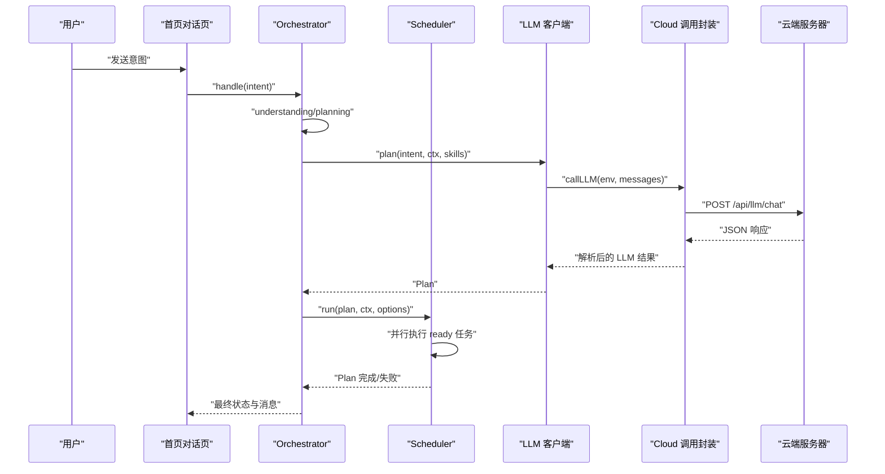

**图表来源**
- [miniprogram/pages/index/index.ts:214-270](file://miniprogram/pages/index/index.ts#L214-L270)
- [miniprogram/src/core/orchestrator.ts:106-221](file://miniprogram/src/core/orchestrator.ts#L106-L221)
- [miniprogram/src/core/scheduler.ts:76-128](file://miniprogram/src/core/scheduler.ts#L76-L128)
- [miniprogram/src/llm/client.ts:56-119](file://miniprogram/src/llm/client.ts#L56-L119)
- [miniprogram/src/services/cloud.ts:64-149](file://miniprogram/src/services/cloud.ts#L64-L149)
- [cloudrun/src/server.ts:76-128](file://cloudrun/src/server.ts#L76-L128)

## 详细组件分析

### 小程序端性能优化

#### 页面加载优化
- 懒加载 Agent Runtime：App.onLaunch 仅输出轻量日志，Agent Runtime 通过 globalData.agent getter 懒构造，避免启动耗时超过基础库阈值。
- 按需初始化云端环境：ensureCloudInit 仅在首次使用时初始化 wx.cloud.init，且捕获异常不阻断启动。
- 分包与懒加载：app.json 启用 requiredComponents 懒加载，减少首屏包体积。

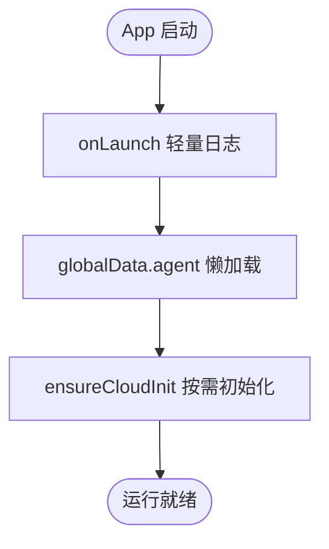

**图表来源**
- [miniprogram/app.ts:23-48](file://miniprogram/app.ts#L23-L48)
- [miniprogram/src/services/cloud.ts:192-207](file://miniprogram/src/services/cloud.ts#L192-L207)
- [miniprogram/app.json:12-12](file://miniprogram/app.json#L12-L12)

**章节来源**
- [miniprogram/app.ts:23-48](file://miniprogram/app.ts#L23-L48)
- [miniprogram/src/services/cloud.ts:192-207](file://miniprogram/src/services/cloud.ts#L192-L207)
- [miniprogram/app.json:1-20](file://miniprogram/app.json#L1-L20)

#### 内存管理与渲染性能调优
- 增量 setData：appendMessage 追加单条消息并设置 scrollIntoView，避免全量重建。
- 事件订阅与退订：onLoad 订阅 runtime 事件，onUnload 退订，防止内存泄漏。
- 可控输入框：loading 期间允许继续输入下一条，提升交互流畅度。
- 消息 ID 唯一性：msgSeq 递增生成 wx:key，避免同毫秒时间戳碰撞导致重绘抖动。

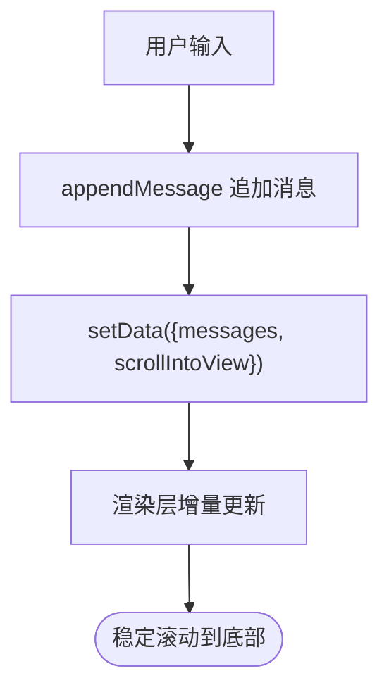

**图表来源**
- [miniprogram/pages/index/index.ts:214-270](file://miniprogram/pages/index/index.ts#L214-L270)
- [miniprogram/pages/index/index.ts:323-327](file://miniprogram/pages/index/index.ts#L323-L327)

**章节来源**
- [miniprogram/pages/index/index.ts:117-158](file://miniprogram/pages/index/index.ts#L117-L158)
- [miniprogram/pages/index/index.ts:214-270](file://miniprogram/pages/index/index.ts#L214-L270)
- [miniprogram/pages/index/index.ts:323-327](file://miniprogram/pages/index/index.ts#L323-L327)

#### 网络与重试优化
- 统一超时与重试：callContainer 默认 15s 超时，最多 3 次重试，指数退避 baseDelayMs=600ms。
- 开发环境降级：isDevEnv 判定 develop/trial/release，非 release 时云端不可用降级为 code:-1，保证演示链路。
- 错误归一化：CloudNetworkError 标记 retryable，上层可据此决定是否重试或降级。

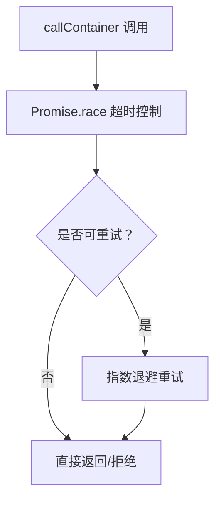

**图表来源**
- [miniprogram/src/services/cloud.ts:64-149](file://miniprogram/src/services/cloud.ts#L64-L149)
- [miniprogram/src/services/cloud.ts:172-182](file://miniprogram/src/services/cloud.ts#L172-L182)

**章节来源**
- [miniprogram/src/services/cloud.ts:64-149](file://miniprogram/src/services/cloud.ts#L64-L149)
- [miniprogram/src/services/cloud.ts:172-182](file://miniprogram/src/services/cloud.ts#L172-L182)

#### 本地缓存策略
- SKILL 结果缓存：key 格式 cache:skillId:action:hash(input)，TTL 默认 5 分钟，避免重复调用。
- FNV-1a 哈希：对 input JSON 字符串计算 32-bit hash，降低键冲突概率。
- 失效策略：invalidateSkill 当前为空实现，依赖 TTL 自然过期。

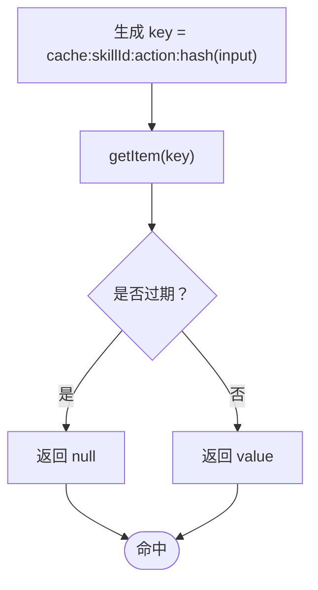

**图表来源**
- [miniprogram/src/storage/cache.ts:24-52](file://miniprogram/src/storage/cache.ts#L24-L52)

**章节来源**
- [miniprogram/src/storage/cache.ts:1-57](file://miniprogram/src/storage/cache.ts#L1-L57)

### 云端服务性能优化

#### Node.js 进程优化
- 零运行时依赖：仅使用 node:http 内建模组，减少冷启动时间与依赖开销。
- 端口与环境变量：PORT 环境变量指定监听端口，默认 80，符合云托管要求。
- 健康检查：GET / 与 /healthz 返回 200，供云托管探活。

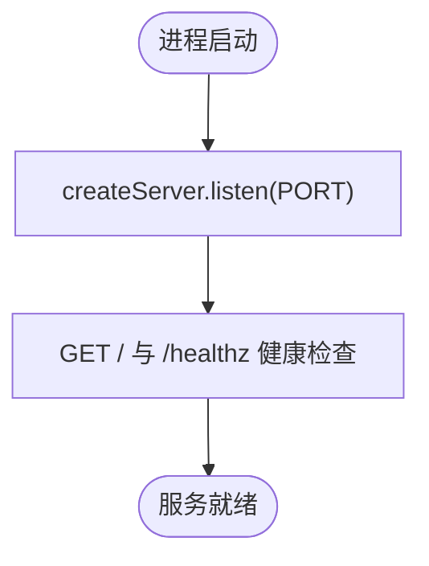

**图表来源**
- [cloudrun/src/server.ts:76-91](file://cloudrun/src/server.ts#L76-L91)
- [cloudrun/src/server.ts:125-128](file://cloudrun/src/server.ts#L125-L128)

**章节来源**
- [cloudrun/src/server.ts:1-28](file://cloudrun/src/server.ts#L1-L28)
- [cloudrun/src/server.ts:76-128](file://cloudrun/src/server.ts#L76-L128)
- [cloudrun/package.json:1-17](file://cloudrun/package.json#L1-L17)

#### 请求体限制与错误处理
- 最大请求体：MAX_BODY_BYTES=1MB，超出即拒绝并返回 413。
- JSON 解析：空 body 返回 undefined，非法 JSON 返回 400。
- 统一响应：sendJson 封装 content-type 与 JSON 序列化。

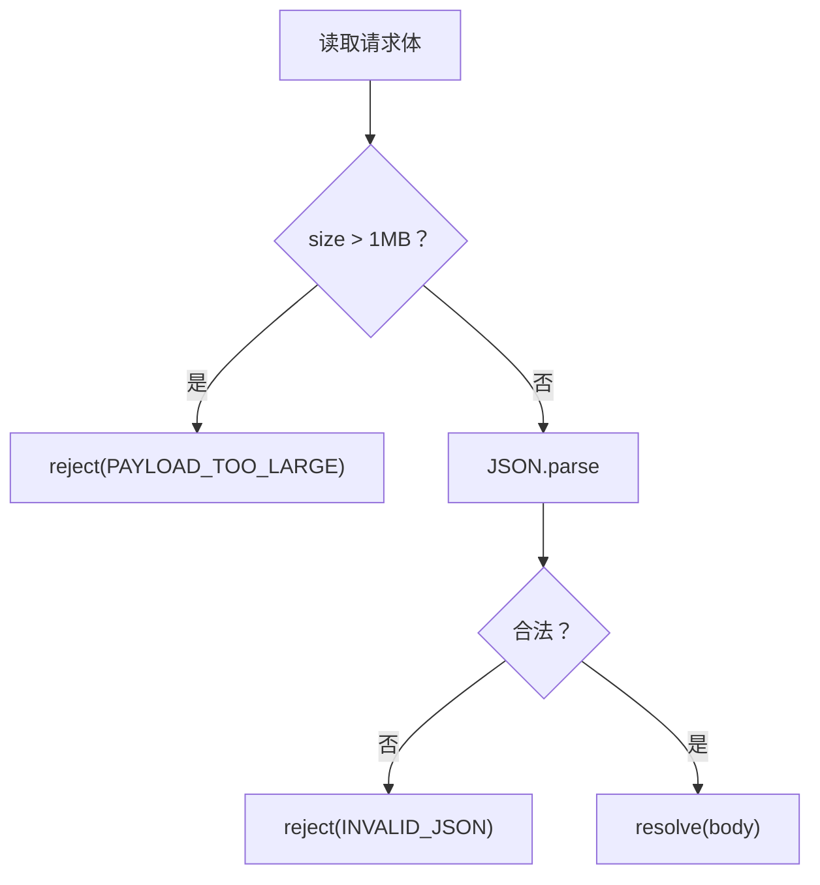

**图表来源**
- [cloudrun/src/server.ts:34-61](file://cloudrun/src/server.ts#L34-L61)
- [cloudrun/src/server.ts:105-122](file://cloudrun/src/server.ts#L105-L122)

**章节来源**
- [cloudrun/src/server.ts:34-61](file://cloudrun/src/server.ts#L34-L61)
- [cloudrun/src/server.ts:105-122](file://cloudrun/src/server.ts#L105-L122)

#### 路由分发与上下文注入
- 路由表：Map<method+path, handler>，聚合 llm/train/coffee 子路由。
- 上下文：从请求头提取 openid 与 sessionId，透传至 handler。
- 健康检查：GET / 与 /healthz 返回 service 名称与时间戳。

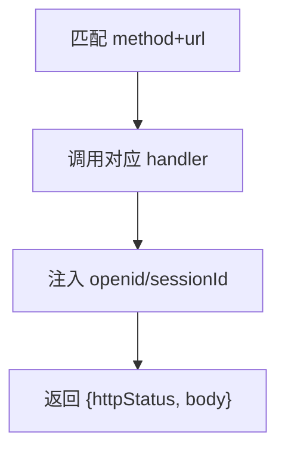

**图表来源**
- [cloudrun/src/server.ts:22-27](file://cloudrun/src/server.ts#L22-L27)
- [cloudrun/src/server.ts:100-109](file://cloudrun/src/server.ts#L100-L109)
- [cloudrun/src/api.ts:20-38](file://cloudrun/src/api.ts#L20-L38)

**章节来源**
- [cloudrun/src/server.ts:22-27](file://cloudrun/src/server.ts#L22-L27)
- [cloudrun/src/server.ts:100-109](file://cloudrun/src/server.ts#L100-L109)
- [cloudrun/src/api.ts:10-38](file://cloudrun/src/api.ts#L10-L38)

### 并发处理与负载均衡

#### 任务调度优化
- DAG 调度：每轮找出依赖满足且 pending 的任务，并行执行 Promise.allSettled，直至全部终态或死锁。
- 死锁检测：若仍有 pending 但无 running/waiting_human，抛出 SchedulerDeadlockError。
- 执行令牌：runToken 使旧轮次在 reset 后中止，防止并发双跑与交弹窗。

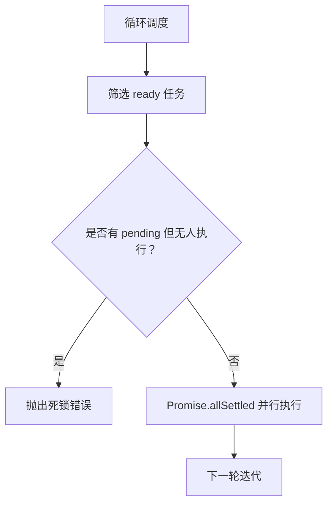

**图表来源**
- [miniprogram/src/core/scheduler.ts:76-128](file://miniprogram/src/core/scheduler.ts#L76-L128)
- [miniprogram/src/core/orchestrator.ts:106-118](file://miniprogram/src/core/orchestrator.ts#L106-L118)

**章节来源**
- [miniprogram/src/core/scheduler.ts:76-128](file://miniprogram/src/core/scheduler.ts#L76-L128)
- [miniprogram/src/core/orchestrator.ts:106-118](file://miniprogram/src/core/orchestrator.ts#L106-L118)

#### 连接池管理与资源限流（扩展建议）
- 连接池：当前服务端未显式维护连接池；建议在外部数据库或第三方 API 调用处引入连接池（如数据库客户端自带连接池），复用 TCP 连接，降低握手开销。
- 资源限流：可在 server.ts 入口处增加速率限制中间件（如令牌桶/漏桶），限制单位时间内请求数，保护后端服务。
- 并发上限：结合云托管实例规格，调整单实例并发处理能力，并通过水平扩展分担负载。

[本节为通用扩展建议，不直接分析具体文件]

### 性能监控与分析

#### APM 工具集成（扩展建议）
- 小程序端：接入微信云开发观测平台或第三方 APM（如阿里云 ARMS、腾讯 APM），采集页面加载时长、setData 频率、网络请求耗时与错误率。
- 云端服务：接入 Node.js APM（如 New Relic、Datadog），采集请求延迟、吞吐、错误率与 GC 指标。

[本节为通用实践建议，不直接分析具体文件]

#### 性能瓶颈识别与优化效果评估
- 瓶颈识别：
  - 小程序端：关注 onLaunch 耗时、setData 批量更新、长列表渲染、网络超时与重试风暴。
  - 云端服务：关注路由分发耗时、JSON 解析与序列化、外部 API 调用延迟与错误率。
- 优化效果评估：
  - 对比优化前后首屏加载时间、平均响应时间、P95/P99 延迟、错误率与重试次数。
  - 通过 APM 看板观察热点接口与慢调用链，验证优化收益。

[本节为通用分析方法，不直接分析具体文件]

### 容量规划与扩展策略

#### 水平扩展配置
- 多实例部署：云端服务按 CPU/内存利用率与 QPS 阈值扩容实例数量，保持单实例负载均衡。
- 会话亲和：如需会话状态，可在网关层配置会话亲和或使用共享存储（如 Redis）持久化会话。

[本节为通用架构建议，不直接分析具体文件]

#### 自动扩缩容规则
- 扩缩容触发：CPU>70% 或 P95 延迟>200ms 持续 2 分钟则扩容；CPU<30% 持续 5 分钟则缩容。
- 冷却时间：扩容后至少 5 分钟再评估，避免频繁震荡。

[本节为通用运维建议，不直接分析具体文件]

#### 成本优化建议
- 按需实例：低峰期使用较小实例规格，高峰期弹性扩容。
- 缓存优先：充分利用本地缓存与 CDN，减少后端压力。
- 请求合并：小程序端合并多次 setData 与网络请求，降低传输与渲染开销。

[本节为通用成本优化建议，不直接分析具体文件]

## 依赖关系分析

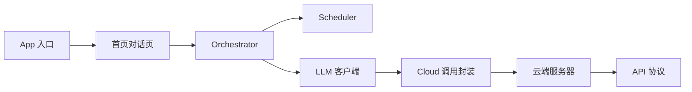

**图表来源**
- [miniprogram/app.ts:23-48](file://miniprogram/app.ts#L23-L48)
- [miniprogram/pages/index/index.ts:117-158](file://miniprogram/pages/index/index.ts#L117-L158)
- [miniprogram/src/core/orchestrator.ts:73-118](file://miniprogram/src/core/orchestrator.ts#L73-L118)
- [miniprogram/src/core/scheduler.ts:76-128](file://miniprogram/src/core/scheduler.ts#L76-L128)
- [miniprogram/src/llm/client.ts:56-119](file://miniprogram/src/llm/client.ts#L56-L119)
- [miniprogram/src/services/cloud.ts:64-149](file://miniprogram/src/services/cloud.ts#L64-L149)
- [cloudrun/src/server.ts:76-128](file://cloudrun/src/server.ts#L76-L128)
- [cloudrun/src/api.ts:10-38](file://cloudrun/src/api.ts#L10-L38)

**章节来源**
- [miniprogram/app.ts:23-48](file://miniprogram/app.ts#L23-L48)
- [cloudrun/src/server.ts:76-128](file://cloudrun/src/server.ts#L76-L128)

## 性能考虑
- 小程序端：
  - 首屏优化：懒加载 Agent Runtime、按需初始化云端环境、启用 requiredComponents。
  - 渲染优化：增量 setData、scrollIntoView 自动滚动、wx:key 唯一 ID。
  - 网络优化：统一超时与重试、开发环境降级、本地缓存减少重复调用。
- 云端服务：
  - 进程优化：零运行时依赖、健康检查、端口环境变量。
  - 请求处理：请求体大小限制、JSON 解析错误处理、统一响应。
  - 可扩展点：连接池、速率限制、水平扩展与自动扩缩容。

[本节为总结性内容，不直接分析具体文件]

## 故障排查指南
- 小程序端：
  - onLaunch 超时：确保仅输出轻量日志，Agent Runtime 懒加载。
  - setData 卡顿：避免全量更新，使用增量 appendMessage。
  - 云端不可用：检查 isDevEnv 与 ensureCloudInit，确认开发模式降级逻辑。
- 云端服务：
  - 请求体过大：检查 MAX_BODY_BYTES 与客户端上传数据大小。
  - JSON 解析失败：确认客户端发送合法 JSON。
  - 路由 404：检查路由表与方法路径匹配。

**章节来源**
- [miniprogram/app.ts:23-48](file://miniprogram/app.ts#L23-L48)
- [miniprogram/pages/index/index.ts:323-327](file://miniprogram/pages/index/index.ts#L323-L327)
- [miniprogram/src/services/cloud.ts:172-182](file://miniprogram/src/services/cloud.ts#L172-L182)
- [cloudrun/src/server.ts:34-61](file://cloudrun/src/server.ts#L34-L61)
- [cloudrun/src/server.ts:94-97](file://cloudrun/src/server.ts#L94-L97)

## 结论
本项目在小程序端与云端服务均实现了关键性能优化点：懒加载、增量渲染、统一超时重试、本地缓存、请求体限制与健康检查。在此基础上，建议进一步引入连接池、速率限制、APM 监控与自动扩缩容，以持续提升系统稳定性与性能表现。

[本节为总结性内容，不直接分析具体文件]

## 附录
- 构建与启动：
  - 小程序端：使用微信开发者工具打开 project.config.json，编译并预览。
  - 云端服务：npm run build 与 npm start，监听 PORT 环境变量指定端口。

**章节来源**
- [project.config.json:1-42](file://project.config.json#L1-L42)
- [cloudrun/package.json:6-10](file://cloudrun/package.json#L6-L10)