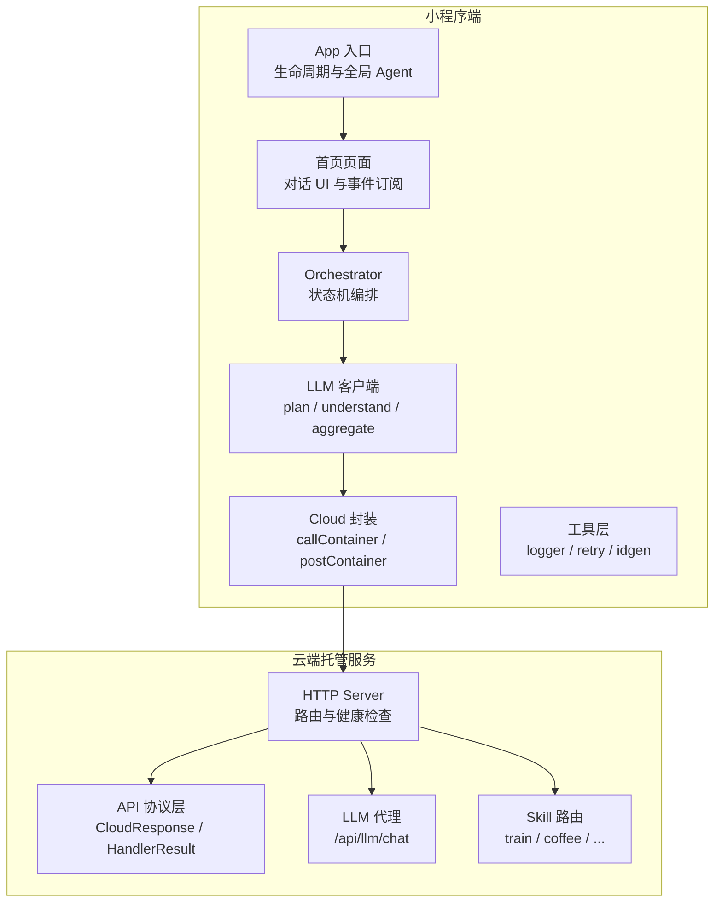
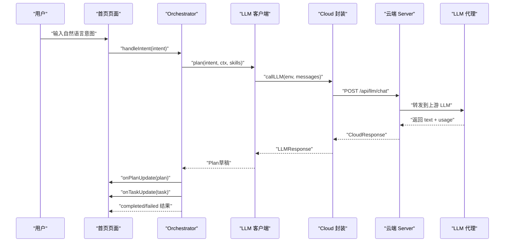
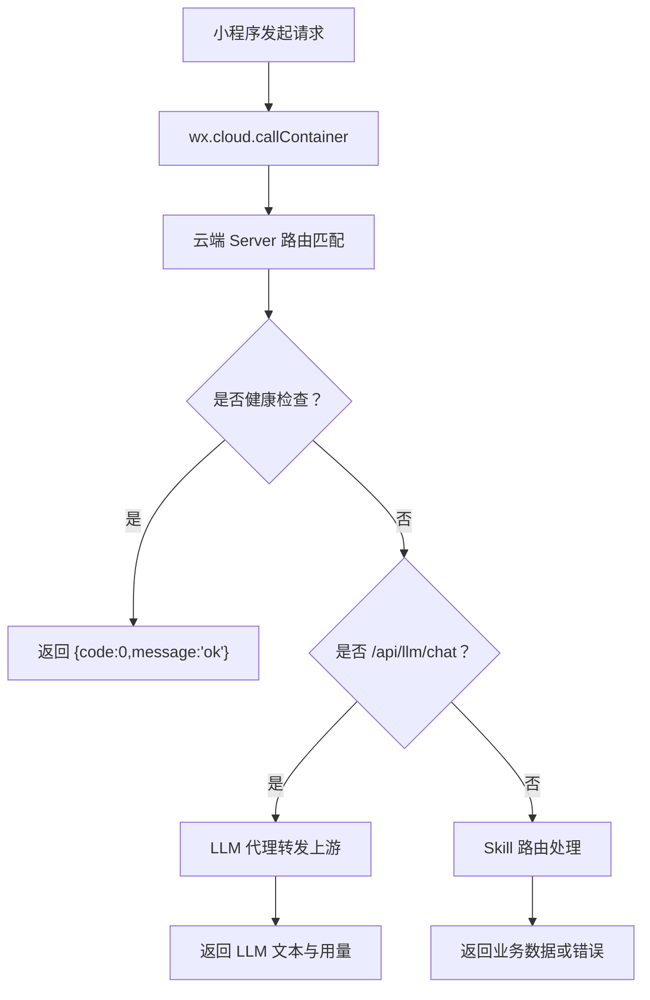

# 故障排查

<cite>
**本文引用的文件**   
- [miniprogram/app.ts](file://miniprogram/app.ts)
- [miniprogram/pages/index/index.ts](file://miniprogram/pages/index/index.ts)
- [miniprogram/src/utils/logger.ts](file://miniprogram/src/utils/logger.ts)
- [miniprogram/src/services/cloud.ts](file://miniprogram/src/services/cloud.ts)
- [miniprogram/src/services/llm.ts](file://miniprogram/src/services/llm.ts)
- [miniprogram/src/llm/client.ts](file://miniprogram/src/llm/client.ts)
- [miniprogram/src/core/orchestrator.ts](file://miniprogram/src/core/orchestrator.ts)
- [cloudrun/src/server.ts](file://cloudrun/src/server.ts)
- [cloudrun/src/api.ts](file://cloudrun/src/api.ts)
- [cloudrun/src/llm-chat.ts](file://cloudrun/src/llm-chat.ts)
- [cloudrun/smoke-test.ps1](file://cloudrun/smoke-test.ps1)
</cite>

## 目录
1. [引言](#引言)
2. [项目结构与故障域划分](#项目结构与故障域划分)
3. [核心组件与调用链](#核心组件与调用链)
4. [架构总览与请求路径](#架构总览与请求路径)
5. [常见问题诊断指南](#常见问题诊断指南)
6. [日志分析方法](#日志分析方法)
7. [调试工具使用技巧](#调试工具使用技巧)
8. [系统健康检查脚本](#系统健康检查脚本)
9. [性能分析与优化建议](#性能分析与优化建议)
10. [应急预案与恢复流程](#应急预案与恢复流程)
11. [结论](#结论)

## 引言
本指南面向 WAIC-WeChat-MiniProgram 的运维、开发与测试人员，聚焦小程序加载失败、API 调用异常、LLM 服务连接问题等典型故障的诊断方法。文档基于代码仓库中的小程序端、云端托管服务与 LLM 代理实现，给出可操作的排查步骤、日志解读方式、调试技巧、健康检查脚本以及降级与回滚策略。

## 项目结构与故障域划分
本项目分为小程序端与云端托管服务两部分：
- 小程序端负责用户交互、Agent 编排、云端容器调用、LLM 客户端封装、重试与日志。
- 云端托管服务负责路由分发、业务 Skill 接口、LLM 代理转发、健康检查与统一错误响应。

**图表来源**
- [miniprogram/app.ts:23-47](file://miniprogram/app.ts#L23-L47)
- [miniprogram/pages/index/index.ts:117-152](file://miniprogram/pages/index/index.ts#L117-L152)
- [miniprogram/src/core/orchestrator.ts:74-114](file://miniprogram/src/core/orchestrator.ts#L74-L114)
- [miniprogram/src/llm/client.ts:56-99](file://miniprogram/src/llm/client.ts#L56-L99)
- [miniprogram/src/services/cloud.ts:65-149](file://miniprogram/src/services/cloud.ts#L65-L149)
- [cloudrun/src/server.ts:76-128](file://cloudrun/src/server.ts#L76-L128)
- [cloudrun/src/api.ts:10-38](file://cloudrun/src/api.ts#L10-L38)
- [cloudrun/src/llm-chat.ts:55-117](file://cloudrun/src/llm-chat.ts#L55-L117)

**章节来源**
- [miniprogram/app.ts:1-49](file://miniprogram/app.ts#L1-L49)
- [miniprogram/pages/index/index.ts:1-329](file://miniprogram/pages/index/index.ts#L1-L329)
- [cloudrun/src/server.ts:1-129](file://cloudrun/src/server.ts#L1-L129)

## 核心组件与调用链
关键组件职责如下：
- App 入口：微信生命周期、品牌信息注入、懒加载 Agent Runtime。
- 首页页面：对话消息渲染、状态列展示、任务卡片更新、发送意图。
- Orchestrator：Agent 状态机（idle → understanding → planning → confirming_plan → executing → aggregating → completed/failed），处理 Plan 确认、执行、回滚与聚合。
- LLM 客户端：构造 Prompt、调用云端 LLM 代理、解析输出、本地规则兜底。
- Cloud 封装：统一 wx.cloud.callContainer 调用、超时、重试、开发环境降级。
- 云端 Server：健康检查、路由分发、JSON body 解析、统一错误码。
- LLM 代理：OpenAI 兼容协议转发、上游超时与错误处理、Token 用量统计。

**图表来源**
- [miniprogram/pages/index/index.ts:214-270](file://miniprogram/pages/index/index.ts#L214-L270)
- [miniprogram/src/core/orchestrator.ts:106-256](file://miniprogram/src/core/orchestrator.ts#L106-L256)
- [miniprogram/src/llm/client.ts:56-119](file://miniprogram/src/llm/client.ts#L56-L119)
- [miniprogram/src/services/llm.ts:57-83](file://miniprogram/src/services/llm.ts#L57-L83)
- [miniprogram/src/services/cloud.ts:65-149](file://miniprogram/src/services/cloud.ts#L65-L149)
- [cloudrun/src/server.ts:80-122](file://cloudrun/src/server.ts#L80-L122)
- [cloudrun/src/llm-chat.ts:55-117](file://cloudrun/src/llm-chat.ts#L55-L117)

**章节来源**
- [miniprogram/src/core/orchestrator.ts:1-340](file://miniprogram/src/core/orchestrator.ts#L1-L340)
- [miniprogram/src/llm/client.ts:1-153](file://miniprogram/src/llm/client.ts#L1-L153)
- [miniprogram/src/services/llm.ts:1-83](file://miniprogram/src/services/llm.ts#L1-L83)
- [miniprogram/src/services/cloud.ts:1-223](file://miniprogram/src/services/cloud.ts#L1-L223)
- [cloudrun/src/server.ts:1-129](file://cloudrun/src/server.ts#L1-L129)
- [cloudrun/src/llm-chat.ts:1-123](file://cloudrun/src/llm-chat.ts#L1-L123)

## 架构总览与请求路径
小程序通过云容器调用云端服务；LLM 调用走专用代理端点，避免在小程序暴露密钥。

**图表来源**
- [miniprogram/src/services/cloud.ts:65-149](file://miniprogram/src/services/cloud.ts#L65-L149)
- [cloudrun/src/server.ts:80-122](file://cloudrun/src/server.ts#L80-L122)
- [cloudrun/src/llm-chat.ts:55-117](file://cloudrun/src/llm-chat.ts#L55-L117)

**章节来源**
- [cloudrun/src/server.ts:1-129](file://cloudrun/src/server.ts#L1-L129)
- [cloudrun/src/llm-chat.ts:1-123](file://cloudrun/src/llm-chat.ts#L1-L123)

## 常见问题诊断指南

### 小程序加载失败
常见现象：
- 启动后无对话界面或提示“Agent runtime 未就绪”。
- onLaunch 耗时过长触发基础库警告。
- 页面 onLoad 无法订阅 runtime 事件。

诊断步骤：
1. 检查 App 生命周期日志：确认 `微信 App 生命周期启动` 与品牌版本信息是否正常输出。
2. 检查 globalData.agent 是否被懒加载创建：若缺失，说明 createAgentRuntime 未被调用或初始化失败。
3. 检查页面 onLoad 中是否成功订阅事件：若日志出现“Agent runtime 未就绪”，需检查 App 初始化顺序与依赖注入。
4. 检查 wx.cloud.init 是否可用：若不可用，ensureCloudInit 会记录 warn 并跳过，后续 callContainer 将进入开发模式降级。

定位要点：
- 关注 logger 输出的 `[BRAND_NAME][INFO]` 与 `[BRAND_NAME][WARN]`。
- 若 onLaunch 耗时过长，应移除重型初始化逻辑，保持懒加载。

**章节来源**
- [miniprogram/app.ts:23-47](file://miniprogram/app.ts#L23-L47)
- [miniprogram/pages/index/index.ts:129-152](file://miniprogram/pages/index/index.ts#L129-L152)
- [miniprogram/src/services/cloud.ts:192-207](file://miniprogram/src/services/cloud.ts#L192-L207)
- [miniprogram/src/utils/logger.ts:40-61](file://miniprogram/src/utils/logger.ts#L40-L61)

### API 调用异常
常见现象：
- 云端返回 code 非 0 或 HTTP 5xx。
- 请求体过大或 JSON 格式非法。
- 路由不存在。

诊断步骤：
1. 检查小程序端 CloudNetworkError 与 LLMError 的重试标记：retryable 为 true 时触发指数退避重试。
2. 检查云端 server.ts 的错误分支：PAYLOAD_TOO_LARGE、INVALID_JSON、内部错误分别返回 413、400、500。
3. 检查路由表注册：若 method+url 不匹配，返回 404 并提示“無此路由”。
4. 检查 CloudResponse 结构：小程序端期望 `{statusCode, data}`，若为空或非对象则视为网络错误。

定位要点：
- 小程序端日志包含“callContainer 失敗”与错误摘要。
- 云端日志包含“異常：...”与具体错误消息。

**章节来源**
- [miniprogram/src/services/cloud.ts:45-59](file://miniprogram/src/services/cloud.ts#L45-L59)
- [miniprogram/src/services/cloud.ts:92-119](file://miniprogram/src/services/cloud.ts#L92-L119)
- [cloudrun/src/server.ts:34-61](file://cloudrun/src/server.ts#L34-L61)
- [cloudrun/src/server.ts:94-122](file://cloudrun/src/server.ts#L94-L122)

### LLM 服务连接问题
常见现象：
- LLM 代理返回 503，提示“LLM 代理未配置”或“上游連線失敗”。
- 小程序端触发本地规则式规划器兜底（仅开发/体验环境）。
- Token 用量统计缺失或模型名未返回。

诊断步骤：
1. 检查云端环境变量 LLM_BASE_URL 与 LLM_API_KEY 是否配置。
2. 检查上游 fetch 是否超时或返回非 200：超时上限为 30 秒。
3. 检查小程序端 devFallbackReason 判定：仅在开发/体验环境允许降级。
4. 检查 LLM 客户端解析阶段：若 LLM 输出非 JSON 或字段缺失，抛出 LLMParserError。

定位要点：
- 云端日志包含“LLM 上游連線失敗”与上游状态码。
- 小程序端日志包含“雲端 LLM 不可用（...）”与降级原因。

**章节来源**
- [cloudrun/src/llm-chat.ts:55-117](file://cloudrun/src/llm-chat.ts#L55-L117)
- [miniprogram/src/llm/client.ts:37-45](file://miniprogram/src/llm/client.ts#L37-L45)
- [miniprogram/src/llm/client.ts:83-99](file://miniprogram/src/llm/client.ts#L83-L99)
- [miniprogram/src/services/llm.ts:70-83](file://miniprogram/src/services/llm.ts#L70-L83)

### 状态机死锁与任务卡死
常见现象：
- 页面长时间显示“理解意圖中”或“拆解任務中”。
- 多次请求被 BUSY 守卫拦截。
- 调度器报告死锁。

诊断步骤：
1. 检查 Orchestrator.handle 的状态转移：understanding/planning 提前返回必须转回 idle。
2. 检查 reset() 是否被调用：reset 会递增 runToken 使在途 Scheduler 失效。
3. 检查 SchedulerDeadlockError 处理：发生死锁时进行回滚并转入 failed。
4. 检查页面事件订阅：确保 onUnload 时正确取消订阅。

定位要点：
- 日志中出现“非法狀態轉移”或“Orchestrator 已重置”。
- 页面状态列长期停留在中间态。

**章节来源**
- [miniprogram/src/core/orchestrator.ts:60-71](file://miniprogram/src/core/orchestrator.ts#L60-L71)
- [miniprogram/src/core/orchestrator.ts:120-146](file://miniprogram/src/core/orchestrator.ts#L120-L146)
- [miniprogram/src/core/orchestrator.ts:258-270](file://miniprogram/src/core/orchestrator.ts#L258-L270)
- [miniprogram/pages/index/index.ts:154-158](file://miniprogram/pages/index/index.ts#L154-L158)

## 日志分析方法

### 错误堆栈解读
- 小程序端错误优先通过 logger.error 输出，包含时间戳与品牌前缀。
- CloudNetworkError 与 LLMError 携带 retryable 标记，用于重试决策。
- PlannerLLMError 表示 LLM 调用或解析失败，通常伴随“LLM 呼叫失敗”或“LLM 輸出無法解析”。

分析建议：
- 过滤 `[BRAND_NAME][ERROR]` 日志，结合时间戳定位异常时段。
- 对 CloudNetworkError 与 LLMError 区分重试场景：429/503 可重试，其他错误需人工介入。
- 对 PlannerLLMError 检查上游 LLM 返回文本是否满足 JSON 模式。

**章节来源**
- [miniprogram/src/utils/logger.ts:40-61](file://miniprogram/src/utils/logger.ts#L40-L61)
- [miniprogram/src/services/cloud.ts:45-59](file://miniprogram/src/services/cloud.ts#L45-L59)
- [miniprogram/src/services/llm.ts:47-54](file://miniprogram/src/services/llm.ts#L47-L54)
- [miniprogram/src/llm/client.ts:20-25](file://miniprogram/src/llm/client.ts#L20-L25)

### 性能瓶颈定位
- LLM 规划耗时通过 info 日志输出，包含毫秒数与 totalTokens。
- 重试延迟采用指数退避加抖动，避免雪崩。
- 云端上游超时上限为 30 秒，小程序端单次调用默认超时 15 秒。

分析建议：
- 关注“LLM 規劃耗時”日志，识别慢请求。
- 检查重试次数与延迟，判断是否因上游不稳定导致整体变慢。
- 对比小程序端与云端超时配置，避免双重等待。

**章节来源**
- [miniprogram/src/llm/client.ts:101-103](file://miniprogram/src/llm/client.ts#L101-L103)
- [miniprogram/src/utils/retry.ts:42-85](file://miniprogram/src/utils/retry.ts#L42-L85)
- [cloudrun/src/llm-chat.ts:52-53](file://cloudrun/src/llm-chat.ts#L52-L53)
- [miniprogram/src/services/cloud.ts:127-138](file://miniprogram/src/services/cloud.ts#L127-L138)

### 数据一致性检查
- Plan 生成后状态为 draft，确认后变为 confirmed。
- 任务状态包括 pending、running、waiting_human、succeeded、failed、rolled_back、skipped。
- 失败时需按反序撤销已成功且可逆的任务。

分析建议：
- 检查 Plan 状态流转是否符合预期。
- 核对任务状态变更是否与 UI 卡片徽章一致。
- 验证回滚是否覆盖所有 succeeded 且 reversible 的任务。

**章节来源**
- [miniprogram/src/core/orchestrator.ts:148-174](file://miniprogram/src/core/orchestrator.ts#L148-L174)
- [miniprogram/src/core/orchestrator.ts:278-303](file://miniprogram/src/core/orchestrator.ts#L278-L303)
- [miniprogram/pages/index/index.ts:277-321](file://miniprogram/pages/index/index.ts#L277-L321)

## 调试工具使用技巧

### 微信开发者工具调试
- 启用控制台日志，过滤 `[BRAND_NAME]` 前缀。
- 使用 Network 面板查看 wx.cloud.callContainer 请求与响应。
- 在 App.onLaunch 与 Page.onLoad 设置断点，检查 globalData.agent 与事件订阅。

### 云端服务日志查看
- 云端 server.ts 通过 console.log 输出标准日志，包含时间戳与方法路径。
- LLM 代理日志包含上游状态码与错误详情。
- 健康检查端点 `/healthz` 可用于快速验证服务可用性。

### 网络请求分析
- 小程序端 CloudNetworkError 与 LLMError 提供错误摘要，便于快速定位。
- 云端 server.ts 对 PAYLOAD_TOO_LARGE 与 INVALID_JSON 有明确错误码。
- 使用 smoke-test.ps1 模拟请求，验证 Skill 与 LLM 代理行为。

**章节来源**
- [miniprogram/src/utils/logger.ts:40-61](file://miniprogram/src/utils/logger.ts#L40-L61)
- [cloudrun/src/server.ts:29-32](file://cloudrun/src/server.ts#L29-L32)
- [cloudrun/src/llm-chat.ts:93-101](file://cloudrun/src/llm-chat.ts#L93-L101)
- [cloudrun/smoke-test.ps1:1-17](file://cloudrun/smoke-test.ps1#L1-L17)

## 系统健康检查脚本

### 服务可用性测试
- 访问 `/healthz` 或 `/`，期望返回 `{code:0,message:'ok'}`。
- 若返回 404，检查路由注册是否正确。
- 若返回 500，检查 server.ts 的 try-catch 分支。

### 依赖服务状态验证
- 调用 Skill 路由（如 train、coffee），验证业务接口正常。
- 调用 LLM 代理，未配置时应返回 503。
- 使用 smoke-test.ps1 自动化验证多个端点。

### 性能基准测试
- 重复调用 LLM 代理，观察上游超时与错误率。
- 监控小程序端重试次数与延迟分布。
- 对比不同 baseDelayMs 与 maxAttempts 对用户体验的影响。

**章节来源**
- [cloudrun/src/server.ts:84-91](file://cloudrun/src/server.ts#L84-L91)
- [cloudrun/smoke-test.ps1:1-17](file://cloudrun/smoke-test.ps1#L1-L17)
- [miniprogram/src/utils/retry.ts:42-85](file://miniprogram/src/utils/retry.ts#L42-L85)

## 性能分析与优化建议
- 合理设置 LLM 温度与最大 token，避免过长输出影响解析。
- 控制重试次数与延迟，避免雪崩效应。
- 使用开发环境降级保证本地演示，但正式发布保持严格失败语义。
- 优化小程序端 onLaunch 逻辑，保持轻量，避免阻塞启动。

[本节为通用指导，不直接分析具体文件]

## 应急预案与恢复流程

### 服务降级
- 开发/体验环境：LLM 不可用时自动降级为本地规则式规划器。
- 正式环境：LLM 真实故障不静默掩盖，保留失败语义。
- 云端 5xx 或网络失败：小程序端 CloudNetworkError 触发重试，耗尽后抛错。

### 数据回滚
- Orchestrator 在失败时按反序撤销已成功且可逆的任务。
- 单任务回滚失败仅记录错误，继续其余回滚操作。
- 若存在 pending_payment 订单，按支付截止时间为自动过期。

### 灾难恢复
- 重置 Orchestrator 状态至 idle，清除当前 Plan。
- 重新初始化云端环境，确保 wx.cloud.init 成功。
- 检查环境变量 LLM_BASE_URL 与 LLM_API_KEY，确保 LLM 代理可用。

**章节来源**
- [miniprogram/src/llm/client.ts:83-99](file://miniprogram/src/llm/client.ts#L83-L99)
- [miniprogram/src/core/orchestrator.ts:278-303](file://miniprogram/src/core/orchestrator.ts#L278-L303)
- [miniprogram/src/core/orchestrator.ts:258-270](file://miniprogram/src/core/orchestrator.ts#L258-L270)
- [miniprogram/src/services/cloud.ts:192-207](file://miniprogram/src/services/cloud.ts#L192-L207)

## 结论
本指南基于代码实现提供了从小程序加载、API 调用、LLM 连接到状态机与回滚的全链路故障排查方法。通过日志分析、调试工具与健康检查脚本，可快速定位问题并采取降级、回滚与恢复措施。建议在正式发布环境中保持严格失败语义，同时在开发环境利用降级机制保障演示与调试效率。