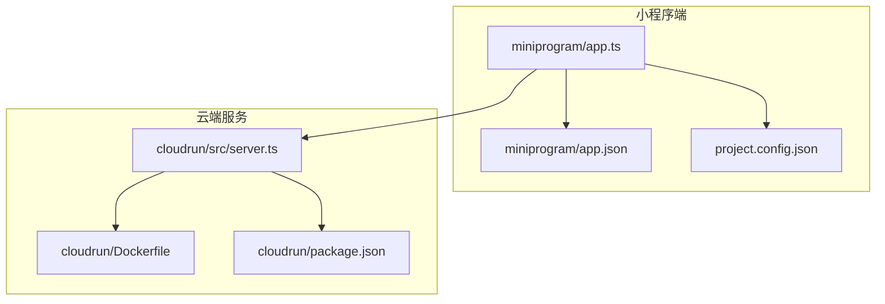
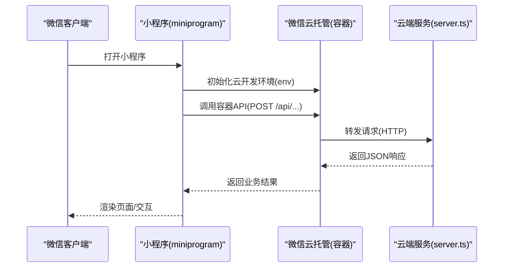
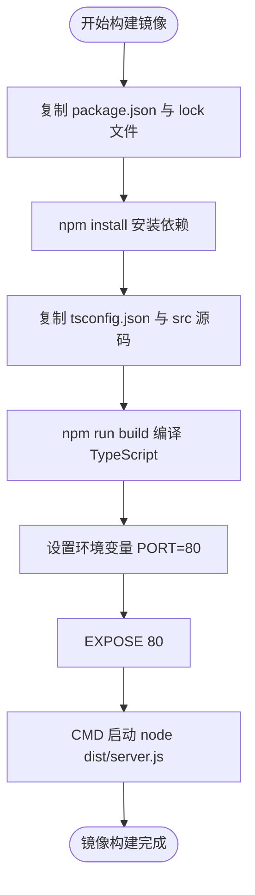
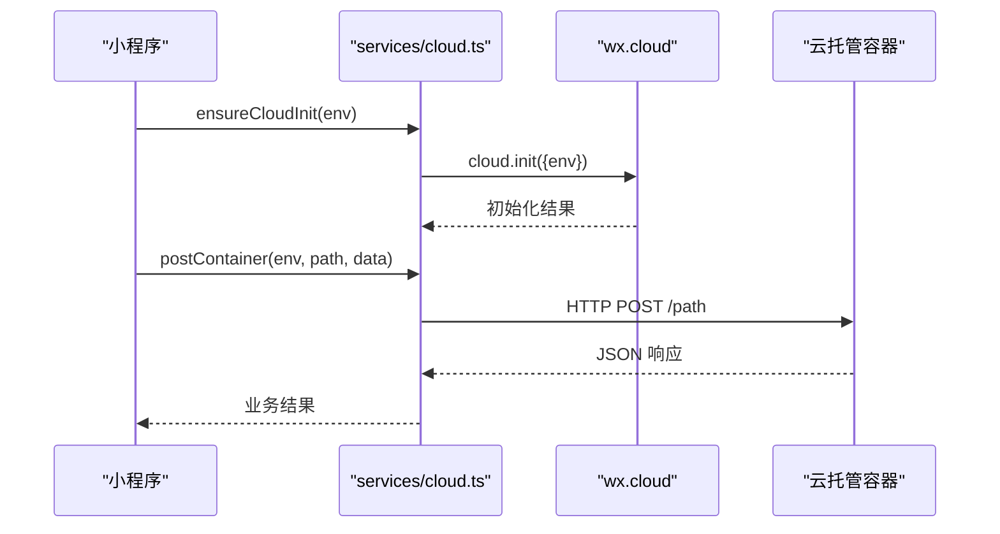
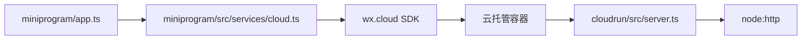

# 环境部署

<cite>
**本文引用的文件**   
- [cloudrun/Dockerfile](file://cloudrun/Dockerfile)
- [cloudrun/package.json](file://cloudrun/package.json)
- [cloudrun/src/server.ts](file://cloudrun/src/server.ts)
- [miniprogram/app.ts](file://miniprogram/app.ts)
- [miniprogram/app.json](file://miniprogram/app.json)
- [project.config.json](file://project.config.json)
- [miniprogram/src/services/cloud.ts](file://miniprogram/src/services/cloud.ts)
</cite>

## 目录
1. [简介](#简介)
2. [项目结构](#项目结构)
3. [核心组件](#核心组件)
4. [架构总览](#架构总览)
5. [详细组件分析](#详细组件分析)
6. [依赖关系分析](#依赖关系分析)
7. [性能与生产最佳实践](#性能与生产最佳实践)
8. [故障排查指南](#故障排查指南)
9. [结论](#结论)

## 简介
本文件面向 WAIC-WeChat-MiniProgram 项目的部署与发布，覆盖以下目标：
- 微信小程序的发布流程：代码上传、版本管理与审核发布。
- 云端服务的 Docker 容器化部署：镜像构建配置、环境变量设置与端口映射。
- 微信云托管平台的部署配置：服务实例管理、域名绑定与安全组设置。
- 本地开发环境搭建：依赖安装、编译配置与调试工具使用。
- 生产环境的最佳实践：资源限制、健康检查与自动扩缩容配置。

## 项目结构
仓库包含两个主要部分：
- miniprogram：微信小程序前端工程，包含页面、业务逻辑与服务调用封装。
- cloudrun：基于 Node.js 的云端服务，提供 LLM 对话、技能编排等后端能力，并通过 Docker 容器化部署到微信云托管。

图表来源
- [miniprogram/app.ts:1-49](file://miniprogram/app.ts#L1-L49)
- [miniprogram/app.json:1-20](file://miniprogram/app.json#L1-L20)
- [project.config.json:1-42](file://project.config.json#L1-L42)
- [cloudrun/src/server.ts:1-129](file://cloudrun/src/server.ts#L1-L129)
- [cloudrun/Dockerfile:1-20](file://cloudrun/Dockerfile#L1-L20)
- [cloudrun/package.json:1-17](file://cloudrun/package.json#L1-L17)

章节来源
- [miniprogram/app.ts:1-49](file://miniprogram/app.ts#L1-L49)
- [miniprogram/app.json:1-20](file://miniprogram/app.json#L1-L20)
- [project.config.json:1-42](file://project.config.json#L1-L42)
- [cloudrun/Dockerfile:1-20](file://cloudrun/Dockerfile#L1-L20)
- [cloudrun/package.json:1-17](file://cloudrun/package.json#L1-L17)
- [cloudrun/src/server.ts:1-129](file://cloudrun/src/server.ts#L1-L129)

## 核心组件
- 小程序入口与生命周期：负责初始化品牌信息、懒加载 Agent Runtime，并接入全局数据。
- 小程序配置：定义页面路由、窗口样式、权限声明与私域接口清单。
- 项目配置：指向小程序根目录、启用 TypeScript 编译插件、基础库版本与 AppID。
- 云端服务入口：监听 PORT 环境变量，解析 JSON Body，分发路由，提供健康检查。
- 容器镜像：基于 Node 20 Alpine，安装依赖、编译 TypeScript，暴露端口并启动服务。
- 云端调用封装：在小程序端初始化云开发环境并提供容器调用方法。

章节来源
- [miniprogram/app.ts:1-49](file://miniprogram/app.ts#L1-L49)
- [miniprogram/app.json:1-20](file://miniprogram/app.json#L1-L20)
- [project.config.json:1-42](file://project.config.json#L1-L42)
- [cloudrun/src/server.ts:1-129](file://cloudrun/src/server.ts#L1-L129)
- [cloudrun/Dockerfile:1-20](file://cloudrun/Dockerfile#L1-L20)
- [miniprogram/src/services/cloud.ts:171-223](file://miniprogram/src/services/cloud.ts#L171-L223)

## 架构总览
小程序通过微信云开发的容器调用能力访问云端服务；云端服务以 Node.js HTTP 服务器运行，暴露统一 API 与健康检查接口。

图表来源
- [miniprogram/src/services/cloud.ts:171-223](file://miniprogram/src/services/cloud.ts#L171-L223)
- [cloudrun/src/server.ts:76-128](file://cloudrun/src/server.ts#L76-L128)

## 详细组件分析

### 微信小程序发布流程
- 代码上传与预览：在开发者工具中完成编译后，可上传代码用于测试与灰度验证。
- 版本管理：每次上传会生成新版本，支持多版本并存与回滚。
- 审核发布：提交审核后，由微信平台进行合规性检查，通过后上线至线上环境。

关键配置要点：
- 小程序根目录与编译器插件：确保 TypeScript 编译生效。
- 基础库版本与 AppID：保证运行时兼容性与应用标识正确。
- 权限与隐私接口：按需声明定位等权限与 requiredPrivateInfos。

章节来源
- [project.config.json:1-42](file://project.config.json#L1-L42)
- [miniprogram/app.json:1-20](file://miniprogram/app.json#L1-L20)

### 云端服务 Docker 容器化部署
- 基础镜像：Node 20 Alpine，轻量且满足零运行时依赖要求。
- 依赖安装：先复制 package.json 与 lock 文件，再执行 npm install，利用层缓存提升构建速度。
- 源码编译：复制 tsconfig.json 与 src 目录，执行 tsc 编译产出 dist。
- 环境变量与端口：设置 PORT=80，EXPOSE 80，CMD 启动 dist/server.js。
- 健康检查：服务端实现 GET / 与 GET /healthz 返回 200，供平台探活。

图表来源
- [cloudrun/Dockerfile:1-20](file://cloudrun/Dockerfile#L1-L20)
- [cloudrun/package.json:1-17](file://cloudrun/package.json#L1-L17)
- [cloudrun/src/server.ts:76-128](file://cloudrun/src/server.ts#L76-L128)

章节来源
- [cloudrun/Dockerfile:1-20](file://cloudrun/Dockerfile#L1-L20)
- [cloudrun/package.json:1-17](file://cloudrun/package.json#L1-L17)
- [cloudrun/src/server.ts:1-129](file://cloudrun/src/server.ts#L1-L129)

### 微信云托管平台部署配置
- 服务实例管理：根据流量与负载调整实例数量，结合健康检查确保可用性。
- 域名绑定：为服务绑定自定义域名或平台域名，开启 HTTPS。
- 安全组设置：仅开放必要端口（默认 80），限制入站来源。
- 环境变量：在平台配置 PORT 环境变量，确保服务监听正确端口。

注意：
- 服务端已默认监听 PORT 环境变量，若未设置则回退到 80。
- 健康检查接口 / 与 /healthz 必须可达，否则平台可能判定服务异常。

章节来源
- [cloudrun/src/server.ts:1-129](file://cloudrun/src/server.ts#L1-L129)

### 本地开发环境搭建
- 依赖安装：进入 cloudrun 目录执行 npm install，安装 TypeScript 与类型定义。
- 编译配置：执行 npm run build 生成 dist 目录。
- 调试工具：使用微信开发者工具打开 miniprogram 目录，启用 TypeScript 编译插件。
- 运行服务：执行 npm start 启动云端服务，便于联调。

章节来源
- [cloudrun/package.json:1-17](file://cloudrun/package.json#L1-L17)
- [project.config.json:1-42](file://project.config.json#L1-L42)

### 小程序端云端调用与初始化
- 环境初始化：ensureCloudInit 对 wx.cloud.init 进行幂等初始化，失败时静默跳过，不阻塞启动。
- 容器调用：postContainer 封装 POST 请求，传入 env、path、data 与扩展选项。
- 开发环境判断：isDevEnv 通过 getAccountInfoSync 获取 envVersion 判断是否为开发环境。

图表来源
- [miniprogram/src/services/cloud.ts:171-223](file://miniprogram/src/services/cloud.ts#L171-L223)

章节来源
- [miniprogram/src/services/cloud.ts:171-223](file://miniprogram/src/services/cloud.ts#L171-L223)

## 依赖关系分析
- 小程序端依赖微信基础库与云开发 SDK，通过 services/cloud.ts 发起容器调用。
- 云端服务依赖 Node.js 内建模组（http/fetch），无第三方运行时依赖。
- 构建阶段依赖 TypeScript 与类型定义，编译产物为 dist 下的 JavaScript。

图表来源
- [miniprogram/app.ts:1-49](file://miniprogram/app.ts#L1-L49)
- [miniprogram/src/services/cloud.ts:171-223](file://miniprogram/src/services/cloud.ts#L171-L223)
- [cloudrun/src/server.ts:1-129](file://cloudrun/src/server.ts#L1-L129)

章节来源
- [miniprogram/app.ts:1-49](file://miniprogram/app.ts#L1-L49)
- [miniprogram/src/services/cloud.ts:171-223](file://miniprogram/src/services/cloud.ts#L171-L223)
- [cloudrun/src/server.ts:1-129](file://cloudrun/src/server.ts#L1-L129)

## 性能与生产最佳实践
- 资源限制：在云托管平台为服务设置 CPU 与内存上限，避免资源争用。
- 健康检查：保持 / 与 /healthz 可用，确保平台能准确探测服务状态。
- 自动扩缩容：根据 QPS 与延迟指标配置扩缩容策略，保障高并发场景稳定性。
- 日志与监控：将 stdout 输出作为日志源，配合平台日志系统进行分析与告警。
- 安全加固：仅开放必要端口，启用 HTTPS，限制来源 IP 白名单。

[本节为通用指导，不直接分析具体文件]

## 故障排查指南
- 端口问题：确认 PORT 环境变量是否设置，服务端默认监听 80。
- 健康检查失败：检查 / 与 /healthz 是否返回 200，确保路由未被拦截。
- 请求体过大：服务端限制 1MB，超过将返回 413。
- JSON 解析错误：非合法 JSON 将返回 400，需检查客户端请求格式。
- 内部错误：服务端捕获异常并返回 500，建议查看云平台日志定位堆栈。

章节来源
- [cloudrun/src/server.ts:76-128](file://cloudrun/src/server.ts#L76-L128)

## 结论
本项目采用“小程序 + 云端容器”的架构，小程序通过微信云托管调用 Node.js 服务，服务以 Docker 镜像形式部署，具备零运行时依赖、健康检查与统一响应协议。按照本文档的流程与最佳实践，可实现从本地开发到生产发布的完整闭环，并在微信云托管平台上获得稳定、可扩展的运行环境。