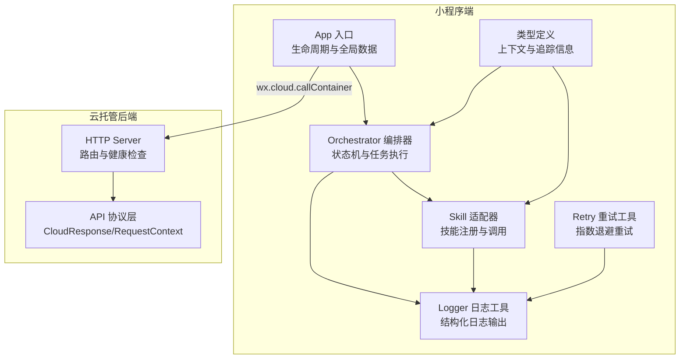
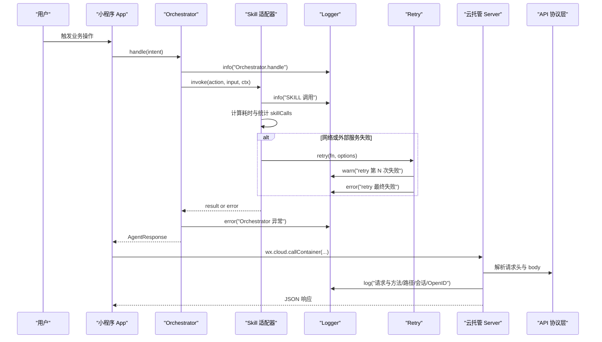
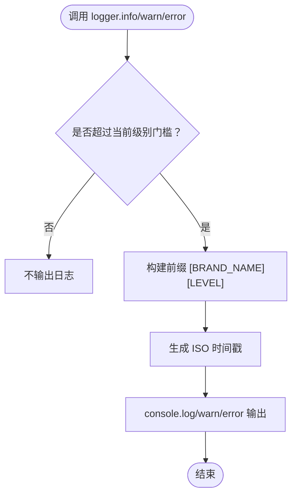
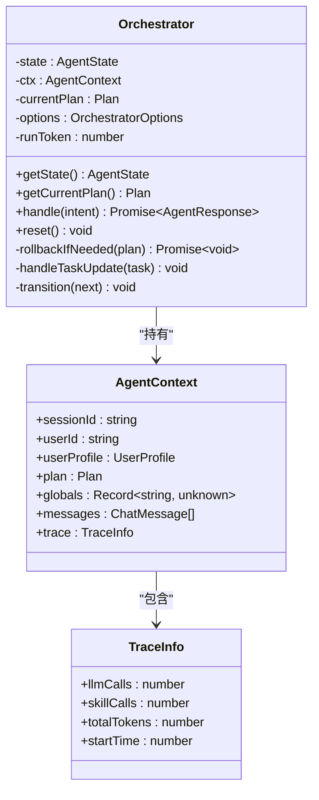
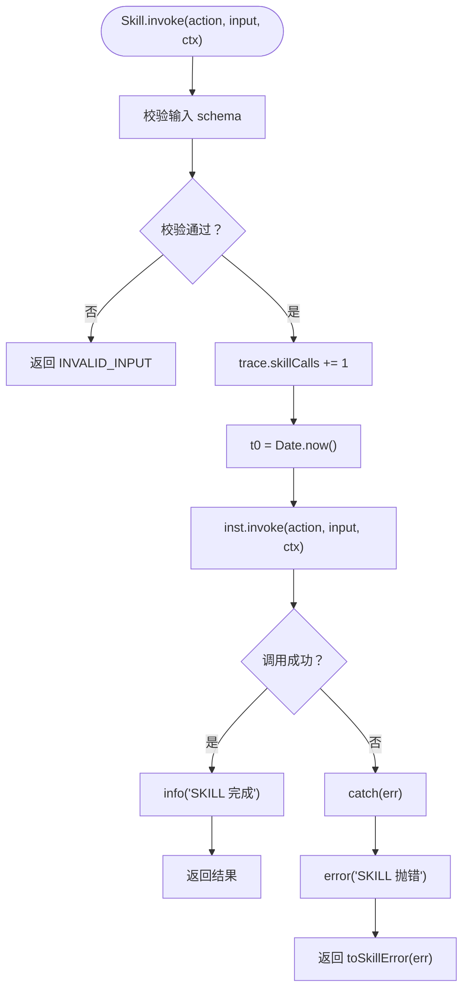
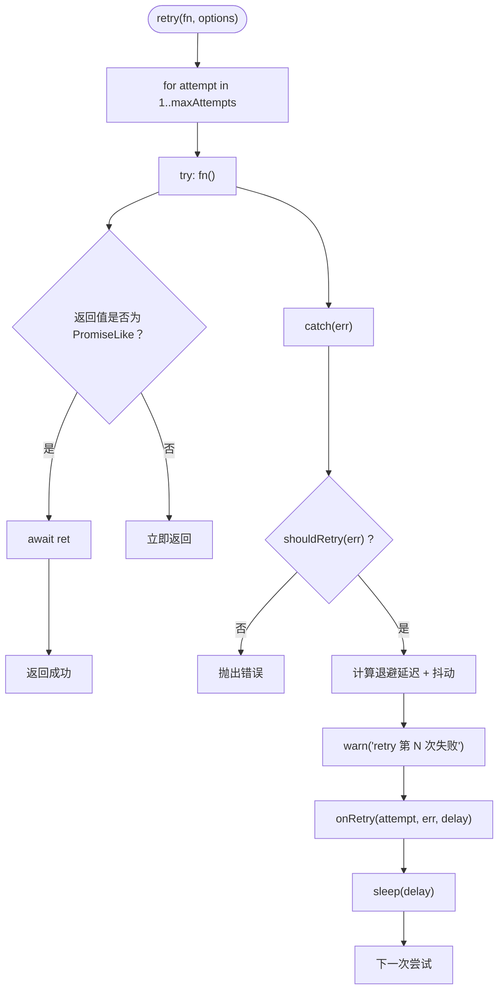
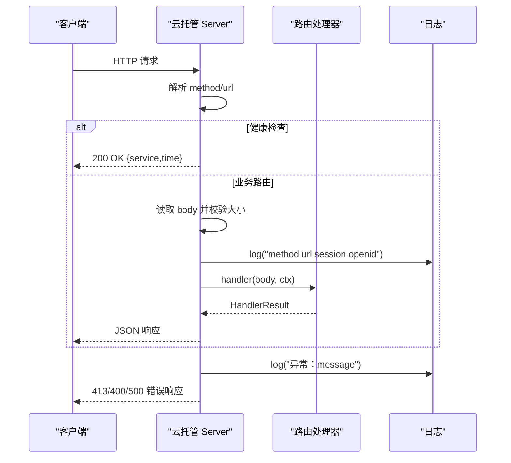
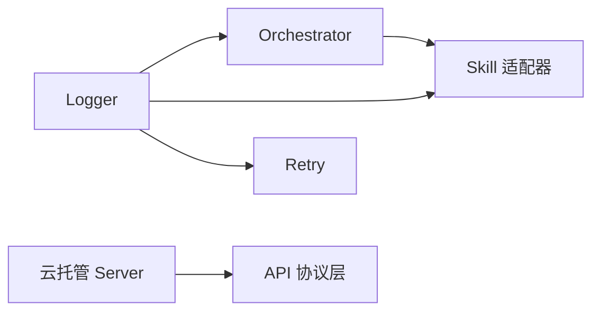

# 监控告警

<cite>
**本文引用的文件**   
- [miniprogram/src/utils/logger.ts](file://miniprogram/src/utils/logger.ts)
- [cloudrun/src/server.ts](file://cloudrun/src/server.ts)
- [miniprogram/app.ts](file://miniprogram/app.ts)
- [miniprogram/src/core/orchestrator.ts](file://miniprogram/src/core/orchestrator.ts)
- [miniprogram/src/skills/adapter.ts](file://miniprogram/src/skills/adapter.ts)
- [miniprogram/src/utils/retry.ts](file://miniprogram/src/utils/retry.ts)
- [cloudrun/src/api.ts](file://cloudrun/src/api.ts)
- [miniprogram/src/types/context.d.ts](file://miniprogram/src/types/context.d.ts)
</cite>

## 目录
1. [引言](#引言)
2. [项目结构](#项目结构)
3. [核心组件](#核心组件)
4. [架构总览](#架构总览)
5. [详细组件分析](#详细组件分析)
6. [依赖关系分析](#依赖关系分析)
7. [性能与容量规划](#性能与容量规划)
8. [故障排查指南](#故障排查指南)
9. [结论](#结论)
10. [附录：指标、日志与告警配置清单](#附录指标日志与告警配置清单)

## 引言
本监控告警文档面向 WAIC-WeChat-MiniProgram 的小程序端与云托管后端，目标是建立一套可观测性体系，覆盖关键业务指标收集、结构化日志系统、异常告警机制、仪表板可视化以及多渠道告警通知。当前代码库已具备基础日志能力、统一错误处理与重试机制，但尚未内置完整的埋点上报与告警通道；本文在现有实现基础上给出落地方案与扩展建议，确保在不侵入核心业务逻辑的前提下完成监控与告警闭环。

## 项目结构
本项目包含小程序前端与云托管后端两部分：
- 小程序端：负责用户交互、Agent 编排、技能调用、本地缓存与会话历史等。
- 云托管后端：提供 HTTP API、健康检查、请求解析与路由分发，并输出标准 JSON 响应。

图表来源
- [miniprogram/app.ts:23-48](file://miniprogram/app.ts#L23-L48)
- [miniprogram/src/core/orchestrator.ts:74-106](file://miniprogram/src/core/orchestrator.ts#L74-L106)
- [miniprogram/src/skills/adapter.ts:42-85](file://miniprogram/src/skills/adapter.ts#L42-L85)
- [miniprogram/src/utils/logger.ts:12-61](file://miniprogram/src/utils/logger.ts#L12-L61)
- [miniprogram/src/utils/retry.ts:42-85](file://miniprogram/src/utils/retry.ts#L42-L85)
- [cloudrun/src/server.ts:76-128](file://cloudrun/src/server.ts#L76-L128)
- [cloudrun/src/api.ts:10-38](file://cloudrun/src/api.ts#L10-L38)

章节来源
- [miniprogram/app.ts:1-49](file://miniprogram/app.ts#L1-L49)
- [cloudrun/src/server.ts:1-129](file://cloudrun/src/server.ts#L1-L129)

## 核心组件
本节聚焦监控与告警相关的关键组件：
- 小程序端 Logger：提供带品牌前缀与时间戳的结构化日志，支持级别控制（debug/info/warn/error），error 等级始终输出。
- Orchestrator 编排器：记录关键流程日志与异常，维护状态机转移，暴露 onStateChange/onTaskUpdate 回调用于埋点。
- Skill 适配器：统计 skillCalls、记录耗时与错误，便于性能与错误率指标采集。
- Retry 重试工具：对失败进行指数退避重试，并在最终失败时输出 error 日志，可作为重试成功率指标来源。
- 云托管 Server：统一日志输出到 stdout，记录请求方法、路径、会话与 OpenID，捕获异常并返回标准错误码。
- API 协议层：定义 CloudResponse、RequestContext、HandlerResult，为错误分类与指标聚合提供契约。

章节来源
- [miniprogram/src/utils/logger.ts:12-61](file://miniprogram/src/utils/logger.ts#L12-L61)
- [miniprogram/src/core/orchestrator.ts:106-256](file://miniprogram/src/core/orchestrator.ts#L106-L256)
- [miniprogram/src/skills/adapter.ts:42-85](file://miniprogram/src/skills/adapter.ts#L42-L85)
- [miniprogram/src/utils/retry.ts:42-85](file://miniprogram/src/utils/retry.ts#L42-L85)
- [cloudrun/src/server.ts:76-128](file://cloudrun/src/server.ts#L76-L128)
- [cloudrun/src/api.ts:10-38](file://cloudrun/src/api.ts#L10-L38)

## 架构总览
下图展示小程序端到云托管后端的监控与告警数据流：小程序端通过 Logger 输出结构化日志，并通过 onStateChange/onTaskUpdate 回调上报关键事件；云托管后端将请求日志输出至 stdout，供云平台日志系统采集；错误与异常在两端均有统一处理，便于后续聚合与告警。

图表来源
- [miniprogram/src/core/orchestrator.ts:106-256](file://miniprogram/src/core/orchestrator.ts#L106-L256)
- [miniprogram/src/skills/adapter.ts:42-85](file://miniprogram/src/skills/adapter.ts#L42-L85)
- [miniprogram/src/utils/retry.ts:42-85](file://miniprogram/src/utils/retry.ts#L42-L85)
- [cloudrun/src/server.ts:76-128](file://cloudrun/src/server.ts#L76-L128)
- [cloudrun/src/api.ts:10-38](file://cloudrun/src/api.ts#L10-L38)

## 详细组件分析

### 小程序端日志系统（Logger）
- 结构化日志格式：每条日志包含品牌前缀 `[BRAND_NAME][LEVEL]`、ISO 时间戳与消息内容，便于聚合与溯源。
- 日志级别配置：支持 debug/info/warn/error，默认门槛为 info；error 等级不受门槛限制，始终输出。
- 使用方式：各模块通过 logger 的 info/warn/error 函数输出日志；App 启动时可设置全局日志级别。

图表来源
- [miniprogram/src/utils/logger.ts:28-61](file://miniprogram/src/utils/logger.ts#L28-L61)

章节来源
- [miniprogram/src/utils/logger.ts:12-61](file://miniprogram/src/utils/logger.ts#L12-L61)
- [miniprogram/app.ts:23-48](file://miniprogram/app.ts#L23-L48)

### Orchestrator 编排器与埋点
- 关键流程日志：handle 入口记录意图摘要；状态转移与回滚过程有 info/warn/error 日志。
- 埋点回调：onStateChange 与 onTaskUpdate 可用于上报状态变化与任务进度，作为用户活跃度与任务完成率指标来源。
- 异常处理：捕获 PlannerLLMError、SchedulerDeadlockError 等特定异常，统一转换为业务错误码（如 LLM_ERROR、DEADLOCK、UNEXPECTED）。

图表来源
- [miniprogram/src/core/orchestrator.ts:74-106](file://miniprogram/src/core/orchestrator.ts#L74-L106)
- [miniprogram/src/types/context.d.ts:38-62](file://miniprogram/src/types/context.d.ts#L38-L62)

章节来源
- [miniprogram/src/core/orchestrator.ts:106-256](file://miniprogram/src/core/orchestrator.ts#L106-L256)
- [miniprogram/src/types/context.d.ts:38-62](file://miniprogram/src/types/context.d.ts#L38-L62)

### Skill 适配器与性能指标
- 指标采集：每次调用增加 trace.skillCalls，记录开始时间与结束时间以计算耗时。
- 错误处理：捕获异常并转换为 SkillError，同时输出 error 日志，便于错误率与失败原因分析。
- 校验与降级：入参 schema 校验失败直接返回 INVALID_INPUT，避免无效调用。

图表来源
- [miniprogram/src/skills/adapter.ts:42-85](file://miniprogram/src/skills/adapter.ts#L42-L85)

章节来源
- [miniprogram/src/skills/adapter.ts:42-85](file://miniprogram/src/skills/adapter.ts#L42-L85)

### Retry 重试工具与错误监控
- 指数退避：退避公式为 min(baseDelayMs * 2^(attempt-1), maxDelayMs) + 随机抖动，避免雪崩。
- 重试策略：shouldRetry 可自定义判断错误是否可重试；onRetry 钩子可用于埋点。
- 日志输出：每次失败输出 warn，最终失败输出 error，便于统计重试成功率与失败原因。

图表来源
- [miniprogram/src/utils/retry.ts:42-85](file://miniprogram/src/utils/retry.ts#L42-L85)

章节来源
- [miniprogram/src/utils/retry.ts:42-85](file://miniprogram/src/utils/retry.ts#L42-L85)

### 云托管后端日志与错误处理
- 请求日志：server.ts 中 log 函数输出方法、路径、会话与 OpenID，便于聚合与追踪。
- 健康检查：GET / 与 /healthz 返回服务状态与时间戳，供云平台探活。
- 错误处理：捕获 PAYLOAD_TOO_LARGE、INVALID_JSON 等异常，返回对应 HTTP 状态码与消息；其他异常返回 500。

图表来源
- [cloudrun/src/server.ts:76-128](file://cloudrun/src/server.ts#L76-L128)

章节来源
- [cloudrun/src/server.ts:76-128](file://cloudrun/src/server.ts#L76-L128)
- [cloudrun/src/api.ts:10-38](file://cloudrun/src/api.ts#L10-L38)

## 依赖关系分析
- 小程序端 Logger 被 Orchestrator、Skill 适配器、Retry 工具广泛引用，形成统一的日志输出入口。
- Orchestrator 依赖 Skill 适配器与 Scheduler，并通过回调与 UI 层解耦。
- 云托管 Server 依赖 API 协议层，统一处理请求与响应，便于错误分类与指标聚合。

图表来源
- [miniprogram/src/utils/logger.ts:12-61](file://miniprogram/src/utils/logger.ts#L12-L61)
- [miniprogram/src/core/orchestrator.ts:106-256](file://miniprogram/src/core/orchestrator.ts#L106-L256)
- [miniprogram/src/skills/adapter.ts:42-85](file://miniprogram/src/skills/adapter.ts#L42-L85)
- [miniprogram/src/utils/retry.ts:42-85](file://miniprogram/src/utils/retry.ts#L42-L85)
- [cloudrun/src/server.ts:76-128](file://cloudrun/src/server.ts#L76-L128)
- [cloudrun/src/api.ts:10-38](file://cloudrun/src/api.ts#L10-L38)

章节来源
- [miniprogram/src/utils/logger.ts:12-61](file://miniprogram/src/utils/logger.ts#L12-L61)
- [miniprogram/src/core/orchestrator.ts:106-256](file://miniprogram/src/core/orchestrator.ts#L106-L256)
- [miniprogram/src/skills/adapter.ts:42-85](file://miniprogram/src/skills/adapter.ts#L42-L85)
- [miniprogram/src/utils/retry.ts:42-85](file://miniprogram/src/utils/retry.ts#L42-L85)
- [cloudrun/src/server.ts:76-128](file://cloudrun/src/server.ts#L76-L128)
- [cloudrun/src/api.ts:10-38](file://cloudrun/src/api.ts#L10-L38)

## 性能与容量规划
- 小程序端性能指标：
  - 用户活跃度：基于 onShow/onHide 与 Orchestrator.onStateChange 回调统计活跃会话数与任务发起频率。
  - API 调用量：基于 Skill.trace.skillCalls 与云托管 Server 的请求日志统计调用次数与成功率。
  - 错误率：基于 Logger.error 与 Retry 的最终失败日志统计错误比例与失败原因分布。
  - 性能指标：基于 Skill 适配器记录的耗时与 Orchestrator 的状态转移耗时评估 P50/P95/P99。
- 云托管后端容量规划：
  - 请求体上限：MAX_BODY_BYTES 为 1MB，需根据业务需求评估是否需要调整。
  - 健康检查：/healthz 用于云平台探活，需确保高可用与低延迟。
  - 日志聚合：stdout 日志由云平台日志系统采集，建议按环境（开发/测试/生产）与模块维度进行索引与保留策略配置。

[本节为通用指导，不直接分析具体文件]

## 故障排查指南
- 小程序端：
  - 若出现“BUSY”状态，检查 Orchestrator 是否处于非空闲态，确认 reset 是否正确调用。
  - 若 Skill 调用频繁失败，查看 Retry 的 warn/error 日志，确认 shouldRetry 策略与外部服务可用性。
  - 若 LLM 调用失败，关注 PlannerLLMError 与 LLM_ERROR 错误码，检查 LLM 服务状态与配额。
- 云托管后端：
  - 若返回 413，检查请求体是否超过 1MB，优化 payload 大小。
  - 若返回 400，检查 JSON 格式是否合法，确保客户端正确序列化。
  - 若返回 500，查看 server.ts 中的异常日志，定位内部错误根因。

章节来源
- [miniprogram/src/core/orchestrator.ts:106-256](file://miniprogram/src/core/orchestrator.ts#L106-L256)
- [miniprogram/src/utils/retry.ts:42-85](file://miniprogram/src/utils/retry.ts#L42-L85)
- [cloudrun/src/server.ts:76-128](file://cloudrun/src/server.ts#L76-L128)

## 结论
本项目已具备结构化日志、统一错误处理与重试机制的基础能力。在此基础上，建议补充以下监控与告警能力：
- 埋点上报：通过 Orchestrator 的 onStateChange/onTaskUpdate 与 Skill 的 trace 指标，上报用户活跃度、API 调用量、错误率与性能指标。
- 日志聚合：将小程序端与云托管后端的日志统一接入云平台日志系统，按模块与环境维度进行索引与查询。
- 异常告警：基于错误日志与指标阈值配置告警规则，通过邮件、短信与企业微信通知触达运维团队。
- 仪表板可视化：搭建关键指标看板，支持趋势分析与容量规划，提升可观测性与运维效率。

[本节为总结性内容，不直接分析具体文件]

## 附录：指标、日志与告警配置清单

### 关键业务指标收集方案
- 用户活跃度：
  - 来源：App.onShow/onHide 与 Orchestrator.onStateChange。
  - 指标：活跃会话数、任务发起频率、状态转移次数。
- API 调用量：
  - 来源：Skill.trace.skillCalls 与云托管 Server 请求日志。
  - 指标：调用次数、成功率、失败原因分布。
- 错误率：
  - 来源：Logger.error 与 Retry 的最终失败日志。
  - 指标：错误比例、错误类型分布、重试成功率。
- 性能指标：
  - 来源：Skill 适配器记录的耗时与 Orchestrator 的状态转移耗时。
  - 指标：P50/P95/P99 耗时、慢调用占比。

章节来源
- [miniprogram/src/core/orchestrator.ts:106-256](file://miniprogram/src/core/orchestrator.ts#L106-L256)
- [miniprogram/src/skills/adapter.ts:42-85](file://miniprogram/src/skills/adapter.ts#L42-L85)
- [cloudrun/src/server.ts:76-128](file://cloudrun/src/server.ts#L76-L128)

### 日志系统搭建
- 结构化日志格式：
  - 小程序端：`[BRAND_NAME][LEVEL] <timestamp> <message>`。
  - 云托管后端：`[cloudrun] <timestamp> <message>`。
- 日志级别配置：
  - 小程序端：默认 info，error 始终输出；可通过 setLogLevel 动态调整。
  - 云托管后端：统一输出到 stdout，由云平台日志系统采集。
- 日志聚合策略：
  - 按环境（开发/测试/生产）与模块维度进行索引。
  - 保留策略：根据合规与成本要求设定保留周期。

章节来源
- [miniprogram/src/utils/logger.ts:12-61](file://miniprogram/src/utils/logger.ts#L12-L61)
- [cloudrun/src/server.ts:29-32](file://cloudrun/src/server.ts#L29-L32)

### 异常告警机制
- 错误监控：
  - 小程序端：Logger.error 与 Retry 的最终失败日志。
  - 云托管后端：server.ts 中的异常日志与错误码（413/400/500）。
- 性能阈值告警：
  - 基于 Skill 适配器记录的耗时与 Orchestrator 的状态转移耗时，设置 P95/P99 阈值告警。
- 业务异常通知：
  - 基于 Orchestrator 的错误码（LLM_ERROR、DEADLOCK、UNEXPECTED）与 Skill 的错误类型，触发业务异常通知。

章节来源
- [miniprogram/src/utils/logger.ts:12-61](file://miniprogram/src/utils/logger.ts#L12-L61)
- [miniprogram/src/utils/retry.ts:42-85](file://miniprogram/src/utils/retry.ts#L42-L85)
- [miniprogram/src/core/orchestrator.ts:106-256](file://miniprogram/src/core/orchestrator.ts#L106-L256)
- [cloudrun/src/server.ts:76-128](file://cloudrun/src/server.ts#L76-L128)

### 监控仪表板配置示例
- 关键指标可视化：
  - 用户活跃度：折线图展示活跃会话数与任务发起频率。
  - API 调用量：柱状图展示调用次数与成功率。
  - 错误率：饼图展示错误类型分布。
  - 性能指标：折线图展示 P50/P95/P99 耗时趋势。
- 趋势分析与容量规划：
  - 基于历史数据预测资源使用趋势，提前扩容或优化。

[本节为概念性内容，不直接分析具体文件]

### 告警规则配置方法
- 邮件通知：
  - 配置 SMTP 服务器与收件人列表，当错误率或性能阈值超限时发送邮件。
- 短信通知：
  - 集成短信网关，当严重错误发生时发送短信给运维人员。
- 企业微信通知：
  - 配置企业微信群机器人 Webhook，当业务异常或性能告警时推送消息到群聊。

[本节为通用指导，不直接分析具体文件]