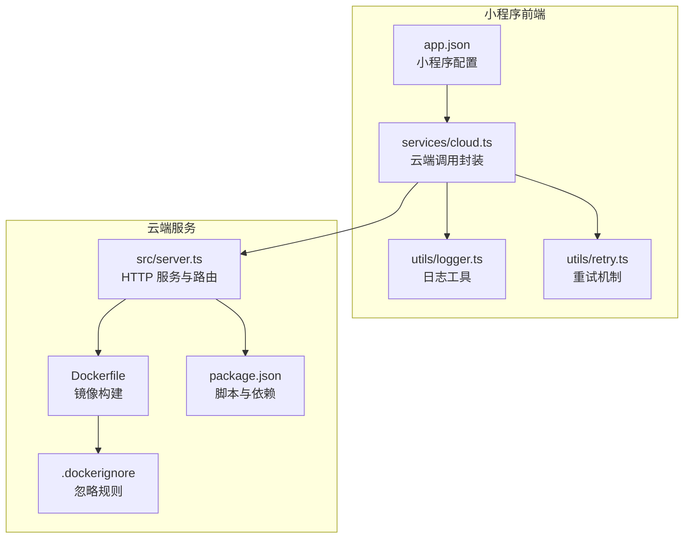
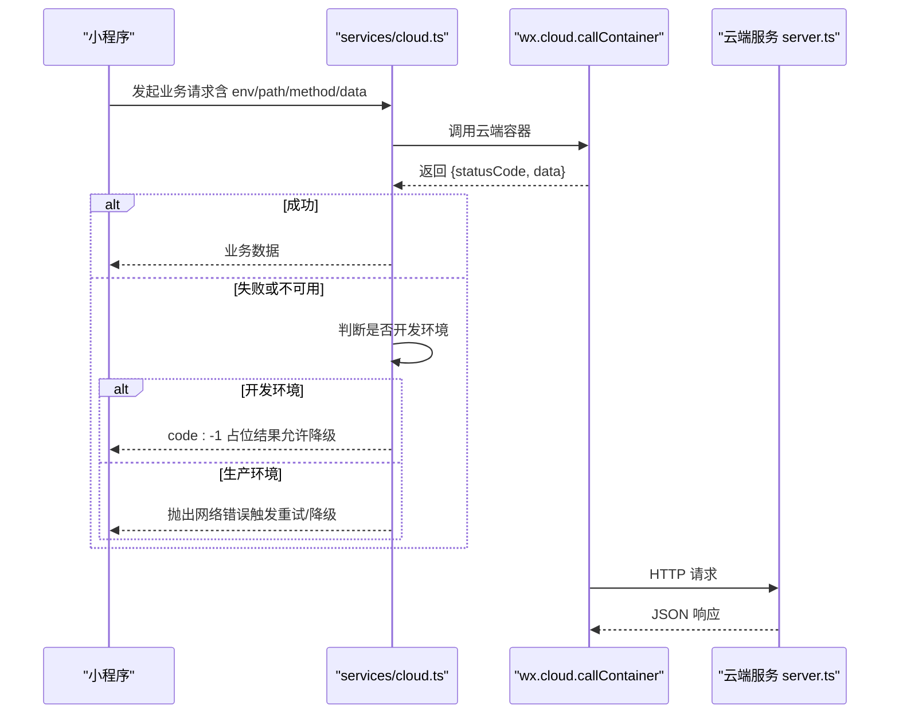
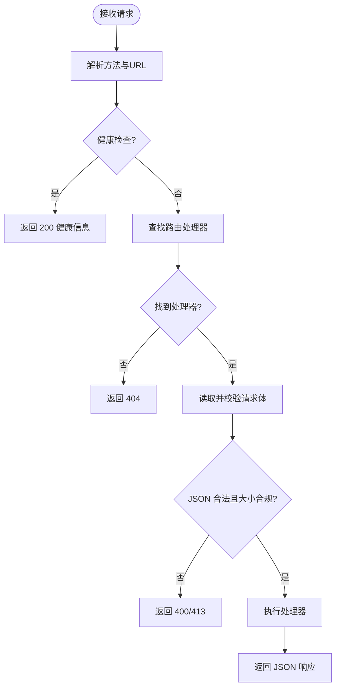
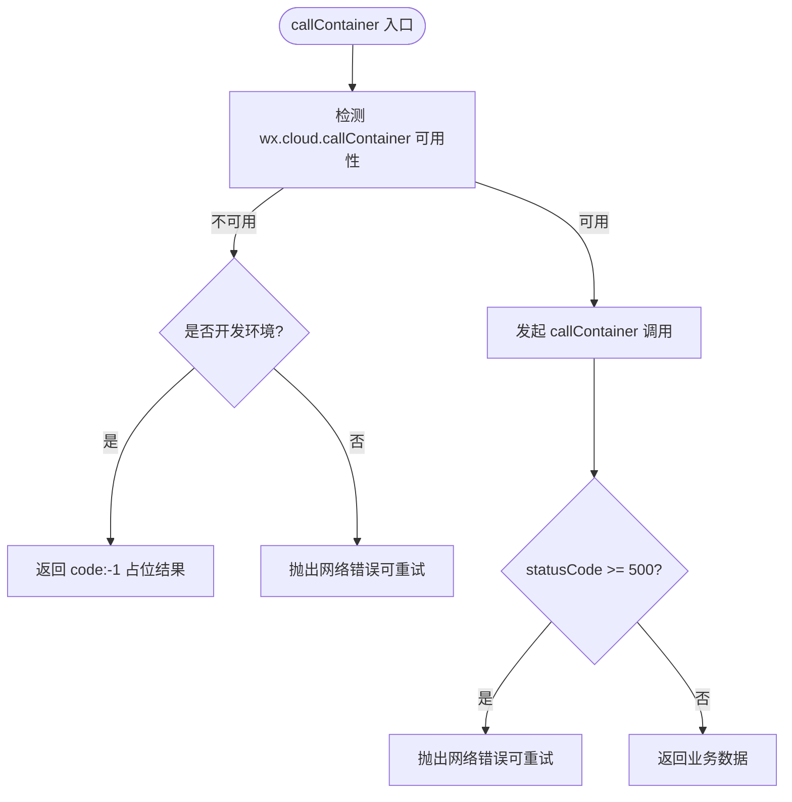
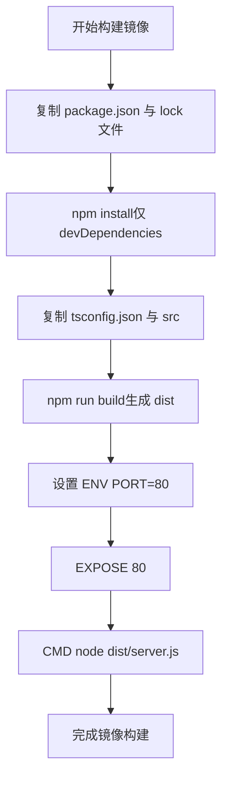
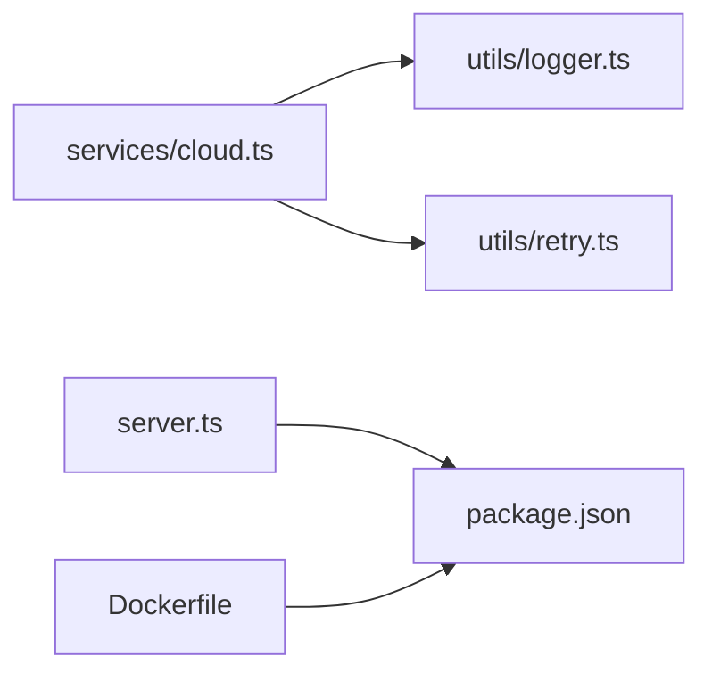

# 部署运维

<cite>
**本文引用的文件**   
- [cloudrun/Dockerfile](file://cloudrun/Dockerfile)
- [cloudrun/.dockerignore](file://cloudrun/.dockerignore)
- [cloudrun/package.json](file://cloudrun/package.json)
- [cloudrun/src/server.ts](file://cloudrun/src/server.ts)
- [miniprogram/app.json](file://miniprogram/app.json)
- [project.config.json](file://project.config.json)
- [miniprogram/src/services/cloud.ts](file://miniprogram/src/services/cloud.ts)
- [miniprogram/src/utils/logger.ts](file://miniprogram/src/utils/logger.ts)
- [miniprogram/src/utils/retry.ts](file://miniprogram/src/utils/retry.ts)
</cite>

## 目录
1. [简介](#简介)
2. [项目结构](#项目结构)
3. [核心组件](#核心组件)
4. [架构总览](#架构总览)
5. [详细组件分析](#详细组件分析)
6. [依赖关系分析](#依赖关系分析)
7. [性能与容量规划](#性能与容量规划)
8. [监控与告警](#监控与告警)
9. [故障排查指南](#故障排查指南)
10. [灾难恢复与备份](#灾难恢复与备份)
11. [自动化与CI/CD流水线](#自动化与cicd流水线)
12. [结论](#结论)

## 简介
本文件为 WAIC-WeChat-MiniProgram 的生产环境部署与运维手册，覆盖小程序发布流程、云端服务容器化配置、监控告警体系、故障排查、性能优化、灾难恢复与备份策略，以及自动化脚本与CI/CD流水线示例。文档面向开发与运维人员，兼顾非技术读者理解。

## 项目结构
仓库采用“小程序前端 + 云端 Node.js 服务”的双端结构：
- miniprogram：微信小程序前端，包含页面、业务逻辑与服务封装。
- cloudrun：基于 Node.js 的云端托管服务，提供 LLM 对话与技能接口，并通过微信 Cloud Container 被小程序调用。

图示来源
- [miniprogram/app.json:1-20](file://miniprogram/app.json#L1-L20)
- [miniprogram/src/services/cloud.ts:1-223](file://miniprogram/src/services/cloud.ts#L1-L223)
- [miniprogram/src/utils/logger.ts:1-61](file://miniprogram/src/utils/logger.ts#L1-L61)
- [miniprogram/src/utils/retry.ts:44-101](file://miniprogram/src/utils/retry.ts#L44-L101)
- [cloudrun/src/server.ts:1-129](file://cloudrun/src/server.ts#L1-L129)
- [cloudrun/Dockerfile:1-20](file://cloudrun/Dockerfile#L1-L20)
- [cloudrun/.dockerignore:1-5](file://cloudrun/.dockerignore#L1-L5)
- [cloudrun/package.json:1-17](file://cloudrun/package.json#L1-L17)

章节来源
- [miniprogram/app.json:1-20](file://miniprogram/app.json#L1-L20)
- [project.config.json:1-42](file://project.config.json#L1-L42)
- [cloudrun/Dockerfile:1-20](file://cloudrun/Dockerfile#L1-L20)
- [cloudrun/package.json:1-17](file://cloudrun/package.json#L1-L17)

## 核心组件
- 小程序侧云端调用封装：统一错误结构、超时与重试、开发/生产降级策略、会话透传。
- 云端 HTTP 服务：零运行时依赖，仅使用 Node 内建模块；健康检查、请求体解析、路由分发、标准 JSON 响应。
- 容器化构建：Alpine 基础镜像、TypeScript 编译产物运行、端口与环境变量约定。
- 日志与重试：结构化日志前缀、可配置级别；指数退避+抖动重试。

章节来源
- [miniprogram/src/services/cloud.ts:1-223](file://miniprogram/src/services/cloud.ts#L1-L223)
- [cloudrun/src/server.ts:1-129](file://cloudrun/src/server.ts#L1-L129)
- [cloudrun/Dockerfile:1-20](file://cloudrun/Dockerfile#L1-L20)
- [miniprogram/src/utils/logger.ts:1-61](file://miniprogram/src/utils/logger.ts#L1-L61)
- [miniprogram/src/utils/retry.ts:44-101](file://miniprogram/src/utils/retry.ts#L44-L101)

## 架构总览
小程序通过 wx.cloud.callContainer 调用云端容器服务；云端服务监听 PORT 环境变量指定的端口，暴露健康检查与业务路由。

图示来源
- [miniprogram/src/services/cloud.ts:64-149](file://miniprogram/src/services/cloud.ts#L64-L149)
- [cloudrun/src/server.ts:76-128](file://cloudrun/src/server.ts#L76-L128)

## 详细组件分析

### 云端服务（Node.js）
职责：
- 监听 PORT 环境变量指定端口（默认 80）。
- 解析 JSON 请求体（上限 1MB），统一错误码。
- 路由分发：聚合各 handler 模块的路由表。
- 健康检查：GET / 与 GET /healthz 返回服务状态。

关键实现要点：
- 健康检查路径直接返回 200 与业务信息。
- 请求体过大返回 413，非法 JSON 返回 400，其他异常返回 500。
- 从请求头提取 openid 与会话 ID，便于链路追踪。

图示来源
- [cloudrun/src/server.ts:76-128](file://cloudrun/src/server.ts#L76-L128)

章节来源
- [cloudrun/src/server.ts:1-129](file://cloudrun/src/server.ts#L1-L129)

### 小程序云端调用封装
职责：
- 统一调用 wx.cloud.callContainer，注入 content-type 与会话头。
- 超时控制：单次调用默认 15s，支持自定义。
- 重试策略：指数退避+抖动，最大尝试次数与延迟可配置。
- 开发/生产降级：开发环境云端不可用时返回 code:-1，允许本地 mock/规则兜底；生产环境保持严格失败语义。

关键实现要点：
- 开发环境判定依据微信账户信息中的 envVersion。
- 确保 wx.cloud.init 冪等初始化，避免重复初始化。
- 将网络层错误标记为可重试，供上层统一处理。

图示来源
- [miniprogram/src/services/cloud.ts:64-149](file://miniprogram/src/services/cloud.ts#L64-L149)
- [miniprogram/src/services/cloud.ts:157-182](file://miniprogram/src/services/cloud.ts#L157-L182)
- [miniprogram/src/services/cloud.ts:184-207](file://miniprogram/src/services/cloud.ts#L184-L207)

章节来源
- [miniprogram/src/services/cloud.ts:1-223](file://miniprogram/src/services/cloud.ts#L1-L223)

### Docker 容器化配置
- 基础镜像：node:20-alpine，最小化运行时体积。
- 工作目录：/app。
- 依赖安装：先复制 package.json 与 lock 文件，利用缓存加速构建；仅 devDependencies（typescript/@types/node）。
- 源码编译：复制 tsconfig.json 与 src，执行 npm run build 生成 dist。
- 运行配置：ENV PORT=80，EXPOSE 80，CMD 启动 dist/server.js。
- .dockerignore：排除 node_modules、dist、*.log、.git。

图示来源
- [cloudrun/Dockerfile:1-20](file://cloudrun/Dockerfile#L1-L20)
- [cloudrun/.dockerignore:1-5](file://cloudrun/.dockerignore#L1-L5)

章节来源
- [cloudrun/Dockerfile:1-20](file://cloudrun/Dockerfile#L1-L20)
- [cloudrun/.dockerignore:1-5](file://cloudrun/.dockerignore#L1-L5)
- [cloudrun/package.json:1-17](file://cloudrun/package.json#L1-L17)

### 小程序发布配置
- app.json：定义页面、导航栏样式、权限声明与隐私信息。
- project.config.json：小程序工程配置，包括 TypeScript 编译器插件、压缩选项、上传 SourceMap、AppID 等。

章节来源
- [miniprogram/app.json:1-20](file://miniprogram/app.json#L1-L20)
- [project.config.json:1-42](file://project.config.json#L1-L42)

## 依赖关系分析
- 小程序 services/cloud.ts 依赖 utils/logger.ts 与 utils/retry.ts。
- 云端 server.ts 聚合 llm/skill 路由模块（未在本节展开）。
- Dockerfile 依赖 package.json 与 tsconfig.json 进行构建。

图示来源
- [miniprogram/src/services/cloud.ts:1-223](file://miniprogram/src/services/cloud.ts#L1-L223)
- [miniprogram/src/utils/logger.ts:1-61](file://miniprogram/src/utils/logger.ts#L1-L61)
- [miniprogram/src/utils/retry.ts:44-101](file://miniprogram/src/utils/retry.ts#L44-L101)
- [cloudrun/src/server.ts:1-129](file://cloudrun/src/server.ts#L1-L129)
- [cloudrun/package.json:1-17](file://cloudrun/package.json#L1-L17)
- [cloudrun/Dockerfile:1-20](file://cloudrun/Dockerfile#L1-L20)

章节来源
- [miniprogram/src/services/cloud.ts:1-223](file://miniprogram/src/services/cloud.ts#L1-L223)
- [cloudrun/src/server.ts:1-129](file://cloudrun/src/server.ts#L1-L129)
- [cloudrun/package.json:1-17](file://cloudrun/package.json#L1-L17)
- [cloudrun/Dockerfile:1-20](file://cloudrun/Dockerfile#L1-L20)

## 性能与容量规划
- 云端服务
  - 请求体上限：1MB，避免大负载拖垮服务。
  - 健康检查：/ 与 /healthz 用于云托管探活，建议外部监控定期探测。
  - 端口与环境：PORT 环境变量决定监听端口，默认 80。
- 小程序侧
  - 超时与重试：默认 15s 超时，指数退避+抖动重试，避免雪崩。
  - 开发/生产降级：开发环境允许本地降级，生产环境保持严格失败语义。
- 容器镜像
  - Alpine 基础镜像减小体积，提升冷启动速度。
  - 单阶段构建简化流程，正式版可改为多阶段仅携带 dist/。

[本节为通用指导，不直接分析具体文件]

## 监控与告警
- 关键指标收集
  - 云端健康检查：对外暴露 / 与 /healthz，建议通过外部探针定时访问并记录成功率与延迟。
  - 小程序调用成功率：在 services/cloud.ts 中统计成功/失败比例，结合日志前缀聚合。
- 日志聚合
  - 小程序日志：utils/logger.ts 输出带品牌前缀的结构化日志，便于按品牌与级别过滤。
  - 云端日志：server.ts 统一输出到 stdout，由云托管日志系统采集。
- 异常通知
  - 云端 5xx 与网络错误：services/cloud.ts 在生产环境抛出可重试错误，建议在 CI/CD 或运维平台接入告警通道（如企业微信、邮件、短信）。
  - 重试失败：utils/retry.ts 在最终失败时输出错误日志，可作为告警触发点。

章节来源
- [cloudrun/src/server.ts:76-128](file://cloudrun/src/server.ts#L76-L128)
- [miniprogram/src/services/cloud.ts:64-149](file://miniprogram/src/services/cloud.ts#L64-L149)
- [miniprogram/src/utils/logger.ts:1-61](file://miniprogram/src/utils/logger.ts#L1-L61)
- [miniprogram/src/utils/retry.ts:44-101](file://miniprogram/src/utils/retry.ts#L44-L101)

## 故障排查指南
常见问题与定位步骤：
- 小程序无法调用云端
  - 检查 wx.cloud.callContainer 是否可用：services/cloud.ts 在非 wx 环境下返回 code:-1（开发模式）。
  - 确认 wx.cloud.init 已正确初始化：services/cloud.ts 提供 ensureCloudInit 方法。
  - 查看开发/生产环境判定：isDevEnv 根据 envVersion 判断，影响降级行为。
- 云端服务无响应
  - 健康检查失败：访问 / 或 /healthz，确认返回 200 与健康信息。
  - 请求体过大或非法 JSON：服务端返回 413 或 400，检查客户端 payload。
  - 端口配置错误：确认 PORT 环境变量与 Dockerfile EXPOSE 一致。
- 重试风暴或雪崩
  - 调整 retry 参数：maxAttempts、baseDelayMs、maxDelayMs。
  - 观察 utils/retry.ts 的重试日志，确认抖动与退避生效。

章节来源
- [miniprogram/src/services/cloud.ts:64-149](file://miniprogram/src/services/cloud.ts#L64-L149)
- [miniprogram/src/services/cloud.ts:157-182](file://miniprogram/src/services/cloud.ts#L157-L182)
- [miniprogram/src/services/cloud.ts:184-207](file://miniprogram/src/services/cloud.ts#L184-L207)
- [cloudrun/src/server.ts:76-128](file://cloudrun/src/server.ts#L76-L128)
- [miniprogram/src/utils/retry.ts:44-101](file://miniprogram/src/utils/retry.ts#L44-L101)

## 灾难恢复与备份
- 数据备份策略
  - 云端服务无状态：主要依赖外部存储（数据库、对象存储），需制定定期快照与异地备份策略。
  - 小程序本地缓存：storage/session 模块负责本地持久化，建议提供用户数据导出与清理能力。
- 灾难恢复计划
  - 云端服务快速重建：通过 Docker 镜像与配置文件（Dockerfile、package.json）快速重建服务实例。
  - 小程序版本回滚：保留历史包体与配置，支持快速回滚至稳定版本。
  - 监控与告警联动：当健康检查失败或错误率飙升时，自动触发扩容或回滚流程。

[本节为通用指导，不直接分析具体文件]

## 自动化与CI/CD流水线
- 构建与测试
  - 云端服务：npm run build 编译 TypeScript，npm start 启动服务进行冒烟测试。
  - 小程序：启用 TypeScript 编译器插件，开启 SourceMap 上传以便调试。
- 镜像构建与推送
  - 使用 Dockerfile 构建镜像，推送至镜像仓库；部署时拉取最新镜像。
- 部署流程
  - 云端服务：更新环境变量（如 LLM_BASE_URL、LLM_API_KEY、LLM_MODEL），重启服务实例。
  - 小程序：通过开发者工具或 CLI 上传代码并提交审核。

章节来源
- [cloudrun/package.json:1-17](file://cloudrun/package.json#L1-L17)
- [cloudrun/Dockerfile:1-20](file://cloudrun/Dockerfile#L1-L20)
- [project.config.json:1-42](file://project.config.json#L1-L42)

## 结论
本运维文档围绕小程序与云端服务的部署、监控、故障排查、性能优化与自动化展开，结合现有代码结构与配置，提供了可操作的实践指南。建议在生产环境中完善监控告警、备份恢复与自动化流水线，以提升系统稳定性与可维护性。