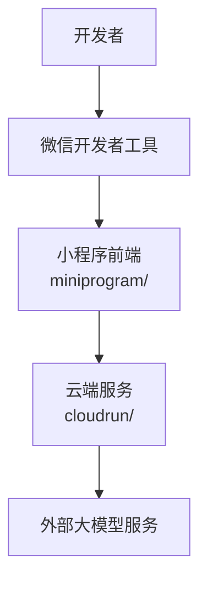

# 快速开始

<cite>
**本文引用的文件**   
- [package.json](file://package.json)
- [project.config.json](file://project.config.json)
- [miniprogram/app.ts](file://miniprogram/app.ts)
- [miniprogram/app.json](file://miniprogram/app.json)
- [miniprogram/pages/index/index.ts](file://miniprogram/pages/index/index.ts)
- [cloudrun/package.json](file://cloudrun/package.json)
- [cloudrun/src/server.ts](file://cloudrun/src/server.ts)
- [cloudrun/Dockerfile](file://cloudrun/Dockerfile)
</cite>

## 目录
1. [简介](#简介)
2. [项目结构](#项目结构)
3. [环境准备](#环境准备)
4. [克隆与依赖安装](#克隆与依赖安装)
5. [运行小程序前端](#运行小程序前端)
6. [运行云端服务](#运行云端服务)
7. [基本配置说明](#基本配置说明)
8. [第一个测试用例](#第一个测试用例)
9. [常见问题与故障排除](#常见问题与故障排除)
10. [命令参考与常用技巧](#命令参考与常用技巧)
11. [结论](#结论)

## 简介
本项目是一个微信小程序端的 AI Agent 助手，包含：
- 小程序前端：基于 TypeScript 的微信原生小程序工程。
- 云端服务：零运行时依赖的 Node.js HTTP 服务，提供 LLM 对话、技能编排等接口。

本指南帮助你在最短时间内完成环境搭建、依赖安装、前后端启动，并给出一个简单验证流程。

## 项目结构
- 根目录
  - package.json：顶层脚本（类型检查、构建）。
  - project.config.json：微信开发者工具项目配置，指向 miniprogram/ 目录。
- miniprogram/
  - app.ts：小程序生命周期入口，注入品牌信息与懒加载 Agent Runtime。
  - app.json：小程序页面注册、窗口样式、权限声明等。
  - pages/index/index.ts：首页对话界面逻辑，订阅 Agent 状态与任务进度事件。
- cloudrun/
  - src/server.ts：HTTP 服务器入口，健康检查、路由分发、请求体解析与错误处理。
  - Dockerfile：容器镜像构建，使用 node:20-alpine，暴露端口 80。
  - package.json：云端服务脚本（构建、启动、类型检查）。

图表来源
- [project.config.json:1-42](file://project.config.json#L1-L42)
- [miniprogram/app.ts:1-49](file://miniprogram/app.ts#L1-L49)
- [cloudrun/src/server.ts:1-129](file://cloudrun/src/server.ts#L1-L129)

章节来源
- [project.config.json:1-42](file://project.config.json#L1-L42)
- [miniprogram/app.ts:1-49](file://miniprogram/app.ts#L1-L49)
- [cloudrun/src/server.ts:1-129](file://cloudrun/src/server.ts#L1-L129)

## 环境准备
- Node.js
  - 建议使用 Node.js 18+；云端 Dockerfile 使用 node:20-alpine，本地开发建议保持一致版本。
- 微信开发者工具
  - 安装最新版微信开发者工具，确保支持 TypeScript 编译插件。
- 可选：Docker
  - 如需在容器中运行云端服务，请安装 Docker。

注意
- 项目启用 TypeScript 编译插件，需在微信开发者工具中保持该插件开启。
- 小程序基础库版本在项目中设置为 3.0.0，请在开发者工具中匹配或升级基础库。

章节来源
- [cloudrun/Dockerfile:1-20](file://cloudrun/Dockerfile#L1-L20)
- [project.config.json:1-42](file://project.config.json#L1-L42)

## 克隆与依赖安装
1. 克隆仓库
   - git clone <仓库地址>
   - cd WAIC-WeChat-MiniProgram
2. 安装顶层依赖（TypeScript）
   - npm install
3. 安装云端服务依赖
   - cd cloudrun
   - npm install
   - npm run build
   - 产物位于 dist/，由 server.js 启动

说明
- 顶层 package.json 仅提供类型检查与构建脚本，实际小程序代码由微信开发者工具编译。
- 云端服务使用 TypeScript，需先构建再运行。

章节来源
- [package.json:1-23](file://package.json#L1-L23)
- [cloudrun/package.json:1-17](file://cloudrun/package.json#L1-L17)

## 运行小程序前端
1. 打开微信开发者工具
   - 导入项目根目录。
   - 确认 project.config.json 中的 miniprogramRoot 指向 miniprogram/。
2. 编译与预览
   - 点击“编译”，等待 TypeScript 编译完成。
   - 在模拟器中查看首页对话界面。
3. 调试
   - 打开调试器查看日志与网络请求。
   - 若出现 TypeScript 报错，请先修复类型问题。

章节来源
- [project.config.json:1-42](file://project.config.json#L1-L42)
- [miniprogram/app.ts:1-49](file://miniprogram/app.ts#L1-L49)

## 运行云端服务
本地直接运行
1. 进入 cloudrun 目录
   - cd cloudrun
2. 构建并启动
   - npm run build
   - npm start
3. 健康检查
   - 访问 http://localhost:80 或 http://localhost:80/healthz
   - 返回 JSON，包含 service 与 time 字段表示服务正常。

容器运行（可选）
1. 构建镜像
   - docker build -t micromate-cloudrun .
2. 运行容器
   - docker run -p 80:80 micromate-cloudrun
3. 健康检查
   - curl http://localhost:80/healthz

说明
- 服务监听 PORT 环境变量，默认 80。
- 仅使用 Node 内建模组，零运行时依赖。

章节来源
- [cloudrun/package.json:1-17](file://cloudrun/package.json#L1-L17)
- [cloudrun/src/server.ts:1-129](file://cloudrun/src/server.ts#L1-L129)
- [cloudrun/Dockerfile:1-20](file://cloudrun/Dockerfile#L1-L20)

## 基本配置说明
- 小程序项目配置（project.config.json）
  - miniprogramRoot：小程序源码目录，当前为 miniprogram/。
  - setting.useCompilerPlugins：启用 TypeScript 编译器插件。
  - libVersion：基础库版本，当前为 3.0.0。
  - appid：小程序 AppID，请替换为你自己的 AppID。
- 小程序应用配置（miniprogram/app.json）
  - pages：注册首页路径。
  - window：导航栏标题与样式。
  - permission：位置权限描述。
  - requiredPrivateInfos：声明需要的位置信息权限。
- 云端服务配置（cloudrun/src/server.ts）
  - 端口：PORT 环境变量，默认 80。
  - 健康检查：GET / 与 GET /healthz。
  - 请求体大小上限：1MB。
  - 自定义头：x-wx-openid、x-micromate-session。

章节来源
- [project.config.json:1-42](file://project.config.json#L1-L42)
- [miniprogram/app.json:1-20](file://miniprogram/app.json#L1-L20)
- [cloudrun/src/server.ts:1-129](file://cloudrun/src/server.ts#L1-L129)

## 第一个测试用例
目标：验证环境搭建是否成功。

步骤
1. 启动云端服务
   - 本地：npm start（cloudrun 目录）
   - 容器：docker run -p 80:80 micromate-cloudrun
2. 调用健康检查
   - 浏览器或 curl 访问 http://localhost:80/healthz
   - 期望返回包含 code、message、data.service、data.time 的 JSON。
3. 打开小程序前端
   - 在微信开发者工具中编译并预览。
   - 在首页输入示例文本，例如“明天北京到上海的高铁”。
4. 观察结果
   - 若云端服务未就绪或端口不一致，小程序侧会显示异常提示。
   - 若健康检查通过但小程序仍失败，请检查小程序与云端的网络连通性与域名配置。

章节来源
- [cloudrun/src/server.ts:1-129](file://cloudrun/src/server.ts#L1-L129)
- [miniprogram/pages/index/index.ts:1-329](file://miniprogram/pages/index/index.ts#L1-L329)

## 常见问题与故障排除
- 微信开发者工具无法编译 TypeScript
  - 确认 project.config.json 中 useCompilerPlugins 已启用 TypeScript。
  - 检查 TypeScript 版本与基础库兼容性。
- 小程序基础库版本不匹配
  - 将开发者工具的基础库升级到 3.0.0 或更高版本。
- 云端服务端口冲突
  - 修改 PORT 环境变量后重启服务。
  - 或在 cloudrun/.env 中设置 PORT（如使用支持的环境变量加载方案）。
- 健康检查返回 404 或 500
  - 检查路由是否正确注册。
  - 查看服务端日志输出，定位异常原因。
- 小程序无法连接云端服务
  - 确认小程序配置的云端服务地址与端口一致。
  - 检查防火墙与代理设置。
- 权限相关报错
  - 在 miniprogram/app.json 中正确声明权限与隐私信息。
  - 在真机调试时授予相应权限。

章节来源
- [project.config.json:1-42](file://project.config.json#L1-L42)
- [miniprogram/app.json:1-20](file://miniprogram/app.json#L1-L20)
- [cloudrun/src/server.ts:1-129](file://cloudrun/src/server.ts#L1-L129)

## 命令参考与常用技巧
- 顶层脚本
  - npm run type-check：执行 TypeScript 类型检查。
  - npm run build：执行 TypeScript 构建（无输出，仅检查）。
- 云端服务脚本
  - npm run build：编译 TypeScript 到 dist/。
  - npm start：启动 Node 服务（dist/server.js）。
  - npm run type-check：云端服务类型检查。
- 常用操作
  - 本地开发：先构建云端服务，再在微信开发者工具中编译小程序。
  - 容器化部署：docker build 与 docker run 启动云端服务。
  - 健康检查：curl http://localhost:80/healthz 验证服务可用性。

章节来源
- [package.json:1-23](file://package.json#L1-L23)
- [cloudrun/package.json:1-17](file://cloudrun/package.json#L1-L17)

## 结论
按照本指南完成环境准备、依赖安装、前后端启动与基本配置后，你可以在微信开发者工具中运行小程序前端，并通过健康检查验证云端服务是否正常。遇到问题时，优先检查端口、基础库版本与权限配置，并结合服务端日志进行排查。