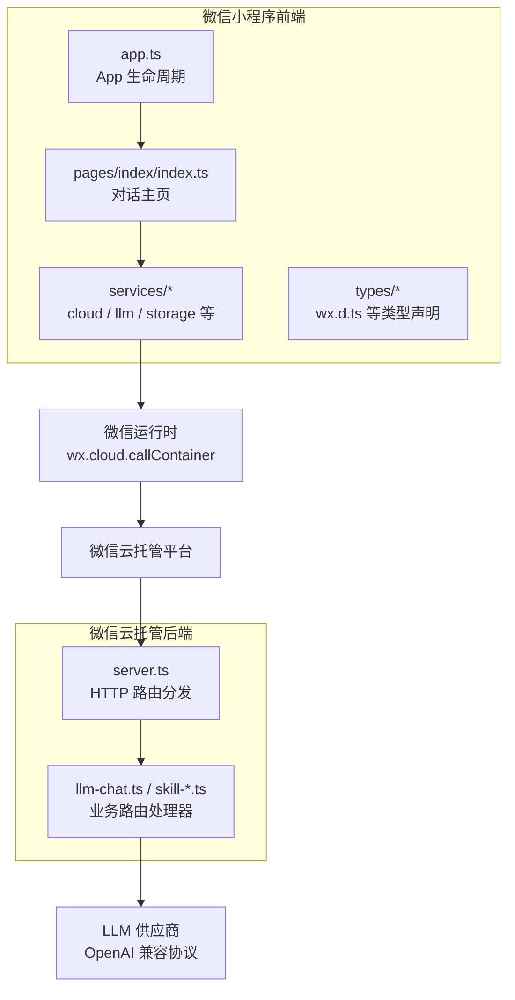
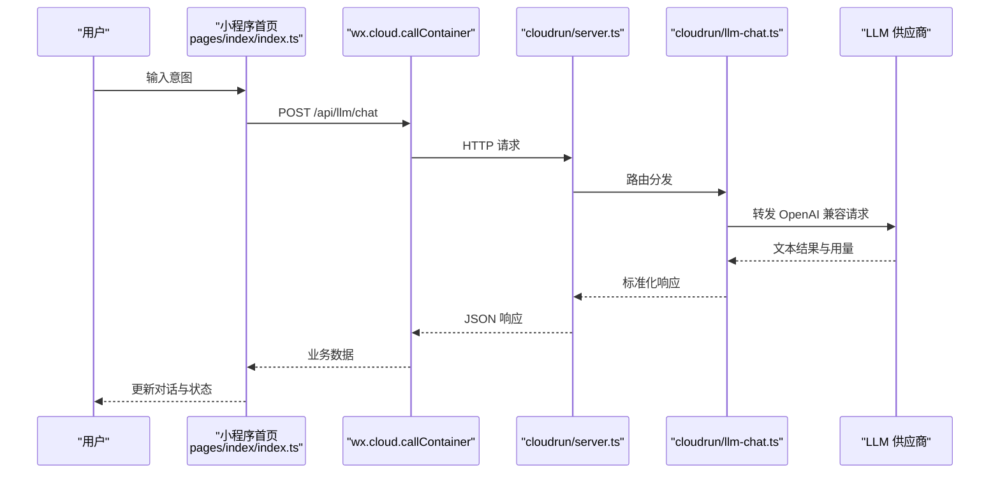
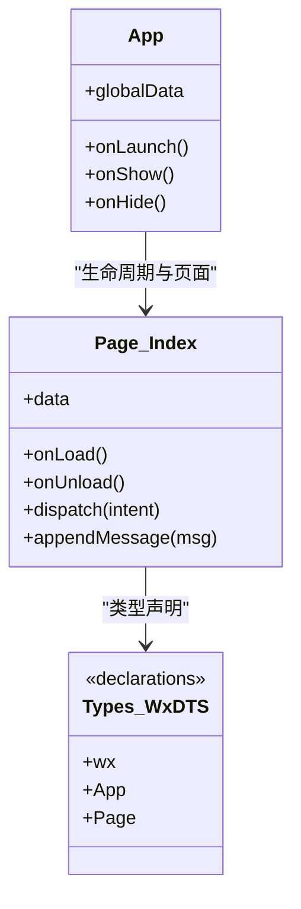
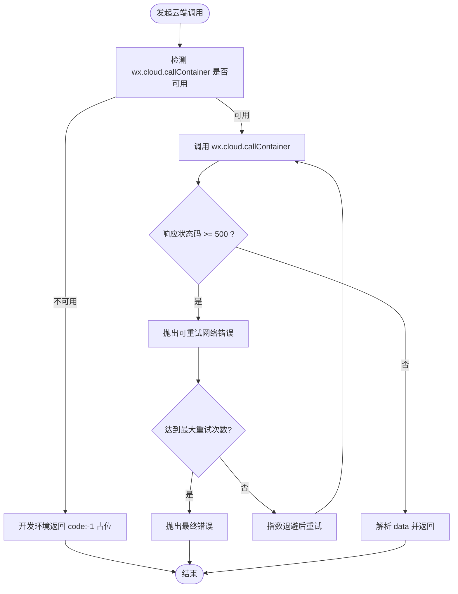
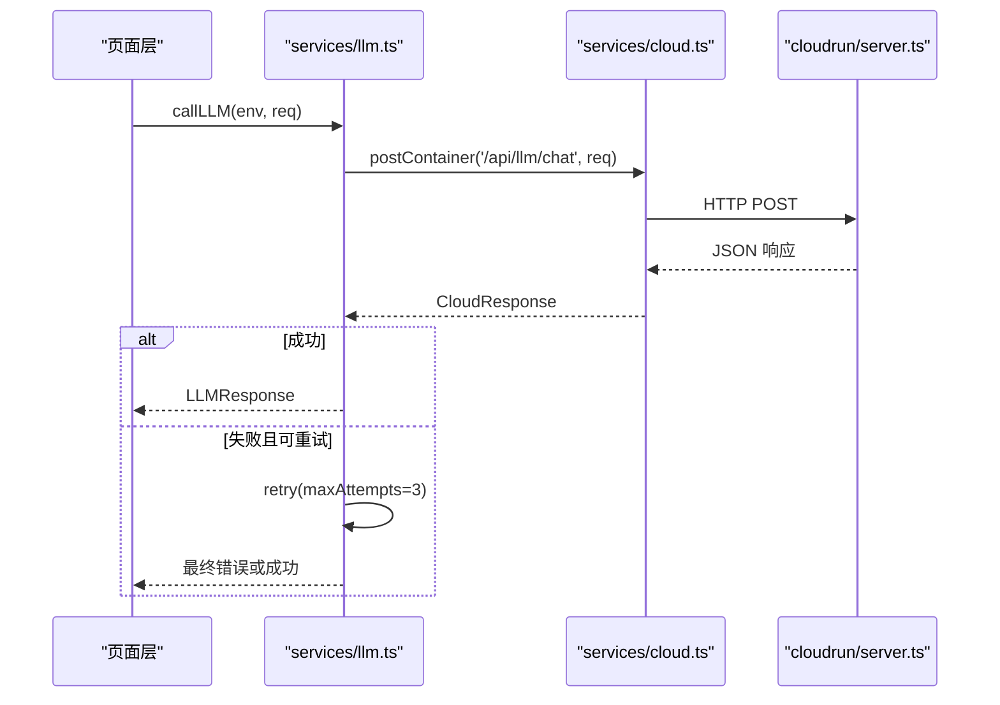
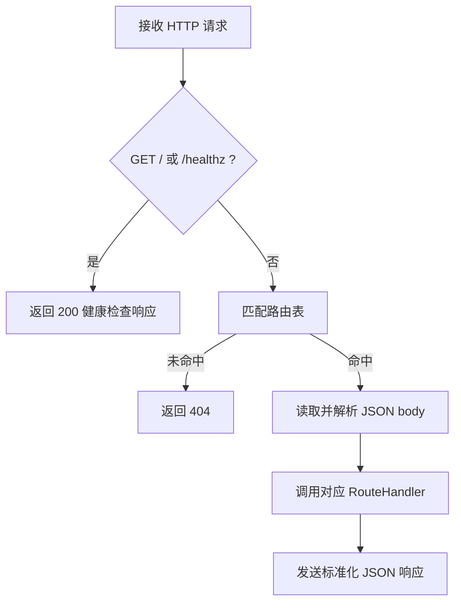
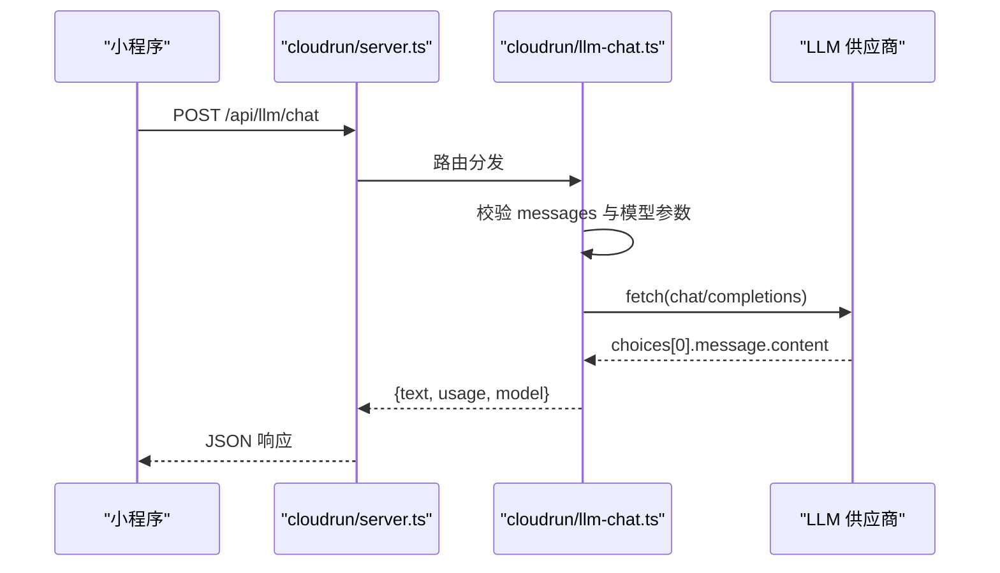
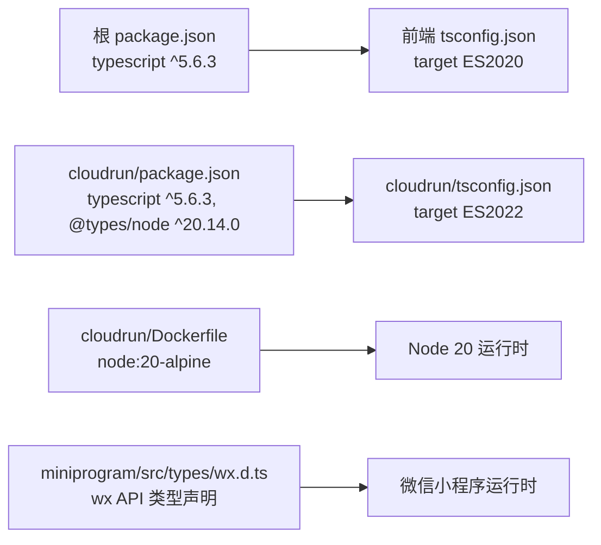

# 技术栈

<cite>
**本文引用的文件**   
- [package.json](file://package.json)
- [tsconfig.json](file://tsconfig.json)
- [cloudrun/package.json](file://cloudrun/package.json)
- [cloudrun/tsconfig.json](file://cloudrun/tsconfig.json)
- [miniprogram/app.json](file://miniprogram/app.json)
- [miniprogram/app.ts](file://miniprogram/app.ts)
- [miniprogram/pages/index/index.ts](file://miniprogram/pages/index/index.ts)
- [miniprogram/src/services/cloud.ts](file://miniprogram/src/services/cloud.ts)
- [miniprogram/src/services/llm.ts](file://miniprogram/src/services/llm.ts)
- [miniprogram/src/types/wx.d.ts](file://miniprogram/src/types/wx.d.ts)
- [cloudrun/src/server.ts](file://cloudrun/src/server.ts)
- [cloudrun/src/llm-chat.ts](file://cloudrun/src/llm-chat.ts)
- [cloudrun/Dockerfile](file://cloudrun/Dockerfile)
</cite>

## 目录
1. [简介](#简介)
2. [项目结构](#项目结构)
3. [核心组件](#核心组件)
4. [架构总览](#架构总览)
5. [详细组件分析](#详细组件分析)
6. [依赖关系与版本兼容性](#依赖关系与版本兼容性)
7. [性能与可观测性](#性能与可观测性)
8. [故障排查指南](#故障排查指南)
9. [结论](#结论)
10. [附录：环境要求与安装步骤](#附录环境要求与安装步骤)

## 简介
本项目是一个运行在微信小程序内的个人 AI 助理，前端使用 TypeScript + WXML/WXSS，后端使用 Node.js + TypeScript 部署到微信云托管容器。小程序通过微信云开发调用云端容器服务，云端再转发至多家 LLM 供应商（OpenAI 兼容协议），实现跨 Skill 的任务编排与执行。

## 项目结构
仓库采用“前端小程序 + 后端云托管”的双仓式组织：
- miniprogram：微信小程序前端，包含页面、运行时、类型定义与服务封装。
- cloudrun：Node.js 后端，提供 HTTP API，统一接入 LLM 与 Skill 端点。
- 根级 package.json 与 tsconfig.json：用于前端 TypeScript 类型检查与路径别名。

**图表来源**
- [miniprogram/app.ts:23-48](file://miniprogram/app.ts#L23-L48)
- [miniprogram/pages/index/index.ts:117-152](file://miniprogram/pages/index/index.ts#L117-L152)
- [miniprogram/src/services/cloud.ts:64-149](file://miniprogram/src/services/cloud.ts#L64-L149)
- [cloudrun/src/server.ts:76-128](file://cloudrun/src/server.ts#L76-L128)
- [cloudrun/src/llm-chat.ts:55-117](file://cloudrun/src/llm-chat.ts#L55-L117)

**章节来源**
- [miniprogram/app.ts:1-49](file://miniprogram/app.ts#L1-L49)
- [miniprogram/app.json:1-20](file://miniprogram/app.json#L1-L20)
- [cloudrun/src/server.ts:1-28](file://cloudrun/src/server.ts#L1-L28)

## 核心组件
- 微信小程序框架与运行时
  - App/Page 生命周期、全局数据注入、页面路由由 app.ts 与 pages/index/index.ts 管理。
  - 小程序配置（页面、导航栏、权限）位于 app.json。
  - 类型安全：通过自定义 wx.d.ts 覆盖常用 wx API，避免引入外部 @types/wechat-miniprogram。
- TypeScript 工程化
  - 根 tsconfig.json 针对小程序源码进行类型检查（noEmit），启用严格模式与 ESNext 模块解析。
  - cloudrun/tsconfig.json 针对服务端编译为 CommonJS，目标 ES2022，输出 dist。
- 云托管后端
  - server.ts 基于 node:http 自建轻量 HTTP 服务器，零运行时依赖，监听 PORT 环境变量。
  - 路由表由各 handler 模块以 entries 形式注册（如 llm-chat.ts）。
- LLM 客户端与代理
  - 小程序侧 services/llm.ts 封装云端 LLM 调用，统一错误语义与重试策略。
  - 云端 llm-chat.ts 将请求转为 OpenAI 兼容协议，转发至 LLM 供应商。

**章节来源**
- [miniprogram/app.ts:1-49](file://miniprogram/app.ts#L1-L49)
- [miniprogram/pages/index/index.ts:1-17](file://miniprogram/pages/index/index.ts#L1-L17)
- [miniprogram/src/types/wx.d.ts:1-128](file://miniprogram/src/types/wx.d.ts#L1-L128)
- [tsconfig.json:1-23](file://tsconfig.json#L1-L23)
- [cloudrun/tsconfig.json:1-18](file://cloudrun/tsconfig.json#L1-L18)
- [cloudrun/src/server.ts:1-28](file://cloudrun/src/server.ts#L1-L28)
- [miniprogram/src/services/llm.ts:1-83](file://miniprogram/src/services/llm.ts#L1-L83)
- [cloudrun/src/llm-chat.ts:1-17](file://cloudrun/src/llm-chat.ts#L1-L17)

## 架构总览
整体交互流程如下：
- 用户在小程序首页输入意图，触发 Agent 处理。
- 小程序通过 wx.cloud.callContainer 调用云端容器服务。
- 云端 server.ts 根据路由分发给具体处理器（如 LLM 聊天）。
- LLM 处理器将请求转换为 OpenAI 兼容格式并调用上游 LLM 供应商。
- 响应经云端返回给小程序，UI 更新状态与消息卡片。

**图表来源**
- [miniprogram/pages/index/index.ts:213-270](file://miniprogram/pages/index/index.ts#L213-L270)
- [miniprogram/src/services/cloud.ts:64-149](file://miniprogram/src/services/cloud.ts#L64-L149)
- [cloudrun/src/server.ts:76-128](file://cloudrun/src/server.ts#L76-L128)
- [cloudrun/src/llm-chat.ts:55-117](file://cloudrun/src/llm-chat.ts#L55-L117)

## 详细组件分析

### 前端：微信小程序框架与 TypeScript
- 入口与生命周期
  - app.ts 负责微信 App 生命周期与全局数据注入，懒加载 Agent Runtime，避免 onLaunch 耗时过长。
- 页面与交互
  - pages/index/index.ts 实现对话界面、状态机展示、任务进度卡片渲染，订阅 Agent 事件实时更新 UI。
- 类型系统
  - types/wx.d.ts 提供完整 wx API 类型声明，确保类型安全且不引入额外依赖。

**图表来源**
- [miniprogram/app.ts:23-48](file://miniprogram/app.ts#L23-L48)
- [miniprogram/pages/index/index.ts:117-152](file://miniprogram/pages/index/index.ts#L117-L152)
- [miniprogram/src/types/wx.d.ts:10-37](file://miniprogram/src/types/wx.d.ts#L10-L37)

**章节来源**
- [miniprogram/app.ts:1-49](file://miniprogram/app.ts#L1-L49)
- [miniprogram/pages/index/index.ts:1-17](file://miniprogram/pages/index/index.ts#L1-L17)
- [miniprogram/src/types/wx.d.ts:1-128](file://miniprogram/src/types/wx.d.ts#L1-L128)

### 前端：云服务封装与重试策略
- cloud.ts 封装 wx.cloud.callContainer，统一超时、重试、错误结构与埋点。
- isDevEnv 判定开发/体验环境，允许本地降级；ensureCloudInit 保证云初始化幂等。
- postContainer 提供便捷 POST 方法。

**图表来源**
- [miniprogram/src/services/cloud.ts:64-149](file://miniprogram/src/services/cloud.ts#L64-L149)
- [miniprogram/src/services/cloud.ts:172-207](file://miniprogram/src/services/cloud.ts#L172-L207)

**章节来源**
- [miniprogram/src/services/cloud.ts:1-223](file://miniprogram/src/services/cloud.ts#L1-L223)

### 前端：LLM 客户端封装
- services/llm.ts 封装 callLLM，统一错误语义（LLMError）、重试策略（最多 3 次，基础延迟 800ms）。
- 与云端约定标准响应结构（text、usage、model），并在失败时区分可重试与不可重试场景。

**图表来源**
- [miniprogram/src/services/llm.ts:56-83](file://miniprogram/src/services/llm.ts#L56-L83)
- [miniprogram/src/services/cloud.ts:209-223](file://miniprogram/src/services/cloud.ts#L209-L223)
- [cloudrun/src/server.ts:76-128](file://cloudrun/src/server.ts#L76-L128)

**章节来源**
- [miniprogram/src/services/llm.ts:1-83](file://miniprogram/src/services/llm.ts#L1-L83)

### 后端：Node.js 服务与路由分发
- server.ts 基于 node:http 创建服务器，解析 JSON body，按 METHOD+URL 匹配路由。
- 健康检查 GET / 与 /healthz，供云托管探活。
- 统一响应格式 CloudResponse，错误码与消息体标准化。

**图表来源**
- [cloudrun/src/server.ts:76-128](file://cloudrun/src/server.ts#L76-L128)

**章节来源**
- [cloudrun/src/server.ts:1-129](file://cloudrun/src/server.ts#L1-L129)

### 后端：LLM 代理与上游调用
- llm-chat.ts 校验请求参数，构造 OpenAI 兼容 payload，设置 Authorization 头。
- 使用 Node 18+ 内建 fetch 调用上游，支持超时控制（AbortSignal.timeout）。
- 将上游响应映射为标准结构（text、usage、model），异常统一返回 503 可重试语义。

**图表来源**
- [cloudrun/src/llm-chat.ts:55-117](file://cloudrun/src/llm-chat.ts#L55-L117)

**章节来源**
- [cloudrun/src/llm-chat.ts:1-122](file://cloudrun/src/llm-chat.ts#L1-L122)

## 依赖关系与版本兼容性
- 前端 TypeScript
  - 根 package.json 中 devDependencies 包含 typescript ^5.6.3。
  - tsconfig.json 目标 ES2020，模块 ESNext，启用 strict、noImplicitAny、strictNullChecks。
- 后端 TypeScript
  - cloudrun/package.json 中 devDependencies 包含 typescript ^5.6.3 与 @types/node ^20.14.0。
  - cloudrun/tsconfig.json 目标 ES2022，模块 CommonJS，lib 包含 ES2022。
- 运行时与环境
  - 后端 Dockerfile 基于 node:20-alpine，要求 Node 20 运行时。
  - 小程序端依赖微信基础库提供的 wx.* API，类型声明自维护于 types/wx.d.ts。

**图表来源**
- [package.json:19-21](file://package.json#L19-L21)
- [tsconfig.json:1-23](file://tsconfig.json#L1-L23)
- [cloudrun/package.json:12-15](file://cloudrun/package.json#L12-L15)
- [cloudrun/tsconfig.json:1-18](file://cloudrun/tsconfig.json#L1-L18)
- [cloudrun/Dockerfile:1-19](file://cloudrun/Dockerfile#L1-L19)
- [miniprogram/src/types/wx.d.ts:1-128](file://miniprogram/src/types/wx.d.ts#L1-L128)

**章节来源**
- [package.json:1-23](file://package.json#L1-L23)
- [tsconfig.json:1-23](file://tsconfig.json#L1-L23)
- [cloudrun/package.json:1-17](file://cloudrun/package.json#L1-L17)
- [cloudrun/tsconfig.json:1-18](file://cloudrun/tsconfig.json#L1-L18)
- [cloudrun/Dockerfile:1-19](file://cloudrun/Dockerfile#L1-L19)
- [miniprogram/src/types/wx.d.ts:1-128](file://miniprogram/src/types/wx.d.ts#L1-L128)

## 性能与可观测性
- 小程序启动优化
  - app.ts 中 onLaunch 保持轻量，Agent Runtime 懒加载，避免超过基础库 100ms 限制。
- 云端超时与重试
  - 小程序侧 cloud.ts 默认单次调用超时 15s，最多重试 3 次，基础延迟 600ms。
  - LLM 客户端侧 llm.ts 单独重试逻辑，避免嵌套放大（3×3=9 次）。
  - 云端 llm-chat.ts 上游超时上限 30s，使用 AbortSignal.timeout 控制。
- 日志与埋点
  - 小程序侧 logger 记录关键事件；云端 server.ts 输出结构化日志，便于云托管收集。

**章节来源**
- [miniprogram/app.ts:23-31](file://miniprogram/app.ts#L23-L31)
- [miniprogram/src/services/cloud.ts:123-149](file://miniprogram/src/services/cloud.ts#L123-L149)
- [miniprogram/src/services/llm.ts:77-83](file://miniprogram/src/services/llm.ts#L77-L83)
- [cloudrun/src/llm-chat.ts:52-92](file://cloudrun/src/llm-chat.ts#L52-L92)
- [cloudrun/src/server.ts:29-32](file://cloudrun/src/server.ts#L29-L32)

## 故障排查指南
- 小程序无法调用云端
  - 检查 ensureCloudInit 是否成功初始化；isDevEnv 判定是否为开发环境导致降级。
  - 确认 wx.cloud.callContainer 可用，非游客模式或未开通云开发。
- LLM 调用失败
  - 检查云端环境变量 LLM_BASE_URL 与 LLM_API_KEY 是否配置。
  - 观察上层返回码：400 表示入参非法，503 表示上游失败（可重试），429 限流。
- 页面状态异常
  - 检查 Agent Runtime 是否就绪（globalData.agent），以及事件订阅是否正确退订。

**章节来源**
- [miniprogram/src/services/cloud.ts:172-207](file://miniprogram/src/services/cloud.ts#L172-L207)
- [cloudrun/src/llm-chat.ts:55-71](file://cloudrun/src/llm-chat.ts#L55-L71)
- [miniprogram/pages/index/index.ts:141-152](file://miniprogram/pages/index/index.ts#L141-L152)

## 结论
本项目采用微信小程序作为前端平台，结合 TypeScript 提升类型安全与开发体验；后端基于 Node.js 与 TypeScript 构建轻量 HTTP 服务，部署于微信云托管，统一接入多家 LLM 供应商。通过分层封装与重试机制，系统在稳定性与可观测性上具备良好表现。

## 附录：环境要求与安装步骤
- 环境要求
  - Node.js 20+（后端构建与运行）
  - 微信开发者工具（小程序开发与预览）
  - 微信云托管环境（云端服务部署）
- 安装步骤
  - 安装依赖：npm install（根目录与 cloudrun 子目录分别执行）
  - 类型检查：npm run type-check（根目录）
  - 后端构建：cd cloudrun && npm run build
  - 启动后端：cd cloudrun && npm start
  - 小程序开发：打开微信开发者工具，导入项目目录，配置云开发环境 ID

**章节来源**
- [cloudrun/Dockerfile:1-19](file://cloudrun/Dockerfile#L1-L19)
- [package.json:6-9](file://package.json#L6-L9)
- [cloudrun/package.json:6-10](file://cloudrun/package.json#L6-L10)