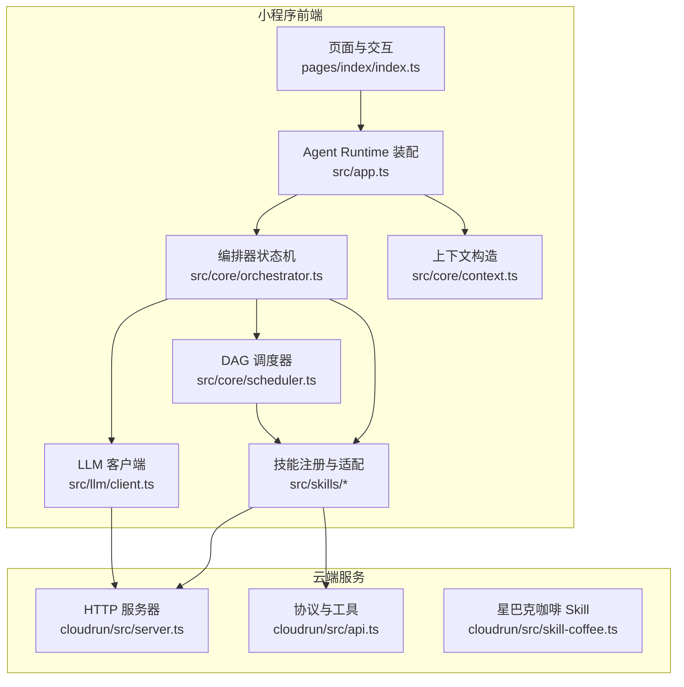
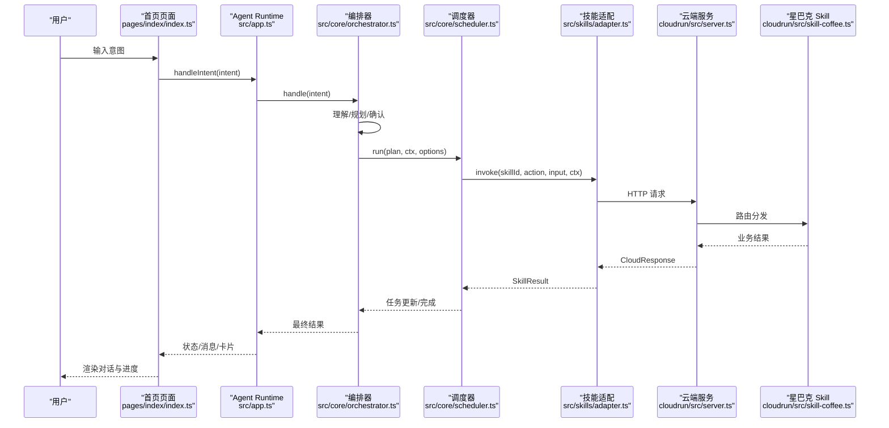
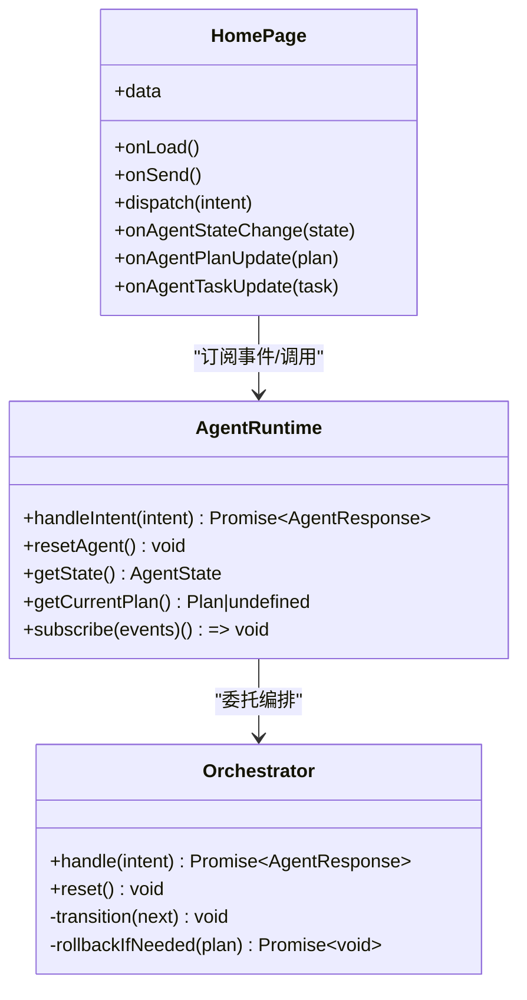
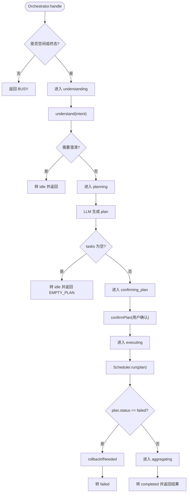
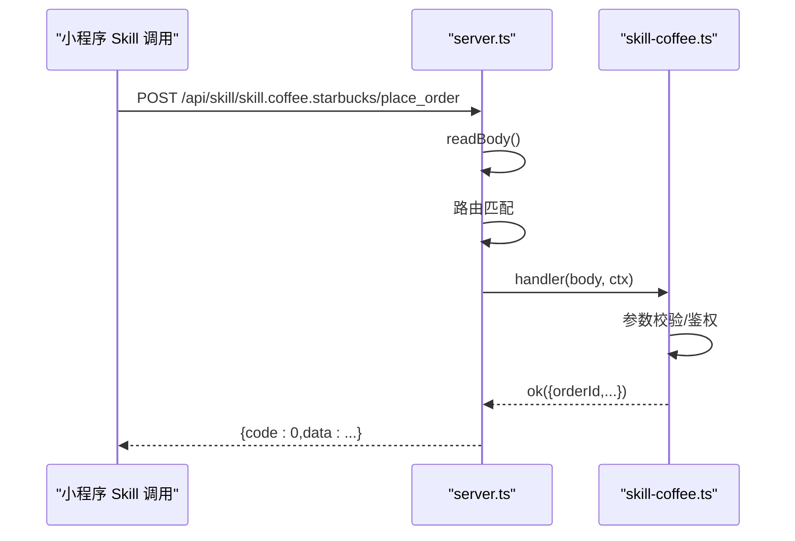
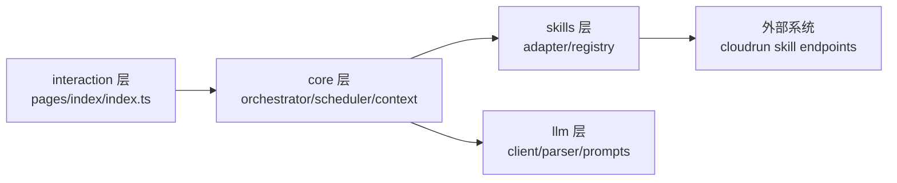

# 架构概览

<cite>
**本文引用的文件**   
- [miniprogram/app.ts](file://miniprogram/app.ts)
- [miniprogram/pages/index/index.ts](file://miniprogram/pages/index/index.ts)
- [miniprogram/src/app.ts](file://miniprogram/src/app.ts)
- [miniprogram/src/core/orchestrator.ts](file://miniprogram/src/core/orchestrator.ts)
- [miniprogram/src/core/scheduler.ts](file://miniprogram/src/core/scheduler.ts)
- [miniprogram/src/core/context.ts](file://miniprogram/src/core/context.ts)
- [miniprogram/src/llm/client.ts](file://miniprogram/src/llm/client.ts)
- [miniprogram/src/skills/adapter.ts](file://miniprogram/src/skills/adapter.ts)
- [miniprogram/src/skills/registry.ts](file://miniprogram/src/skills/registry.ts)
- [cloudrun/src/server.ts](file://cloudrun/src/server.ts)
- [cloudrun/src/api.ts](file://cloudrun/src/api.ts)
- [cloudrun/src/skill-coffee.ts](file://cloudrun/src/skill-coffee.ts)
</cite>

## 目录
1. [引言](#引言)
2. [项目结构](#项目结构)
3. [核心组件](#核心组件)
4. [架构总览](#架构总览)
5. [详细组件分析](#详细组件分析)
6. [依赖关系分析](#依赖关系分析)
7. [性能与可靠性考量](#性能与可靠性考量)
8. [故障排查指南](#故障排查指南)
9. [结论](#结论)

## 引言
本文件为 WAIC-WeChat-MiniProgram 项目的整体架构概览文档，目标是从高层视角说明小程序前端、云端服务层与外部系统之间的职责划分与协作方式，并解释状态机模式、策略模式、观察者模式、工厂模式和适配器模式在系统中的落地。文档同时给出从用户输入到任务执行的完整数据流与控制流，以及系统的扩展性与可维护性设计要点。

## 项目结构
项目采用“小程序前端 + 云端托管服务”的两端分离结构：
- 小程序前端（miniprogram）：负责用户交互、Agent Runtime 装配、状态机编排、计划调度、技能适配与 LLM 调用封装。
- 云端服务（cloudrun）：提供统一 HTTP 路由、健康检查、业务 Skill 接口（如星巴克咖啡），并以标准化 CloudResponse 协议返回结果。

图表来源
- [miniprogram/pages/index/index.ts:117-158](file://miniprogram/pages/index/index.ts#L117-L158)
- [miniprogram/src/app.ts:90-177](file://miniprogram/src/app.ts#L90-L177)
- [miniprogram/src/core/orchestrator.ts:74-256](file://miniprogram/src/core/orchestrator.ts#L74-L256)
- [miniprogram/src/core/scheduler.ts:77-128](file://miniprogram/src/core/scheduler.ts#L77-L128)
- [miniprogram/src/llm/client.ts:56-119](file://miniprogram/src/llm/client.ts#L56-L119)
- [cloudrun/src/server.ts:76-128](file://cloudrun/src/server.ts#L76-L128)
- [cloudrun/src/api.ts:10-48](file://cloudrun/src/api.ts#L10-L48)
- [cloudrun/src/skill-coffee.ts:119-123](file://cloudrun/src/skill-coffee.ts#L119-L123)

章节来源
- [miniprogram/app.ts:1-49](file://miniprogram/app.ts#L1-L49)
- [miniprogram/src/app.ts:1-39](file://miniprogram/src/app.ts#L1-L39)
- [cloudrun/src/server.ts:1-20](file://cloudrun/src/server.ts#L1-L20)

## 核心组件
- 小程序 App 入口：管理微信生命周期，懒加载 Agent Runtime，暴露全局品牌信息与运行时实例。
- Agent Runtime：装配 SKILL 注册表、云端初始化、Orchestrator 构建，对外暴露 handleIntent / resetAgent / getState / subscribe。
- Orchestrator（状态机）：定义允许的状态转移，驱动理解、规划、确认、执行、聚合、完成/失败等阶段，处理回滚与异常。
- Scheduler（DAG 调度器）：按依赖并行执行 Task，支持人类确认 checkpoint、死锁检测、级联跳过与中止。
- LLM 客户端：封装 LLM 调用、解析与降级策略，输出 Plan。
- Skills 适配与注册：统一校验、埋点、错误转换；集中注册与查询能力元信息。
- 云端服务：统一路由、健康检查、CloudResponse 协议、Skill 端点实现。

章节来源
- [miniprogram/app.ts:23-48](file://miniprogram/app.ts#L23-L48)
- [miniprogram/src/app.ts:90-177](file://miniprogram/src/app.ts#L90-L177)
- [miniprogram/src/core/orchestrator.ts:28-71](file://miniprogram/src/core/orchestrator.ts#L28-L71)
- [miniprogram/src/core/scheduler.ts:27-52](file://miniprogram/src/core/scheduler.ts#L27-L52)
- [miniprogram/src/llm/client.ts:20-25](file://miniprogram/src/llm/client.ts#L20-L25)
- [miniprogram/src/skills/adapter.ts:36-85](file://miniprogram/src/skills/adapter.ts#L36-L85)
- [miniprogram/src/skills/registry.ts:16-70](file://miniprogram/src/skills/registry.ts#L16-L70)
- [cloudrun/src/server.ts:76-128](file://cloudrun/src/server.ts#L76-L128)
- [cloudrun/src/api.ts:10-48](file://cloudrun/src/api.ts#L10-L48)

## 架构总览
三层架构设计理念与职责划分：
- 小程序前端层：负责用户交互、消息展示、事件订阅与状态映射；通过 Agent Runtime 调用 Orchestrator。
- 云端服务层：提供稳定 HTTP 接口，承载业务 Skill 逻辑，统一鉴权与错误码，返回标准 CloudResponse。
- 外部系统：由具体 Skill 对接（如星巴克门店搜索、下单、取消），当前以内存模拟数据演示。

图表来源
- [miniprogram/pages/index/index.ts:214-270](file://miniprogram/pages/index/index.ts#L214-L270)
- [miniprogram/src/app.ts:123-149](file://miniprogram/src/app.ts#L123-L149)
- [miniprogram/src/core/orchestrator.ts:106-256](file://miniprogram/src/core/orchestrator.ts#L106-L256)
- [miniprogram/src/core/scheduler.ts:77-128](file://miniprogram/src/core/scheduler.ts#L77-L128)
- [miniprogram/src/skills/adapter.ts:36-85](file://miniprogram/src/skills/adapter.ts#L36-L85)
- [cloudrun/src/server.ts:76-128](file://cloudrun/src/server.ts#L76-L128)
- [cloudrun/src/skill-coffee.ts:54-93](file://cloudrun/src/skill-coffee.ts#L54-L93)

## 详细组件分析

### 小程序前端层
- 页面与交互：首页负责消息列表、输入框、示例点击、重置、语音提示；订阅 Runtime 事件，将状态与任务进度映射到 UI。
- App 入口：仅做微信生命周期与懒加载 Runtime，避免 onLaunch 耗时过长。
- Agent Runtime：单例装配，注入 confirmPlan 与 checkpoint，转发状态/计划/任务事件给 UI。

图表来源
- [miniprogram/pages/index/index.ts:117-158](file://miniprogram/pages/index/index.ts#L117-L158)
- [miniprogram/pages/index/index.ts:214-270](file://miniprogram/pages/index/index.ts#L214-L270)
- [miniprogram/src/app.ts:123-177](file://miniprogram/src/app.ts#L123-L177)
- [miniprogram/src/core/orchestrator.ts:74-256](file://miniprogram/src/core/orchestrator.ts#L74-L256)

章节来源
- [miniprogram/app.ts:23-48](file://miniprogram/app.ts#L23-L48)
- [miniprogram/pages/index/index.ts:117-158](file://miniprogram/pages/index/index.ts#L117-L158)
- [miniprogram/src/app.ts:90-177](file://miniprogram/src/app.ts#L90-L177)

### 编排器与调度器（状态机与 DAG）
- 状态机模式：Orchestrator 明确定义允许的状态转移表，确保理解、规划、确认、执行、聚合、完成/失败等阶段的有序流转，并提供 reset 强制归位。
- 策略模式：confirmPlan 与 checkpoint 回调由上层注入，使 UI 交互策略可替换（测试可用 autoConfirm/autoApproveCheckpoint）。
- 观察者模式：Runtime 持有 listeners Set，将 Orchestrator 的 onStateChange/onTaskUpdate/onPlanUpdate 广播给所有订阅者（页面）。
- 工厂模式：createAgentRuntime 作为工厂，保证单例与幂等初始化；handleOnce 提供一次性会话工厂。
- 适配器模式：skills/adapter 统一校验、埋点、错误转换，屏蔽底层 Skill 差异。

图表来源
- [miniprogram/src/core/orchestrator.ts:106-256](file://miniprogram/src/core/orchestrator.ts#L106-L256)
- [miniprogram/src/core/orchestrator.ts:278-303](file://miniprogram/src/core/orchestrator.ts#L278-L303)
- [miniprogram/src/core/scheduler.ts:77-128](file://miniprogram/src/core/scheduler.ts#L77-L128)

章节来源
- [miniprogram/src/core/orchestrator.ts:28-71](file://miniprogram/src/core/orchestrator.ts#L28-L71)
- [miniprogram/src/core/orchestrator.ts:106-256](file://miniprogram/src/core/orchestrator.ts#L106-L256)
- [miniprogram/src/core/scheduler.ts:77-128](file://miniprogram/src/core/scheduler.ts#L77-L128)

### 云端服务层
- server.ts：监听端口、解析 JSON body、路由分发、健康检查、统一响应格式。
- api.ts：定义 CloudResponse、RequestContext、HandlerResult 及 ok/fail/badRequest/unauthorized/forbidden 工具函数。
- skill-coffee.ts：实现星巴克门店搜索、下单、取消接口，包含参数校验、归属鉴权与 IDOR 防护。

图表来源
- [cloudrun/src/server.ts:76-128](file://cloudrun/src/server.ts#L76-L128)
- [cloudrun/src/api.ts:10-48](file://cloudrun/src/api.ts#L10-L48)
- [cloudrun/src/skill-coffee.ts:54-93](file://cloudrun/src/skill-coffee.ts#L54-L93)

章节来源
- [cloudrun/src/server.ts:1-20](file://cloudrun/src/server.ts#L1-L20)
- [cloudrun/src/server.ts:76-128](file://cloudrun/src/server.ts#L76-L128)
- [cloudrun/src/api.ts:10-48](file://cloudrun/src/api.ts#L10-L48)
- [cloudrun/src/skill-coffee.ts:119-123](file://cloudrun/src/skill-coffee.ts#L119-L123)

## 依赖关系分析
依赖方向遵循“interaction → core → skills → llm”的单向不可逆原则：
- 页面与交互不直接 import core 内部，而是通过 getApp().globalData.agent 访问 Runtime。
- core 层不反向依赖 interaction，仅通过 types/checkpoint 注入回调。
- llm 层不反向依赖 skills，availableSkills 由 core 传入 slim 元信息。
- skills 层通过 adapter 统一调用，不直接耦合 wx.* 或外部网络细节。

图表来源
- [miniprogram/pages/index/index.ts:117-158](file://miniprogram/pages/index/index.ts#L117-L158)
- [miniprogram/src/core/orchestrator.ts:13-26](file://miniprogram/src/core/orchestrator.ts#L13-L26)
- [miniprogram/src/llm/client.ts:56-82](file://miniprogram/src/llm/client.ts#L56-L82)
- [miniprogram/src/skills/adapter.ts:36-85](file://miniprogram/src/skills/adapter.ts#L36-L85)

章节来源
- [miniprogram/src/app.ts:18-39](file://miniprogram/src/app.ts#L18-L39)
- [miniprogram/src/core/orchestrator.ts:13-26](file://miniprogram/src/core/orchestrator.ts#L13-L26)
- [miniprogram/src/llm/client.ts:56-82](file://miniprogram/src/llm/client.ts#L56-L82)
- [miniprogram/src/skills/adapter.ts:36-85](file://miniprogram/src/skills/adapter.ts#L36-L85)

## 性能与可靠性考量
- 启动性能：App.onLaunch 保持轻量，Agent Runtime 懒加载，避免首屏阻塞。
- 并发安全：Orchestrator 使用 runToken 令牌防止 reset 后旧流程继续；Scheduler 通过 isRunActive 探測中止。
- 用户体验：checkpoint 序列化互斥链避免多个弹窗互相覆盖；任务级联跳过保证依赖一致性。
- 降级策略：LLM 调用失败时开发环境自动降级到本地规则规划器，保证全链路可演示。
- 错误分类：PlannerLLMError、SchedulerDeadlockError、SkillError 等细粒度错误便于定位与重试策略。

章节来源
- [miniprogram/app.ts:23-48](file://miniprogram/app.ts#L23-L48)
- [miniprogram/src/core/orchestrator.ts:116-118](file://miniprogram/src/core/orchestrator.ts#L116-L118)
- [miniprogram/src/core/scheduler.ts:54-74](file://miniprogram/src/core/scheduler.ts#L54-L74)
- [miniprogram/src/llm/client.ts:37-45](file://miniprogram/src/llm/client.ts#L37-L45)

## 故障排查指南
- 页面未显示状态变化：检查页面是否正确订阅 onStateChange/onPlanUpdate/onTaskUpdate，并在 onUnload 中退订。
- 任务卡死：查看 Scheduler 是否抛出 SchedulerDeadlockError，检查依赖图是否存在环或上游未成功。
- LLM 不可用：确认云端 LLM_BASE_URL/KEY 配置；开发环境会降级到本地规则规划器，生产环境应报错。
- 权限问题：云端写操作需携带 x-wx-openid，否则返回 unauthorized；IDOR 防护会拒绝他人资源操作。
- 重置导致中断：Orchestrator.reset 会使 in-flight 任务失效，注意日志中的 RUN_RESET 与 skipped 标记。

章节来源
- [miniprogram/pages/index/index.ts:141-158](file://miniprogram/pages/index/index.ts#L141-L158)
- [miniprogram/src/core/scheduler.ts:102-114](file://miniprogram/src/core/scheduler.ts#L102-L114)
- [miniprogram/src/llm/client.ts:83-99](file://miniprogram/src/llm/client.ts#L83-L99)
- [cloudrun/src/skill-coffee.ts:67-70](file://cloudrun/src/skill-coffee.ts#L67-L70)
- [miniprogram/src/core/orchestrator.ts:186-199](file://miniprogram/src/core/orchestrator.ts#L186-L199)

## 结论
本项目通过清晰的三层架构与多种设计模式的组合，实现了从用户意图到任务执行的端到端自动化流程。状态机确保流程可控，调度器保障任务正确执行，适配器与注册中心提升扩展性，云端服务提供稳定的业务能力。系统在启动性能、并发安全、降级策略与错误分类方面做了充分考量，具备良好的可维护性与可扩展性。未来可在 NLU、支付集成、持久化存储等方面进一步演进。