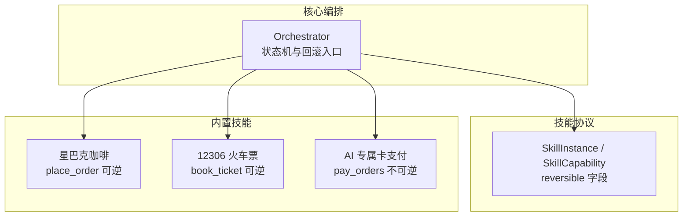
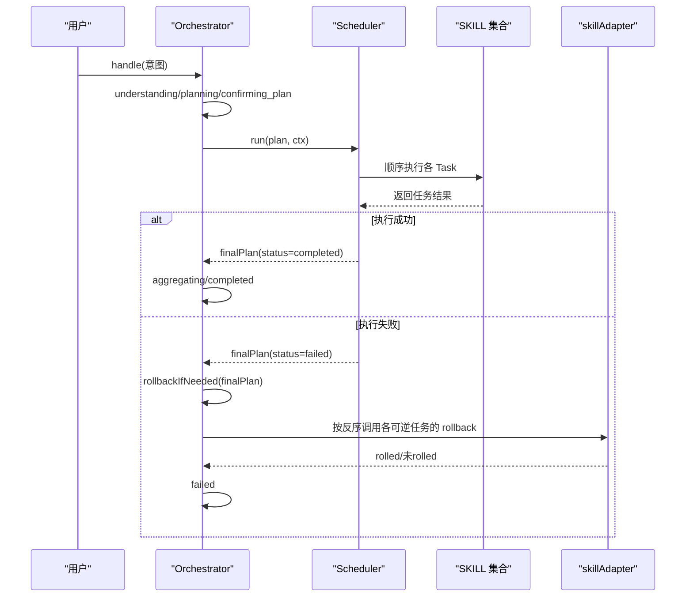
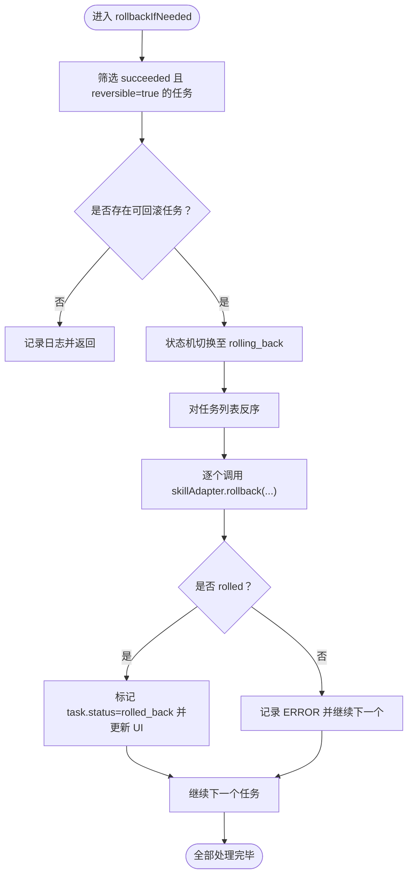
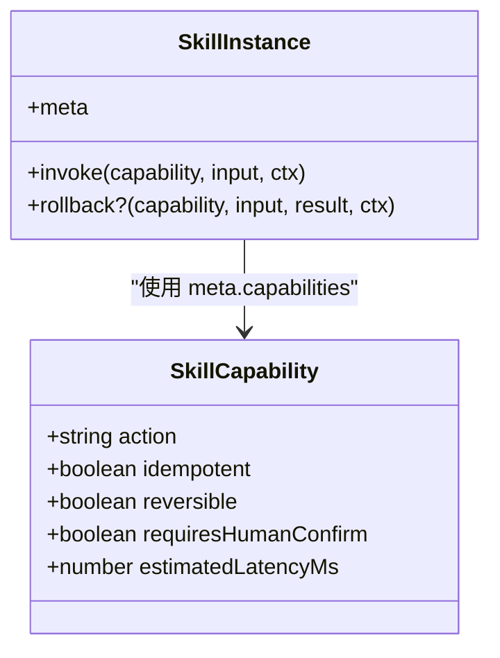
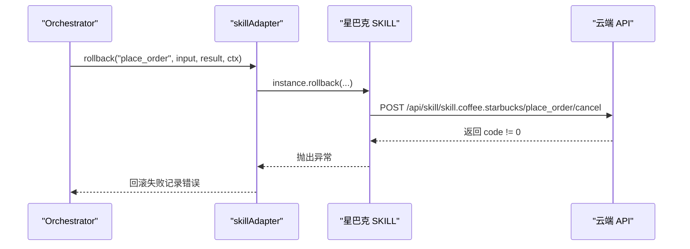
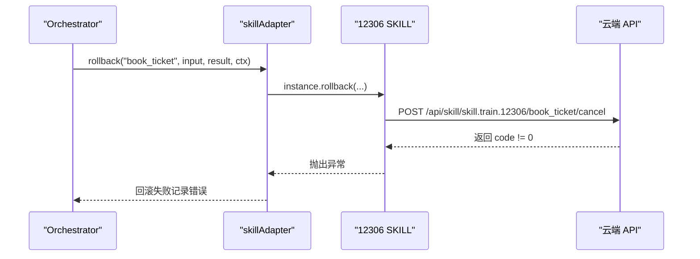
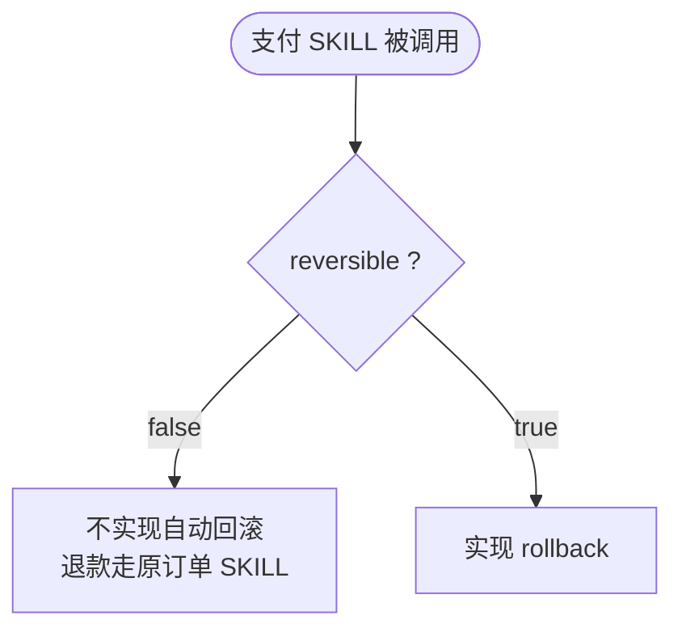
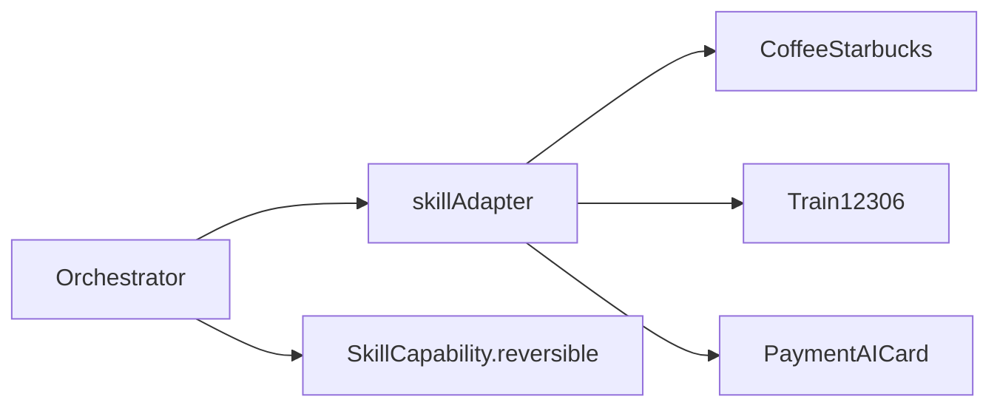

# 事务一致性

<cite>
**本文引用的文件**   
- [orchestrator.ts](file://miniprogram/src/core/orchestrator.ts)
- [skill.d.ts](file://miniprogram/src/types/skill.d.ts)
- [coffee-starbucks/index.ts](file://miniprogram/src/skills/builtin/coffee-starbucks/index.ts)
- [payment-aicard/index.ts](file://miniprogram/src/skills/builtin/payment-aicard/index.ts)
- [train-12306/index.ts](file://miniprogram/src/skills/builtin/train-12306/index.ts)
</cite>

## 目录
1. [引言](#引言)
2. [项目结构](#项目结构)
3. [核心组件](#核心组件)
4. [架构总览](#架构总览)
5. [详细组件分析](#详细组件分析)
6. [依赖关系分析](#依赖关系分析)
7. [性能与健壮性](#性能与健壮性)
8. [故障排查指南](#故障排查指南)
9. [结论](#结论)
10. [附录：回滚示例与最佳实践](#附录回滚示例与最佳实践)

## 引言
本文聚焦 WAIC-WeChat-MiniProgram 项目中的“事务一致性”能力，重点解释 Orchestrator 的失败回滚机制，尤其是 rollbackIfNeeded 的实现原理、reversible 能力的声明方式、反序撤销策略的原因、部分回滚失败的处理策略，以及面向业务的可逆操作设计原则与最佳实践。读者无需深入源码即可理解整体流程，同时提供精确的文件与行号引用，便于进一步定位实现细节。

## 项目结构
围绕事务一致性的关键代码分布在以下位置：
- 编排器与状态机：miniprogram/src/core/orchestrator.ts
- SKILL 协议与可逆能力类型：miniprogram/src/types/skill.d.ts
- 星巴克咖啡技能（含可逆下单）：miniprogram/src/skills/builtin/coffee-starbucks/index.ts
- 火车票技能（含可逆购票）：miniprogram/src/skills/builtin/train-12306/index.ts
- AI 专属卡支付技能（不可逆，退款走原订单技能）：miniprogram/src/skills/builtin/payment-aicard/index.ts

图表来源
- [orchestrator.ts:272-303](file://miniprogram/src/core/orchestrator.ts#L272-L303)
- [skill.d.ts:37-58](file://miniprogram/src/types/skill.d.ts#L37-L58)
- [coffee-starbucks/index.ts:107-145](file://miniprogram/src/skills/builtin/coffee-starbucks/index.ts#L107-L145)
- [train-12306/index.ts:126-156](file://miniprogram/src/skills/builtin/train-12306/index.ts#L126-L156)
- [payment-aicard/index.ts:48-86](file://miniprogram/src/skills/builtin/payment-aicard/index.ts#L48-L86)

章节来源
- [orchestrator.ts:1-340](file://miniprogram/src/core/orchestrator.ts#L1-L340)
- [skill.d.ts:1-119](file://miniprogram/src/types/skill.d.ts#L1-L119)

## 核心组件
- Orchestrator：负责理解意图、生成 Plan、调度执行、结果聚合与失败回滚；维护状态机并在失败时触发回滚。
- SkillInstance/SkillCapability：定义每个技能的对外能力元信息，包括 idempotent、reversible、requiresHumanConfirm 等属性；reversible=true 时必须实现 rollback。
- 内置技能：
  - 星巴克咖啡：search_store（只读）、place_order（下单，可逆）。
  - 12306 火车票：search_train（只读）、book_ticket（购票，可逆）。
  - AI 专属卡支付：pay_orders（合并支付，不可逆；退款需走原订单技能）。

章节来源
- [orchestrator.ts:73-89](file://miniprogram/src/core/orchestrator.ts#L73-L89)
- [skill.d.ts:37-104](file://miniprogram/src/types/skill.d.ts#L37-L104)
- [coffee-starbucks/index.ts:58-146](file://miniprogram/src/skills/builtin/coffee-starbucks/index.ts#L58-L146)
- [train-12306/index.ts:69-157](file://miniprogram/src/skills/builtin/train-12306/index.ts#L69-L157)
- [payment-aicard/index.ts:37-87](file://miniprogram/src/skills/builtin/payment-aicard/index.ts#L37-L87)

## 架构总览
下图展示一次包含多个写操作的典型事务流程，以及失败时的回滚路径。

图表来源
- [orchestrator.ts:106-256](file://miniprogram/src/core/orchestrator.ts#L106-L256)
- [orchestrator.ts:272-303](file://miniprogram/src/core/orchestrator.ts#L272-L303)

## 详细组件分析

### Orchestrator 与 rollbackIfNeeded
- 触发时机：
  - 执行阶段失败：finalPlan.status === 'failed' 时调用回滚。
  - 异常分支：当捕获到特定异常（如死锁）且存在当前 Plan 时，先回滚再进入 failed。
- 筛选条件：仅对 status='succeeded' 且 capability.reversible===true 的任务进行回滚。
- 执行顺序：对目标任务列表 reverse()，采用“后完成先撤销”的反序策略。
- 状态机：回滚期间切换到 rolling_back 状态，完成后由调用方转入 failed。
- 单点失败处理：单个任务回滚失败仅记录错误并继续其余任务，不中断整体回滚。

图表来源
- [orchestrator.ts:272-303](file://miniprogram/src/core/orchestrator.ts#L272-L303)

章节来源
- [orchestrator.ts:175-213](file://miniprogram/src/core/orchestrator.ts#L175-L213)
- [orchestrator.ts:222-256](file://miniprogram/src/core/orchestrator.ts#L222-L256)
- [orchestrator.ts:272-303](file://miniprogram/src/core/orchestrator.ts#L272-L303)

### reversible 能力声明与约束
- SkillCapability 中通过 reversible 布尔值声明某项能力是否支持回滚。
- 若 reversible=true，则 SkillInstance 必须实现 rollback(capability, input, result, ctx)。
- 该约束在类型注释中明确：未实现将抛出错误。

图表来源
- [skill.d.ts:37-58](file://miniprogram/src/types/skill.d.ts#L37-L58)
- [skill.d.ts:85-104](file://miniprogram/src/types/skill.d.ts#L85-L104)

章节来源
- [skill.d.ts:37-58](file://miniprogram/src/types/skill.d.ts#L37-L58)
- [skill.d.ts:85-104](file://miniprogram/src/types/skill.d.ts#L85-L104)

### 星巴克咖啡技能：place_order 的回滚逻辑
- 能力声明：
  - place_order：idempotent=false，reversible=true，requiresHumanConfirm=true。
- 回滚实现：
  - 调用云端取消接口，传入 orderId 与 sessionId。
  - 若云端返回失败，记录错误并抛出异常，使上层感知回滚失败。

图表来源
- [coffee-starbucks/index.ts:107-145](file://miniprogram/src/skills/builtin/coffee-starbucks/index.ts#L107-L145)
- [coffee-starbucks/index.ts:163-176](file://miniprogram/src/skills/builtin/coffee-starbucks/index.ts#L163-L176)

章节来源
- [coffee-starbucks/index.ts:58-146](file://miniprogram/src/skills/builtin/coffee-starbucks/index.ts#L58-L146)
- [coffee-starbucks/index.ts:163-176](file://miniprogram/src/skills/builtin/coffee-starbucks/index.ts#L163-L176)

### 12306 火车票技能：book_ticket 的回滚逻辑
- 能力声明：
  - book_ticket：idempotent=false，reversible=true，requiresHumanConfirm=true。
- 回滚实现：
  - 调用云端取消接口，传入 orderId 与原始 input。
  - 若云端返回失败，记录错误并抛出异常。

图表来源
- [train-12306/index.ts:126-156](file://miniprogram/src/skills/builtin/train-12306/index.ts#L126-L156)
- [train-12306/index.ts:174-189](file://miniprogram/src/skills/builtin/train-12306/index.ts#L174-L189)

章节来源
- [train-12306/index.ts:69-157](file://miniprogram/src/skills/builtin/train-12306/index.ts#L69-L157)
- [train-12306/index.ts:174-189](file://miniprogram/src/skills/builtin/train-12306/index.ts#L174-L189)

### AI 专属卡支付技能：pay_orders 的不可逆设计
- 能力声明：
  - pay_orders：idempotent=false，reversible=false，requiresHumanConfirm=true。
- 回滚实现：
  - 不提供自动回滚；若发生退款需求，应走原订单 SKILL 的取消/退款能力。
- 设计理由：
  - 支付作为闭环枢纽，不应承担退款语义；退款属于原交易侧的业务。

图表来源
- [payment-aicard/index.ts:48-86](file://miniprogram/src/skills/builtin/payment-aicard/index.ts#L48-L86)
- [payment-aicard/index.ts:143-146](file://miniprogram/src/skills/builtin/payment-aicard/index.ts#L143-L146)

章节来源
- [payment-aicard/index.ts:37-87](file://miniprogram/src/skills/builtin/payment-aicard/index.ts#L37-L87)
- [payment-aicard/index.ts:143-146](file://miniprogram/src/skills/builtin/payment-aicard/index.ts#L143-L146)

## 依赖关系分析
- Orchestrator 依赖 skillAdapter 以统一调用各 SKILL 的 invoke/rollback。
- SkillCapability 的 reversible 字段决定 Orchestrator 是否选择该任务进行回滚。
- 各内置 SKILL 通过 SkillInstance 暴露 invoke 与可选 rollback，遵循统一协议。

图表来源
- [orchestrator.ts:13-20](file://miniprogram/src/core/orchestrator.ts#L13-L20)
- [skill.d.ts:37-58](file://miniprogram/src/types/skill.d.ts#L37-L58)
- [coffee-starbucks/index.ts:148-177](file://miniprogram/src/skills/builtin/coffee-starbucks/index.ts#L148-L177)
- [train-12306/index.ts:159-190](file://miniprogram/src/skills/builtin/train-12306/index.ts#L159-L190)
- [payment-aicard/index.ts:89-147](file://miniprogram/src/skills/builtin/payment-aicard/index.ts#L89-L147)

章节来源
- [orchestrator.ts:13-20](file://miniprogram/src/core/orchestrator.ts#L13-L20)
- [skill.d.ts:37-58](file://miniprogram/src/types/skill.d.ts#L37-L58)

## 性能与健壮性
- 反序撤销的性能影响：
  - 仅对已成功的可逆任务进行过滤与反转，时间复杂度为 O(n)，空间复杂度为 O(k)（k 为可回滚任务数），开销可控。
- 健壮性保障：
  - 单任务回滚失败不中断整体回滚，保证最大程度的补偿一致性。
  - 状态机在回滚期间切换到 rolling_back，避免并发干扰与 UI 不一致。
  - 通过 onTaskUpdate 实时推送任务状态变更，便于前端反馈与审计。

[本节为通用指导，不直接分析具体文件]

## 故障排查指南
- 常见问题与定位要点：
  - 未声明 reversible 但需要回滚：检查 SkillCapability.reversible 是否为 true，并确保实现 rollback。
  - 回滚未生效：确认任务状态为 succeeded 且 capability.reversible===true。
  - 回滚失败：查看日志中“回滚失败”的错误码与原因，定位云端接口或业务校验失败。
  - 支付不可逆：确认支付 SKILL 的 reversible=false，退款需走原订单 SKILL。
- 建议的排查步骤：
  - 在 Orchestrator 的 onTaskUpdate 回调中打印任务状态变化，观察 rolled_back 是否出现。
  - 在各 SKILL 的 rollback 实现中加入详细日志，记录输入参数与云端响应。
  - 针对云端接口失败，结合重试策略与幂等键，确保补偿操作的可靠性。

章节来源
- [orchestrator.ts:272-303](file://miniprogram/src/core/orchestrator.ts#L272-L303)
- [coffee-starbucks/index.ts:163-176](file://miniprogram/src/skills/builtin/coffee-starbucks/index.ts#L163-L176)
- [train-12306/index.ts:174-189](file://miniprogram/src/skills/builtin/train-12306/index.ts#L174-L189)
- [payment-aicard/index.ts:143-146](file://miniprogram/src/skills/builtin/payment-aicard/index.ts#L143-L146)

## 结论
本项目通过 Orchestrator 的状态机与 skillAdapter 的统一协议，实现了基于 reversible 声明的事务一致性保障。失败时按反序撤销已成功且可逆的任务，单点失败不影响整体回滚，从而最大化补偿一致性。支付类操作采用不可逆设计，退款交由原订单 SKILL 处理，符合职责分离与最小权限原则。建议在新增 SKILL 时严格遵循 reversible 与 requiresHumanConfirm 的规范，确保写操作具备人类确认与可补偿能力。

[本节为总结性内容，不直接分析具体文件]

## 附录：回滚示例与最佳实践

### 示例一：咖啡下单失败后的回滚
- 场景：用户下咖啡订单成功后，后续支付失败。
- 回滚动作：调用星巴克 SKILL 的 cancel 接口取消订单。
- 关键点：
  - place_order 的 reversible=true，因此会被纳入回滚目标。
  - 云端接口失败会抛出异常，上层记录错误并继续其他任务回滚。

章节来源
- [coffee-starbucks/index.ts:107-145](file://miniprogram/src/skills/builtin/coffee-starbucks/index.ts#L107-L145)
- [coffee-starbucks/index.ts:163-176](file://miniprogram/src/skills/builtin/coffee-starbucks/index.ts#L163-L176)

### 示例二：火车票购票失败后的回滚
- 场景：用户购票成功后，后续支付失败。
- 回滚动作：调用 12306 SKILL 的 cancel 接口取消订单。
- 关键点：
  - book_ticket 的 reversible=true，纳入回滚目标。
  - 云端接口失败会抛出异常，上层记录错误并继续其他任务回滚。

章节来源
- [train-12306/index.ts:126-156](file://miniprogram/src/skills/builtin/train-12306/index.ts#L126-L156)
- [train-12306/index.ts:174-189](file://miniprogram/src/skills/builtin/train-12306/index.ts#L174-L189)

### 示例三：支付不可逆的设计
- 场景：合并支付失败或用户取消支付。
- 处理方式：支付 SKILL 不实现自动回滚；如需退款，走原订单 SKILL 的取消/退款能力。
- 关键点：
  - pay_orders 的 reversible=false，不会被 Orchestrator 自动回滚。
  - 退款语义归属原订单 SKILL，保持职责清晰。

章节来源
- [payment-aicard/index.ts:48-86](file://miniprogram/src/skills/builtin/payment-aicard/index.ts#L48-L86)
- [payment-aicard/index.ts:143-146](file://miniprogram/src/skills/builtin/payment-aicard/index.ts#L143-L146)

### 最佳实践清单
- 明确声明：
  - 所有写操作必须设置 requiresHumanConfirm=true。
  - 能安全补偿的操作才设置 reversible=true，否则设为 false。
- 回滚实现：
  - 在 rollback 中尽量幂等，避免重复取消造成副作用。
  - 对云端接口失败进行详细日志记录，必要时抛错以便上层感知。
- 编排与状态：
  - 利用 Orchestrator 的状态机与 onTaskUpdate 反馈回滚进度。
  - 在异常分支优先回滚再进入 failed，保证数据一致性。
- 设计原则：
  - 反序撤销，确保“后完成的先撤销”，与执行顺序对称。
  - 单一任务回滚失败不中断整体回滚，提升健壮性。
  - 支付与退款职责分离，支付不可逆，退款走原订单 SKILL。

[本节为通用指导，不直接分析具体文件]