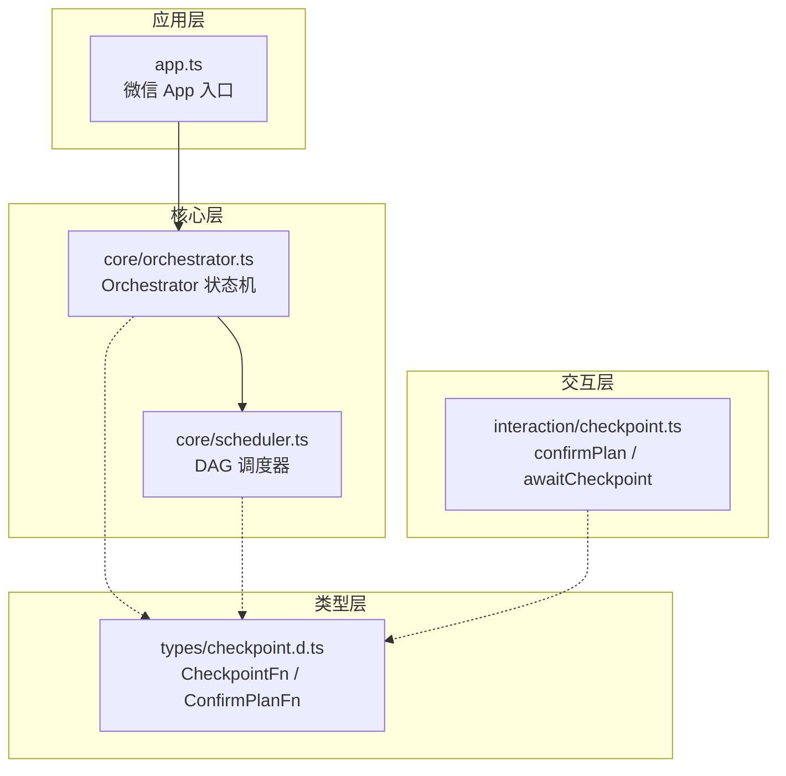
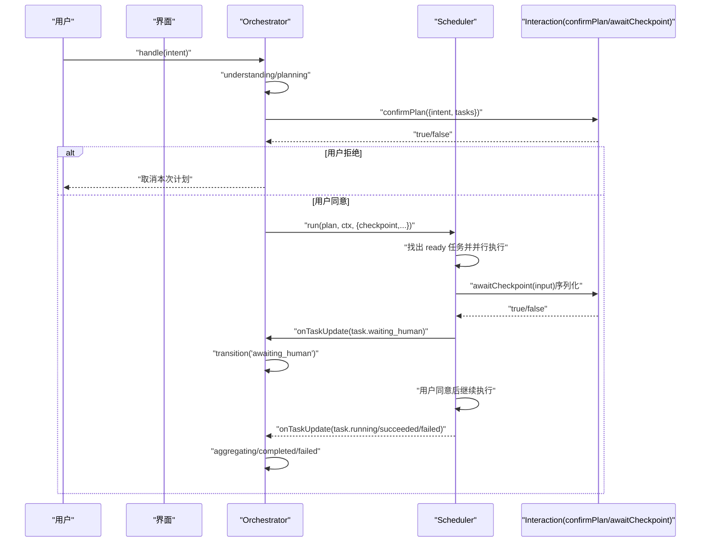
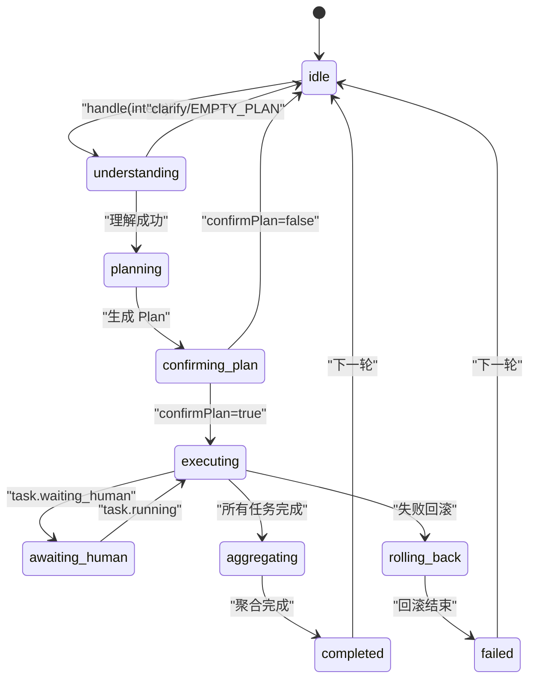
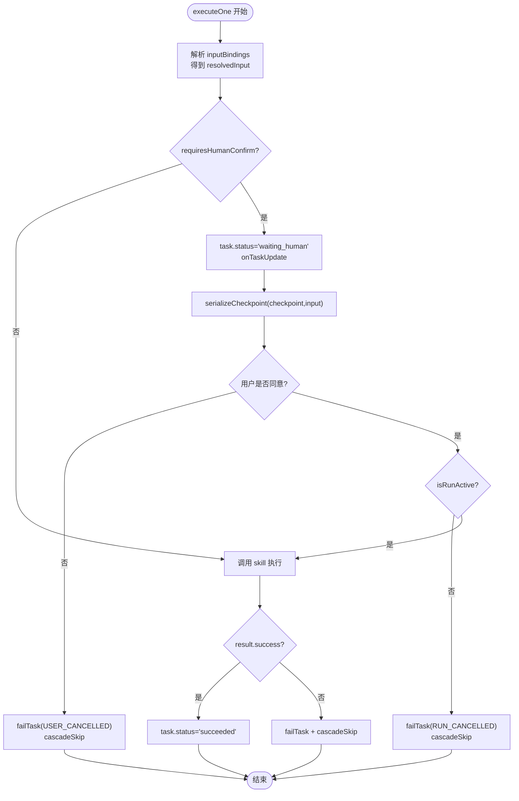
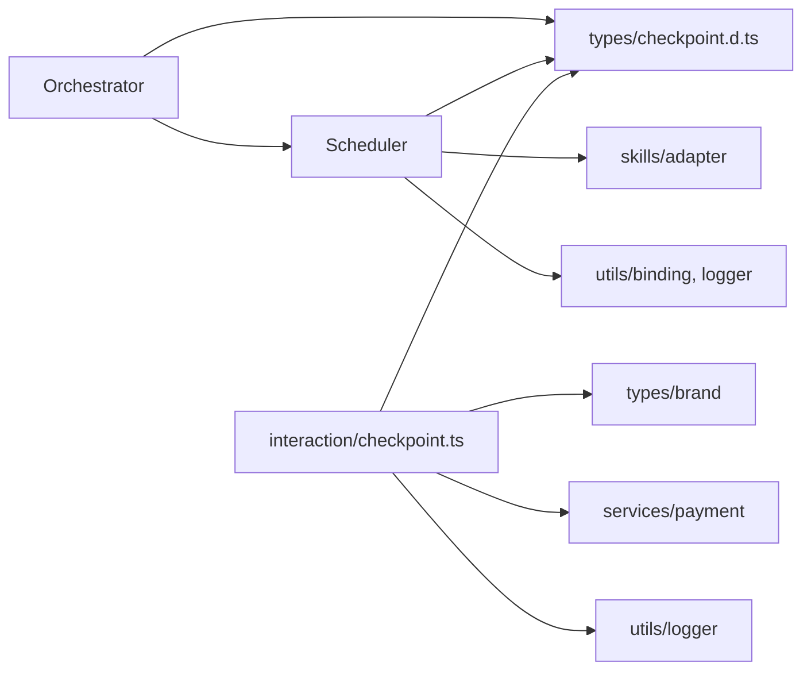

# 人机协作确认

<cite>
**本文引用的文件**   
- [miniprogram/src/interaction/checkpoint.ts](file://miniprogram/src/interaction/checkpoint.ts)
- [miniprogram/src/types/checkpoint.d.ts](file://miniprogram/src/types/checkpoint.d.ts)
- [miniprogram/src/core/orchestrator.ts](file://miniprogram/src/core/orchestrator.ts)
- [miniprogram/src/core/scheduler.ts](file://miniprogram/src/core/scheduler.ts)
- [miniprogram/src/types/agent-state.d.ts](file://miniprogram/src/types/agent-state.d.ts)
- [miniprogram/app.ts](file://miniprogram/app.ts)
</cite>

## 目录
1. [引言](#引言)
2. [项目结构](#项目结构)
3. [核心组件](#核心组件)
4. [架构总览](#架构总览)
5. [详细组件分析](#详细组件分析)
6. [依赖关系分析](#依赖关系分析)
7. [性能与并发特性](#性能与并发特性)
8. [故障排查指南](#故障排查指南)
9. [结论](#结论)
10. [附录：确认对话框设计示例](#附录确认对话框设计示例)

## 引言
本文件聚焦 WAIC-WeChat-MiniProgram 项目中“人机协作确认”机制，重点说明 Checkpoint 机制的实现原理、关键操作的确认流程与用户授权机制；解释 ConfirmPlanFn 与 CheckpointFn 回调的工作方式；说明 awaiting_human 状态的管理、UI 交互流程与状态同步；并提供确认对话框实现示例、自动批准机制的配置与使用场景，以及测试环境中的简化处理方式。

Checkpoint 机制的核心目标是：在计划执行前进行整体确认，在执行写操作前进行单步确认，确保人类用户在关键路径上拥有最终决定权，同时保证 UI 状态与后台调度一致、并发安全。

## 项目结构
人机协作确认涉及以下关键模块：
- 类型定义层：checkpoint 协议类型（CheckpointInput、ConfirmPlanInput、CheckpointFn、ConfirmPlanFn）
- 交互实现层：基于 wx.showModal 的确认对话框（confirmPlan、awaitCheckpoint）
- 编排层：Orchestrator 状态机（包含 confirming_plan、executing、awaiting_human 等状态）
- 调度层：Scheduler DAG 调度器（任务就绪检测、并行执行、死锁检测、checkpoint 序列化）
- 应用入口：App 生命周期与 Agent Runtime 懒加载

**图表来源**
- [miniprogram/src/interaction/checkpoint.ts:1-122](file://miniprogram/src/interaction/checkpoint.ts#L1-L122)
- [miniprogram/src/types/checkpoint.d.ts:1-44](file://miniprogram/src/types/checkpoint.d.ts#L1-L44)
- [miniprogram/src/core/orchestrator.ts:28-48](file://miniprogram/src/core/orchestrator.ts#L28-L48)
- [miniprogram/src/core/scheduler.ts:27-44](file://miniprogram/src/core/scheduler.ts#L27-L44)
- [miniprogram/app.ts:23-48](file://miniprogram/app.ts#L23-L48)

**章节来源**
- [miniprogram/src/types/checkpoint.d.ts:1-44](file://miniprogram/src/types/checkpoint.d.ts#L1-L44)
- [miniprogram/src/interaction/checkpoint.ts:1-122](file://miniprogram/src/interaction/checkpoint.ts#L1-L122)
- [miniprogram/src/core/orchestrator.ts:28-48](file://miniprogram/src/core/orchestrator.ts#L28-L48)
- [miniprogram/src/core/scheduler.ts:27-44](file://miniprogram/src/core/scheduler.ts#L27-L44)
- [miniprogram/app.ts:23-48](file://miniprogram/app.ts#L23-L48)

## 核心组件
- 类型协议：CheckpointInput、ConfirmPlanInput、CheckpointFn、ConfirmPlanFn
- 交互实现：confirmPlan（计划级确认）、awaitCheckpoint（单步写操作确认）
- 编排器：Orchestrator（状态机，管理 confirming_plan → executing → awaiting_human → aggregating → completed/failed）
- 调度器：Scheduler（DAG 调度、任务并行、checkpoint 序列化、死锁检测）

这些组件通过依赖注入解耦：core 层仅依赖类型声明，交互层由上层组装时注入具体实现。

**章节来源**
- [miniprogram/src/types/checkpoint.d.ts:17-44](file://miniprogram/src/types/checkpoint.d.ts#L17-L44)
- [miniprogram/src/interaction/checkpoint.ts:48-122](file://miniprogram/src/interaction/checkpoint.ts#L48-L122)
- [miniprogram/src/core/orchestrator.ts:28-48](file://miniprogram/src/core/orchestrator.ts#L28-L48)
- [miniprogram/src/core/scheduler.ts:27-44](file://miniprogram/src/core/scheduler.ts#L27-L44)

## 架构总览
人机协作确认的整体流程如下：
1. Orchestrator.handle(intent) 进入理解与规划阶段，生成 Plan。
2. 进入 confirming_plan 状态，调用 confirmPlan 回调展示计划摘要并请求用户确认。
3. 若用户拒绝，回到 idle；若同意，进入 executing 状态并开始调度任务。
4. 对 requiresHumanConfirm 的任务，Scheduler 将任务标记为 waiting_human，并通过 checkpoint 序列化互斥锁串行弹出确认框。
5. Orchestrator 监听任务更新，当 task.status === 'waiting_human' 且当前状态为 executing 时，转移到 awaiting_human。
6. 用户确认后，任务继续执行；完成后聚合结果并进入 completed；失败则回滚并进入 failed。

**图表来源**
- [miniprogram/src/core/orchestrator.ts:106-221](file://miniprogram/src/core/orchestrator.ts#L106-L221)
- [miniprogram/src/core/scheduler.ts:77-127](file://miniprogram/src/core/scheduler.ts#L77-L127)
- [miniprogram/src/interaction/checkpoint.ts:48-122](file://miniprogram/src/interaction/checkpoint.ts#L48-L122)

## 详细组件分析

### Checkpoint 类型协议
- CheckpointInput：包含待确认任务、能力元数据、解析后的最终入参、Agent 上下文。
- ConfirmPlanInput：包含原始意图、全部任务、Agent 上下文。
- CheckpointFn：返回 Promise<boolean>，true 表示用户同意执行。
- ConfirmPlanFn：返回 Promise<boolean>，true 表示用户同意执行整个计划。

类型下沉到 types/checkpoint.d.ts，以便 core 层与 interaction 层共享协议而不产生反向依赖。

**章节来源**
- [miniprogram/src/types/checkpoint.d.ts:17-44](file://miniprogram/src/types/checkpoint.d.ts#L17-L44)

### 交互实现：confirmPlan 与 awaitCheckpoint
- confirmPlan：汇总意图与各任务摘要（含依赖信息），通过 wx.showModal 显示“确认执行计划”，按钮文案为“执行/取消”。
- awaitCheckpoint：展示任务摘要、类型（写操作不可逆或读操作）、明细（金额感知格式化或 JSON 截断），通过 wx.showModal 显示“需要您确认”，按钮文案为“同意/拒绝”。
- showWxModal：封装 wx.showModal，若无 API 则降级为默认拒绝（测试用 fallback）。

金额明细格式化逻辑会识别第一个元素包含 amountCent 的数组作为订单明细，逐项展示“品名 × 数量 = 金额”并汇总合计，避免 pretty-print JSON 被截断导致金额不可见。

**章节来源**
- [miniprogram/src/interaction/checkpoint.ts:48-122](file://miniprogram/src/interaction/checkpoint.ts#L48-L122)

### Orchestrator 状态机与 awaiting_human 管理
- 允许的状态转移包括：idle → understanding → planning → confirming_plan → executing → awaiting_human → aggregating → completed/failed，以及 rolling_back。
- handle(intent) 中：
  - 理解与规划后进入 confirming_plan，调用 confirmPlan；拒绝则回到 idle。
  - 成功后进入 executing，调用 runScheduler；任务等待人类确认时，通过 onTaskUpdate 联动转移到 awaiting_human。
  - 执行完成进入 aggregating，然后 completed；失败则回滚并进入 failed。
- reset()：强制归位 idle，递增 runToken 使在途 Scheduler 与 checkpoint 失效，防止并发双跑与交错弹窗。
- rollbackIfNeeded：按反序撤销已成功且可逆的任务，单个回滚失败不中断整体回滚。

**图表来源**
- [miniprogram/src/core/orchestrator.ts:60-71](file://miniprogram/src/core/orchestrator.ts#L60-L71)
- [miniprogram/src/core/orchestrator.ts:106-221](file://miniprogram/src/core/orchestrator.ts#L106-L221)
- [miniprogram/src/core/orchestrator.ts:258-328](file://miniprogram/src/core/orchestrator.ts#L258-L328)

**章节来源**
- [miniprogram/src/core/orchestrator.ts:60-71](file://miniprogram/src/core/orchestrator.ts#L60-L71)
- [miniprogram/src/core/orchestrator.ts:106-221](file://miniprogram/src/core/orchestrator.ts#L106-L221)
- [miniprogram/src/core/orchestrator.ts:258-328](file://miniprogram/src/core/orchestrator.ts#L258-L328)
- [miniprogram/src/types/agent-state.d.ts:7-17](file://miniprogram/src/types/agent-state.d.ts#L7-L17)

### Scheduler 调度与 checkpoint 序列化
- run(plan, ctx, options)：每轮找出依赖已满足且 pending 的任务，并行执行；死锁检测：若仍有 pending 但无 running/waiting_human，抛出死锁错误。
- executeOne(task,...)：
  - 解析 inputBindings 得到 resolvedInput，写入 task.input。
  - 若 capability.requiresHumanConfirm：
    - 设置 task.status = 'waiting_human'，触发 onTaskUpdate。
    - 通过 serializeCheckpoint 串行调用 checkpoint 回调，避免多个弹窗互相覆盖。
    - 若用户拒绝，标记失败并级联跳过下游任务。
    - 若执行令牌失效（shouldAbort），标记失败并级联跳过。
  - 执行 skill 调用，根据 result.success 设置 succeeded/failed，失败则级联跳过下游。
- serializeCheckpoint：模块级 Promise 链，新的 checkpoint 排队等待前一个完成，链尾吞错避免单次失败卡死后续。

**图表来源**
- [miniprogram/src/core/scheduler.ts:77-127](file://miniprogram/src/core/scheduler.ts#L77-L127)
- [miniprogram/src/core/scheduler.ts:140-204](file://miniprogram/src/core/scheduler.ts#L140-L204)
- [miniprogram/src/core/scheduler.ts:62-74](file://miniprogram/src/core/scheduler.ts#L62-L74)

**章节来源**
- [miniprogram/src/core/scheduler.ts:77-127](file://miniprogram/src/core/scheduler.ts#L77-L127)
- [miniprogram/src/core/scheduler.ts:140-204](file://miniprogram/src/core/scheduler.ts#L140-L204)
- [miniprogram/src/core/scheduler.ts:62-74](file://miniprogram/src/core/scheduler.ts#L62-L74)

## 依赖关系分析
- Orchestrator 依赖：
  - LLM 客户端（理解与计划）
  - Scheduler（任务调度）
  - SkillAdapter（技能调用与回滚）
  - 类型协议（CheckpointFn、ConfirmPlanFn）
- Scheduler 依赖：
  - 类型协议（CheckpointFn、CheckpointInput）
  - SkillAdapter（invoke/rollback）
  - Utils（binding、logger）
- Interaction（checkpoint.ts）依赖：
  - 类型协议（CheckpointInput、ConfirmPlanInput）
  - Brand（品牌标识）
  - Payment（金额格式化）
  - Logger（日志）

**图表来源**
- [miniprogram/src/core/orchestrator.ts:13-26](file://miniprogram/src/core/orchestrator.ts#L13-L26)
- [miniprogram/src/core/scheduler.ts:18-25](file://miniprogram/src/core/scheduler.ts#L18-L25)
- [miniprogram/src/interaction/checkpoint.ts:13-16](file://miniprogram/src/interaction/checkpoint.ts#L13-L16)

**章节来源**
- [miniprogram/src/core/orchestrator.ts:13-26](file://miniprogram/src/core/orchestrator.ts#L13-L26)
- [miniprogram/src/core/scheduler.ts:18-25](file://miniprogram/src/core/scheduler.ts#L18-L25)
- [miniprogram/src/interaction/checkpoint.ts:13-16](file://miniprogram/src/interaction/checkpoint.ts#L13-L16)

## 性能与并发特性
- 并发执行：Scheduler 对 ready 任务使用 Promise.allSettled 并行执行，提升吞吐。
- 弹窗互斥：checkpointChain 模块级 Promise 链确保同一时刻只有一个确认弹窗，避免 wx.showModal 覆盖导致的确认结果丢失。
- 令牌控制：Orchestrator.runToken 与 Scheduler.isRunActive 配合，reset 后旧流程立即中止，防止重复下单与交错弹窗。
- 死锁检测：当仍有 pending 任务但无 running/waiting_human 时抛出 SchedulerDeadlockError，避免无限循环。

[本节为通用性能讨论，不直接分析具体文件]

## 故障排查指南
- 用户拒绝 checkpoint：
  - 现象：任务标记失败，错误码 USER_CANCELLED，下游任务级联 skipped。
  - 处理：检查用户交互是否被遮挡或误触；确认 checkpoint 内容是否正确展示。
- 执行令牌失效：
  - 现象：任务标记失败，错误码 RUN_CANCELLED，下游任务级联 skipped。
  - 处理：检查是否存在多次 reset 或新轮次接管；确认 isRunActive 回调正确返回。
- 死锁：
  - 现象：抛出 SchedulerDeadlockError，pending 任务无法推进。
  - 处理：检查依赖图是否有环或上游任务未成功；查看日志定位卡住的任务。
- wx.showModal 不可用：
  - 现象：fallback 默认拒绝，可能导致计划或写操作被取消。
  - 处理：确认运行环境具备 wx API；测试环境可使用 autoApproveCheckpoint 绕过。

**章节来源**
- [miniprogram/src/core/scheduler.ts:175-184](file://miniprogram/src/core/scheduler.ts#L175-L184)
- [miniprogram/src/core/scheduler.ts:102-114](file://miniprogram/src/core/scheduler.ts#L102-L114)
- [miniprogram/src/interaction/checkpoint.ts:28-45](file://miniprogram/src/interaction/checkpoint.ts#L28-L45)

## 结论
Checkpoint 机制通过类型协议、交互实现、编排状态机与调度器的协同，实现了可靠的人机协作确认流程。confirmPlan 提供计划级确认，awaitCheckpoint 提供单步写操作确认；awaiting_human 状态与任务状态联动，确保 UI 实时反映人类确认需求。序列化互斥锁与令牌控制保障了并发安全与用户体验。自动批准机制便于测试环境快速验证，生产环境应严格遵循人类确认红线。

[本节为总结性内容，不直接分析具体文件]

## 附录：确认对话框设计示例
以下为不同类型操作的确认界面设计建议（概念性示例，非代码片段）：

- 计划级确认（confirmPlan）
  - 标题：“AI 生成：确认执行计划”
  - 内容：意图摘要 + 任务列表（含依赖标注）
  - 按钮：“执行” / “取消”
  - 适用场景：多步骤计划首次执行前

- 单步写操作确认（awaitCheckpoint）
  - 标题：“AI 生成：需要您确认”
  - 内容：任务摘要 + 类型（写操作不可逆/读操作）+ 明细（金额感知格式化或 JSON 截断）
  - 按钮：“同意” / “拒绝”
  - 适用场景：支付下单、库存扣减等不可逆写操作

- 金额明细格式化
  - 识别第一个元素包含 amountCent 的数组作为订单明细
  - 逐项展示“品名 × 数量 = 金额”，并汇总合计
  - 非订单入参退化为紧凑 JSON（截断至 500 字符）

- 自动批准机制（测试环境）
  - OrchestratorOptions.autoConfirm：自动同意计划确认
  - OrchestratorOptions.autoApproveCheckpoint：自动同意所有 checkpoint
  - 使用场景：自动化测试、CI 流水线、快速验证流程

- 降级处理（无 wx API）
  - showWxModal 检测到 globalThis.wx.showModal 不存在时，记录日志并默认拒绝
  - 测试环境建议使用 autoApproveCheckpoint 绕过

[本节为概念性指导，不直接分析具体文件]