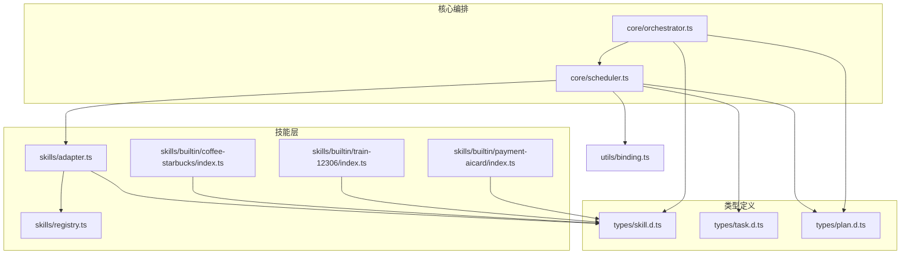
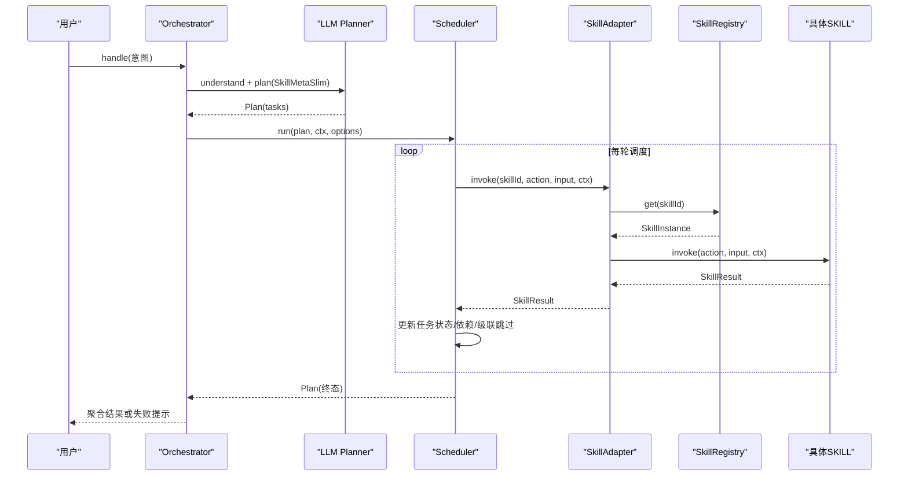
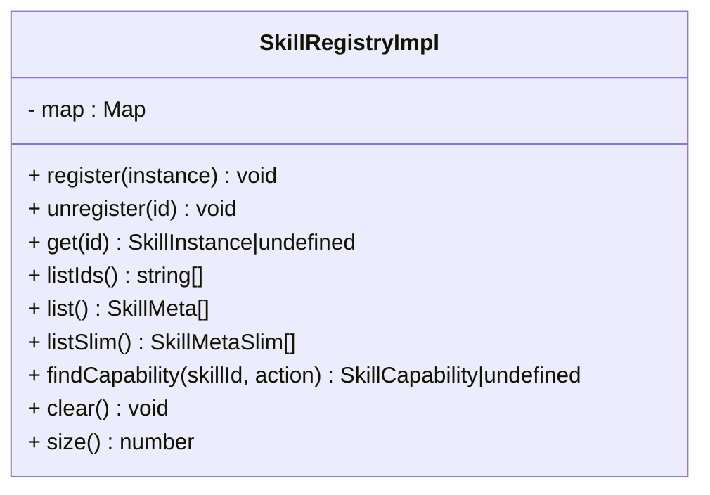
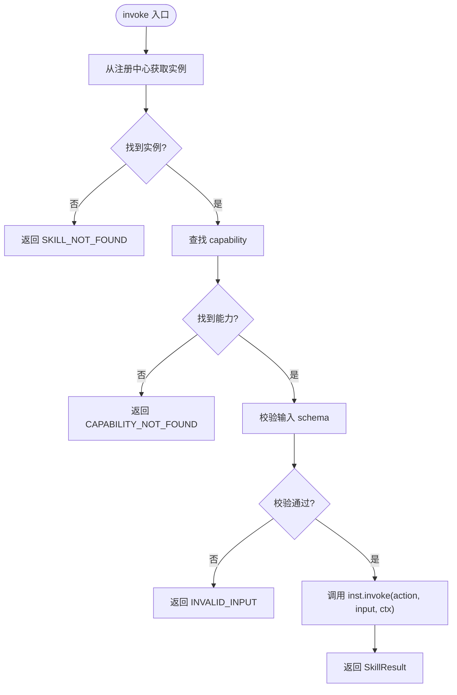
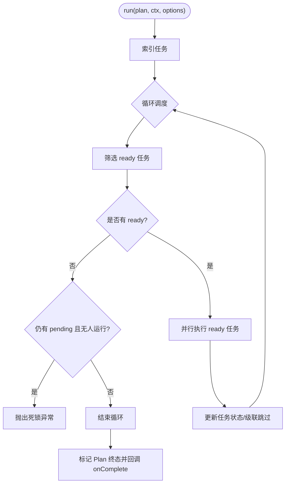
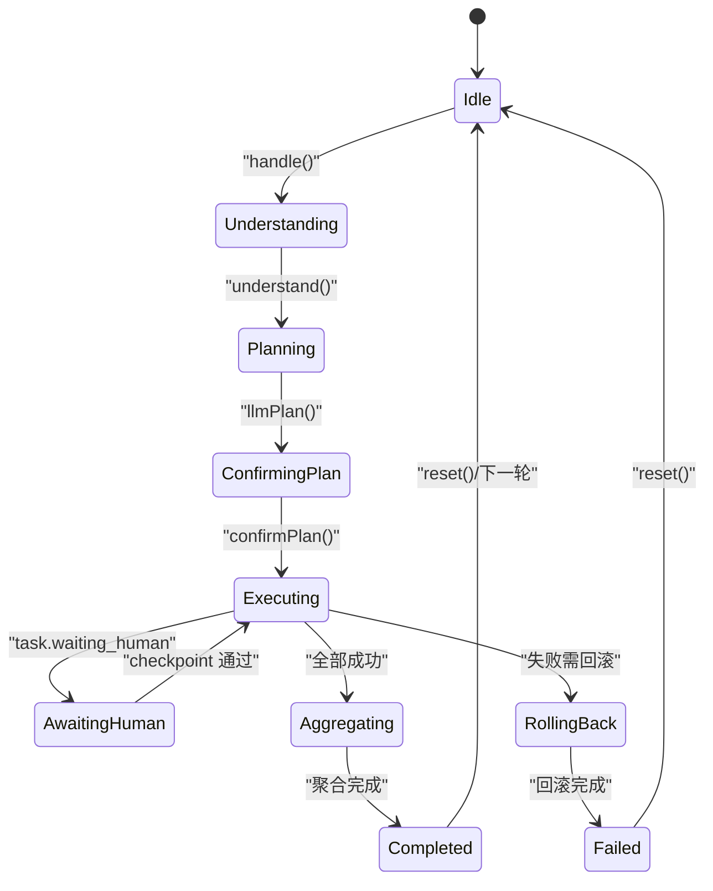
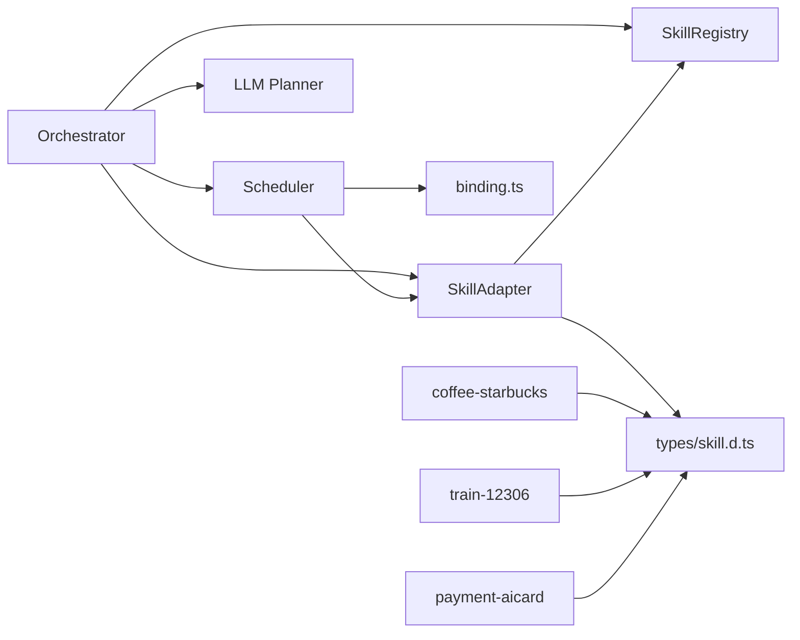
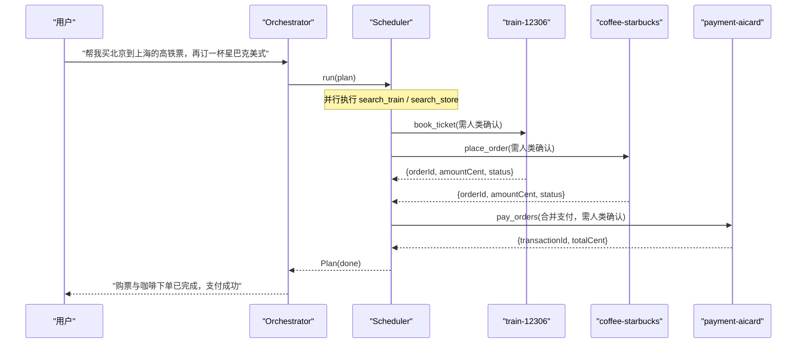

# 多技能协作

<cite>
**本文引用的文件**   
- [miniprogram/src/skills/registry.ts](file://miniprogram/src/skills/registry.ts)
- [miniprogram/src/skills/adapter.ts](file://miniprogram/src/skills/adapter.ts)
- [miniprogram/src/core/scheduler.ts](file://miniprogram/src/core/scheduler.ts)
- [miniprogram/src/core/orchestrator.ts](file://miniprogram/src/core/orchestrator.ts)
- [miniprogram/src/types/skill.d.ts](file://miniprogram/src/types/skill.d.ts)
- [miniprogram/src/types/task.d.ts](file://miniprogram/src/types/task.d.ts)
- [miniprogram/src/types/plan.d.ts](file://miniprogram/src/types/plan.d.ts)
- [miniprogram/src/utils/binding.ts](file://miniprogram/src/utils/binding.ts)
- [miniprogram/src/skills/builtin/coffee-starbucks/index.ts](file://miniprogram/src/skills/builtin/coffee-starbucks/index.ts)
- [miniprogram/src/skills/builtin/train-12306/index.ts](file://miniprogram/src/skills/builtin/train-12306/index.ts)
- [miniprogram/src/skills/builtin/payment-aicard/index.ts](file://miniprogram/src/skills/builtin/payment-aicard/index.ts)
</cite>

## 目录
1. [引言](#引言)
2. [项目结构](#项目结构)
3. [核心组件](#核心组件)
4. [架构总览](#架构总览)
5. [详细组件分析](#详细组件分析)
6. [依赖关系分析](#依赖关系分析)
7. [性能与优化建议](#性能与优化建议)
8. [故障排查指南](#故障排查指南)
9. [结论](#结论)
10. [附录：技能协作示例](#附录技能协作示例)

## 引言
本文面向 WAIC-WeChat-MiniProgram 项目的“多技能协作”能力，聚焦以下目标：
- 说明 SkillRegistry 注册中心如何完成技能的动态注册、发现与元数据管理。
- 解释 SkillAdapter 适配器模式如何统一不同 SKILL 的调用接口，并实现参数校验、错误归一化与埋点。
- 阐述 Scheduler 调度器如何实现 DAG 任务的并行执行、依赖管理与人类确认（checkpoint）串行化。
- 给出跨技能协作的具体示例，展示多个 SKILL 如何通过 Plan/Task 协同完成复杂任务。
- 明确技能间通信机制、数据传递方式与错误传播策略。
- 提供性能优化建议与最佳实践指导。

## 项目结构
围绕多技能协作，关键代码分布在以下模块：
- 类型定义：skill.d.ts、task.d.ts、plan.d.ts，定义了技能协议、任务模型与计划模型。
- 技能层：skills/registry.ts（注册中心）、skills/adapter.ts（统一适配器）、skills/builtin/*（内置技能）。
- 核心编排：core/orchestrator.ts（状态机编排）、core/scheduler.ts（DAG 调度）。
- 工具：utils/binding.ts（跨任务数据绑定解析）。

图表来源
- [miniprogram/src/core/orchestrator.ts:1-340](file://miniprogram/src/core/orchestrator.ts#L1-L340)
- [miniprogram/src/core/scheduler.ts:1-245](file://miniprogram/src/core/scheduler.ts#L1-L245)
- [miniprogram/src/skills/adapter.ts:1-115](file://miniprogram/src/skills/adapter.ts#L1-L115)
- [miniprogram/src/skills/registry.ts:1-91](file://miniprogram/src/skills/registry.ts#L1-L91)
- [miniprogram/src/types/skill.d.ts:1-119](file://miniprogram/src/types/skill.d.ts#L1-L119)
- [miniprogram/src/types/task.d.ts:1-59](file://miniprogram/src/types/task.d.ts#L1-L59)
- [miniprogram/src/types/plan.d.ts:1-51](file://miniprogram/src/types/plan.d.ts#L1-L51)
- [miniprogram/src/utils/binding.ts:1-50](file://miniprogram/src/utils/binding.ts#L1-L50)

章节来源
- [miniprogram/src/core/orchestrator.ts:1-340](file://miniprogram/src/core/orchestrator.ts#L1-L340)
- [miniprogram/src/core/scheduler.ts:1-245](file://miniprogram/src/core/scheduler.ts#L1-L245)
- [miniprogram/src/skills/adapter.ts:1-115](file://miniprogram/src/skills/adapter.ts#L1-L115)
- [miniprogram/src/skills/registry.ts:1-91](file://miniprogram/src/skills/registry.ts#L1-L91)
- [miniprogram/src/types/skill.d.ts:1-119](file://miniprogram/src/types/skill.d.ts#L1-L119)
- [miniprogram/src/types/task.d.ts:1-59](file://miniprogram/src/types/task.d.ts#L1-L59)
- [miniprogram/src/types/plan.d.ts:1-51](file://miniprogram/src/types/plan.d.ts#L1-L51)
- [miniprogram/src/utils/binding.ts:1-50](file://miniprogram/src/utils/binding.ts#L1-L50)

## 核心组件
- SkillRegistry：技能注册中心，负责技能的注册、反注册、查询与元数据暴露。
- SkillAdapter：统一适配器，屏蔽具体技能差异，提供入参校验、错误包装、日志埋点与 rollback 封装。
- Orchestrator：编排器，驱动理解、规划、确认、执行、聚合等阶段的状态机。
- Scheduler：DAG 调度器，按依赖并行执行任务，处理人类确认、失败级联与回滚。
- 内置技能：星巴克咖啡、12306 火车票、微信 AI 专属卡支付，演示读/写/支付三类场景。

章节来源
- [miniprogram/src/skills/registry.ts:1-91](file://miniprogram/src/skills/registry.ts#L1-L91)
- [miniprogram/src/skills/adapter.ts:1-115](file://miniprogram/src/skills/adapter.ts#L1-L115)
- [miniprogram/src/core/orchestrator.ts:1-340](file://miniprogram/src/core/orchestrator.ts#L1-L340)
- [miniprogram/src/core/scheduler.ts:1-245](file://miniprogram/src/core/scheduler.ts#L1-L245)
- [miniprogram/src/skills/builtin/coffee-starbucks/index.ts:1-237](file://miniprogram/src/skills/builtin/coffee-starbucks/index.ts#L1-L237)
- [miniprogram/src/skills/builtin/train-12306/index.ts:1-293](file://miniprogram/src/skills/builtin/train-12306/index.ts#L1-L293)
- [miniprogram/src/skills/builtin/payment-aicard/index.ts:1-147](file://miniprogram/src/skills/builtin/payment-aicard/index.ts#L1-L147)

## 架构总览
整体流程由 Orchestrator 驱动，结合 LLM Planner 生成 Plan，再由 Scheduler 调度执行；SkillAdapter 作为统一入口访问各 SKILL，SkillRegistry 维护技能实例。

图表来源
- [miniprogram/src/core/orchestrator.ts:106-221](file://miniprogram/src/core/orchestrator.ts#L106-L221)
- [miniprogram/src/core/scheduler.ts:77-128](file://miniprogram/src/core/scheduler.ts#L77-L128)
- [miniprogram/src/skills/adapter.ts:37-85](file://miniprogram/src/skills/adapter.ts#L37-L85)
- [miniprogram/src/skills/registry.ts:16-70](file://miniprogram/src/skills/registry.ts#L16-L70)

## 详细组件分析

### SkillRegistry 注册中心
职责与特性：
- 动态注册/反注册：通过 id 唯一性保证不重复注册。
- 元数据暴露：list() 返回完整 SkillMeta，listSlim() 返回精简版用于 LLM 规划，降低 token 消耗。
- 能力查询：findCapability(skillId, action) 供 Scheduler 判断冪等、可逆、是否需要人类确认等属性。
- 单例导出：全局共享注册表。

复杂度与行为：
- 注册/查找/列出均为 O(1)/O(n)，Map 操作高效。
- 对重复 id 抛出异常，避免隐式覆盖。

图表来源
- [miniprogram/src/skills/registry.ts:16-70](file://miniprogram/src/skills/registry.ts#L16-L70)

章节来源
- [miniprogram/src/skills/registry.ts:1-91](file://miniprogram/src/skills/registry.ts#L1-L91)
- [miniprogram/src/types/skill.d.ts:16-58](file://miniprogram/src/types/skill.d.ts#L16-L58)

### SkillAdapter 适配器
职责与特性：
- 统一调用入口 invoke(skillId, action, input, ctx, options)。
- 入参 schema 校验：基于 JSON Schema 验证，失败返回 INVALID_INPUT。
- 错误包装：将任意 Error 转换为 SkillError，确保上层一致处理。
- 埋点与日志：记录调用次数、耗时与错误。
- 回滚封装：rollback(skillId, action, input, result, ctx) 统一调用 SKILL.rollback。

图表来源
- [miniprogram/src/skills/adapter.ts:37-85](file://miniprogram/src/skills/adapter.ts#L37-L85)

章节来源
- [miniprogram/src/skills/adapter.ts:1-115](file://miniprogram/src/skills/adapter.ts#L1-L115)
- [miniprogram/src/types/skill.d.ts:60-104](file://miniprogram/src/types/skill.d.ts#L60-L104)

### Scheduler 调度器
职责与特性：
- DAG 调度：每轮找出依赖已满足且 pending 的任务，使用 Promise.allSettled 并行执行。
- 人类确认串行化：requiresHumanConfirm 的任务进入 waiting_human，并通过序列化 checkpoint 链避免弹窗冲突。
- 失败级联：任一任务失败，将其下游依赖标记为 skipped。
- 死锁检测：当无 ready 任务且仍有 pending 任务时抛出死锁异常。
- 运行令牌：isRunActive 探测 Orchestrator 是否重置，防止旧流程继续执行。

图表来源
- [miniprogram/src/core/scheduler.ts:77-128](file://miniprogram/src/core/scheduler.ts#L77-L128)
- [miniprogram/src/core/scheduler.ts:139-204](file://miniprogram/src/core/scheduler.ts#L139-L204)
- [miniprogram/src/core/scheduler.ts:229-240](file://miniprogram/src/core/scheduler.ts#L229-L240)

章节来源
- [miniprogram/src/core/scheduler.ts:1-245](file://miniprogram/src/core/scheduler.ts#L1-L245)
- [miniprogram/src/types/task.d.ts:11-59](file://miniprogram/src/types/task.d.ts#L11-L59)
- [miniprogram/src/utils/binding.ts:18-43](file://miniprogram/src/utils/binding.ts#L18-L43)

### Orchestrator 编排器
职责与特性：
- 状态机：idle → understanding → planning → confirming_plan → executing → aggregating → completed/failed。
- 生命周期：handle(intent) 驱动全流程，支持 reset 强制归位 idle。
- 失败回滚：按反序撤销已成功且可逆的任务。
- UI 联动：onTaskUpdate/onPlanUpdate/onStateChange 推送状态变化。

图表来源
- [miniprogram/src/core/orchestrator.ts:60-71](file://miniprogram/src/core/orchestrator.ts#L60-L71)
- [miniprogram/src/core/orchestrator.ts:106-221](file://miniprogram/src/core/orchestrator.ts#L106-L221)
- [miniprogram/src/core/orchestrator.ts:278-303](file://miniprogram/src/core/orchestrator.ts#L278-L303)

章节来源
- [miniprogram/src/core/orchestrator.ts:1-340](file://miniprogram/src/core/orchestrator.ts#L1-L340)
- [miniprogram/src/types/plan.d.ts:11-33](file://miniprogram/src/types/plan.d.ts#L11-L33)

### 内置技能示例
- 星巴克咖啡（coffee-starbucks）：search_store（读，幂等），place_order（写，需确认，可回滚）。
- 12306 火车票（train-12306）：search_train（读，幂等），book_ticket（写，需确认，可回滚）。
- 微信 AI 专属卡支付（payment-aicard）：pay_orders（合并支付，需确认，不可回滚，退款走原订单 SKILL）。

这些技能通过 SkillInstance 暴露 meta 与 invoke/rollback，遵循统一协议。

章节来源
- [miniprogram/src/skills/builtin/coffee-starbucks/index.ts:58-177](file://miniprogram/src/skills/builtin/coffee-starbucks/index.ts#L58-L177)
- [miniprogram/src/skills/builtin/train-12306/index.ts:69-190](file://miniprogram/src/skills/builtin/train-12306/index.ts#L69-L190)
- [miniprogram/src/skills/builtin/payment-aicard/index.ts:37-147](file://miniprogram/src/skills/builtin/payment-aicard/index.ts#L37-L147)

## 依赖关系分析
- Orchestrator 依赖 Scheduler、LLM Planner、SkillRegistry 与 Adapter。
- Scheduler 依赖 Adapter、Binding 工具与 Task/Plan 类型。
- Adapter 依赖 Registry、Validator、Logger 与 Skill 类型。
- 内置技能依赖 services/cloud 与 logger，严格禁止直接 import wx.*。

图表来源
- [miniprogram/src/core/orchestrator.ts:1-340](file://miniprogram/src/core/orchestrator.ts#L1-L340)
- [miniprogram/src/core/scheduler.ts:1-245](file://miniprogram/src/core/scheduler.ts#L1-L245)
- [miniprogram/src/skills/adapter.ts:1-115](file://miniprogram/src/skills/adapter.ts#L1-L115)
- [miniprogram/src/skills/registry.ts:1-91](file://miniprogram/src/skills/registry.ts#L1-L91)
- [miniprogram/src/utils/binding.ts:1-50](file://miniprogram/src/utils/binding.ts#L1-L50)
- [miniprogram/src/types/skill.d.ts:1-119](file://miniprogram/src/types/skill.d.ts#L1-L119)

章节来源
- [miniprogram/src/core/orchestrator.ts:1-340](file://miniprogram/src/core/orchestrator.ts#L1-L340)
- [miniprogram/src/core/scheduler.ts:1-245](file://miniprogram/src/core/scheduler.ts#L1-L245)
- [miniprogram/src/skills/adapter.ts:1-115](file://miniprogram/src/skills/adapter.ts#L1-L115)
- [miniprogram/src/skills/registry.ts:1-91](file://miniprogram/src/skills/registry.ts#L1-L91)
- [miniprogram/src/utils/binding.ts:1-50](file://miniprogram/src/utils/binding.ts#L1-L50)
- [miniprogram/src/types/skill.d.ts:1-119](file://miniprogram/src/types/skill.d.ts#L1-L119)

## 性能与优化建议
- 使用 listSlim() 向 LLM 暴露精简元数据，减少 token 消耗。
- 利用 estimatedLatencyMs 辅助 Scheduler 估算并发与超时策略。
- 批量读取类能力（如 search_*）应声明 idempotent=true，便于重试与缓存。
- 写操作必须 requiresHumanConfirm=true，避免并发弹窗导致确认丢失。
- 合理拆分 DAG，使独立子图并行执行，提升吞吐。
- 在 SkillResult.bindings 中输出下游所需字段，减少重复查询。
- 对网络请求进行统一封装与重试策略，区分 retryable 错误码。

[本节为通用指导，不直接分析具体文件]

## 故障排查指南
常见问题与定位要点：
- SKILL_NOT_FOUND/CAPABILITY_NOT_FOUND：检查注册中心是否正确注册，action 名称是否匹配。
- INVALID_INPUT：核对 inputSchema 与传入参数，关注必填字段与类型约束。
- 死锁异常：检查 dependsOn 是否存在环依赖，或上游任务长期 pending。
- 人类确认阻塞：确认 checkpoint 串行化链未卡住，UI 侧是否及时响应。
- 回滚失败：检查 reversible 能力是否实现 rollback，云端取消接口是否正常。
- 级联跳过：上游失败后下游自动 skipped，检查业务逻辑是否符合预期。

章节来源
- [miniprogram/src/skills/adapter.ts:24-34](file://miniprogram/src/skills/adapter.ts#L24-L34)
- [miniprogram/src/core/scheduler.ts:46-52](file://miniprogram/src/core/scheduler.ts#L46-L52)
- [miniprogram/src/core/scheduler.ts:206-240](file://miniprogram/src/core/scheduler.ts#L206-L240)
- [miniprogram/src/core/orchestrator.ts:278-303](file://miniprogram/src/core/orchestrator.ts#L278-L303)

## 结论
本项目通过 SkillRegistry、SkillAdapter、Scheduler 与 Orchestrator 的组合，构建了可扩展、可观测、可回滚的多技能协作框架。内置技能展示了读/写/支付的典型用法，配合 Plan/Task 的 DAG 模型与 bindings 数据流，能够支撑复杂的跨服务业务流程。建议在扩展新技能时严格遵循协议规范，完善元数据描述与错误语义，以提升 Planner 路由准确性与系统稳定性。

[本节为总结，不直接分析具体文件]

## 附录：技能协作示例
示例：购买火车票并下单星巴克咖啡，最后合并支付。

图表来源
- [miniprogram/src/core/orchestrator.ts:106-221](file://miniprogram/src/core/orchestrator.ts#L106-L221)
- [miniprogram/src/core/scheduler.ts:116-128](file://miniprogram/src/core/scheduler.ts#L116-L128)
- [miniprogram/src/skills/builtin/train-12306/index.ts:159-190](file://miniprogram/src/skills/builtin/train-12306/index.ts#L159-L190)
- [miniprogram/src/skills/builtin/coffee-starbucks/index.ts:148-177](file://miniprogram/src/skills/builtin/coffee-starbucks/index.ts#L148-L177)
- [miniprogram/src/skills/builtin/payment-aicard/index.ts:89-147](file://miniprogram/src/skills/builtin/payment-aicard/index.ts#L89-L147)

章节来源
- [miniprogram/src/core/orchestrator.ts:106-221](file://miniprogram/src/core/orchestrator.ts#L106-L221)
- [miniprogram/src/core/scheduler.ts:116-128](file://miniprogram/src/core/scheduler.ts#L116-L128)
- [miniprogram/src/skills/builtin/train-12306/index.ts:159-190](file://miniprogram/src/skills/builtin/train-12306/index.ts#L159-L190)
- [miniprogram/src/skills/builtin/coffee-starbucks/index.ts:148-177](file://miniprogram/src/skills/builtin/coffee-starbucks/index.ts#L148-L177)
- [miniprogram/src/skills/builtin/payment-aicard/index.ts:89-147](file://miniprogram/src/skills/builtin/payment-aicard/index.ts#L89-L147)