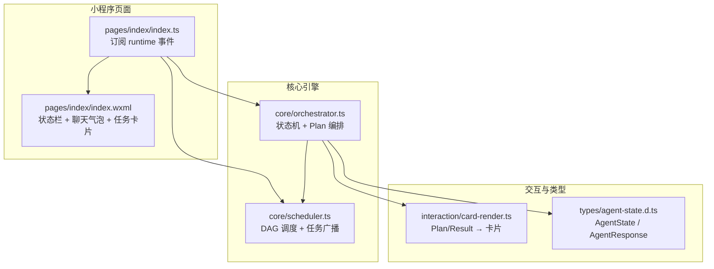
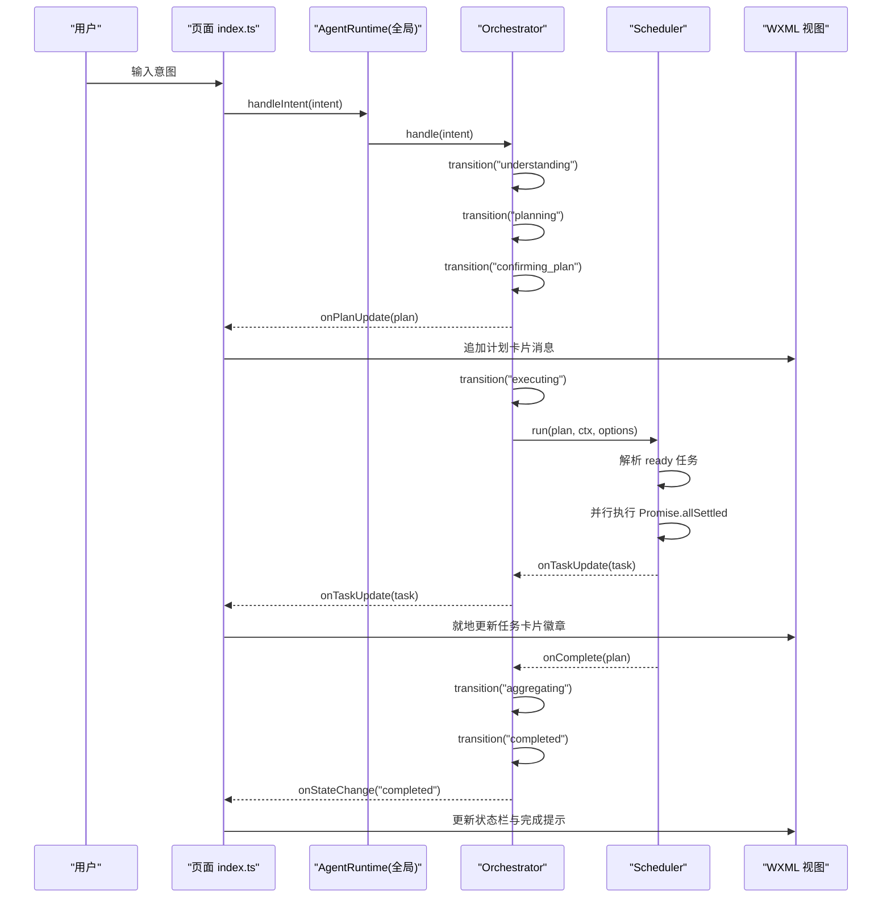
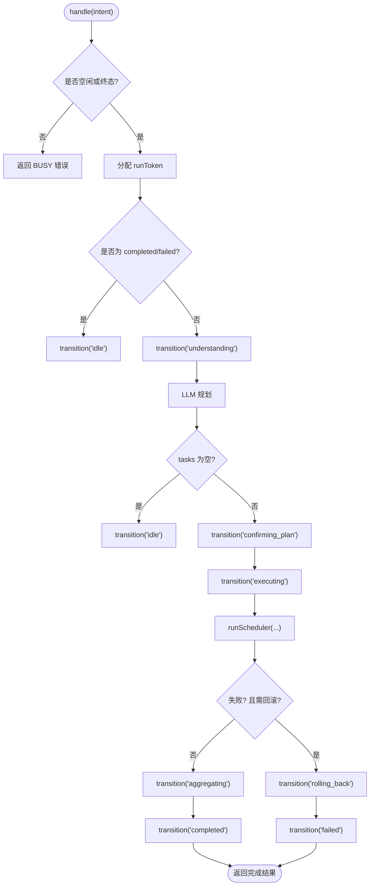
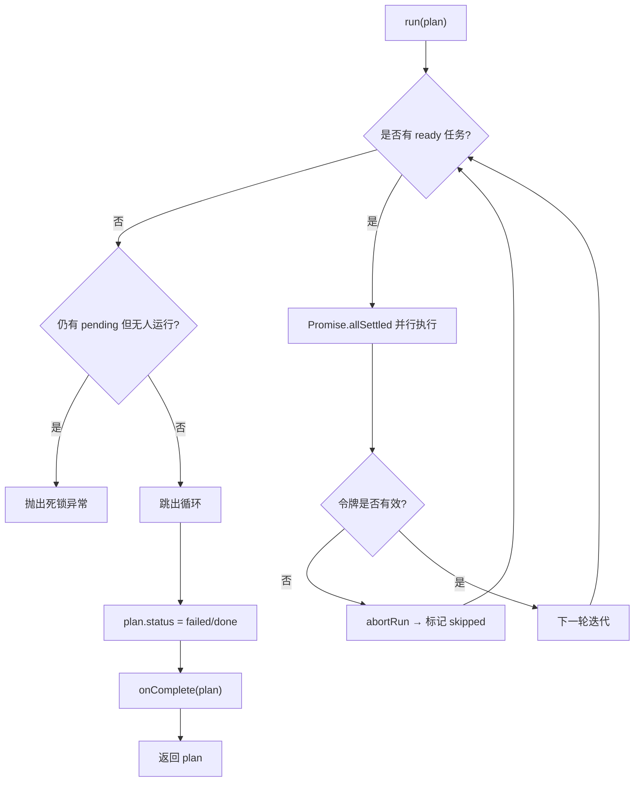
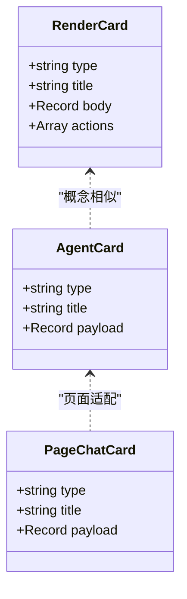
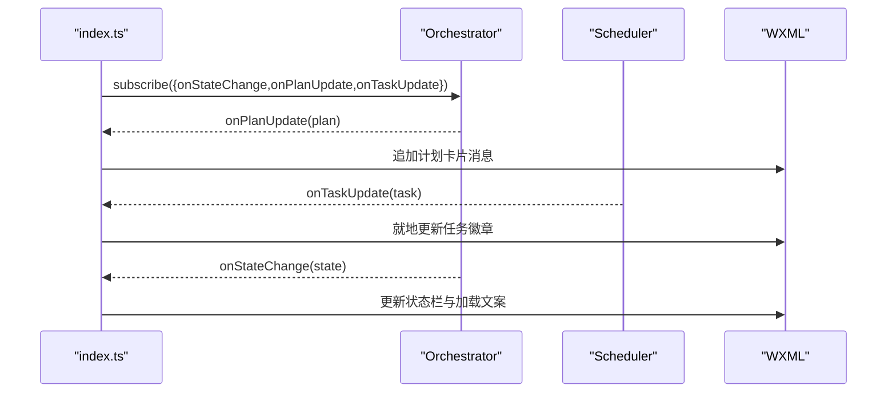
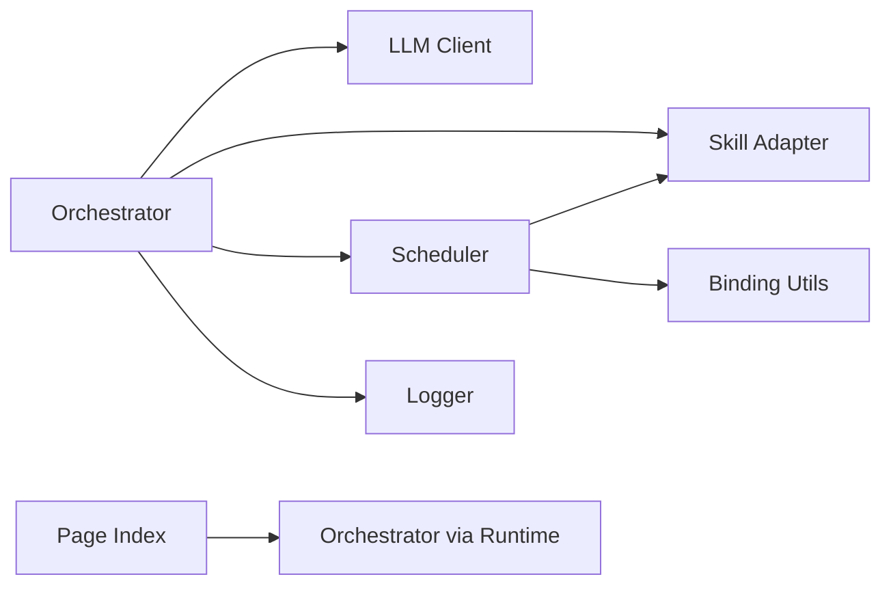
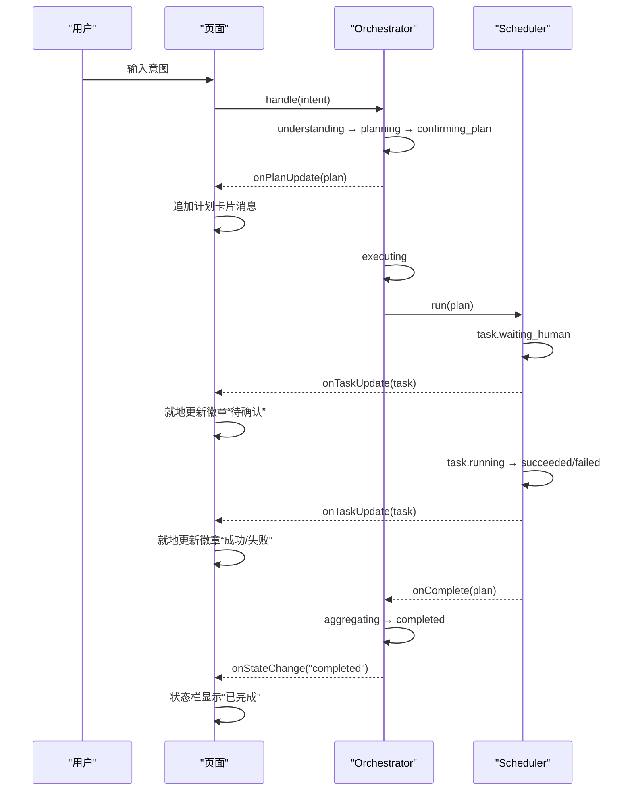

# 实时状态反馈

<cite>
**本文引用的文件**   
- [orchestrator.ts](file://miniprogram/src/core/orchestrator.ts)
- [scheduler.ts](file://miniprogram/src/core/scheduler.ts)
- [card-render.ts](file://miniprogram/src/interaction/card-render.ts)
- [agent-state.d.ts](file://miniprogram/src/types/agent-state.d.ts)
- [index.ts](file://miniprogram/pages/index/index.ts)
- [index.wxml](file://miniprogram/pages/index/index.wxml)
</cite>

## 目录
1. [引言](#引言)
2. [项目结构](#项目结构)
3. [核心组件](#核心组件)
4. [架构总览](#架构总览)
5. [详细组件分析](#详细组件分析)
6. [依赖关系分析](#依赖关系分析)
7. [性能与并发特性](#性能与并发特性)
8. [UI 更新示例：从计划确认到任务执行](#ui-更新示例从计划确认到任务执行)
9. [状态同步最佳实践](#状态同步最佳实践)
10. [用户体验优化建议](#用户体验优化建议)
11. [常见问题排查](#常见问题排查)
12. [结论](#结论)

## 引言
本文面向 WAIC-WeChat-MiniProgram 项目的“实时状态反馈”能力，重点说明以下方面：
- 状态机转移监听机制与 onStateChange 回调的实现和使用。
- 任务更新通知机制，如何通过 onTaskUpdate 实时更新 UI 进度。
- AgentCard 渲染逻辑与不同类型状态卡片的展示方式。
- 从“计划确认”到“任务执行”的完整状态流转与 UI 表现。
- 状态同步的最佳实践，包括并发控制与一致性保证。
- 用户体验优化建议与常见问题解决方案。

## 项目结构
本项目在小程序端通过页面层订阅运行时事件，将 Orchestrator（状态机）和 Scheduler（调度器）的状态变化实时反映到聊天界面与任务卡片中。关键路径如下：
- 页面 index.ts 订阅 onStateChange、onPlanUpdate、onTaskUpdate。
- Orchestrator 负责状态机转移、Plan 生成、结果聚合与回滚。
- Scheduler 负责 DAG 任务调度、写操作 checkpoint 串行化、任务状态广播。
- card-render.ts 提供 Plan/Result 到 UI 卡片的映射。
- agent-state.d.ts 定义状态类型与对外响应结构。

**图表来源**
- [index.ts:141-148](file://miniprogram/pages/index/index.ts#L141-L148)
- [orchestrator.ts:106-256](file://miniprogram/src/core/orchestrator.ts#L106-L256)
- [scheduler.ts:77-128](file://miniprogram/src/core/scheduler.ts#L77-L128)
- [card-render.ts:21-53](file://miniprogram/src/interaction/card-render.ts#L21-L53)
- [agent-state.d.ts:7-47](file://miniprogram/src/types/agent-state.d.ts#L7-L47)

**章节来源**
- [index.ts:117-152](file://miniprogram/pages/index/index.ts#L117-L152)
- [orchestrator.ts:1-48](file://miniprogram/src/core/orchestrator.ts#L1-L48)
- [scheduler.ts:1-44](file://miniprogram/src/core/scheduler.ts#L1-L44)
- [card-render.ts:1-19](file://miniprogram/src/interaction/card-render.ts#L1-L19)
- [agent-state.d.ts:1-17](file://miniprogram/src/types/agent-state.d.ts#L1-L17)

## 核心组件
- Orchestrator（状态机）
  - 维护当前 AgentState，提供 handle() 主流程、reset() 重置、transition() 受控转移。
  - 暴露 onStateChange、onPlanUpdate、onTaskUpdate 回调给上层 UI。
  - 内置 ALLOWED_TRANSITIONS 允许表，确保状态机合法转移。
- Scheduler（调度器）
  - 按依赖解析 ready 任务并并行执行，检测死锁。
  - 对需要人类确认的写操作进行序列化弹窗（checkpoint），避免并发弹框丢失。
  - 通过 onUpdate 推送任务状态变更，供 Orchestrator 转发给 UI。
- Card Render（卡片渲染）
  - 将 Plan 与 Result 转换为 UI 可渲染的卡片 schema，支持 plan/result/info/order/payment/train 等类型。
- Page Index（页面）
  - 订阅运行时事件，更新状态栏、聊天消息与任务卡片徽章。
  - 提供发送、重置、示例输入等交互入口。

**章节来源**
- [orchestrator.ts:28-48](file://miniprogram/src/core/orchestrator.ts#L28-L48)
- [orchestrator.ts:60-71](file://miniprogram/src/core/orchestrator.ts#L60-L71)
- [orchestrator.ts:74-89](file://miniprogram/src/core/orchestrator.ts#L74-L89)
- [scheduler.ts:27-44](file://miniprogram/src/core/scheduler.ts#L27-L44)
- [card-render.ts:11-19](file://miniprogram/src/interaction/card-render.ts#L11-L19)
- [index.ts:43-76](file://miniprogram/pages/index/index.ts#L43-L76)

## 架构总览
下图展示了从用户输入到 UI 更新的端到端流程，以及状态机与调度器的协作关系。

**图表来源**
- [index.ts:214-270](file://miniprogram/pages/index/index.ts#L214-L270)
- [orchestrator.ts:106-256](file://miniprogram/src/core/orchestrator.ts#L106-L256)
- [scheduler.ts:77-128](file://miniprogram/src/core/scheduler.ts#L77-L128)

## 详细组件分析

### Orchestrator 状态机与 onStateChange
- 状态机定义
  - AgentState 包含 idle、understanding、planning、confirming_plan、executing、awaiting_human、aggregating、completed、failed、rolling_back。
  - ALLOWED_TRANSITIONS 明确允许的转移路径，非法转移仅告警不中断（MVP 宽松模式）。
- 生命周期与回调
  - handle() 主流程：理解→规划→确认→执行→聚合→完成；异常时进入 failed 并尝试回滚。
  - reset() 强制归位 idle，递增 runToken 使在途调度失效。
  - transition(next) 统一封装状态转移，调用 onStateChange(next, prev)。
- 任务更新联动
  - handleTaskUpdate(task) 将 task.waiting_human ↔ awaiting_human 与 executing 联动，保持 UI 阶段提示一致。

**图表来源**
- [orchestrator.ts:106-256](file://miniprogram/src/core/orchestrator.ts#L106-L256)
- [orchestrator.ts:319-328](file://miniprogram/src/core/orchestrator.ts#L319-L328)

**章节来源**
- [agent-state.d.ts:7-17](file://miniprogram/src/types/agent-state.d.ts#L7-L17)
- [orchestrator.ts:60-71](file://miniprogram/src/core/orchestrator.ts#L60-L71)
- [orchestrator.ts:106-256](file://miniprogram/src/core/orchestrator.ts#L106-L256)
- [orchestrator.ts:258-270](file://miniprogram/src/core/orchestrator.ts#L258-L270)
- [orchestrator.ts:305-328](file://miniprogram/src/core/orchestrator.ts#L305-L328)

### Scheduler 任务调度与 onTaskUpdate
- 调度循环
  - 每轮找出依赖满足且 pending 的任务，并行执行，直到全部终态或死锁。
  - 死锁检测：无 ready 且仍有 pending，且无 running/waiting_human 任务则抛出异常。
- 写操作 checkpoint 串行化
  - 使用模块级 Promise 链 serializeCheckpoint 保证同一时刻只有一个确认弹窗。
  - 若用户拒绝或令牌失效，标记失败并级联跳过下游任务。
- 任务状态广播
  - 在 waiting_human、running、succeeded/failed、skipped 等节点调用 onUpdate 推送任务状态。

**图表来源**
- [scheduler.ts:77-128](file://miniprogram/src/core/scheduler.ts#L77-L128)
- [scheduler.ts:139-204](file://miniprogram/src/core/scheduler.ts#L139-L204)
- [scheduler.ts:219-240](file://miniprogram/src/core/scheduler.ts#L219-L240)

**章节来源**
- [scheduler.ts:27-44](file://miniprogram/src/core/scheduler.ts#L27-L44)
- [scheduler.ts:62-74](file://miniprogram/src/core/scheduler.ts#L62-L74)
- [scheduler.ts:77-128](file://miniprogram/src/core/scheduler.ts#L77-L128)
- [scheduler.ts:139-204](file://miniprogram/src/core/scheduler.ts#L139-L204)
- [scheduler.ts:219-240](file://miniprogram/src/core/scheduler.ts#L219-L240)

### 卡片渲染与 AgentCard
- renderPlan
  - 将每个 Task 渲染为 type=plan 的卡片，包含 skillId.action、summary、input、dependsOn、status 等字段。
- renderResult
  - 过滤 succeeded 的任务，根据 skillId 选择 result 卡片类型（train/order/payment/info）。
- 页面侧 ChatCard
  - 将 Plan 转为带 taskId、skill、status、statusLabel 的卡片，并在 onAgentTaskUpdate 中就地更新徽章。

**图表来源**
- [card-render.ts:11-19](file://miniprogram/src/interaction/card-render.ts#L11-L19)
- [card-render.ts:21-53](file://miniprogram/src/interaction/card-render.ts#L21-L53)
- [agent-state.d.ts:39-47](file://miniprogram/src/types/agent-state.d.ts#L39-L47)
- [index.ts:36-41](file://miniprogram/pages/index/index.ts#L36-L41)

**章节来源**
- [card-render.ts:21-53](file://miniprogram/src/interaction/card-render.ts#L21-L53)
- [agent-state.d.ts:39-47](file://miniprogram/src/types/agent-state.d.ts#L39-L47)
- [index.ts:277-321](file://miniprogram/pages/index/index.ts#L277-L321)

### 页面事件订阅与 UI 更新
- onLoad 订阅 onStateChange、onPlanUpdate、onTaskUpdate。
- onAgentStateChange 更新状态栏与 loading 气泡文案。
- onAgentPlanUpdate 追加计划卡片消息，显示任务列表与初始状态。
- onAgentTaskUpdate 就地更新对应任务的 status 与 statusLabel，必要时附加错误信息。
- WXML 渲染状态栏、聊天气泡、任务卡片徽章与加载动画。

**图表来源**
- [index.ts:141-148](file://miniprogram/pages/index/index.ts#L141-L148)
- [index.ts:272-321](file://miniprogram/pages/index/index.ts#L272-L321)
- [index.wxml:9-47](file://miniprogram/pages/index/index.wxml#L9-L47)

**章节来源**
- [index.ts:129-152](file://miniprogram/pages/index/index.ts#L129-L152)
- [index.ts:272-321](file://miniprogram/pages/index/index.ts#L272-L321)
- [index.wxml:9-47](file://miniprogram/pages/index/index.wxml#L9-L47)

## 依赖关系分析
- Orchestrator 依赖：
  - LLM 客户端（理解与规划）、Skill 适配器（执行与回滚）、Scheduler（任务调度）、Logger、ID 生成器。
  - 注入 confirmPlan、checkpoint、onTaskUpdate、onPlanUpdate、onStateChange。
- Scheduler 依赖：
  - Skill 适配器（invoke/rollback）、Binding 工具（参数绑定）、Logger。
  - 注入 checkpoint、onTaskUpdate、onComplete、isRunActive。
- 页面依赖：
  - 全局 AgentRuntime（app.globalData.agent），用于订阅事件与触发 handleIntent/resetAgent。

**图表来源**
- [orchestrator.ts:13-26](file://miniprogram/src/core/orchestrator.ts#L13-L26)
- [scheduler.ts:18-25](file://miniprogram/src/core/scheduler.ts#L18-L25)
- [index.ts:18-24](file://miniprogram/pages/index/index.ts#L18-L24)

**章节来源**
- [orchestrator.ts:13-26](file://miniprogram/src/core/orchestrator.ts#L13-L26)
- [scheduler.ts:18-25](file://miniprogram/src/core/scheduler.ts#L18-L25)
- [index.ts:18-24](file://miniprogram/pages/index/index.ts#L18-L24)

## 性能与并发特性
- 并行执行
  - Scheduler 使用 Promise.allSettled 并行执行 ready 任务，提升吞吐。
- 死锁检测
  - 当无 ready 任务且仍有 pending 且无 running/waiting_human 时抛出异常，避免无限循环。
- 写操作串行化
  - serializeCheckpoint 以模块级 Promise 链串行化弹窗，防止 wx.showModal 覆盖导致确认丢失。
- 令牌控制
  - runToken 在 Orchestrator.reset() 或新一轮 handle() 时递增，Scheduler 通过 isRunActive 探测并中止旧流程，避免并发双跑与重复下单。
- 级联跳过
  - 任务失败后 cascadeSkip 将所有依赖下游标记为 skipped，快速收敛状态。

**章节来源**
- [scheduler.ts:117-119](file://miniprogram/src/core/scheduler.ts#L117-L119)
- [scheduler.ts:102-114](file://miniprogram/src/core/scheduler.ts#L102-L114)
- [scheduler.ts:62-74](file://miniprogram/src/core/scheduler.ts#L62-L74)
- [orchestrator.ts:79-84](file://miniprogram/src/core/orchestrator.ts#L79-L84)
- [orchestrator.ts:176-183](file://miniprogram/src/core/orchestrator.ts#L176-L183)
- [scheduler.ts:229-240](file://miniprogram/src/core/scheduler.ts#L229-L240)

## UI 更新示例：从计划确认到任务执行
以下为典型的用户旅程与 UI 反馈序列：
- 用户输入意图。
- 页面立即显示“理解意图中”，随后 Orchestrator 进入 planning 并生成 Plan。
- onPlanUpdate 触发，页面追加计划卡片消息，列出各任务及初始状态。
- 用户确认后，Orchestrator 进入 executing，Scheduler 开始调度。
- 遇到需要人类确认的写操作时，task.status=waiting_human，页面就地更新徽章为“待确认”。
- 用户确认后，task.status=running，随后变为 succeeded/failed，页面即时刷新徽章与错误信息。
- 所有任务完成后，Orchestrator 聚合结果并进入 completed，状态栏显示“已完成”。

**图表来源**
- [index.ts:214-270](file://miniprogram/pages/index/index.ts#L214-L270)
- [orchestrator.ts:148-221](file://miniprogram/src/core/orchestrator.ts#L148-L221)
- [scheduler.ts:165-198](file://miniprogram/src/core/scheduler.ts#L165-L198)

## 状态同步最佳实践
- 使用 onStateChange 驱动状态栏与加载文案
  - 页面在 onAgentStateChange 中更新 state 与 stateLabel，确保顶部状态指示与加载气泡一致。
- 使用 onPlanUpdate 追加计划卡片
  - 首次生成 Plan 时追加消息，展示任务清单与初始状态，便于用户确认。
- 使用 onTaskUpdate 就地更新任务徽章
  - 根据 task.id 定位对应卡片，更新 status 与 statusLabel，必要时附加 error.message。
- 并发控制与一致性
  - 通过 runToken 与 isRunActive 防止旧流程继续执行，避免重复弹窗与并发双跑。
  - checkpoint 串行化确保同一时刻只有一个确认弹窗，避免结果丢失。
  - 非法状态转移仅告警不中断（MVP），后续应严格校验 ALLOWED_TRANSITIONS。
- 失败与回滚
  - 失败时先尝试回滚可逆任务，再进入 failed；回滚过程中持续 onTaskUpdate 刷新 UI。
- 重置语义
  - reset() 强制归位 idle，丢弃本轮在途任务；页面应清空对话并恢复初始状态。

**章节来源**
- [index.ts:272-321](file://miniprogram/pages/index/index.ts#L272-L321)
- [orchestrator.ts:79-84](file://miniprogram/src/core/orchestrator.ts#L79-L84)
- [orchestrator.ts:176-199](file://miniprogram/src/core/orchestrator.ts#L176-L199)
- [orchestrator.ts:258-270](file://miniprogram/src/core/orchestrator.ts#L258-L270)
- [orchestrator.ts:278-303](file://miniprogram/src/core/orchestrator.ts#L278-L303)
- [scheduler.ts:62-74](file://miniprogram/src/core/scheduler.ts#L62-L74)
- [scheduler.ts:165-198](file://miniprogram/src/core/scheduler.ts#L165-L198)

## 用户体验优化建议
- 状态文案本地化
  - 使用 STATE_LABELS 与 TASK_STATUS_LABELS 提供中文阶段文案，提升可读性。
- 渐进式反馈
  - 在 understanding/planning/confirming_plan/executing/aggregating 各阶段显示简短提示，减少用户等待焦虑。
- 卡片信息分层
  - 计划卡片展示 summary 与 skill.action；结果卡片按 skillId 分类（train/order/payment/info），突出关键数据。
- 错误可见性
  - 任务失败时在卡片上显示错误信息，并提供重试或取消入口（可扩展 actions）。
- 自动滚动与锚点
  - appendMessage 设置 scrollIntoView，确保新消息自动滚动到底部。
- 输入体验
  - loading 期间允许继续输入下一条消息，仅禁用发送按钮，提升多轮对话效率。

**章节来源**
- [index.ts:86-109](file://miniprogram/pages/index/index.ts#L86-L109)
- [index.ts:323-327](file://miniprogram/pages/index/index.ts#L323-L327)
- [card-render.ts:21-53](file://miniprogram/src/interaction/card-render.ts#L21-L53)

## 常见问题排查
- 状态永久 BUSY
  - 原因：提前返回路径未正确转回 idle（如 clarify 或 EMPTY_PLAN）。
  - 解决：确保 understand 返回 clarify 与 llmPlan 返回空 tasks 时均调用 transition('idle')。
- 弹窗确认丢失
  - 原因：多个写操作同时弹出确认框，wx.showModal 只保留最后一个。
  - 解决：使用 serializeCheckpoint 串行化 checkpoint，确保同一时刻仅一个弹窗。
- 并发双跑与重复下单
  - 原因：reset() 后旧流程仍在执行。
  - 解决：通过 runToken 与 isRunActive 探测并中止旧流程；页面调用 resetAgent() 后清理 UI。
- 任务卡死
  - 原因：依赖环或上游失败导致无 ready 任务。
  - 解决：检查 dependsOn 配置与上游任务状态；Scheduler 会抛出死锁异常，记录 pending 任务以便调试。
- 回滚不完整
  - 原因：单任务回滚失败被忽略，整体回滚继续。
  - 解决：记录回滚失败日志，由 Orchestrator 最终进入 failed；UI 展示已回滚数量与剩余失败。

**章节来源**
- [orchestrator.ts:125-146](file://miniprogram/src/core/orchestrator.ts#L125-L146)
- [orchestrator.ts:159-172](file://miniprogram/src/core/orchestrator.ts#L159-L172)
- [scheduler.ts:62-74](file://miniprogram/src/core/scheduler.ts#L62-L74)
- [scheduler.ts:102-114](file://miniprogram/src/core/scheduler.ts#L102-L114)
- [orchestrator.ts:278-303](file://miniprogram/src/core/orchestrator.ts#L278-L303)

## 结论
本项目的实时状态反馈通过 Orchestrator 的状态机与 Scheduler 的任务调度协同实现，结合页面层的 onStateChange、onPlanUpdate、onTaskUpdate 订阅机制，提供了从计划确认到任务执行的完整可视化反馈。通过令牌控制、checkpoint 串行化与级联跳过等机制，确保了并发安全与状态一致性。建议在 MVP 基础上进一步严格状态转移校验、扩展卡片交互动作，并完善错误处理与重试策略，以提升用户体验与系统健壮性。