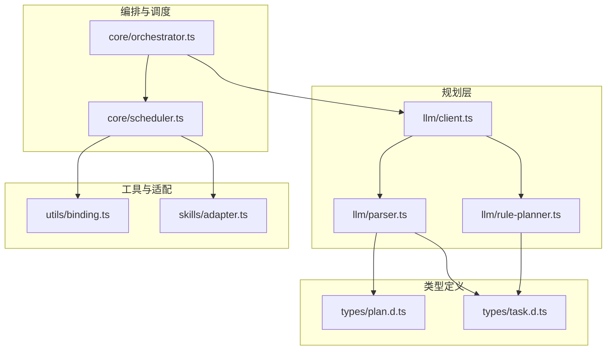
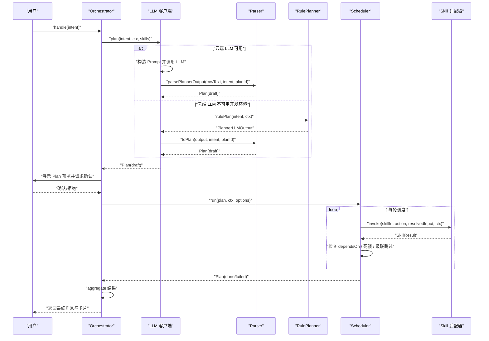
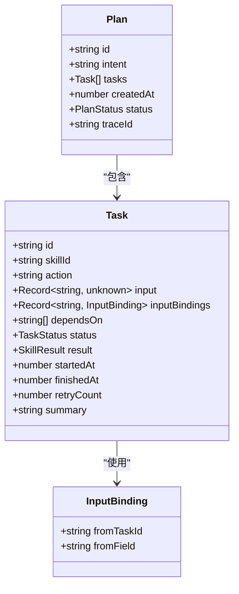
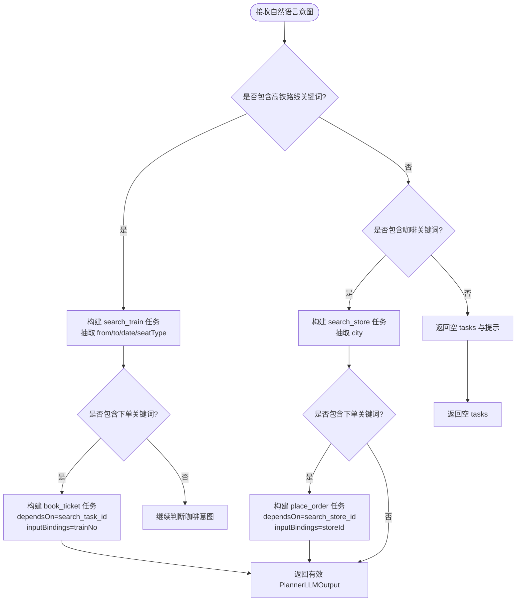
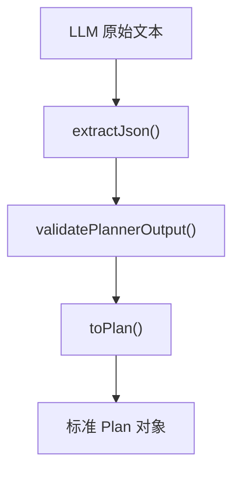
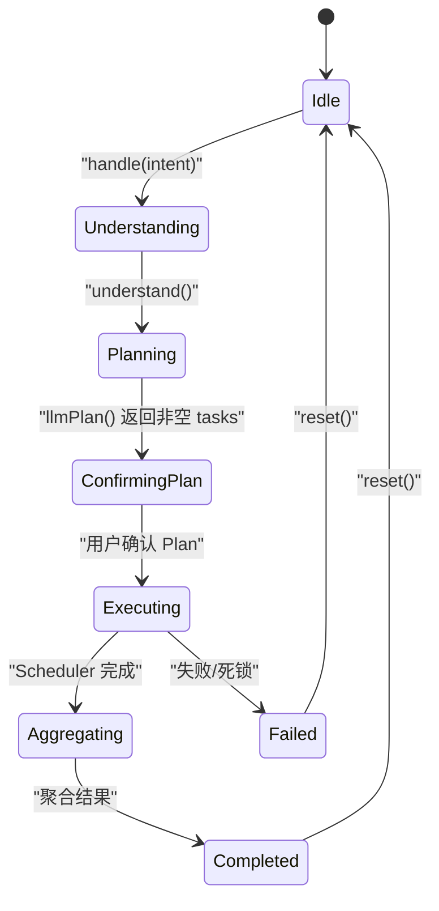
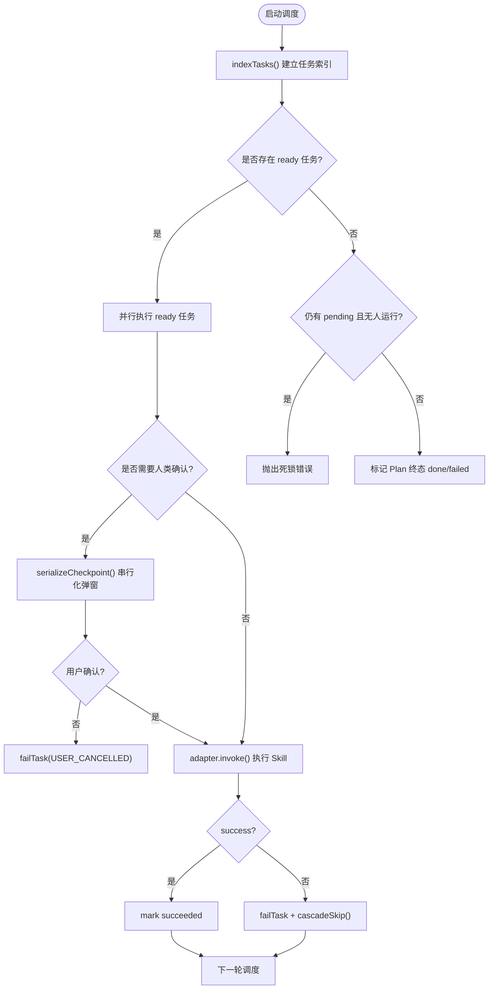
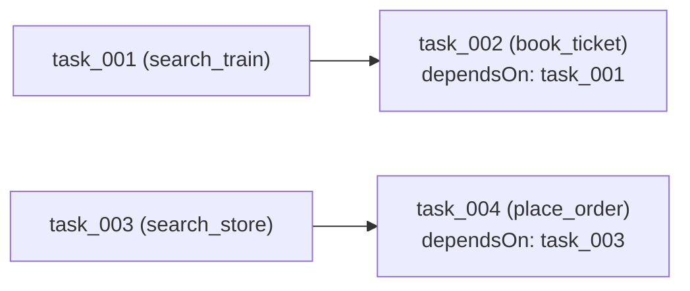
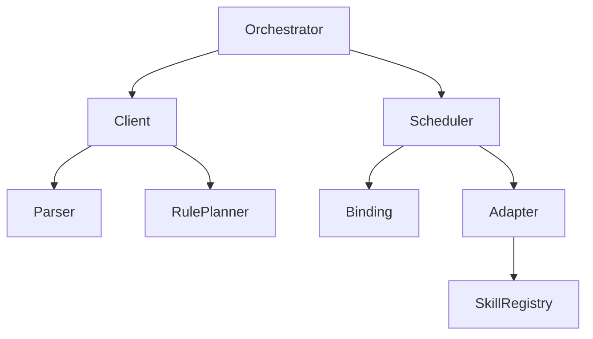
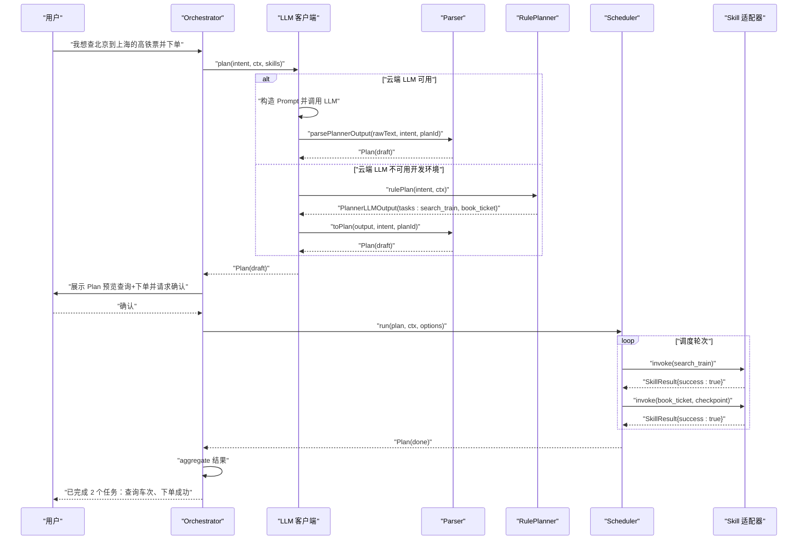

# 智能任务规划

<cite>
**本文引用的文件**   
- [plan.d.ts](file://miniprogram/src/types/plan.d.ts)
- [task.d.ts](file://miniprogram/src/types/task.d.ts)
- [rule-planner.ts](file://miniprogram/src/llm/rule-planner.ts)
- [parser.ts](file://miniprogram/src/llm/parser.ts)
- [client.ts](file://miniprogram/src/llm/client.ts)
- [orchestrator.ts](file://miniprogram/src/core/orchestrator.ts)
- [scheduler.ts](file://miniprogram/src/core/scheduler.ts)
- [binding.ts](file://miniprogram/src/utils/binding.ts)
- [adapter.ts](file://miniprogram/src/skills/adapter.ts)
</cite>

## 目录
1. [引言](#引言)
2. [项目结构](#项目结构)
3. [核心组件](#核心组件)
4. [架构总览](#架构总览)
5. [详细组件分析](#详细组件分析)
6. [依赖关系分析](#依赖关系分析)
7. [性能与复杂度](#性能与复杂度)
8. [故障排查指南](#故障排查指南)
9. [结论](#结论)
10. [附录：端到端示例](#附录端到端示例)

## 引言
本文面向 WAIC-WeChat-MiniProgram 项目的“智能任务规划”能力，重点说明 Plan 对象的生成过程、DAG 任务图的构建、依赖关系分析与任务排序执行机制；解释 RulePlanner 如何将自然语言意图转换为可执行的任务计划；给出 Plan 与 Task 的数据结构定义、状态管理；说明验证机制（循环依赖检测、冲突解决策略）；并通过一个从用户输入到最终 Plan 对象的完整示例，帮助读者理解从自然语言到 DAG 调度执行的端到端流程。

## 项目结构
围绕智能任务规划的关键代码分布在以下模块：
- 类型定义：Plan、Task、PlanStatus、TaskStatus 等数据结构位于 types 目录。
- 规划层：LLM 客户端、解析器与规则式降级规划器位于 llm 目录。
- 编排与调度：Orchestrator 负责状态机与生命周期，Scheduler 负责 DAG 执行。
- 工具与适配：binding 提供跨任务数据绑定解析，skills/adapter 统一调用 Skill 并校验入参。

**图表来源**
- [orchestrator.ts:1-340](file://miniprogram/src/core/orchestrator.ts#L1-L340)
- [scheduler.ts:1-245](file://miniprogram/src/core/scheduler.ts#L1-L245)
- [client.ts:1-153](file://miniprogram/src/llm/client.ts#L1-L153)
- [parser.ts:1-127](file://miniprogram/src/llm/parser.ts#L1-L127)
- [rule-planner.ts:1-165](file://miniprogram/src/llm/rule-planner.ts#L1-L165)
- [binding.ts:1-50](file://miniprogram/src/utils/binding.ts#L1-L50)
- [adapter.ts:1-115](file://miniprogram/src/skills/adapter.ts#L1-L115)
- [plan.d.ts:1-51](file://miniprogram/src/types/plan.d.ts#L1-L51)
- [task.d.ts:1-59](file://miniprogram/src/types/task.d.ts#L1-L59)

**章节来源**
- [orchestrator.ts:1-340](file://miniprogram/src/core/orchestrator.ts#L1-L340)
- [scheduler.ts:1-245](file://miniprogram/src/core/scheduler.ts#L1-L245)
- [client.ts:1-153](file://miniprogram/src/llm/client.ts#L1-L153)
- [parser.ts:1-127](file://miniprogram/src/llm/parser.ts#L1-L127)
- [rule-planner.ts:1-165](file://miniprogram/src/llm/rule-planner.ts#L1-L165)
- [binding.ts:1-50](file://miniprogram/src/utils/binding.ts#L1-L50)
- [adapter.ts:1-115](file://miniprogram/src/skills/adapter.ts#L1-L115)
- [plan.d.ts:1-51](file://miniprogram/src/types/plan.d.ts#L1-L51)
- [task.d.ts:1-59](file://miniprogram/src/types/task.d.ts#L1-L59)

## 核心组件
- Plan 与 Task 类型：Plan 是 DAG 任务集合，包含 id、intent、tasks、createdAt、status、traceId；Task 是最小执行单元，包含 skillId、action、input、inputBindings、dependsOn、status、result、startedAt、finishedAt、retryCount、summary。
- RulePlanner：在开发环境或云端 LLM 不可用时，通过关键词匹配将自然语言意图映射为 PlannerLLMOutput，再由 parser.toPlan 转为标准 Plan。
- Parser：抽取 JSON、校验结构、补全 Task 字段，输出标准 Plan。
- Orchestrator：状态机驱动整个流程（理解→规划→确认→执行→聚合），负责 Plan 的创建、确认、执行与回滚。
- Scheduler：按 DAG 依赖并行调度任务，处理 checkpoint 人类确认、失败级联跳过、死锁检测与终止。
- Binding：解析 inputBindings，将上游 Task 结果注入下游 Task 的 input。
- Adapter：统一调用 Skill，进行 schema 校验、错误包装、回滚支持。

**章节来源**
- [plan.d.ts:1-51](file://miniprogram/src/types/plan.d.ts#L1-L51)
- [task.d.ts:1-59](file://miniprogram/src/types/task.d.ts#L1-L59)
- [rule-planner.ts:1-165](file://miniprogram/src/llm/rule-planner.ts#L1-L165)
- [parser.ts:1-127](file://miniprogram/src/llm/parser.ts#L1-L127)
- [orchestrator.ts:1-340](file://miniprogram/src/core/orchestrator.ts#L1-L340)
- [scheduler.ts:1-245](file://miniprogram/src/core/scheduler.ts#L1-L245)
- [binding.ts:1-50](file://miniprogram/src/utils/binding.ts#L1-L50)
- [adapter.ts:1-115](file://miniprogram/src/skills/adapter.ts#L1-L115)

## 架构总览
下图展示了从用户输入到 Plan 生成与执行的端到端流程，包括 LLM 与规则式降级路径、Plan 确认、DAG 调度、人类确认与结果聚合。

**图表来源**
- [orchestrator.ts:106-256](file://miniprogram/src/core/orchestrator.ts#L106-L256)
- [client.ts:56-120](file://miniprogram/src/llm/client.ts#L56-L120)
- [parser.ts:89-122](file://miniprogram/src/llm/parser.ts#L89-L122)
- [rule-planner.ts:82-164](file://miniprogram/src/llm/rule-planner.ts#L82-L164)
- [scheduler.ts:77-128](file://miniprogram/src/core/scheduler.ts#L77-L128)
- [adapter.ts:37-85](file://miniprogram/src/skills/adapter.ts#L37-L85)

## 详细组件分析

### Plan 与 Task 数据结构
- Plan：
  - id：计划标识，推荐格式 plan_{timestamp}。
  - intent：用户原始意图。
  - tasks：构成 DAG 的任务数组。
  - createdAt：创建时间（毫秒时间戳）。
  - status：Plan 生命周期状态，包括 draft、confirmed、executing、done、failed。
  - traceId：可选，用于调试追踪。
- Task：
  - id：任务标识，推荐格式 task_NNN（三位数补零）。
  - skillId：关联的 Skill ID。
  - action：调用的 capability 名称。
  - input：入参对象，可能包含 inputBindings 解析后的最终值。
  - inputBindings：跨任务数据流引用声明，key 为本任务的入参字段，value 为来源任务与字段路径。
  - dependsOn：前置任务 ID 列表。
  - status：任务状态，包括 pending、running、waiting_human、succeeded、failed、rolled_back、skipped。
  - result：Skill 执行结果。
  - startedAt/finishedAt：开始与结束时间。
  - retryCount：重试次数。
  - summary：人类可读摘要。

**图表来源**
- [plan.d.ts:19-33](file://miniprogram/src/types/plan.d.ts#L19-L33)
- [task.d.ts:29-59](file://miniprogram/src/types/task.d.ts#L29-L59)

**章节来源**
- [plan.d.ts:1-51](file://miniprogram/src/types/plan.d.ts#L1-L51)
- [task.d.ts:1-59](file://miniprogram/src/types/task.d.ts#L1-L59)

### RulePlanner 工作原理
RulePlanner 作为开发模式下的降级方案，通过关键词识别用户意图（如高铁查询/购票、星巴克门店查询/点单），生成与 LLM Planner 同构的 PlannerLLMOutput，随后由 parser.toPlan 补全字段并输出标准 Plan。其关键逻辑包括：
- 意图识别：
  - 高铁路线相关关键词触发 train 技能（search_train、book_ticket）。
  - 咖啡相关关键词触发 coffee 技能（search_store、place_order）。
  - “买/订/下单/来一杯/帮我点”等关键词标记写操作，需要人类确认。
- 参数抽取：
  - 日期：今天/明天/后天默认推导。
  - 城市：按出现顺序取出发站与到达站。
  - 座席类型：商务座/一等座/二等座/硬座映射。
  - 饮品名：美式/摩卡/拿铁。
- 任务图构建：
  - 搜索类任务无依赖（dependsOn 为空）。
  - 下单类任务依赖对应搜索任务（dependsOn 指向搜索任务 ID）。
  - 下订单务的 inputBindings 引用上游搜索结果（例如 trainNo、storeId）。
- 输出：
  - 若无法识别意图，返回空 tasks 与提示信息。
  - 否则返回包含 tasks 与 message 的 PlannerLLMOutput。

**图表来源**
- [rule-planner.ts:82-164](file://miniprogram/src/llm/rule-planner.ts#L82-L164)

**章节来源**
- [rule-planner.ts:1-165](file://miniprogram/src/llm/rule-planner.ts#L1-L165)

### Parser 与 Plan 生成
Parser 负责从 LLM 原始文本中抽取 JSON、校验结构并转换为标准 Plan：
- extractJson：优先尝试 Markdown 包裹的 JSON，再尝试首个 JSON 对象，失败抛出 LLMParserError。
- validatePlannerOutput：校验 tasks 数组及每个 task 的 skillId、action、input、dependsOn 字段。
- toPlan：为每个 task 分配 id（task_NNN）、status=pending、retryCount=0、summary 默认值，并将 inputBindings 规范化。
- parsePlannerOutput：组合上述步骤，输出 Plan。

**图表来源**
- [parser.ts:40-122](file://miniprogram/src/llm/parser.ts#L40-L122)

**章节来源**
- [parser.ts:1-127](file://miniprogram/src/llm/parser.ts#L1-L127)

### Orchestrator 状态机与 Plan 生命周期
Orchestrator 驱动整体流程，状态转移如下：
- idle → understanding → planning → confirming_plan → executing → aggregating → completed
- 异常或失败时进入 failed，并可回滚已成功且可逆的任务。
- Plan 状态变化：draft → confirmed → executing → done/failed。

**图表来源**
- [orchestrator.ts:60-71](file://miniprogram/src/core/orchestrator.ts#L60-L71)
- [orchestrator.ts:106-256](file://miniprogram/src/core/orchestrator.ts#L106-L256)

**章节来源**
- [orchestrator.ts:1-340](file://miniprogram/src/core/orchestrator.ts#L1-L340)

### Scheduler DAG 调度与依赖解析
Scheduler 的核心算法：
- 每轮找出所有依赖已满足且 pending 的任务（isReady）。
- 并行执行 ready 任务（Promise.allSettled）。
- 等待完成后进入下一轮，直到全部终态或检测到死锁。
- 对 requiresHumanConfirm 的写操作，串行化 checkpoint 弹窗，确保同一时刻仅一个确认框。
- 失败级联跳过：若某任务失败，其下游依赖该任务的所有 pending 任务将被标记为 skipped。
- 死锁检测：若无 ready 任务且仍有 pending 任务，则抛出 SchedulerDeadlockError。

**图表来源**
- [scheduler.ts:77-128](file://miniprogram/src/core/scheduler.ts#L77-L128)
- [scheduler.ts:131-240](file://miniprogram/src/core/scheduler.ts#L131-L240)
- [binding.ts:18-50](file://miniprogram/src/utils/binding.ts#L18-L50)

**章节来源**
- [scheduler.ts:1-245](file://miniprogram/src/core/scheduler.ts#L1-L245)
- [binding.ts:1-50](file://miniprogram/src/utils/binding.ts#L1-L50)

### 依赖关系分析与任务排序
- 依赖关系：Task.dependsOn 指定前置任务 ID；Scheduler 通过 isReady 检查所有依赖是否成功。
- 任务排序：并非静态拓扑排序，而是动态逐轮选择 ready 任务并行执行，保证依赖满足后尽快推进。
- 数据流绑定：inputBindings 将上游 Task 的结果注入下游 Task 的 input，支持点号路径（如 data.trainNo）。

**图表来源**
- [rule-planner.ts:97-153](file://miniprogram/src/llm/rule-planner.ts#L97-L153)
- [scheduler.ts:131-137](file://miniprogram/src/core/scheduler.ts#L131-L137)
- [binding.ts:18-43](file://miniprogram/src/utils/binding.ts#L18-L43)

**章节来源**
- [rule-planner.ts:82-164](file://miniprogram/src/llm/rule-planner.ts#L82-L164)
- [scheduler.ts:131-137](file://miniprogram/src/core/scheduler.ts#L131-L137)
- [binding.ts:18-43](file://miniprogram/src/utils/binding.ts#L18-L43)

### 验证机制：循环依赖检测与冲突解决
- 循环依赖检测：当前实现未显式检测循环依赖；但 Scheduler 的死锁检测会在无 ready 任务且仍有 pending 任务时抛出死锁错误，间接暴露循环依赖问题。
- 冲突解决策略：
  - 写操作的人类确认串行化：通过 serializeCheckpoint 确保同一时刻仅一个弹窗，避免 UI 覆盖导致确认结果丢失。
  - 失败级联跳过：上游任务失败后，下游依赖该任务的任务被标记为 skipped，防止错误扩散。
  - 回滚机制：Orchestrator.rollbackIfNeeded 按反序撤销已成功且可逆的任务，尽量恢复系统一致性。

**章节来源**
- [scheduler.ts:102-114](file://miniprogram/src/core/scheduler.ts#L102-L114)
- [scheduler.ts:165-186](file://miniprogram/src/core/scheduler.ts#L165-L186)
- [scheduler.ts:229-240](file://miniprogram/src/core/scheduler.ts#L229-L240)
- [orchestrator.ts:272-303](file://miniprogram/src/core/orchestrator.ts#L272-L303)

## 依赖关系分析
- Orchestrator 依赖 LLM 客户端与 Scheduler，不直接依赖 Skills 注册表（通过传入 availableSkills）。
- LLM 客户端依赖 Parser 与 RulePlanner，并在开发环境降级。
- Scheduler 依赖 Binding 与 Adapter，以及 Capability 元数据。
- Adapter 依赖 SkillRegistry 与 Validator。

**图表来源**
- [orchestrator.ts:13-26](file://miniprogram/src/core/orchestrator.ts#L13-L26)
- [client.ts:9-18](file://miniprogram/src/llm/client.ts#L9-L18)
- [scheduler.ts:18-25](file://miniprogram/src/core/scheduler.ts#L18-L25)
- [adapter.ts:13-17](file://miniprogram/src/skills/adapter.ts#L13-L17)

**章节来源**
- [orchestrator.ts:1-340](file://miniprogram/src/core/orchestrator.ts#L1-L340)
- [client.ts:1-153](file://miniprogram/src/llm/client.ts#L1-L153)
- [scheduler.ts:1-245](file://miniprogram/src/core/scheduler.ts#L1-L245)
- [adapter.ts:1-115](file://miniprogram/src/skills/adapter.ts#L1-L115)

## 性能与复杂度
- 调度轮次：每轮扫描所有任务以查找 ready 任务，时间复杂度 O(N)，N 为任务数量；并行执行 ready 任务提升吞吐。
- 绑定解析：applyBindings 遍历 inputBindings，时间复杂度 O(B)，B 为绑定数量；路径解析与赋值开销较小。
- 死锁检测：每轮检查 ready 与 pending 状态，O(N)。
- 总体复杂度：取决于任务图规模与并行度；在典型场景（少量任务、有限依赖）下表现良好。

[本节为一般性指导，不涉及具体文件分析]

## 故障排查指南
- LLM 调用失败：
  - 开发环境自动降级至 RulePlanner；release 环境抛出 PlannerLLMError。
  - 检查云端配置与网络连通性。
- 解析失败：
  - LLM 输出不符合 schema 会抛出 LLMParserError；检查 Prompt 与模型输出格式。
- 死锁：
  - 若存在循环依赖或上游任务长期 pending，Scheduler 抛出 SchedulerDeadlockError；检查 dependsOn 与上游任务状态。
- 人类确认冲突：
  - 多个写操作同时弹窗可能导致确认丢失；serializeCheckpoint 已串行化处理，但仍需确保 UI 交互正确。
- 回滚失败：
  - 单个任务回滚失败仅记录错误并继续其他回滚；检查 Skill.rollback 实现与幂等性。

**章节来源**
- [client.ts:83-119](file://miniprogram/src/llm/client.ts#L83-L119)
- [parser.ts:40-87](file://miniprogram/src/llm/parser.ts#L40-L87)
- [scheduler.ts:102-114](file://miniprogram/src/core/scheduler.ts#L102-L114)
- [scheduler.ts:165-186](file://miniprogram/src/core/scheduler.ts#L165-L186)
- [orchestrator.ts:272-303](file://miniprogram/src/core/orchestrator.ts#L272-L303)

## 结论
智能任务规划通过 Orchestrator 的状态机驱动，结合 LLM 与 RulePlanner 的意图解析，生成标准 Plan 与 DAG 任务图；Scheduler 基于依赖关系动态调度任务，支持人类确认、失败级联跳过与回滚机制。该设计在保证可扩展性的同时，提供了可靠的容错与用户体验保障。

[本节为总结性内容，不涉及具体文件分析]

## 附录：端到端示例
以下示例展示从用户输入到最终 Plan 对象的完整转换过程，涵盖 LLM 与规则式降级路径、Plan 确认、DAG 调度与结果聚合。

**图表来源**
- [orchestrator.ts:106-256](file://miniprogram/src/core/orchestrator.ts#L106-L256)
- [client.ts:56-120](file://miniprogram/src/llm/client.ts#L56-L120)
- [parser.ts:89-122](file://miniprogram/src/llm/parser.ts#L89-L122)
- [rule-planner.ts:82-164](file://miniprogram/src/llm/rule-planner.ts#L82-L164)
- [scheduler.ts:77-128](file://miniprogram/src/core/scheduler.ts#L77-L128)
- [adapter.ts:37-85](file://miniprogram/src/skills/adapter.ts#L37-L85)