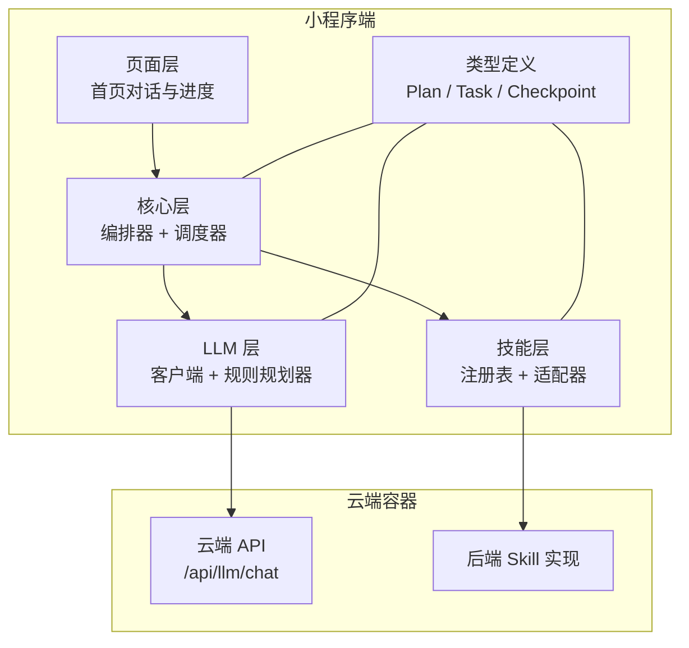
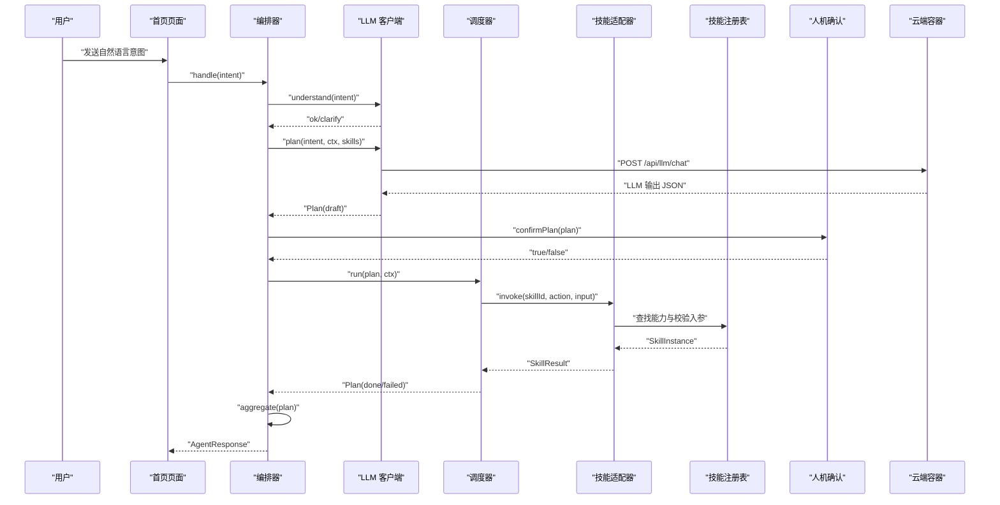
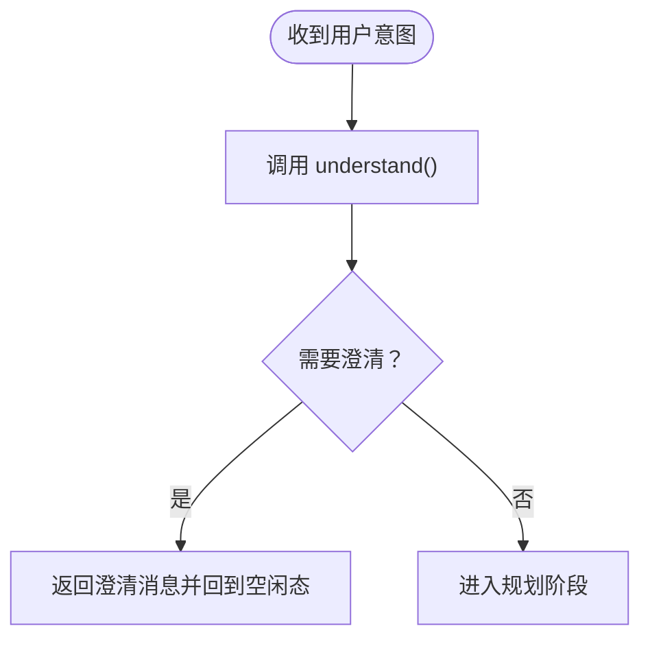
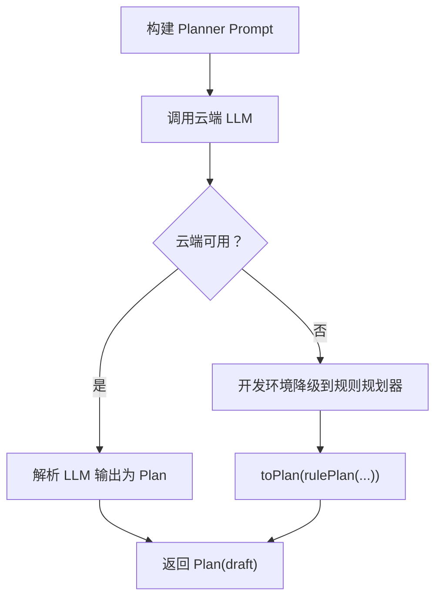
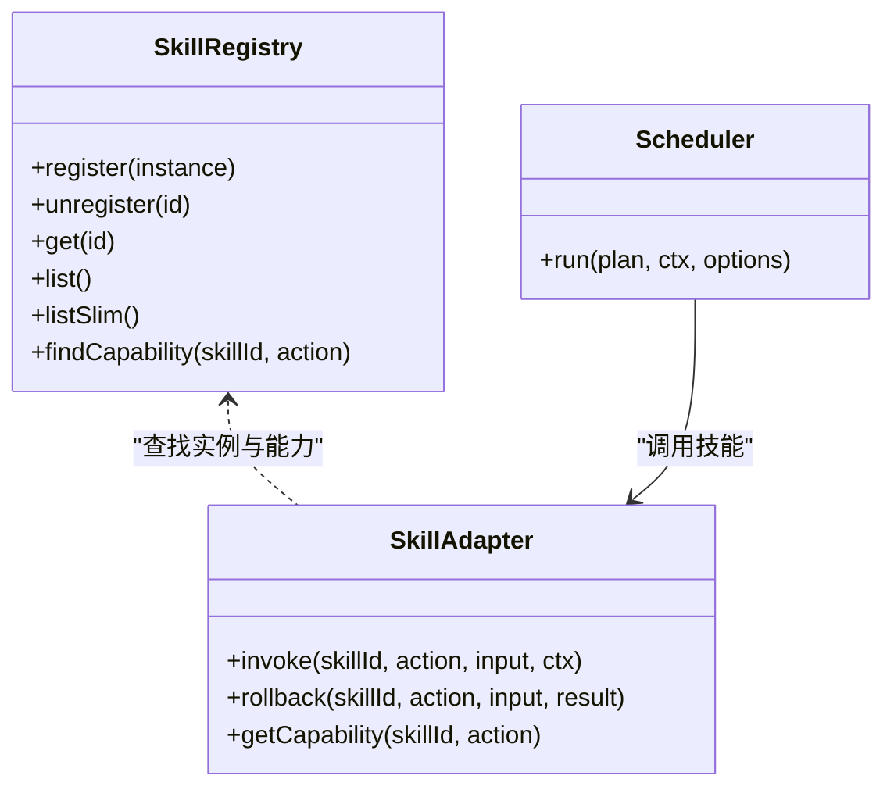
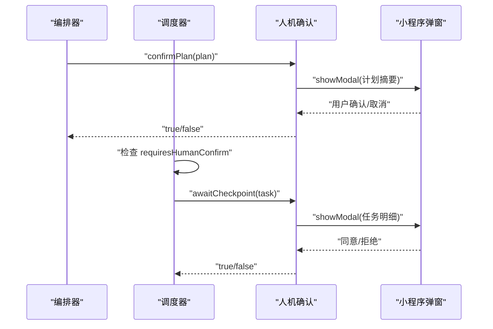
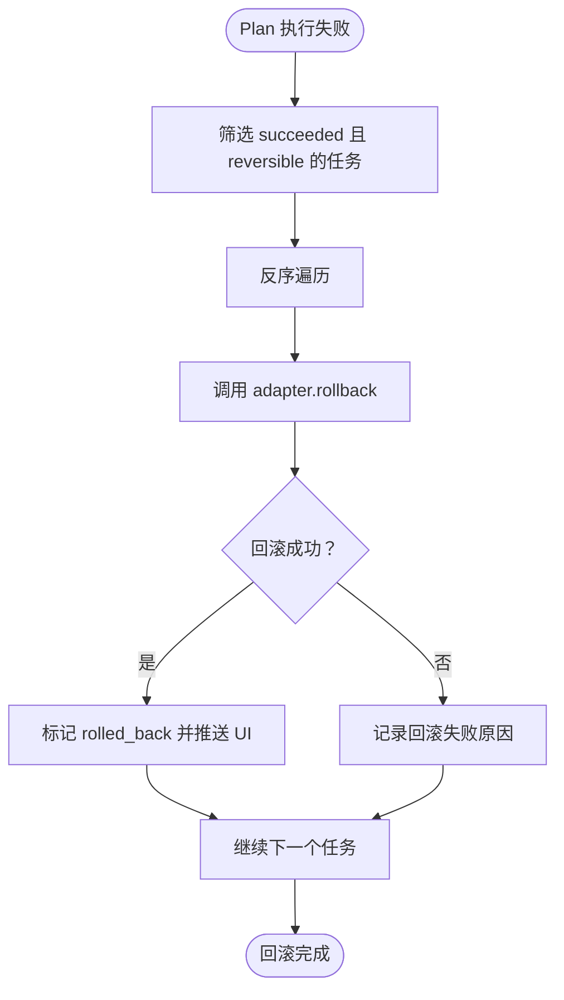
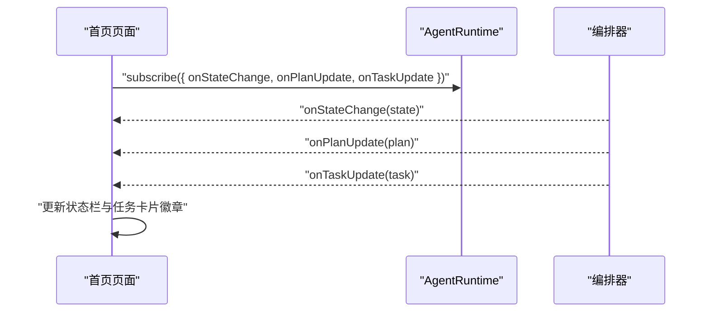

# 核心功能

<cite>
**本文引用的文件**   
- [orchestrator.ts](file://miniprogram/src/core/orchestrator.ts)
- [scheduler.ts](file://miniprogram/src/core/scheduler.ts)
- [client.ts](file://miniprogram/src/llm/client.ts)
- [rule-planner.ts](file://miniprogram/src/llm/rule-planner.ts)
- [registry.ts](file://miniprogram/src/skills/registry.ts)
- [adapter.ts](file://miniprogram/src/skills/adapter.ts)
- [checkpoint.ts](file://miniprogram/src/interaction/checkpoint.ts)
- [cloud.ts](file://miniprogram/src/services/cloud.ts)
- [index.ts（首頁）](file://miniprogram/pages/index/index.ts)
- [plan.d.ts](file://miniprogram/src/types/plan.d.ts)
- [task.d.ts](file://miniprogram/src/types/task.d.ts)
- [checkpoint.d.ts](file://miniprogram/src/types/checkpoint.d.ts)
</cite>

## 目录
1. [引言](#引言)
2. [项目结构](#项目结构)
3. [六大核心功能总览](#六大核心功能总览)
4. [架构总览](#架构总览)
5. [详细功能分析](#详细功能分析)
6. [依赖关系与数据流转](#依赖关系与数据流转)
7. [性能与可靠性特征](#性能与可靠性特征)
8. [故障排查指南](#故障排查指南)
9. [结论](#结论)

## 引言
本文件面向 WAIC-WeChat-MiniProgram 项目的核心能力，围绕以下六大特性展开：自然语言理解、智能任务规划、多技能协作、人机协作确认、事务一致性回滚、实时状态反馈。文档既给出高层业务视角，也提供代码级实现路径、交互流程与可视化图示，帮助开发者与产品人员快速理解系统如何把用户自然语言意图转化为可执行、可确认、可回滚、可观测的任务计划。

## 项目结构
本项目采用“前端小程序 + 云端容器”的混合架构：
- 小程序端负责对话界面、状态机编排、任务调度、技能适配、LLM 客户端封装与降级策略。
- 云端容器提供 LLM 聊天接口与具体业务 Skill 的后端实现。

图表来源
- [index.ts（首页）:117-152](file://miniprogram/pages/index/index.ts#L117-L152)
- [orchestrator.ts:13-26](file://miniprogram/src/core/orchestrator.ts#L13-L26)
- [client.ts:9-18](file://miniprogram/src/llm/client.ts#L9-L18)
- [registry.ts:16-17](file://miniprogram/src/skills/registry.ts#L16-L17)
- [cloud.ts:64-149](file://miniprogram/src/services/cloud.ts#L64-L149)

章节来源
- [index.ts（首页）:117-152](file://miniprogram/pages/index/index.ts#L117-L152)
- [orchestrator.ts:13-26](file://miniprogram/src/core/orchestrator.ts#L13-L26)
- [client.ts:9-18](file://miniprogram/src/llm/client.ts#L9-L18)
- [registry.ts:16-17](file://miniprogram/src/skills/registry.ts#L16-L17)
- [cloud.ts:64-149](file://miniprogram/src/services/cloud.ts#L64-L149)

## 六大核心功能总览
- 自然语言理解：将用户输入转换为结构化 Plan；当前 MVP 阶段直接通过，后续可扩展为 LLM 意图分类。
- 智能任务规划：调用云端 LLM 生成带依赖关系的任务 DAG；开发环境自动降级到本地规则规划器。
- 多技能协作：通过 Skill 注册中心与适配器，按能力元数据驱动多个 Skill 协同执行。
- 人机协作确认：Plan 整体确认与写操作单步确认，保证关键操作需用户授权。
- 事务一致性：失败时按反序撤销已成功且可逆的任务，保障数据一致性。
- 实时状态反馈：UI 订阅状态机与任务事件，即时更新状态栏与任务卡片徽章。

章节来源
- [client.ts:128-134](file://miniprogram/src/llm/client.ts#L128-L134)
- [client.ts:56-119](file://miniprogram/src/llm/client.ts#L56-L119)
- [rule-planner.ts:82-164](file://miniprogram/src/llm/rule-planner.ts#L82-L164)
- [registry.ts:16-60](file://miniprogram/src/skills/registry.ts#L16-L60)
- [checkpoint.ts:48-122](file://miniprogram/src/interaction/checkpoint.ts#L48-L122)
- [orchestrator.ts:278-303](file://miniprogram/src/core/orchestrator.ts#L278-L303)
- [index.ts（首页）:272-327](file://miniprogram/pages/index/index.ts#L272-L327)

## 架构总览
下图展示一次完整请求从用户输入到结果聚合的主控流程，以及各模块的职责边界。

图表来源
- [orchestrator.ts:106-221](file://miniprogram/src/core/orchestrator.ts#L106-L221)
- [client.ts:56-119](file://miniprogram/src/llm/client.ts#L56-L119)
- [cloud.ts:64-149](file://miniprogram/src/services/cloud.ts#L64-L149)
- [scheduler.ts:77-128](file://miniprogram/src/core/scheduler.ts#L77-L128)
- [adapter.ts:37-85](file://miniprogram/src/skills/adapter.ts#L37-L85)
- [registry.ts:35-60](file://miniprogram/src/skills/registry.ts#L35-L60)
- [checkpoint.ts:48-64](file://miniprogram/src/interaction/checkpoint.ts#L48-L64)

## 详细功能分析

### 1. 自然语言理解
- 工作原理：接收用户自然语言输入，判断是否需要澄清或直接进入规划阶段。当前 MVP 简化实现直接返回通过，未来可扩展为 LLM 意图分类。
- 技术实现：在 LLM 客户端中暴露 understand 方法；编排器在 handle 流程中先调用 understand，若需要澄清则提前返回并重置状态机。
- 用户价值：确保用户输入被正确识别，避免误触发无关技能；为后续规划提供稳定入口。
- 使用示例：用户说“帮我点一杯拿铁”，系统直接进入规划阶段；若语义模糊，系统会提示补充信息。

图表来源
- [client.ts:128-134](file://miniprogram/src/llm/client.ts#L128-L134)
- [orchestrator.ts:124-133](file://miniprogram/src/core/orchestrator.ts#L124-L133)

章节来源
- [client.ts:128-134](file://miniprogram/src/llm/client.ts#L128-L134)
- [orchestrator.ts:124-133](file://miniprogram/src/core/orchestrator.ts#L124-L133)

### 2. 智能任务规划
- 工作原理：根据用户意图与可用技能清单，调用云端 LLM 生成结构化 Plan（包含任务列表、依赖关系、摘要等）。开发环境下若云端不可用，自动降级到本地规则规划器。
- 技术实现：
  - 构建 Planner Prompt，传入 availableSkills 简表以降低 token 消耗。
  - 调用 callLLM 获取 LLM 输出，解析并验证为 Plan。
  - 兜底逻辑：若 LLM 未填充 intent，沿用用户输入。
  - 降级策略：在开发环境捕获 LLMError 或 CloudNetworkError，转用 rulePlan 生成同构 Plan。
- 用户价值：将模糊意图转化为明确、可执行的步骤，支持复杂场景的多步骤任务。
- 使用示例：
  - “明天北京到上海的高铁” → 生成查询车次与购票两个任务，后者依赖前者。
  - “附近有星巴克吗” → 生成门店搜索任务。

图表来源
- [client.ts:56-119](file://miniprogram/src/llm/client.ts#L56-L119)
- [rule-planner.ts:82-164](file://miniprogram/src/llm/rule-planner.ts#L82-L164)
- [cloud.ts:64-149](file://miniprogram/src/services/cloud.ts#L64-L149)

章节来源
- [client.ts:56-119](file://miniprogram/src/llm/client.ts#L56-L119)
- [rule-planner.ts:82-164](file://miniprogram/src/llm/rule-planner.ts#L82-L164)
- [cloud.ts:64-149](file://miniprogram/src/services/cloud.ts#L64-L149)

### 3. 多技能协作
- 工作原理：通过 Skill 注册中心统一管理所有技能实例，并通过适配器统一调用、参数校验与错误包装。调度器按依赖关系并行执行就绪任务，形成 DAG 协作。
- 技术实现：
  - 注册中心提供注册、列出、按 id 获取、按 (skillId, action) 查询能力等方法。
  - 适配器负责查找 SkillInstance、校验 inputSchema、记录埋点、统一错误转换。
  - 调度器维护任务索引，每轮找出依赖已满足的 pending 任务并并行执行。
- 用户价值：不同业务域（如高铁、咖啡、支付）以技能形式扩展，无需修改核心流程即可组合出复杂工作流。
- 使用示例：
  - 查询星巴克门店后下单，两任务串联。
  - 查询高铁车次后购票，两任务串联，购票需人类确认。

图表来源
- [registry.ts:16-60](file://miniprogram/src/skills/registry.ts#L16-L60)
- [adapter.ts:37-112](file://miniprogram/src/skills/adapter.ts#L37-L112)
- [scheduler.ts:77-128](file://miniprogram/src/core/scheduler.ts#L77-L128)

章节来源
- [registry.ts:16-60](file://miniprogram/src/skills/registry.ts#L16-L60)
- [adapter.ts:37-112](file://miniprogram/src/skills/adapter.ts#L37-L112)
- [scheduler.ts:77-128](file://miniprogram/src/core/scheduler.ts#L77-L128)

### 4. 人机协作确认
- 工作原理：对 Plan 整体进行确认；对写操作（requiresHumanConfirm）在执行前弹出确认框，展示任务摘要、类型与入参明细（金额感知）。
- 技术实现：
  - 编排器在 planning 完成后调用 confirmPlan 回调。
  - 调度器在 executeOne 中检测 requiresHumanConfirm，标记 waiting_human 并序列化等待用户确认。
  - 交互层通过 wx.showModal 显示确认框；若无 wx API 则降级为拒绝（测试模式）。
- 用户价值：关键操作必须经用户授权，防止误操作；金额类操作清晰展示明细与合计。
- 使用示例：
  - 购票下单前弹窗展示乘客信息与车次。
  - 咖啡下单前弹窗展示饮品、数量与价格合计。

图表来源
- [orchestrator.ts:152-173](file://miniprogram/src/core/orchestrator.ts#L152-L173)
- [scheduler.ts:163-186](file://miniprogram/src/core/scheduler.ts#L163-L186)
- [checkpoint.ts:48-122](file://miniprogram/src/interaction/checkpoint.ts#L48-L122)

章节来源
- [orchestrator.ts:152-173](file://miniprogram/src/core/orchestrator.ts#L152-L173)
- [scheduler.ts:163-186](file://miniprogram/src/core/scheduler.ts#L163-L186)
- [checkpoint.ts:48-122](file://miniprogram/src/interaction/checkpoint.ts#L48-L122)

### 5. 事务一致性
- 工作原理：当 Plan 执行失败时，按反序撤销已成功且可逆的任务，尽可能恢复系统状态；单任务回滚失败仅记录日志继续处理其他任务。
- 技术实现：
  - 编排器在 finalPlan.status === 'failed' 时调用 rollbackIfNeeded。
  - 通过 getCapability 判断 reversible 能力，反序遍历目标任务并调用 adapter.rollback。
  - 回滚成功则将任务状态置为 rolled_back 并推送 UI 更新。
- 用户价值：保证数据一致性，降低部分失败带来的脏数据风险。
- 使用示例：
  - 若购票成功后某项关联操作失败，系统尝试撤销购票。
  - 若回滚不可逆或未实现，则记录原因并继续完成回滚流程。

图表来源
- [orchestrator.ts:278-303](file://miniprogram/src/core/orchestrator.ts#L278-L303)
- [adapter.ts:87-107](file://miniprogram/src/skills/adapter.ts#L87-L107)

章节来源
- [orchestrator.ts:278-303](file://miniprogram/src/core/orchestrator.ts#L278-L303)
- [adapter.ts:87-107](file://miniprogram/src/skills/adapter.ts#L87-L107)

### 6. 实时状态反馈
- 工作原理：页面订阅 AgentRuntime 的状态变更、Plan 生成与任务进度事件，实时更新状态栏文案与任务卡片徽章。
- 技术实现：
  - 首页 onLoad 订阅 onStateChange、onPlanUpdate、onTaskUpdate。
  - onAgentStateChange 更新 stateLabel；onAgentPlanUpdate 追加计划卡片；onAgentTaskUpdate 就地更新对应卡片徽章。
  - 编排器在状态转移与任务更新时触发 onStateChange 与 onTaskUpdate。
- 用户价值：用户能直观看到“理解意图中 → 拆解任务中 → 等待确认 → 执行中 → 已完成/失败”的全链路进度。
- 使用示例：
  - 点击示例按钮“明天北京到上海的高铁”，页面立即显示状态变化与任务卡片。
  - 任务状态从“排队中”变为“执行中”“待确认”“成功”“失败”“已回滚”。

图表来源
- [index.ts（首页）:141-152](file://miniprogram/pages/index/index.ts#L141-L152)
- [index.ts（首页）:272-327](file://miniprogram/pages/index/index.ts#L272-L327)
- [orchestrator.ts:305-328](file://miniprogram/src/core/orchestrator.ts#L305-L328)

章节来源
- [index.ts（首页）:141-152](file://miniprogram/pages/index/index.ts#L141-L152)
- [index.ts（首页）:272-327](file://miniprogram/pages/index/index.ts#L272-L327)
- [orchestrator.ts:305-328](file://miniprogram/src/core/orchestrator.ts#L305-L328)

## 依赖关系与数据流转
- 依赖方向：遵循“interaction → core → skills → llm”的单向不可逆依赖规范。core 不反向依赖 interaction 或 skills 的具体实现，只依赖类型声明与适配器接口。
- 数据流转：
  - 用户意图 → understand → plan → Plan(draft) → confirmPlan → run → tasks → aggregate → AgentResponse。
  - 任务间通过 inputBindings 传递数据，调度器在运行前解析绑定值。
  - 状态机在 idle/understanding/planning/confirming_plan/executing/awaiting_human/aggregating/completed/failed/rolling_back 之间转移。

图表来源
- [orchestrator.ts:106-221](file://miniprogram/src/core/orchestrator.ts#L106-L221)
- [scheduler.ts:149-204](file://miniprogram/src/core/scheduler.ts#L149-L204)
- [plan.d.ts:19-33](file://miniprogram/src/types/plan.d.ts#L19-L33)
- [task.d.ts:29-59](file://miniprogram/src/types/task.d.ts#L29-L59)

章节来源
- [orchestrator.ts:106-221](file://miniprogram/src/core/orchestrator.ts#L106-L221)
- [scheduler.ts:149-204](file://miniprogram/src/core/scheduler.ts#L149-L204)
- [plan.d.ts:19-33](file://miniprogram/src/types/plan.d.ts#L19-L33)
- [task.d.ts:29-59](file://miniprogram/src/types/task.d.ts#L29-L59)

## 性能与可靠性特征
- LLM 调用优化：
  - 使用 temperature=0.3、maxTokens=1500、jsonMode=true 提升稳定性与效率。
  - 开发环境降級避免阻塞演示流程。
- 云端调用容错：
  - 统一超时与重试策略，区分开发与正式环境行为。
  - 开发环境将不可用归一为 code:-1，便于 mock 与规则规划器兜底。
- 任务调度并发控制：
  - 每轮并行执行 ready 任务（Promise.allSettled），提高吞吐。
  - 死锁检测与迭代次数上限保护。
- 人机确认串行化：
  - 通过 Promise 链串行化 checkpoint，避免弹窗覆盖导致确认丢失。
- 令牌机制防并发：
  - runToken 使旧轮次失效，防止 reset 后重复弹窗与并发双跑。

章节来源
- [client.ts:72-99](file://miniprogram/src/llm/client.ts#L72-L99)
- [cloud.ts:123-149](file://miniprogram/src/services/cloud.ts#L123-L149)
- [scheduler.ts:116-120](file://miniprogram/src/core/scheduler.ts#L116-L120)
- [scheduler.ts:54-74](file://miniprogram/src/core/scheduler.ts#L54-L74)
- [orchestrator.ts:79-84](file://miniprogram/src/core/orchestrator.ts#L79-L84)

## 故障排查指南
- LLM 调用失败：
  - 现象：返回 PlannerLLMError 或云端网络错误。
  - 排查：检查云端是否部署、LLM_BASE_URL 与 LLM_API_KEY 配置是否正确；开发环境允许降级，正式发布保持严格失败语义。
- 云端容器不可用：
  - 现象：callContainer 返回 code:-1 或抛出 CloudNetworkError。
  - 排查：确认 wx.cloud.init 已初始化；开发环境允许降级，正式版保留重试语义。
- 任务死锁：
  - 现象：调度器抛出 SchedulerDeadlockError。
  - 排查：检查任务依赖图是否存在环或无法推进的 pending 任务。
- 人机确认丢失：
  - 现象：多个写操作同时弹窗导致确认结果丢失。
  - 排查：确认 checkpoint 串行化机制生效；避免并发触发多个写操作。
- 状态机异常：
  - 现象：非法状态转移告警或 BUSY 守卫拦截。
  - 排查：确保 early return（clarify/EMPTY_PLAN）后状态机归位至 idle。

章节来源
- [client.ts:83-119](file://miniprogram/src/llm/client.ts#L83-L119)
- [cloud.ts:92-119](file://miniprogram/src/services/cloud.ts#L92-L119)
- [scheduler.ts:102-114](file://miniprogram/src/core/scheduler.ts#L102-L114)
- [scheduler.ts:54-74](file://miniprogram/src/core/scheduler.ts#L54-L74)
- [orchestrator.ts:124-146](file://miniprogram/src/core/orchestrator.ts#L124-L146)

## 结论
WAIC-WeChat-MiniProgram 通过编排器与调度器的配合，将自然语言意图转化为可执行、可确认、可回滚、可观测的任务计划。系统在开发环境具备完善的降级策略，在正式环境保持严格的失败语义与重试机制。六大核心功能相互协作，形成从理解、规划、协作、确认到一致性与反馈的完整闭环，为用户提供了直观、可靠、可扩展的智能助手体验。