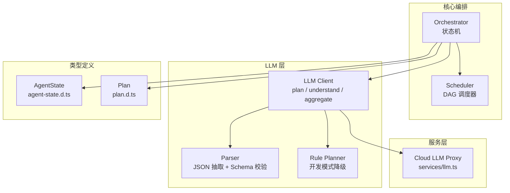
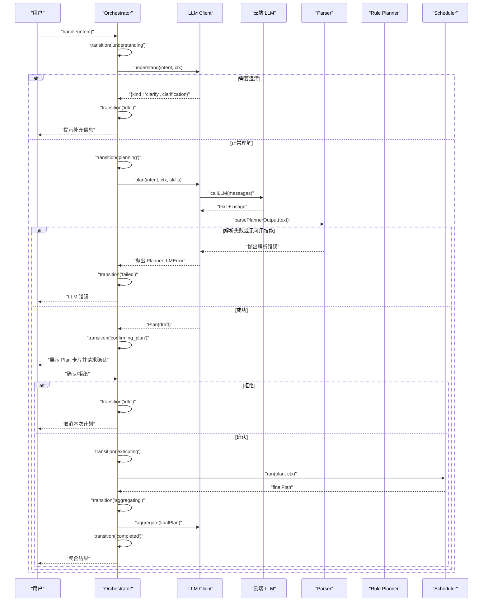
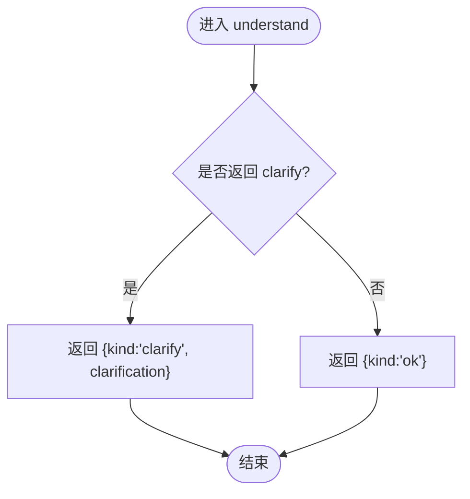
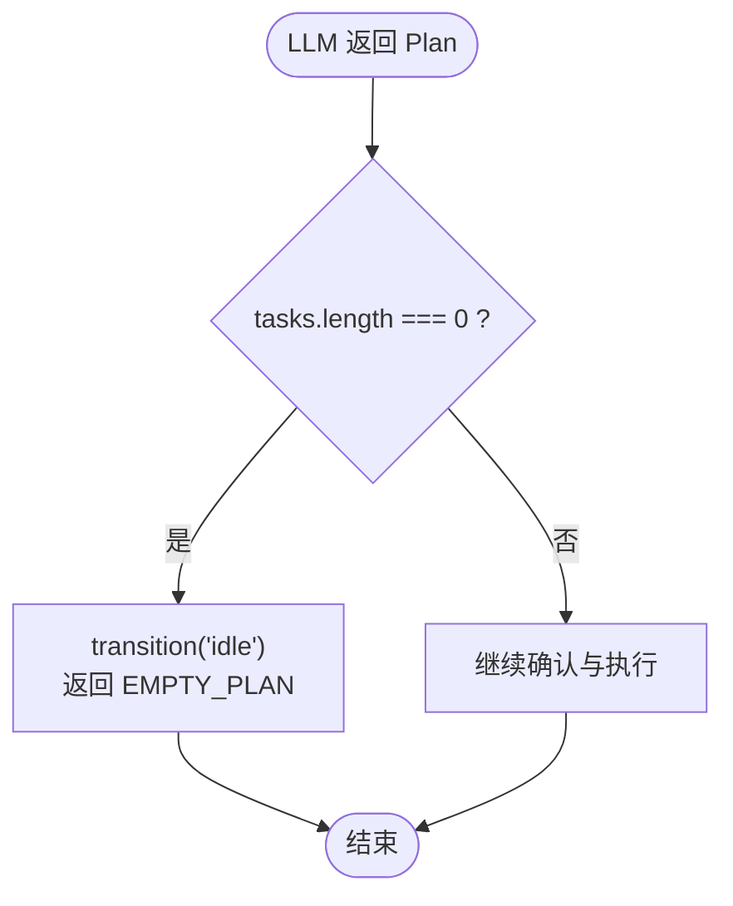
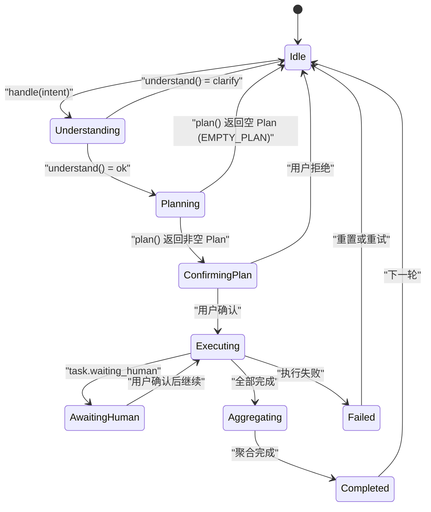
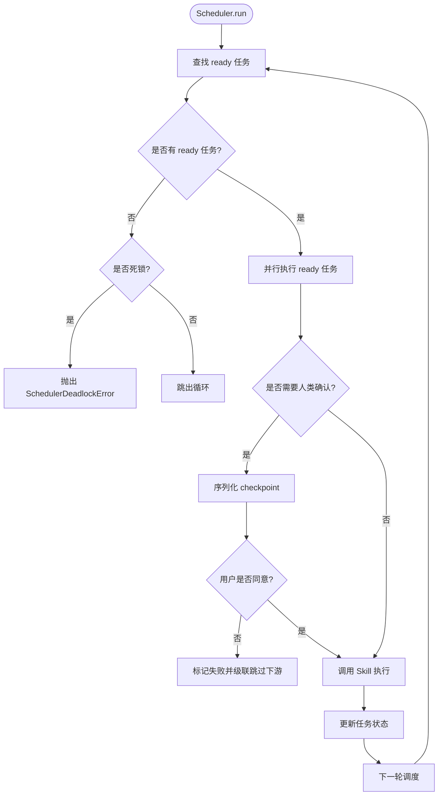
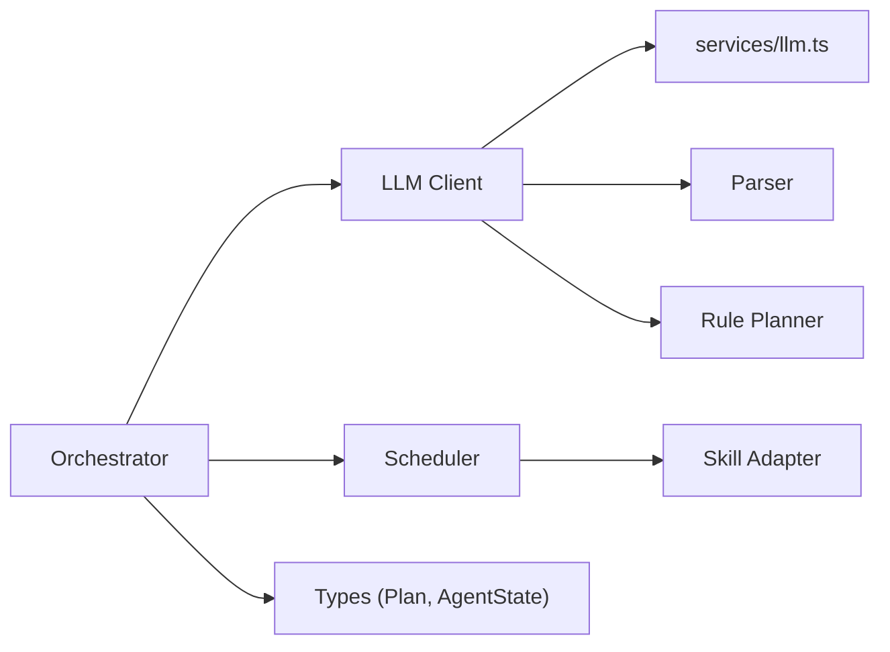

# 自然语言理解

<cite>
**本文引用的文件**   
- [orchestrator.ts](file://miniprogram/src/core/orchestrator.ts)
- [client.ts](file://miniprogram/src/llm/client.ts)
- [parser.ts](file://miniprogram/src/llm/parser.ts)
- [rule-planner.ts](file://miniprogram/src/llm/rule-planner.ts)
- [scheduler.ts](file://miniprogram/src/core/scheduler.ts)
- [agent-state.d.ts](file://miniprogram/src/types/agent-state.d.ts)
- [plan.d.ts](file://miniprogram/src/types/plan.d.ts)
- [llm.ts](file://miniprogram/src/services/llm.ts)
</cite>

## 目录
1. [引言](#引言)
2. [项目结构](#项目结构)
3. [核心组件](#核心组件)
4. [架构总览](#架构总览)
5. [详细组件分析](#详细组件分析)
6. [依赖关系分析](#依赖关系分析)
7. [性能与可靠性](#性能与可靠性)
8. [故障排查指南](#故障排查指南)
9. [结论](#结论)
10. [附录：用户输入处理示例](#附录用户输入处理示例)

## 引言
本文面向 WAIC-WeChat-MiniProgram 项目的“自然语言理解”能力，重点说明 LLM 如何解析用户意图、Orchestrator 状态机如何驱动理解→规划→确认→执行→聚合的完整流程，并解释以下关键机制：
- 意图识别（understand）
- 澄清机制（clarify）
- 空计划处理（EMPTY_PLAN）
- 与 Orchestrator 状态机的集成
- 通过 LLM 进行上下文理解与多轮对话支持

本说明以代码级实现为依据，结合时序图、流程图和类图帮助读者建立从“用户一句话”到“可执行任务计划”的清晰认知。

## 项目结构
与 NLU 相关的核心代码分布在如下模块：
- core/orchestrator.ts：编排器与状态机，负责调用 understand、plan、调度执行与结果聚合
- llm/client.ts：LLM 客户端统一接口，封装 plan、understand、aggregate
- llm/parser.ts：LLM 结构化输出解析器，抽取 JSON、校验 schema、转换为 Plan
- llm/rule-planner.ts：规则式任务规划器，作为开发环境降级方案
- core/scheduler.ts：DAG 调度器，负责任务并行执行、checkpoint 人类确认、死锁检测
- types/agent-state.d.ts：AgentState 状态机类型定义
- types/plan.d.ts：Plan 类型定义
- services/llm.ts：云端 LLM 调用封装



**图表来源**
- [orchestrator.ts:1-340](file://miniprogram/src/core/orchestrator.ts#L1-L340)
- [client.ts:1-153](file://miniprogram/src/llm/client.ts#L1-L153)
- [parser.ts:1-127](file://miniprogram/src/llm/parser.ts#L1-L127)
- [rule-planner.ts:1-165](file://miniprogram/src/llm/rule-planner.ts#L1-L165)
- [scheduler.ts:1-245](file://miniprogram/src/core/scheduler.ts#L1-L245)
- [agent-state.d.ts:1-47](file://miniprogram/src/types/agent-state.d.ts#L1-L47)
- [plan.d.ts:1-51](file://miniprogram/src/types/plan.d.ts#L1-L51)
- [llm.ts:1-83](file://miniprogram/src/services/llm.ts#L1-L83)

**章节来源**
- [orchestrator.ts:1-340](file://miniprogram/src/core/orchestrator.ts#L1-L340)
- [client.ts:1-153](file://miniprogram/src/llm/client.ts#L1-L153)
- [parser.ts:1-127](file://miniprogram/src/llm/parser.ts#L1-L127)
- [rule-planner.ts:1-165](file://miniprogram/src/llm/rule-planner.ts#L1-L165)
- [scheduler.ts:1-245](file://miniprogram/src/core/scheduler.ts#L1-L245)
- [agent-state.d.ts:1-47](file://miniprogram/src/types/agent-state.d.ts#L1-L47)
- [plan.d.ts:1-51](file://miniprogram/src/types/plan.d.ts#L1-L51)
- [llm.ts:1-83](file://miniprogram/src/services/llm.ts#L1-L83)

## 核心组件
- Orchestrator（编排器）
  - 维护 AgentState 状态机，控制理解→规划→确认→执行→聚合的流转
  - 处理 clarify（需补充信息）、EMPTY_PLAN（无法识别意图）等提前返回路径
  - 管理 runToken 防止并发双跑与 reset 后残留状态导致 BUSY 死锁
- LLM Client（LLM 客户端）
  - plan：构造 Prompt、调用云端 LLM、解析输出、兜底规则规划器
  - understand：当前 MVP 直接通过，预留扩展为分类模型
  - aggregate：将 Task 结果聚合为人类可读消息
- Parser（解析器）
  - extractJson：从 LLM 原始文本中抽取 JSON（支持 Markdown 包裹）
  - validatePlannerOutput：校验 tasks 数组及字段完整性
  - toPlan：将 LLM 输出标准化为 Plan 结构
- Rule Planner（规则规划器）
  - 基于关键词匹配生成与 LLM Planner 同构的 PlannerLLMOutput
  - 用于开发环境降级，保证全链路本地演示
- Scheduler（调度器）
  - DAG 并行执行 ready 任务，支持 inputBindings 参数绑定
  - checkpoint 串行化确保同一时刻仅一个确认弹窗
  - 死锁检测与失败回滚联动

**章节来源**
- [orchestrator.ts:28-89](file://miniprogram/src/core/orchestrator.ts#L28-L89)
- [client.ts:20-120](file://miniprogram/src/llm/client.ts#L20-L120)
- [parser.ts:15-122](file://miniprogram/src/llm/parser.ts#L15-L122)
- [rule-planner.ts:75-164](file://miniprogram/src/llm/rule-planner.ts#L75-L164)
- [scheduler.ts:27-128](file://miniprogram/src/core/scheduler.ts#L27-L128)

## 架构总览
下图展示从用户输入到最终结果的端到端流程，包括理解、规划、确认、执行、聚合以及异常分支。



**图表来源**
- [orchestrator.ts:106-256](file://miniprogram/src/core/orchestrator.ts#L106-L256)
- [client.ts:56-120](file://miniprogram/src/llm/client.ts#L56-L120)
- [parser.ts:117-122](file://miniprogram/src/llm/parser.ts#L117-L122)
- [scheduler.ts:77-128](file://miniprogram/src/core/scheduler.ts#L77-L128)

## 详细组件分析

### 意图识别与澄清机制（understand）
- 当前 MVP 的 understand 直接返回 ok，不做复杂 NLU；未来可扩展为分类模型或调用 LLM 做意图判断
- 当返回 kind === 'clarify' 时，Orchestrator 会立即转回 idle，并向用户返回 clarification 提示，避免后续请求被 BUSY 守卫拦截



**图表来源**
- [client.ts:128-134](file://miniprogram/src/llm/client.ts#L128-L134)
- [orchestrator.ts:125-133](file://miniprogram/src/core/orchestrator.ts#L125-L133)

**章节来源**
- [client.ts:128-134](file://miniprogram/src/llm/client.ts#L128-L134)
- [orchestrator.ts:125-133](file://miniprogram/src/core/orchestrator.ts#L125-L133)

### 空计划处理（EMPTY_PLAN）
- 当 LLM 返回的 Plan.tasks 为空时，Orchestrator 将其视为“无法识别意图”，转回 idle 并返回 EMPTY_PLAN 错误码
- 规则规划器在无法识别时也会返回 tasks 为空，走相同路径



**图表来源**
- [orchestrator.ts:138-146](file://miniprogram/src/core/orchestrator.ts#L138-L146)
- [rule-planner.ts:157-163](file://miniprogram/src/llm/rule-planner.ts#L157-L163)

**章节来源**
- [orchestrator.ts:138-146](file://miniprogram/src/core/orchestrator.ts#L138-L146)
- [rule-planner.ts:157-163](file://miniprogram/src/llm/rule-planner.ts#L157-L163)

### LLM 规划与解析（plan + parser）
- plan 函数构造 Prompt，调用云端 LLM，并在开发环境不可用时降级到 rule-planner
- parser 负责从 LLM 原始文本抽取 JSON、校验 schema、转换为标准 Plan
- 若解析失败，抛出 LLMParserError，由 client 包装为 PlannerLLMError

```mermaid
classDiagram
class PlannerLLMError {
+message : string
+cause? : unknown
}
class LLMParserError {
+message : string
+rawText? : string
}
class LLMClient {
+plan(intent, ctx, skills) Plan
+understand(intent, ctx) {kind, clarification?}
+aggregate(plan, aiTag) string
}
class Parser {
+extractJson(rawText) unknown
+validatePlannerOutput(raw) PlannerLLMOutput
+toPlan(llm, intent, planId) Plan
+parsePlannerOutput(rawText, intent, planId) Plan
}
class RulePlanner {
+rulePlan(intent, ctx) PlannerLLMOutput
}
LLMClient --> Parser : "解析输出"
LLMClient --> RulePlanner : "开发环境降级"
LLMClient --> PlannerLLMError : "抛出"
Parser --> LLMParserError : "抛出"
```

**图表来源**
- [client.ts:20-120](file://miniprogram/src/llm/client.ts#L20-L120)
- [parser.ts:15-122](file://miniprogram/src/llm/parser.ts#L15-L122)
- [rule-planner.ts:75-164](file://miniprogram/src/llm/rule-planner.ts#L75-L164)

**章节来源**
- [client.ts:56-120](file://miniprogram/src/llm/client.ts#L56-L120)
- [parser.ts:40-122](file://miniprogram/src/llm/parser.ts#L40-L122)
- [rule-planner.ts:75-164](file://miniprogram/src/llm/rule-planner.ts#L75-L164)

### 与 Orchestrator 状态机的集成
- Orchestrator 维护 ALLOWED_TRANSITIONS 表，严格控制状态转移
- understanding/planning 阶段若提前返回（clarify 或 EMPTY_PLAN），必须显式 transition('idle')，否则会导致 BUSY 永久死锁
- executing 阶段可能因 task.waiting_human 转为 awaiting_human，完成后回到 executing



**图表来源**
- [orchestrator.ts:60-71](file://miniprogram/src/core/orchestrator.ts#L60-L71)
- [orchestrator.ts:106-256](file://miniprogram/src/core/orchestrator.ts#L106-L256)
- [agent-state.d.ts:7-17](file://miniprogram/src/types/agent-state.d.ts#L7-L17)

**章节来源**
- [orchestrator.ts:60-71](file://miniprogram/src/core/orchestrator.ts#L60-L71)
- [orchestrator.ts:106-256](file://miniprogram/src/core/orchestrator.ts#L106-L256)
- [agent-state.d.ts:7-17](file://miniprogram/src/types/agent-state.d.ts#L7-L17)

### 调度器与人类确认（checkpoint）
- Scheduler 每轮找出依赖已满足且 pending 的任务，并行执行
- 写操作 requiresHumanConfirm 时，触发 checkpoint 串行化确认，避免弹窗冲突
- 死锁检测：若无 ready 任务且仍有 pending 任务，则抛出死锁错误



**图表来源**
- [scheduler.ts:77-128](file://miniprogram/src/core/scheduler.ts#L77-L128)
- [scheduler.ts:139-204](file://miniprogram/src/core/scheduler.ts#L139-L204)

**章节来源**
- [scheduler.ts:77-128](file://miniprogram/src/core/scheduler.ts#L77-L128)
- [scheduler.ts:139-204](file://miniprogram/src/core/scheduler.ts#L139-L204)

## 依赖关系分析
- Orchestrator 依赖 LLM Client（plan/understand/aggregate）、Scheduler、SkillRegistry、Logger、ID 生成器等
- LLM Client 依赖 services/llm.ts 进行云端调用，依赖 parser 进行输出解析，依赖 rule-planner 进行开发环境降级
- Parser 依赖 Plan/Task 类型定义，不反向依赖业务逻辑
- Scheduler 依赖 skill adapter 执行具体任务，依赖 checkpoint 回调进行人类确认



**图表来源**
- [orchestrator.ts:13-26](file://miniprogram/src/core/orchestrator.ts#L13-L26)
- [client.ts:9-18](file://miniprogram/src/llm/client.ts#L9-L18)
- [scheduler.ts:18-26](file://miniprogram/src/core/scheduler.ts#L18-L26)

**章节来源**
- [orchestrator.ts:13-26](file://miniprogram/src/core/orchestrator.ts#L13-L26)
- [client.ts:9-18](file://miniprogram/src/llm/client.ts#L9-L18)
- [scheduler.ts:18-26](file://miniprogram/src/core/scheduler.ts#L18-L26)

## 性能与可靠性
- LLM 调用采用重试机制（最多 3 次），避免瞬时网络波动影响
- 开发环境自动降级到规则规划器，保证本地演示可用性
- Scheduler 使用 Promise.allSettled 并行执行 ready 任务，提升吞吐
- checkpoint 串行化避免 UI 弹窗冲突，确保用户确认结果可靠
- Orchestrator 使用 runToken 防止 reset 后并发双跑，避免重复下单与交错弹窗

[本节为通用指导，不涉及具体文件分析]

## 故障排查指南
- LLM 调用失败
  - 检查 services/llm.ts 的重试逻辑与错误码映射
  - 开发环境注意 devFallbackReason 的判断条件
- 解析失败
  - 检查 parser.ts 的 extractJson 与 validatePlannerOutput 逻辑
  - 查看 LLM 原始输出是否符合预期结构
- 空计划
  - 检查 rule-planner.ts 的关键词匹配是否覆盖用户输入
  - 确认 Orchestrator 是否正确处理 EMPTY_PLAN 并转回 idle
- 死锁
  - 检查 scheduler.ts 的死锁检测逻辑与任务依赖关系
  - 确认 inputBindings 是否正确解析

**章节来源**
- [llm.ts:57-83](file://miniprogram/src/services/llm.ts#L57-L83)
- [parser.ts:40-87](file://miniprogram/src/llm/parser.ts#L40-L87)
- [rule-planner.ts:82-164](file://miniprogram/src/llm/rule-planner.ts#L82-L164)
- [scheduler.ts:102-114](file://miniprogram/src/core/scheduler.ts#L102-L114)

## 结论
本项目通过 Orchestrator 状态机驱动 NLU 全流程，结合 LLM 与规则规划器实现灵活的意图理解与任务规划。understand 当前为 MVP 直通模式，未来可扩展为更智能的分类模型；clarify 与 EMPTY_PLAN 机制确保用户体验与系统稳定性；Scheduler 的并行执行与 checkpoint 串行化保障了高吞吐与高可靠性。整体架构清晰、职责分离，便于扩展与维护。

[本节为总结性内容，不涉及具体文件分析]

## 附录：用户输入处理示例
以下为不同类型用户输入的处理方式与对应代码路径：

- 模糊意图（需要澄清）
  - 行为：understand 返回 clarify，Orchestrator 提示用户补充信息
  - 代码路径：[client.ts:128-134](file://miniprogram/src/llm/client.ts#L128-L134), [orchestrator.ts:125-133](file://miniprogram/src/core/orchestrator.ts#L125-L133)

- 需要补充信息的场景（如未指定日期、城市）
  - 行为：规则规划器根据关键词生成任务，若缺失必要参数则返回空 tasks，触发 EMPTY_PLAN
  - 代码路径：[rule-planner.ts:82-164](file://miniprogram/src/llm/rule-planner.ts#L82-L164), [orchestrator.ts:138-146](file://miniprogram/src/core/orchestrator.ts#L138-L146)

- 无法识别的意图
  - 行为：LLM 返回空 tasks 或解析失败，Orchestrator 返回 EMPTY_PLAN 或 LLM_ERROR
  - 代码路径：[orchestrator.ts:138-146](file://miniprogram/src/core/orchestrator.ts#L138-L146), [client.ts:109-115](file://miniprogram/src/llm/client.ts#L109-L115)

- 多轮对话支持
  - 行为：Orchestrator 在 completed/failed 后允许回到 idle，支持新一轮 handle
  - 代码路径：[orchestrator.ts:120-124](file://miniprogram/src/core/orchestrator.ts#L120-L124), [orchestrator.ts:258-270](file://miniprogram/src/core/orchestrator.ts#L258-L270)

**章节来源**
- [client.ts:128-134](file://miniprogram/src/llm/client.ts#L128-L134)
- [orchestrator.ts:125-146](file://miniprogram/src/core/orchestrator.ts#L125-L146)
- [rule-planner.ts:82-164](file://miniprogram/src/llm/rule-planner.ts#L82-L164)
- [client.ts:109-115](file://miniprogram/src/llm/client.ts#L109-L115)
- [orchestrator.ts:120-124](file://miniprogram/src/core/orchestrator.ts#L120-L124)
- [orchestrator.ts:258-270](file://miniprogram/src/core/orchestrator.ts#L258-L270)