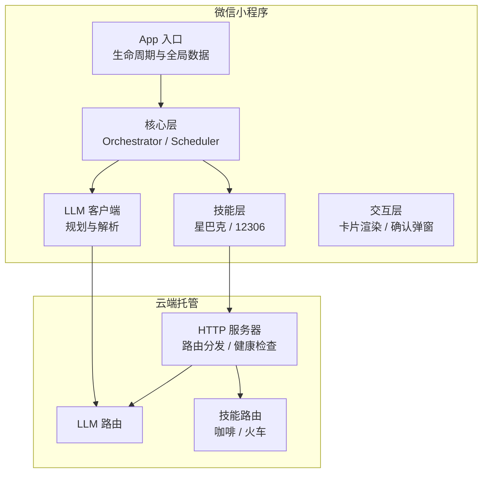
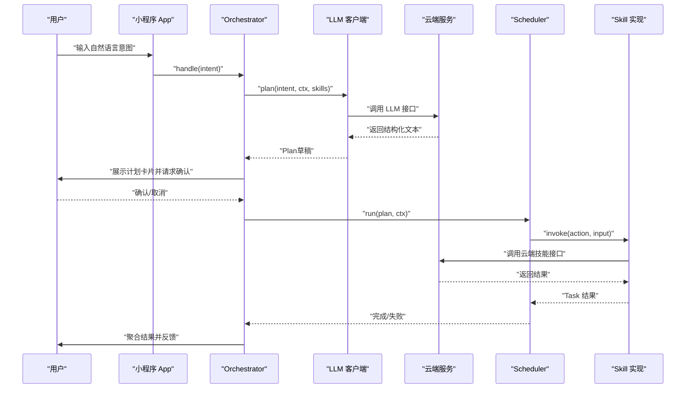
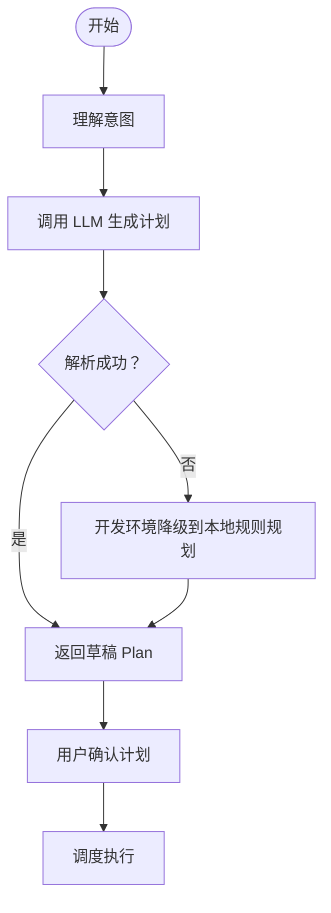
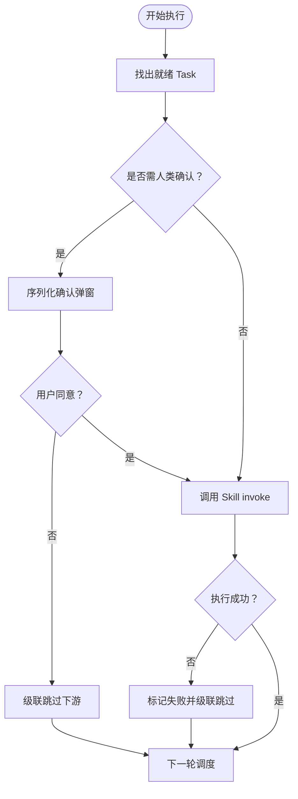
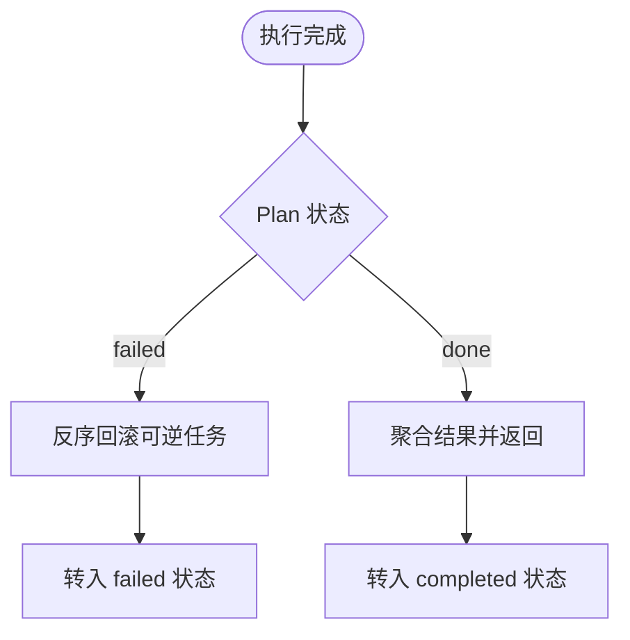
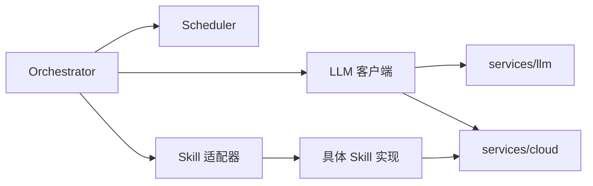

# 项目介绍

<cite>
**本文引用的文件**   
- [package.json](file://package.json)
- [app.ts](file://miniprogram/app.ts)
- [orchestrator.ts](file://miniprogram/src/core/orchestrator.ts)
- [scheduler.ts](file://miniprogram/src/core/scheduler.ts)
- [client.ts](file://miniprogram/src/llm/client.ts)
- [coffee-starbucks/index.ts](file://miniprogram/src/skills/builtin/coffee-starbucks/index.ts)
- [train-12306/index.ts](file://miniprogram/src/skills/builtin/train-12306/index.ts)
- [server.ts](file://cloudrun/src/server.ts)
</cite>

## 目录
1. [引言](#引言)
2. [项目结构](#项目结构)
3. [核心组件](#核心组件)
4. [架构总览](#架构总览)
5. [关键流程与数据流](#关键流程与数据流)
6. [依赖关系分析](#依赖关系分析)
7. [性能与可靠性特性](#性能与可靠性特性)
8. [适用场景与价值主张](#适用场景与价值主张)
9. [常见问题与排错建议](#常见问题与排错建议)
10. [结论](#结论)

## 引言
本项目名为 MicroMate，目标是在微信小程序环境中构建一个基于 AI 的智能任务编排 Agent。它把自然语言意图转化为跨 SKILL 的复杂任务计划，并通过 DAG 调度器并行执行、人机协作确认与失败回滚，最终聚合结果并反馈给用户。项目同时提供云端托管服务，用于 LLM 对话、技能路由与健康检查，形成“小程序前端 + 云端后端”的完整闭环。

项目的核心价值在于：
- 在移动端小程序中集成大语言模型能力，实现跨领域任务的自动化编排。
- 通过 Agent 架构与 DAG 调度，将多步骤、多系统调用串联为可解释、可观测、可回滚的任务流。
- 以人机协作确认机制保障写操作安全，提升用户体验与系统可靠性。

## 项目结构
仓库采用“小程序前端 + 云端托管服务”的双端结构：
- miniprogram：微信小程序前端，包含 Agent Runtime、LLM 客户端、SKILL 注册与内置技能（星巴克咖啡、12306 火车票）、交互层、存储与服务封装等。
- cloudrun：Node.js 云端服务，提供统一 HTTP 入口、健康检查、LLM 路由与各 SKILL 路由。

图表来源
- [app.ts:23-48](file://miniprogram/app.ts#L23-L48)
- [orchestrator.ts:74-119](file://miniprogram/src/core/orchestrator.ts#L74-L119)
- [client.ts:56-119](file://miniprogram/src/llm/client.ts#L56-L119)
- [server.ts:76-128](file://cloudrun/src/server.ts#L76-L128)

章节来源
- [package.json:1-23](file://package.json#L1-L23)
- [app.ts:1-49](file://miniprogram/app.ts#L1-L49)

## 核心组件
- Orchestrator（编排器）：维护 Agent 状态机，负责理解意图、生成计划、用户确认、调度执行、结果聚合与失败回滚。
- Scheduler（DAG 调度器）：按依赖关系并行执行 Task，处理 checkpoint 人机确认、级联跳过、死锁检测与运行令牌失效中止。
- LLM 客户端：构造 Planner Prompt，调用云端 LLM，解析输出为 Plan；开发环境支持本地规则式规划降级。
- Skill 层：定义各技能的元数据、输入输出 Schema、幂等性、可逆性与是否需要人类确认；内置星巴克咖啡与 12306 火车票两个示例技能。
- 云端服务：统一 HTTP 入口、健康检查、JSON 解析、路由分发与错误码标准化。

章节来源
- [orchestrator.ts:74-340](file://miniprogram/src/core/orchestrator.ts#L74-L340)
- [scheduler.ts:77-245](file://miniprogram/src/core/scheduler.ts#L77-L245)
- [client.ts:56-153](file://miniprogram/src/llm/client.ts#L56-L153)
- [coffee-starbucks/index.ts:58-177](file://miniprogram/src/skills/builtin/coffee-starbucks/index.ts#L58-L177)
- [train-12306/index.ts:69-190](file://miniprogram/src/skills/builtin/train-12306/index.ts#L69-L190)
- [server.ts:76-128](file://cloudrun/src/server.ts#L76-L128)

## 架构总览
MicroMate 的整体架构围绕“意图 → 计划 → 确认 → 执行 → 聚合”的主链路展开，并在关键写操作处引入人机协作确认，确保业务安全。

图表来源
- [orchestrator.ts:106-221](file://miniprogram/src/core/orchestrator.ts#L106-L221)
- [client.ts:56-119](file://miniprogram/src/llm/client.ts#L56-L119)
- [server.ts:76-128](file://cloudrun/src/server.ts#L76-L128)
- [scheduler.ts:77-127](file://miniprogram/src/core/scheduler.ts#L77-L127)

## 关键流程与数据流

### 意图理解与计划生成
- Orchestrator 进入 understanding 阶段，调用 LLM 客户端进行理解（当前 MVP 直接通过）。
- 随后进入 planning 阶段，LLM 客户端构造 Planner Prompt，传入可用 SKILL 简表，调用云端 LLM 接口。
- 云端返回结构化文本后，客户端解析为 Plan，若解析失败则抛出特定错误；开发环境可在云端不可用时降级到本地规则式规划器。

图表来源
- [orchestrator.ts:124-148](file://miniprogram/src/core/orchestrator.ts#L124-L148)
- [client.ts:65-119](file://miniprogram/src/llm/client.ts#L65-L119)

章节来源
- [orchestrator.ts:106-148](file://miniprogram/src/core/orchestrator.ts#L106-L148)
- [client.ts:56-119](file://miniprogram/src/llm/client.ts#L56-L119)

### 人机协作确认与执行
- Orchestrator 将 Plan 中的每个 Task 转为卡片，交由上层交互层展示并请求用户确认。
- 用户确认后，进入 executing 阶段，Scheduler 启动 DAG 调度。
- 对需要人类确认的写操作，Scheduler 使用序列化互斥锁保证同一时刻仅一个确认弹窗，避免并发冲突。
- 若用户拒绝或运行令牌失效，对应 Task 标记失败并级联跳过下游任务。

图表来源
- [scheduler.ts:100-127](file://miniprogram/src/core/scheduler.ts#L100-L127)
- [scheduler.ts:139-204](file://miniprogram/src/core/scheduler.ts#L139-L204)

章节来源
- [orchestrator.ts:152-183](file://miniprogram/src/core/orchestrator.ts#L152-L183)
- [scheduler.ts:77-204](file://miniprogram/src/core/scheduler.ts#L77-L204)

### 结果聚合与失败回滚
- 执行完成后，Orchestrator 进入 aggregating 阶段，调用 LLM 客户端聚合成功 Task 的结果，生成可读消息。
- 若整体失败，Orchestrator 按反序撤销已成功且可逆的 Task，再转入 failed 状态。
- 异常路径中，针对 LLM 错误或死锁错误分别给出明确的用户提示与错误码。

图表来源
- [orchestrator.ts:201-221](file://miniprogram/src/core/orchestrator.ts#L201-L221)
- [orchestrator.ts:278-303](file://miniprogram/src/core/orchestrator.ts#L278-L303)

章节来源
- [orchestrator.ts:201-255](file://miniprogram/src/core/orchestrator.ts#L201-L255)
- [orchestrator.ts:278-303](file://miniprogram/src/core/orchestrator.ts#L278-L303)

## 依赖关系分析
- 依赖方向遵循“core 不反向依赖 llm/skills，llm 不反向依赖 skills”的原则，确保模块解耦与职责清晰。
- Orchestrator 依赖 LLM 客户端与 Scheduler，并通过回调注入交互层（confirmPlan/checkpoint），避免 core 层耦合 UI。
- Skill 实现通过 services/cloud 统一访问云端接口，禁止直接依赖 wx.*，便于测试与替换。

图表来源
- [orchestrator.ts:13-26](file://miniprogram/src/core/orchestrator.ts#L13-L26)
- [client.ts:9-18](file://miniprogram/src/llm/client.ts#L9-L18)
- [coffee-starbucks/index.ts:11-14](file://miniprogram/src/skills/builtin/coffee-starbucks/index.ts#L11-L14)
- [train-12306/index.ts:13-16](file://miniprogram/src/skills/builtin/train-12306/index.ts#L13-L16)

章节来源
- [orchestrator.ts:13-26](file://miniprogram/src/core/orchestrator.ts#L13-L26)
- [client.ts:9-18](file://miniprogram/src/llm/client.ts#L9-L18)

## 性能与可靠性特性
- 状态机守卫：Orchestrator 维护允许的状态转移表，非法转移仅告警不中断，防止 BUSY 态永久阻塞。
- 运行令牌：每轮 handle 分配 token，reset 或新一轮接管时使旧流程失效，避免并发双跑与重复下单。
- 死锁检测：Scheduler 在每轮迭代中检测无就绪任务且仍有 pending 的情况，抛出死锁错误。
- 序列化确认：checkpoint 使用 Promise 链串行化，避免多个弹窗互相覆盖导致确认丢失。
- 级联跳过：上游失败或用户取消时，自动跳过所有依赖该 Task 的下游任务，保持计划一致性。
- 失败回滚：按反序撤销已成功且可逆的 Task，尽力而为，单点回滚失败不影响整体回滚流程。

章节来源
- [orchestrator.ts:60-71](file://miniprogram/src/core/orchestrator.ts#L60-L71)
- [orchestrator.ts:116-118](file://miniprogram/src/core/orchestrator.ts#L116-L118)
- [orchestrator.ts:258-270](file://miniprogram/src/core/orchestrator.ts#L258-L270)
- [scheduler.ts:46-52](file://miniprogram/src/core/scheduler.ts#L46-L52)
- [scheduler.ts:62-74](file://miniprogram/src/core/scheduler.ts#L62-L74)
- [scheduler.ts:102-114](file://miniprogram/src/core/scheduler.ts#L102-L114)
- [scheduler.ts:229-240](file://miniprogram/src/core/scheduler.ts#L229-L240)
- [orchestrator.ts:278-303](file://miniprogram/src/core/orchestrator.ts#L278-L303)

## 适用场景与价值主张
- 咖啡订购：通过星巴克 SKILL 查询附近门店并下订单，支持订单取消回滚，适合日常餐饮消费自动化。
- 火车票预订：通过 12306 SKILL 查询车次并购票，支持订单取消回滚，适合出行票务自动化。
- 跨 SKILL 编排：可将多个技能组合成复杂计划，例如先查门店再下单，或先查车次再购票，由 LLM 自动生成计划并由用户确认。

技术亮点与竞争优势：
- Agent 架构：以状态机驱动的多阶段流程，清晰可控。
- DAG 调度：并行执行、依赖管理、死锁检测与级联跳过。
- 人机协作：关键写操作必须经用户确认，保障业务安全。
- 开发体验：云端不可用时的本地降级，便于演示与调试。
- 可扩展性：Skill 注册与适配器模式，便于接入更多第三方服务。

章节来源
- [coffee-starbucks/index.ts:58-146](file://miniprogram/src/skills/builtin/coffee-starbucks/index.ts#L58-L146)
- [train-12306/index.ts:69-157](file://miniprogram/src/skills/builtin/train-12306/index.ts#L69-L157)
- [client.ts:84-95](file://miniprogram/src/llm/client.ts#L84-L95)

## 常见问题与排错建议
- LLM 调用失败：
  - 现象：抛出 PlannerLLMError，提示“LLM 呼叫失敗”。
  - 排查：检查云端 LLM 配置与网络连通性；开发环境可观察是否触发本地规则规划降级。
  - 参考：[client.ts:83-99](file://miniprogram/src/llm/client.ts#L83-L99)

- 任务死锁：
  - 现象：抛出 SchedulerDeadlockError，提示存在 pending 任务但无法推进。
  - 排查：检查 Task 依赖关系与上游任务状态；确认是否存在循环依赖或上游持续失败。
  - 参考：[scheduler.ts:102-114](file://miniprogram/src/core/scheduler.ts#L102-L114)

- 用户取消或运行令牌失效：
  - 现象：Task 被标记为失败并级联跳过下游。
  - 排查：确认用户是否在 checkpoint 拒绝；检查 Orchestrator 是否 reset 或新轮次接管。
  - 参考：[scheduler.ts:169-186](file://miniprogram/src/core/scheduler.ts#L169-L186)

- 云端路由 404：
  - 现象：服务端返回“無此路由”错误。
  - 排查：检查请求方法与 URL 是否匹配已注册路由；确认云托管部署与路由表是否正确。
  - 参考：[server.ts:94-98](file://cloudrun/src/server.ts#L94-L98)

章节来源
- [client.ts:83-99](file://miniprogram/src/llm/client.ts#L83-L99)
- [scheduler.ts:102-114](file://miniprogram/src/core/scheduler.ts#L102-L114)
- [scheduler.ts:169-186](file://miniprogram/src/core/scheduler.ts#L169-L186)
- [server.ts:94-98](file://cloudrun/src/server.ts#L94-L98)

## 结论
MicroMate 在微信小程序中实现了基于 AI 的智能任务编排 Agent，通过 Orchestrator 与 Scheduler 的组合，将自然语言意图转化为可执行的跨 SKILL 计划，并以人机协作确认与失败回滚保障业务安全。项目具备清晰的架构分层、可扩展的技能体系与良好的开发体验，适用于咖啡订购、火车票预订等日常任务的智能化处理，展现出在移动端集成大语言模型能力的创新价值与应用前景。