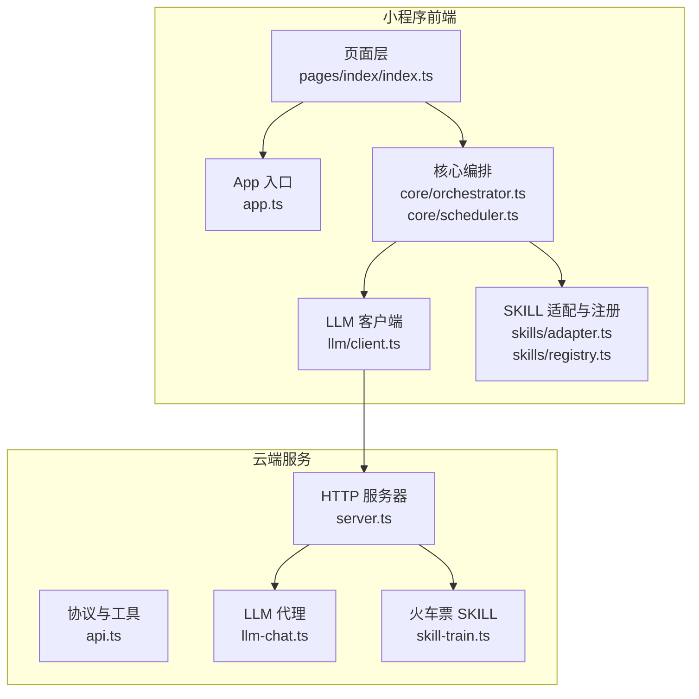
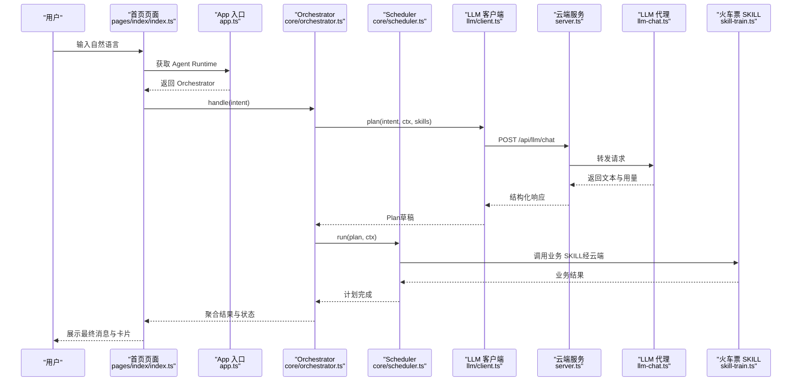
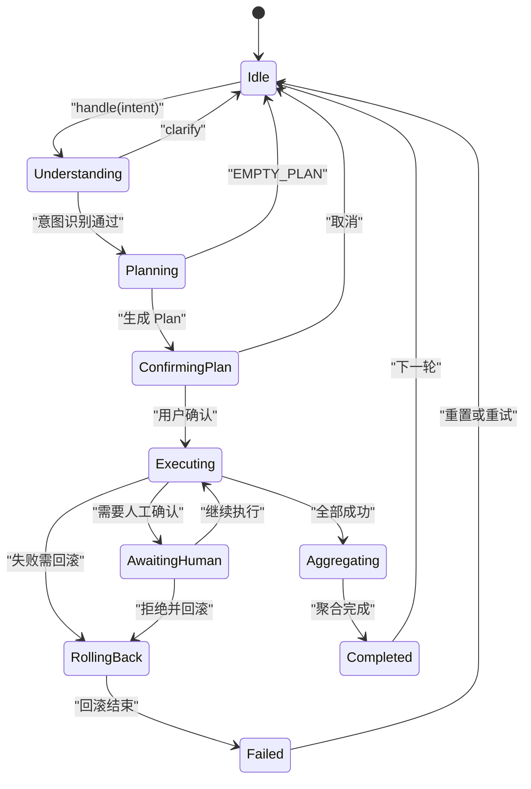
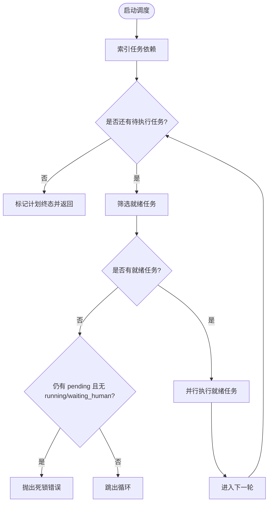
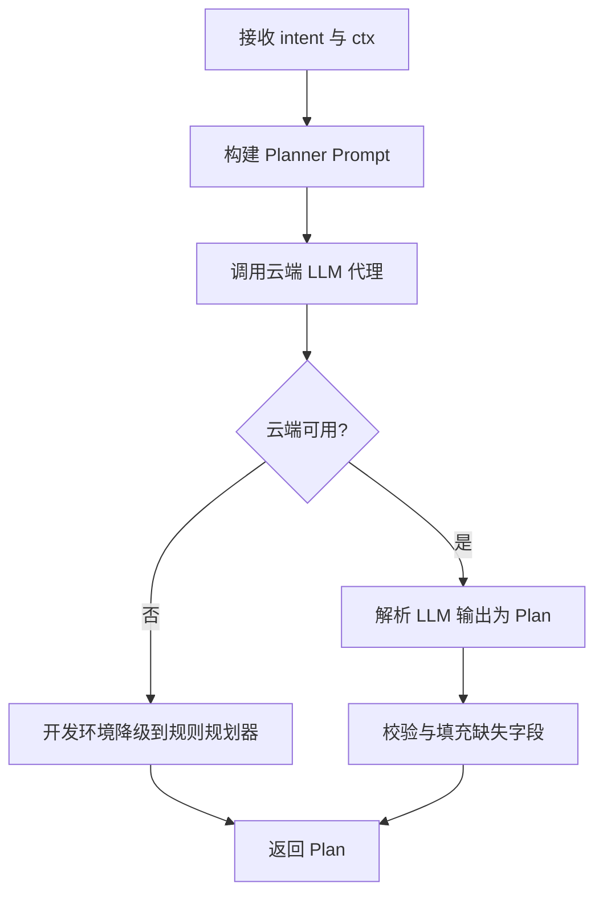
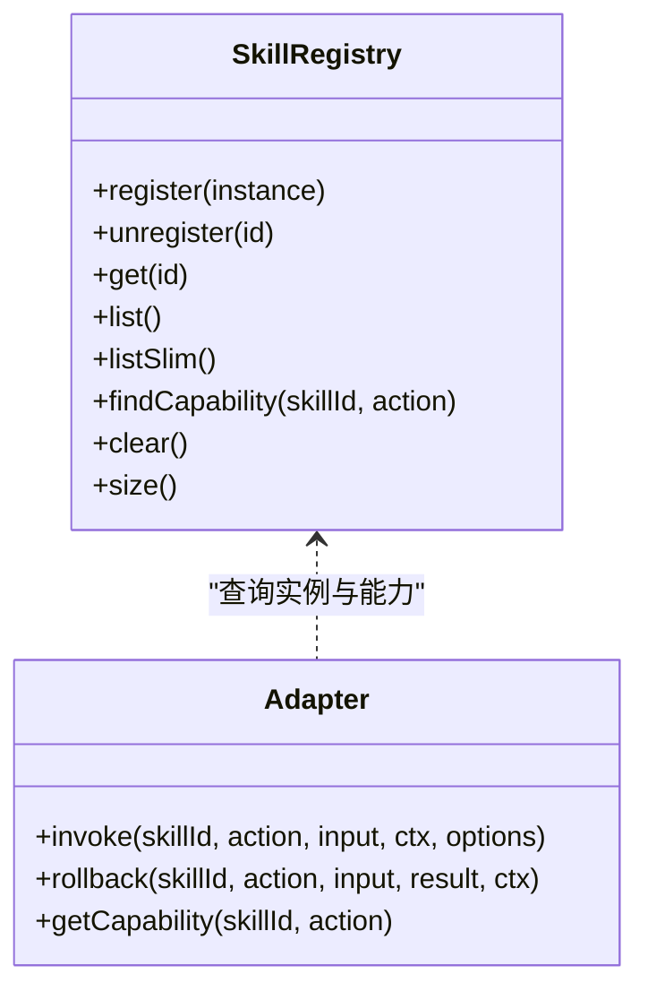
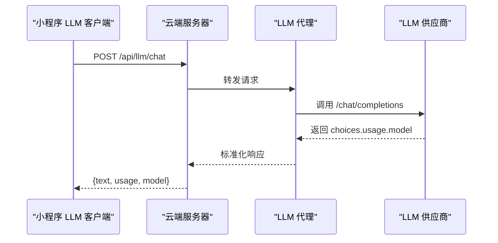
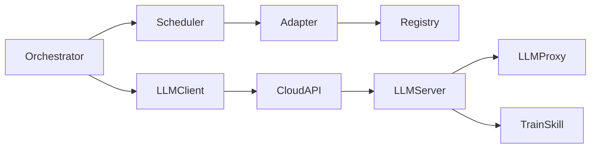

# 项目概述

<cite>
**本文引用的文件**   
- [package.json](file://package.json)
- [miniprogram/app.ts](file://miniprogram/app.ts)
- [miniprogram/app.json](file://miniprogram/app.json)
- [miniprogram/pages/index/index.ts](file://miniprogram/pages/index/index.ts)
- [miniprogram/src/core/orchestrator.ts](file://miniprogram/src/core/orchestrator.ts)
- [miniprogram/src/core/scheduler.ts](file://miniprogram/src/core/scheduler.ts)
- [miniprogram/src/llm/client.ts](file://miniprogram/src/llm/client.ts)
- [miniprogram/src/skills/adapter.ts](file://miniprogram/src/skills/adapter.ts)
- [miniprogram/src/skills/registry.ts](file://miniprogram/src/skills/registry.ts)
- [cloudrun/src/server.ts](file://cloudrun/src/server.ts)
- [cloudrun/src/api.ts](file://cloudrun/src/api.ts)
- [cloudrun/src/llm-chat.ts](file://cloudrun/src/llm-chat.ts)
- [cloudrun/src/skill-train.ts](file://cloudrun/src/skill-train.ts)
</cite>

## 目录
1. [引言](#引言)
2. [项目结构](#项目结构)
3. [核心组件](#核心组件)
4. [架构总览](#架构总览)
5. [详细组件分析](#详细组件分析)
6. [依赖关系分析](#依赖关系分析)
7. [性能与可靠性](#性能与可靠性)
8. [故障排查指南](#故障排查指南)
9. [快速开始](#快速开始)
10. [结论](#结论)

## 引言
本项目名为 MicroMate，目标是在微信小程序中实现一个跨 SKILL 任务编排的 AI 智能助手。它通过自然语言理解、LLM 驱动的任务规划、DAG 调度执行、多技能协作以及人机协作确认机制，完成端到端的任务编排与结果聚合；同时提供云端服务以对接 LLM 供应商与业务 SKILL（如火车票查询与下单）。

项目关键词包括：micromate、wechat-miniprogram、agent、skill-orchestrator、dag。

**章节来源**
- [package.json:1-23](file://package.json#L1-L23)

## 项目结构
仓库采用“前端小程序 + 云端服务”的双端结构：
- miniprogram：微信小程序前端，包含页面、Agent 运行时、核心编排器、LLM 客户端、SKILL 适配与注册中心、类型定义与工具函数等。
- cloudrun：Node.js 云托管服务，提供健康检查、路由分发、LLM 代理与示例 SKILL 接口。

**图表来源**
- [miniprogram/app.ts:1-49](file://miniprogram/app.ts#L1-L49)
- [miniprogram/pages/index/index.ts:1-329](file://miniprogram/pages/index/index.ts#L1-L329)
- [miniprogram/src/core/orchestrator.ts:1-340](file://miniprogram/src/core/orchestrator.ts#L1-L340)
- [miniprogram/src/core/scheduler.ts:1-245](file://miniprogram/src/core/scheduler.ts#L1-L245)
- [miniprogram/src/llm/client.ts:1-153](file://miniprogram/src/llm/client.ts#L1-L153)
- [miniprogram/src/skills/adapter.ts:1-115](file://miniprogram/src/skills/adapter.ts#L1-L115)
- [miniprogram/src/skills/registry.ts:1-91](file://miniprogram/src/skills/registry.ts#L1-L91)
- [cloudrun/src/server.ts:1-129](file://cloudrun/src/server.ts#L1-L129)
- [cloudrun/src/api.ts:1-64](file://cloudrun/src/api.ts#L1-L64)
- [cloudrun/src/llm-chat.ts:1-123](file://cloudrun/src/llm-chat.ts#L1-L123)
- [cloudrun/src/skill-train.ts:1-148](file://cloudrun/src/skill-train.ts#L1-L148)

**章节来源**
- [miniprogram/app.json:1-20](file://miniprogram/app.json#L1-L20)
- [miniprogram/app.ts:1-49](file://miniprogram/app.ts#L1-L49)

## 核心组件
- Orchestrator（编排器）：状态机驱动的对话与任务生命周期管理，负责意图理解、计划生成、用户确认、任务调度、失败回滚与结果聚合。
- Scheduler（调度器）：基于 DAG 的并行任务执行引擎，支持依赖解析、死锁检测、checkpoint 序列化互斥、级联跳过与令牌失效中止。
- LLM 客户端：统一封装 LLM 调用、提示构建、输出解析与开发环境降级策略。
- SKILL 适配器与注册中心：统一 SKILL 发现、能力元数据、入参校验、错误包装与回滚接口。
- 云端服务：轻量 HTTP 服务器，路由分发、健康检查、LLM 代理与示例 SKILL 接口。

**章节来源**
- [miniprogram/src/core/orchestrator.ts:1-340](file://miniprogram/src/core/orchestrator.ts#L1-L340)
- [miniprogram/src/core/scheduler.ts:1-245](file://miniprogram/src/core/scheduler.ts#L1-L245)
- [miniprogram/src/llm/client.ts:1-153](file://miniprogram/src/llm/client.ts#L1-L153)
- [miniprogram/src/skills/adapter.ts:1-115](file://miniprogram/src/skills/adapter.ts#L1-L115)
- [miniprogram/src/skills/registry.ts:1-91](file://miniprogram/src/skills/registry.ts#L1-L91)
- [cloudrun/src/server.ts:1-129](file://cloudrun/src/server.ts#L1-L129)

## 架构总览
系统由小程序前端与云端服务组成。小程序侧负责交互、意图理解、计划生成、任务编排与结果展示；云端侧提供 LLM 代理与业务 SKILL 接口。

**图表来源**
- [miniprogram/pages/index/index.ts:1-329](file://miniprogram/pages/index/index.ts#L1-L329)
- [miniprogram/app.ts:1-49](file://miniprogram/app.ts#L1-L49)
- [miniprogram/src/core/orchestrator.ts:1-340](file://miniprogram/src/core/orchestrator.ts#L1-L340)
- [miniprogram/src/core/scheduler.ts:1-245](file://miniprogram/src/core/scheduler.ts#L1-L245)
- [miniprogram/src/llm/client.ts:1-153](file://miniprogram/src/llm/client.ts#L1-L153)
- [cloudrun/src/server.ts:1-129](file://cloudrun/src/server.ts#L1-L129)
- [cloudrun/src/llm-chat.ts:1-123](file://cloudrun/src/llm-chat.ts#L1-L123)
- [cloudrun/src/skill-train.ts:1-148](file://cloudrun/src/skill-train.ts#L1-L148)

## 详细组件分析

### Orchestrator（编排器）
- 职责：维护 Agent 状态机，串联 understand → planning → confirming_plan → executing → aggregating → completed/failed 流程；处理 BUSY 守卫、PLAN 确认、失败回滚与结果聚合。
- 关键设计：
  - 状态转移表约束合法转移，异常路径强制归位 idle，避免永久 BUSY。
  - 使用 runToken 防止 reset 后并发双跑与弹窗交错。
  - 失败时按反序对可逆任务进行回滚。
  - 将 waiting_human 映射为 awaiting_human，联动 UI 显示等待人类确认。

**图表来源**
- [miniprogram/src/core/orchestrator.ts:50-71](file://miniprogram/src/core/orchestrator.ts#L50-L71)
- [miniprogram/src/core/orchestrator.ts:106-256](file://miniprogram/src/core/orchestrator.ts#L106-L256)

**章节来源**
- [miniprogram/src/core/orchestrator.ts:1-340](file://miniprogram/src/core/orchestrator.ts#L1-L340)

### Scheduler（DAG 调度器）
- 职责：按依赖关系并行执行 Task，检测死锁，支持 checkpoint 序列化互斥、级联跳过与令牌失效中止。
- 关键设计：
  - 每轮找出 ready 任务并 Promise.allSettled 并行执行。
  - 写操作 requiresHumanConfirm 时进入 waiting_human，并通过模块级 Promise 链串行化弹窗，避免 wx.showModal 覆盖导致确认丢失。
  - 当 isRunActive() 返回 false 时中止运行并将非终态任务标记 skipped。
  - 失败任务级联跳过其下游 pending 任务。

**图表来源**
- [miniprogram/src/core/scheduler.ts:77-128](file://miniprogram/src/core/scheduler.ts#L77-L128)
- [miniprogram/src/core/scheduler.ts:139-204](file://miniprogram/src/core/scheduler.ts#L139-L204)

**章节来源**
- [miniprogram/src/core/scheduler.ts:1-245](file://miniprogram/src/core/scheduler.ts#L1-L245)

### LLM 客户端与提示工程
- 职责：构造 Planner Prompt，调用云端 LLM 代理，解析结构化 Plan，并在开发环境降级到本地规则式规划器。
- 关键设计：
  - 在开发环境下，若云端 LLM 不可用（未开通云开发或未配置 Key），自动降级至 rule-planner，保证全链路可演示。
  - 统计 token 用量与耗时，记录 traceId。
  - 对 LLM 输出进行解析与校验，失败抛出自定义错误。

**图表来源**
- [miniprogram/src/llm/client.ts:56-120](file://miniprogram/src/llm/client.ts#L56-L120)

**章节来源**
- [miniprogram/src/llm/client.ts:1-153](file://miniprogram/src/llm/client.ts#L1-L153)

### SKILL 适配器与注册中心
- 职责：统一 SKILL 发现、能力元数据查询、入参 schema 校验、错误包装与回滚接口。
- 关键设计：
  - SkillRegistry 提供注册、反注册、列出完整/简化元数据、按 (skillId, action) 查找 capability。
  - Adapter.invoke 对任意 Error 包装为 SkillError，确保上层一致的错误处理。
  - Adapter.rollback 调用 SKILL 的 rollback 方法，未实现则记录警告。

**图表来源**
- [miniprogram/src/skills/registry.ts:16-91](file://miniprogram/src/skills/registry.ts#L16-L91)
- [miniprogram/src/skills/adapter.ts:37-112](file://miniprogram/src/skills/adapter.ts#L37-L112)

**章节来源**
- [miniprogram/src/skills/adapter.ts:1-115](file://miniprogram/src/skills/adapter.ts#L1-L115)
- [miniprogram/src/skills/registry.ts:1-91](file://miniprogram/src/skills/registry.ts#L1-L91)

### 小程序页面与交互
- 职责：对话历史气泡、发送按钮、语音入口（MVP 提示文字输入）、阶段状态指示、任务进度卡片实时更新。
- 关键设计：
  - 通过 getApp().globalData.agent 获取 Agent Runtime，订阅 onStateChange/onPlanUpdate/onTaskUpdate 事件。
  - 根据 Orchestrator 返回的状态与卡片渲染 UI，自动滚动到底部。
  - 提供重置功能，清空对话并重置 Agent。

**章节来源**
- [miniprogram/pages/index/index.ts:1-329](file://miniprogram/pages/index/index.ts#L1-L329)
- [miniprogram/app.ts:1-49](file://miniprogram/app.ts#L1-L49)

### 云端服务与 LLM 代理
- server.ts：监听端口、JSON body 解析、路由分发、健康检查、统一 JSON 响应与错误处理。
- llm-chat.ts：OpenAI 兼容协议代理，转发到 LLM 供应商，超时保护与上游错误翻译为 503。
- api.ts：标准响应体与工具函数（ok/fail/badRequest/unauthorized/forbidden）。

**图表来源**
- [cloudrun/src/server.ts:76-129](file://cloudrun/src/server.ts#L76-L129)
- [cloudrun/src/llm-chat.ts:55-118](file://cloudrun/src/llm-chat.ts#L55-L118)

**章节来源**
- [cloudrun/src/server.ts:1-129](file://cloudrun/src/server.ts#L1-L129)
- [cloudrun/src/api.ts:1-64](file://cloudrun/src/api.ts#L1-L64)
- [cloudrun/src/llm-chat.ts:1-123](file://cloudrun/src/llm-chat.ts#L1-L123)

### 火车票 SKILL（示例）
- 端点：search_train、book_ticket、book_ticket/cancel。
- 特点：确定性模拟数据、内存订单存储、归属鉴权（openid）与 IDOR 防护。
- 用途：演示跨 SKILL 编排中的业务调用与回滚场景。

**章节来源**
- [cloudrun/src/skill-train.ts:1-148](file://cloudrun/src/skill-train.ts#L1-L148)

## 依赖关系分析
- 依赖方向遵循单向原则：core 不反向依赖 interaction 与 skills；llm 层不反向依赖 skills 注册表。
- 组件耦合：
  - Orchestrator 依赖 LLM 客户端与 Scheduler，注入 confirmPlan/checkpoint 回调。
  - Scheduler 依赖 SKILL 适配器与能力元数据。
  - LLM 客户端依赖 services/cloud 与 utils/idgen/logger。
  - 云端 server 聚合各 handler 路由（llm、train、coffee）。

**图表来源**
- [miniprogram/src/core/orchestrator.ts:1-340](file://miniprogram/src/core/orchestrator.ts#L1-L340)
- [miniprogram/src/core/scheduler.ts:1-245](file://miniprogram/src/core/scheduler.ts#L1-L245)
- [miniprogram/src/llm/client.ts:1-153](file://miniprogram/src/llm/client.ts#L1-L153)
- [miniprogram/src/skills/adapter.ts:1-115](file://miniprogram/src/skills/adapter.ts#L1-L115)
- [miniprogram/src/skills/registry.ts:1-91](file://miniprogram/src/skills/registry.ts#L1-L91)
- [cloudrun/src/server.ts:1-129](file://cloudrun/src/server.ts#L1-L129)
- [cloudrun/src/llm-chat.ts:1-123](file://cloudrun/src/llm-chat.ts#L1-L123)
- [cloudrun/src/skill-train.ts:1-148](file://cloudrun/src/skill-train.ts#L1-L148)

**章节来源**
- [miniprogram/src/core/orchestrator.ts:1-340](file://miniprogram/src/core/orchestrator.ts#L1-L340)
- [miniprogram/src/core/scheduler.ts:1-245](file://miniprogram/src/core/scheduler.ts#L1-L245)
- [miniprogram/src/llm/client.ts:1-153](file://miniprogram/src/llm/client.ts#L1-L153)
- [miniprogram/src/skills/adapter.ts:1-115](file://miniprogram/src/skills/adapter.ts#L1-L115)
- [miniprogram/src/skills/registry.ts:1-91](file://miniprogram/src/skills/registry.ts#L1-L91)
- [cloudrun/src/server.ts:1-129](file://cloudrun/src/server.ts#L1-L129)

## 性能与可靠性
- 性能特性：
  - Orchestrator 在 onLaunch 中保持轻量，Agent Runtime 懒加载，避免阻塞微信生命周期。
  - Scheduler 并行执行 ready 任务，减少整体执行时间。
  - LLM 客户端统计 token 用量与耗时，便于监控与优化。
- 可靠性保障：
  - 状态机约束非法转移，异常路径强制归位 idle，避免永久 BUSY。
  - runToken 令牌机制防止 reset 后并发双跑与弹窗交错。
  - checkpoint 序列化互斥，避免多个写操作弹窗覆盖导致确认丢失。
  - 云端 LLM 代理超时保护与上游错误翻译为可重试语义。
  - 火车票 SKILL 具备归属鉴权与 IDOR 防护。

[本节为通用指导，无需具体文件分析]

## 故障排查指南
- 常见问题与定位：
  - 云端 LLM 不可用：检查环境变量 LLM_BASE_URL 与 LLM_API_KEY；开发环境会降级到规则规划器，生产环境保持失败语义。
  - 请求体过大或格式错误：服务端限制 1MB，非法 JSON 返回 400。
  - 业务失败：云端返回 HTTP 200 + code 非 0，小程序端会翻译为 SkillError。
  - 权限问题：写操作缺少 openid 返回 401；越权访问返回 403。
- 建议步骤：
  - 查看云端日志（stdout）与服务健康检查 /healthz。
  - 检查小程序端日志与 Orchestrator/Scheduler 的错误码（BUSY、EMPTY_PLAN、DEADLOCK、UNEXPECTED）。
  - 核对 SKILL 注册与能力元数据是否正确。

**章节来源**
- [cloudrun/src/server.ts:34-61](file://cloudrun/src/server.ts#L34-L61)
- [cloudrun/src/server.ts:80-123](file://cloudrun/src/server.ts#L80-L123)
- [cloudrun/src/llm-chat.ts:55-118](file://cloudrun/src/llm-chat.ts#L55-L118)
- [cloudrun/src/skill-train.ts:89-141](file://cloudrun/src/skill-train.ts#L89-L141)
- [miniprogram/src/core/orchestrator.ts:106-256](file://miniprogram/src/core/orchestrator.ts#L106-L256)

## 快速开始
- 前置条件：
  - 安装 Node.js 与 TypeScript 开发依赖。
  - 准备微信小程序开发者工具。
  - 部署云端服务并配置 LLM_BASE_URL 与 LLM_API_KEY。
- 运行步骤：
  - 小程序端：使用开发者工具打开 miniprogram 目录，编译并预览。
  - 云端服务：在 cloudrun 目录启动服务，监听 PORT 环境变量指定端口。
  - 验证健康检查：访问 GET / 或 /healthz，应返回服务信息。
- 体验功能：
  - 在小程序首页输入自然语言，例如“明天北京到上海的高铁”“附近有星巴克吗”“帮我点一杯拿铁”。
  - 观察状态列变化与任务进度卡片实时更新。
  - 如需测试火车票 SKILL，可在云端启用对应路由。

**章节来源**
- [miniprogram/app.json:1-20](file://miniprogram/app.json#L1-L20)
- [miniprogram/pages/index/index.ts:134-138](file://miniprogram/pages/index/index.ts#L134-L138)
- [cloudrun/src/server.ts:84-92](file://cloudrun/src/server.ts#L84-L92)

## 结论
MicroMate 通过 Orchestrator 与 Scheduler 的组合，实现了从自然语言到多技能协作任务的端到端编排；LLM 客户端与云端代理提供了可扩展的智能规划能力；checkpoint 与回滚机制保障了事务一致性与用户体验。项目结构清晰、依赖方向明确，适合初学者理解概念，也为有经验的开发者提供了足够的技术深度与扩展空间。

[本节为总结性内容，无需具体文件分析]